# Article 40: Legacy Modernization Strategies for Policy Administration Systems

## Table of Contents

1. [Introduction](#1-introduction)
2. [Legacy PAS Landscape](#2-legacy-pas-landscape)
3. [Modernization Assessment Framework](#3-modernization-assessment-framework)
4. [Modernization Strategy Options](#4-modernization-strategy-options)
5. [Strangler Fig Pattern for PAS](#5-strangler-fig-pattern-for-pas)
6. [Anti-Corruption Layer](#6-anti-corruption-layer)
7. [Data Migration](#7-data-migration)
8. [COBOL Migration Specifics](#8-cobol-migration-specifics)
9. [Integration During Modernization](#9-integration-during-modernization)
10. [Phased Migration Approach](#10-phased-migration-approach)
11. [Organizational Change Management](#11-organizational-change-management)
12. [Risk Management](#12-risk-management)
13. [Case Studies](#13-case-studies)
14. [Decision Frameworks](#14-decision-frameworks)
15. [Architecture Patterns](#15-architecture-patterns)
16. [Conclusion](#16-conclusion)

---

## 1. Introduction

Legacy modernization is the defining technology challenge for the life insurance industry. An estimated 70-80% of life insurance policies in the United States are administered on systems built between the 1970s and 1990s — COBOL on mainframes, AS/400 RPG programs, or first-generation client-server applications. These systems represent decades of accumulated business logic, regulatory compliance rules, and operational knowledge, but they are increasingly incompatible with the demands of modern insurance operations.

The modernization imperative is driven by multiple converging forces:

- **Workforce crisis**: The average COBOL programmer is over 55 years old; within a decade, most will have retired
- **Business agility**: Legacy systems require 12-18 months to launch new products; competitors deliver in weeks
- **Customer expectations**: Digital self-service, real-time processing, and omnichannel experiences are table stakes
- **Regulatory pressure**: New regulations (IFRS 17, LDTI) require calculation capabilities beyond legacy architectures
- **Integration friction**: Legacy systems cannot participate in API ecosystems, limiting distribution innovation
- **Cost**: Mainframe MIPS costs continue to rise while open-system costs decline
- **Vendor risk**: Some legacy PAS vendors have been acquired, discontinued, or stopped investing in their platforms

Yet modernization is extraordinarily risky. A PAS contains the insurer's most critical data — policy records, financial positions, regulatory compliance rules — and any disruption has immediate regulatory, financial, and reputational consequences. The history of insurance IT is littered with failed modernization programs that consumed hundreds of millions of dollars before being abandoned.

This article provides a comprehensive guide for architects and transformation leaders planning and executing PAS modernization. We cover assessment frameworks, strategy options, proven patterns (Strangler Fig, Anti-Corruption Layer), data migration approaches, organizational change management, and risk mitigation — all grounded in the specific realities of life insurance policy administration.

---

## 2. Legacy PAS Landscape

### 2.1 Generational Classification

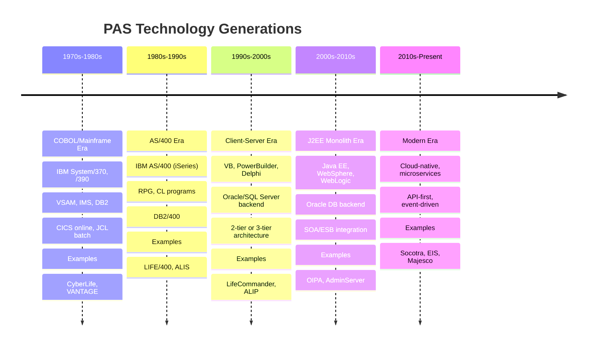

### 2.2 COBOL/Mainframe Architecture (Gen 1)

The most common legacy PAS architecture in the US life insurance industry:

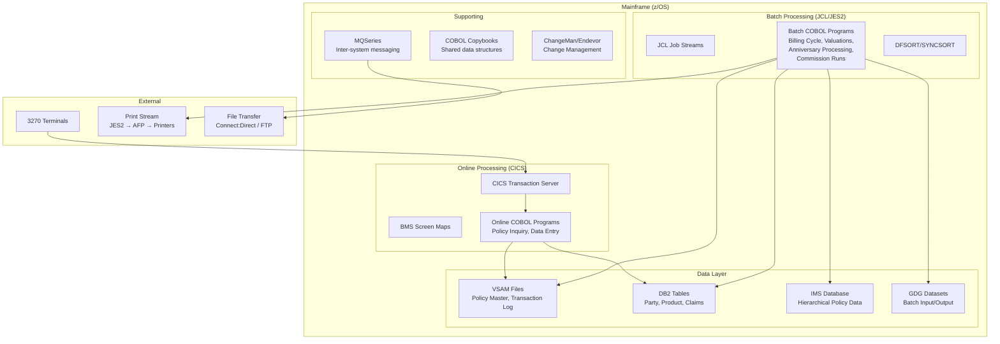

**Typical characteristics**:
- 2-10 million lines of COBOL code
- 500-2,000 CICS transactions
- 200-500 batch job streams
- 1,000-5,000 copybooks defining data structures
- Complex batch scheduling with interdependencies (CA-7, Control-M)
- Decades of accumulated business rules encoded in program logic
- Limited documentation (knowledge in developers' heads)

### 2.3 AS/400 Architecture (Gen 2)

```mermaid
graph TB
    subgraph "IBM iSeries (AS/400)"
        subgraph "Interactive Programs"
            RPG[RPG/400 or RPG IV Programs]
            DDS[Display File Screens (DDS)]
            CLP[CL Programs (Control Language)]
        end
        
        subgraph "Batch Programs"
            BRPG[Batch RPG Programs]
            BCL[Batch CL Programs]
            QUERY[Query/400 Reports]
        end
        
        subgraph "Database"
            DB2_400[DB2/400<br/>Integrated Database]
            PF[Physical Files (Tables)]
            LF[Logical Files (Views/Indexes)]
        end
        
        subgraph "Supporting"
            MSGQ[Message Queues]
            DTAQ[Data Queues]
            JOBD[Job Descriptions]
        end
    end
    
    subgraph "Access Methods"
        GREEN[5250 Green Screen Terminals]
        PC[PC Access (Client Access)]
        WEB[WebFacing / Web Gateway]
    end
    
    GREEN --> RPG
    PC --> RPG
    WEB --> RPG
```

### 2.4 Client-Server Architecture (Gen 3)

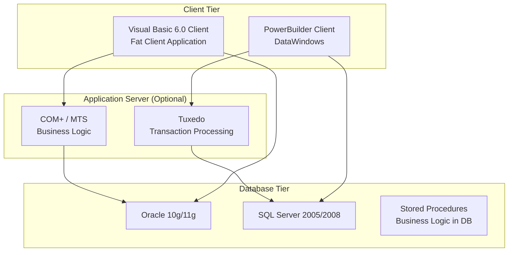

### 2.5 J2EE Monolith Architecture (Gen 4)

```mermaid
graph TB
    subgraph "Web Tier"
        JSP[JSP/JSF Pages]
        STRUTS[Struts Framework]
        WEB_SERV[Web Services (SOAP)]
    end
    
    subgraph "Application Server"
        EJB[EJB Session Beans]
        MDB[Message-Driven Beans]
        JPA[JPA/Hibernate Entities]
        RULE[Rules Engine (Drools/ILOG)]
    end
    
    subgraph "Database"
        ORACLE_DB[(Oracle 12c<br/>Single Schema<br/>2000+ Tables)]
    end
    
    subgraph "Integration"
        ESB[Enterprise Service Bus<br/>TIBCO / WebSphere ESB]
        MQ_JMS[JMS / MQ]
    end
    
    JSP --> EJB
    STRUTS --> EJB
    WEB_SERV --> EJB
    EJB --> JPA --> ORACLE_DB
    EJB --> MDB --> MQ_JMS
    ESB --> WEB_SERV
```

### 2.6 Common Pain Points Across All Generations

| Pain Point | Impact | Urgency |
|---|---|---|
| **Skill shortage** | Cannot maintain or enhance systems; single points of failure in staff | Critical (2-5 year horizon) |
| **Product inflexibility** | 12-18 month product launch cycle; cannot respond to market | High |
| **Integration difficulty** | Cannot participate in API ecosystems; screen scraping as integration | High |
| **Regulatory compliance cost** | Every regulatory change requires expensive coding; IFRS 17 may be impossible | Critical |
| **Customer experience** | No digital self-service; paper-centric processes | High |
| **Infrastructure cost** | MIPS costs rising 5-10% annually; hardware refreshes increasingly expensive | Medium |
| **Testing difficulty** | Lack of automated tests; regression testing is manual and slow | High |
| **Documentation gaps** | Business rules embedded in code; tribal knowledge in aging workforce | Critical |
| **Batch processing windows** | Shrinking overnight windows; 24/7 expectations from digital channels | Medium |
| **Vendor risk** | Platform discontinued or unsupported; no upgrade path | Variable |

---

## 3. Modernization Assessment Framework

### 3.1 Current State Assessment

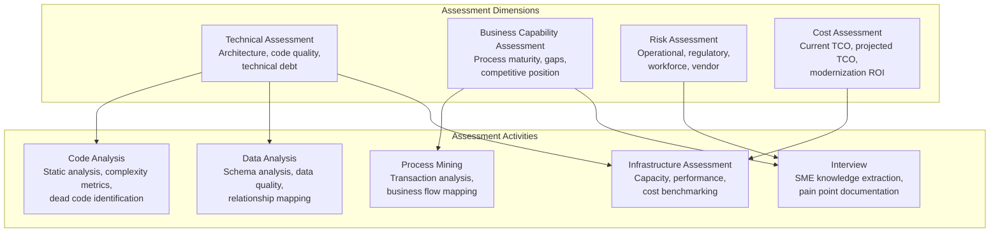

### 3.2 Technical Debt Quantification

```yaml
# Technical debt assessment scorecard
technical_debt_scorecard:
  code_quality:
    metrics:
      - name: "Cyclomatic Complexity"
        measurement: "Average per module"
        threshold: { green: "<10", yellow: "10-20", red: ">20" }
        current_value: 35
        score: "RED"
        
      - name: "Dead Code Percentage"
        measurement: "Unreachable code / total"
        threshold: { green: "<5%", yellow: "5-15%", red: ">15%" }
        current_value: "28%"
        score: "RED"
        
      - name: "Duplicate Code"
        measurement: "Clone percentage"
        threshold: { green: "<5%", yellow: "5-15%", red: ">15%" }
        current_value: "22%"
        score: "RED"
        
      - name: "Test Coverage"
        measurement: "Automated test coverage"
        threshold: { green: ">60%", yellow: "30-60%", red: "<30%" }
        current_value: "3%"
        score: "RED"
        
  architecture_quality:
    metrics:
      - name: "Component Coupling"
        measurement: "Inter-module dependencies"
        current_state: "Highly coupled; 85% of modules have circular dependencies"
        score: "RED"
        
      - name: "Data Architecture"
        measurement: "Normalization, data integrity"
        current_state: "Denormalized VSAM files; no referential integrity"
        score: "RED"
        
      - name: "API Readiness"
        measurement: "Externally accessible APIs"
        current_state: "Zero APIs; all access via 3270 screens or file transfer"
        score: "RED"
        
  infrastructure:
    metrics:
      - name: "Scalability"
        measurement: "Ability to handle 2x load"
        current_state: "Vertical scaling only; at 78% capacity"
        score: "YELLOW"
        
      - name: "Availability"
        measurement: "Unplanned downtime"
        current_state: "99.9% (8.7 hours/year unplanned)"
        score: "YELLOW"
        
  estimated_technical_debt_cost:
    annual_maintenance_premium: "$8.5M"  # Extra cost due to tech debt
    opportunity_cost: "$12M/year"         # Lost business due to inflexibility
    risk_cost: "$25M"                     # Potential regulatory/operational failure
    total_annual_debt_cost: "$45.5M"
```

### 3.3 Application Portfolio Rationalization (Gartner TIME)

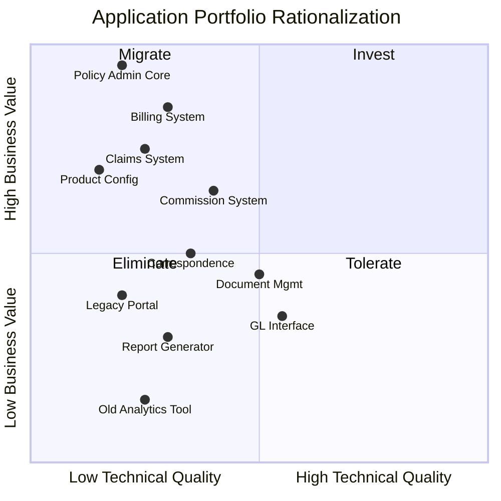

| Quadrant | Strategy | PAS Examples |
|---|---|---|
| **Invest** | Enhance and grow these systems | New cloud-native PAS (if already started) |
| **Migrate** | Move to modern platform, preserve value | Policy Admin Core, Billing, Claims |
| **Tolerate** | Keep running, minimal investment | Document Management, GL Interface |
| **Eliminate** | Decommission, consolidate | Old Analytics Tool, Legacy Portal |

### 3.4 Modernization Readiness Assessment

```yaml
# Modernization readiness checklist
readiness_assessment:
  business_readiness:
    - question: "Is there executive sponsorship for a multi-year program?"
      weight: 10
      score: null  # 1-5
    - question: "Is the business willing to accept temporary feature freezes?"
      weight: 8
    - question: "Are business SMEs available for knowledge transfer?"
      weight: 9
    - question: "Is there budget commitment for 3-5 years?"
      weight: 10
    - question: "Are regulatory timelines driving the decision?"
      weight: 7
      
  technical_readiness:
    - question: "Is the existing codebase analyzable (not encrypted/obfuscated)?"
      weight: 8
    - question: "Are data models documented or discoverable?"
      weight: 9
    - question: "Is there a test environment that mirrors production?"
      weight: 7
    - question: "Are batch job dependencies documented?"
      weight: 6
    - question: "Is source code in a modern version control system?"
      weight: 5
      
  organizational_readiness:
    - question: "Are modern technology skills available (or hirable)?"
      weight: 9
    - question: "Is the organization experienced with agile delivery?"
      weight: 7
    - question: "Can legacy and modern teams work in parallel?"
      weight: 8
    - question: "Is there change management capability?"
      weight: 7
    - question: "Are vendor/partner relationships established?"
      weight: 5
```

---

## 4. Modernization Strategy Options

### 4.1 The 6 Rs of Modernization

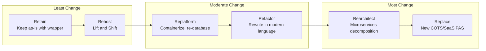

### 4.2 Strategy Comparison

| Strategy | Description | Timeline | Cost | Risk | Best For |
|---|---|---|---|---|---|
| **Retain** | Keep legacy, add API wrapper | 3-6 months | Low | Low | Stable systems near end-of-life |
| **Rehost** | Move to cloud mainframe (Skytap, IBM zCloud) | 6-12 months | Low-Medium | Low | Quick cloud migration, defer modernization |
| **Replatform** | Containerize, swap database, cloud-enable | 12-24 months | Medium | Medium | Client-server or J2EE monoliths |
| **Refactor** | Rewrite in modern language (Java/C#), same architecture | 18-36 months | Medium-High | Medium-High | When code is well-structured |
| **Rearchitect** | Decompose into microservices | 24-48 months | High | High | Long-term strategic investment |
| **Replace** | Buy/build new PAS (COTS or greenfield) | 36-60 months | Very High | Very High | When legacy is beyond repair |

### 4.3 Strategy Decision Framework

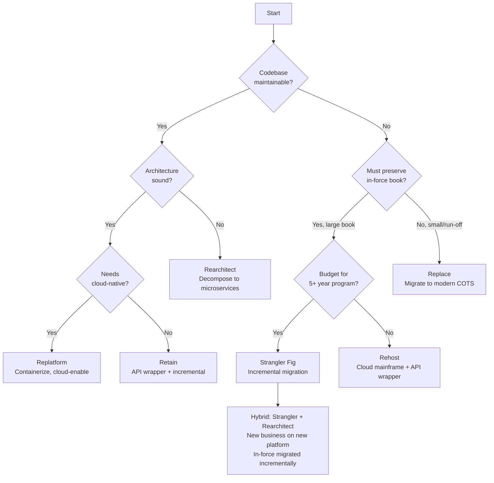

### 4.4 Retain with API Wrapper

For systems that are stable and nearing natural end-of-life (e.g., closed block of business), the most pragmatic approach is to wrap the legacy system with APIs:

```java
// API facade over CICS transaction via CTG (CICS Transaction Gateway)
@RestController
@RequestMapping("/api/v1/legacy/policies")
public class LegacyPolicyApiController {
    
    private final CICSGateway cicsGateway;
    private final DataTranslator translator;
    
    @GetMapping("/{policyNumber}")
    public PolicyDTO getPolicy(@PathVariable String policyNumber) {
        // Prepare COMMAREA (CICS communication area)
        byte[] commarea = translator.buildPolicyInquiryCommarea(policyNumber);
        
        // Execute CICS transaction
        byte[] response = cicsGateway.executeTransaction(
            "POLINQ",     // CICS transaction ID
            "POLPROG",    // COBOL program name
            commarea,
            5000          // timeout ms
        );
        
        // Translate EBCDIC/packed decimal response to JSON-friendly DTO
        return translator.translatePolicyResponse(response);
    }
}

// Data translator: COBOL copybook layout → Java DTO
public class DataTranslator {
    
    // Maps to COBOL copybook POL-INQUIRY-COMMAREA
    public byte[] buildPolicyInquiryCommarea(String policyNumber) {
        byte[] commarea = new byte[2048]; // COMMAREA size from copybook
        
        // Field: POL-NUMBER (PIC X(12)) at offset 0
        EbcdicConverter.stringToEbcdic(policyNumber, commarea, 0, 12);
        
        // Field: POL-FUNCTION (PIC X(1)) at offset 12
        EbcdicConverter.stringToEbcdic("I", commarea, 12, 1); // I = Inquiry
        
        return commarea;
    }
    
    public PolicyDTO translatePolicyResponse(byte[] response) {
        PolicyDTO dto = new PolicyDTO();
        
        // Field: POL-RETURN-CODE (PIC 9(2)) at offset 0
        int returnCode = EbcdicConverter.packedDecimalToInt(response, 0, 2);
        if (returnCode != 0) {
            throw new LegacySystemException("Policy inquiry failed: RC=" + returnCode);
        }
        
        // Field: POL-NUMBER (PIC X(12)) at offset 2
        dto.setPolicyNumber(EbcdicConverter.ebcdicToString(response, 2, 12).trim());
        
        // Field: POL-STATUS (PIC X(2)) at offset 14
        String statusCode = EbcdicConverter.ebcdicToString(response, 14, 2).trim();
        dto.setStatus(mapLegacyStatus(statusCode));
        
        // Field: POL-FACE-AMT (PIC S9(11)V99 COMP-3) at offset 16
        BigDecimal faceAmount = EbcdicConverter.packedDecimalToBigDecimal(response, 16, 7, 2);
        dto.setFaceAmount(faceAmount);
        
        // Field: POL-EFF-DATE (PIC 9(8)) at offset 23
        String dateStr = EbcdicConverter.ebcdicToString(response, 23, 8);
        dto.setEffectiveDate(LocalDate.parse(dateStr, DateTimeFormatter.ofPattern("yyyyMMdd")));
        
        return dto;
    }
}
```

### 4.5 Rehost: Cloud Mainframe

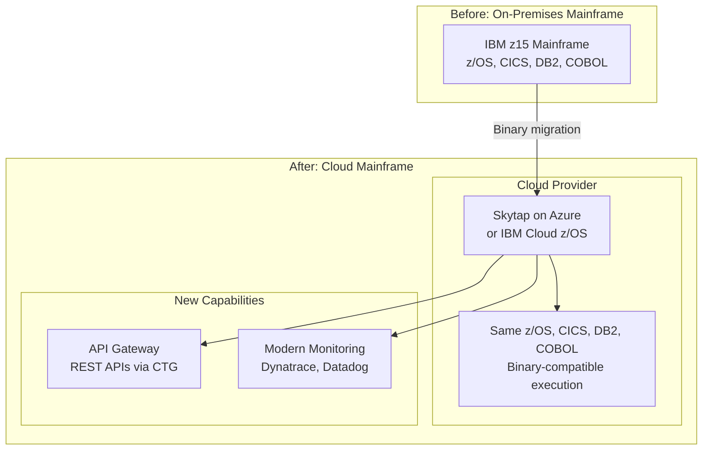

---

## 5. Strangler Fig Pattern for PAS

### 5.1 Pattern Overview

The Strangler Fig pattern (named by Martin Fowler after Australian strangler fig trees that grow around host trees, eventually replacing them) is the gold standard for incremental PAS modernization. Rather than a big-bang replacement, new functionality is built in the modern system while the legacy system continues to operate, with traffic gradually shifted from old to new.

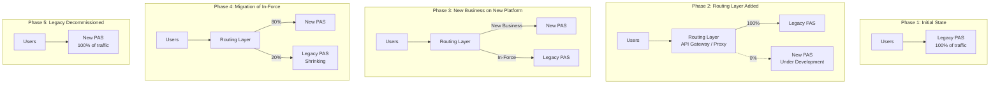

### 5.2 Routing Layer Design

The routing layer is the critical infrastructure that enables gradual migration:

```java
// Routing layer implementation using Spring Cloud Gateway
@Configuration
public class PASRoutingConfig {
    
    @Bean
    public RouteLocator customRouteLocator(RouteLocatorBuilder builder,
                                            PolicyRoutingService routingService) {
        return builder.routes()
            // New business — always route to new platform
            .route("new-business", r -> r
                .path("/api/v*/applications/**")
                .uri("lb://new-pas-policy-service"))
            
            // Policy inquiry — route based on policy origin
            .route("policy-inquiry", r -> r
                .path("/api/v*/policies/{policyNumber}/**")
                .filters(f -> f.filter(new PolicyRoutingFilter(routingService)))
                .uri("lb://routing-placeholder"))
            
            // Billing — route based on policy origin
            .route("billing", r -> r
                .path("/api/v*/billing/**")
                .filters(f -> f.filter(new PolicyRoutingFilter(routingService)))
                .uri("lb://routing-placeholder"))
            
            // Product configuration — new platform
            .route("product-config", r -> r
                .path("/api/v*/products/**")
                .uri("lb://new-pas-product-service"))
            
            // Party management — new platform
            .route("party", r -> r
                .path("/api/v*/parties/**")
                .uri("lb://new-pas-party-service"))
            
            .build();
    }
}

// Policy-level routing filter
public class PolicyRoutingFilter implements GatewayFilter {
    
    private final PolicyRoutingService routingService;
    
    @Override
    public Mono<Void> filter(ServerWebExchange exchange, GatewayFilterChain chain) {
        String policyNumber = extractPolicyNumber(exchange);
        
        PolicyPlatform platform = routingService.getPlatform(policyNumber);
        
        URI targetUri = switch (platform) {
            case NEW_PLATFORM -> URI.create("lb://new-pas-policy-service");
            case LEGACY -> URI.create("http://legacy-api-gateway:8080");
            case MIGRATING -> {
                // During active migration, read from new, write to both
                if (isReadOperation(exchange)) {
                    yield URI.create("lb://new-pas-policy-service");
                } else {
                    yield URI.create("lb://dual-write-service");
                }
            }
        };
        
        exchange.getAttributes().put(GATEWAY_REQUEST_URL_ATTR, targetUri);
        return chain.filter(exchange);
    }
}

// Routing decision service
@Service
public class PolicyRoutingService {
    
    private final PolicyRoutingRepository routingRepository;
    private final RedisTemplate<String, String> redisTemplate;
    
    public PolicyPlatform getPlatform(String policyNumber) {
        // Check cache first
        String cached = redisTemplate.opsForValue().get("routing:" + policyNumber);
        if (cached != null) {
            return PolicyPlatform.valueOf(cached);
        }
        
        // Check routing table
        PolicyRouting routing = routingRepository
            .findByPolicyNumber(policyNumber)
            .orElse(null);
        
        PolicyPlatform platform;
        if (routing != null) {
            platform = routing.getPlatform();
        } else {
            // Default: policies before cutover date → legacy
            platform = PolicyPlatform.LEGACY;
        }
        
        // Cache for 5 minutes
        redisTemplate.opsForValue().set(
            "routing:" + policyNumber, 
            platform.name(),
            Duration.ofMinutes(5)
        );
        
        return platform;
    }
    
    // Called during migration to update routing
    @Transactional
    public void migratePolicy(String policyNumber) {
        PolicyRouting routing = routingRepository
            .findByPolicyNumber(policyNumber)
            .orElse(new PolicyRouting(policyNumber));
        
        routing.setPlatform(PolicyPlatform.NEW_PLATFORM);
        routing.setMigrationDate(Instant.now());
        routingRepository.save(routing);
        
        // Invalidate cache
        redisTemplate.delete("routing:" + policyNumber);
    }
}
```

### 5.3 Feature-by-Feature Migration

```mermaid
gantt
    title Strangler Fig Migration — Feature Sequencing
    dateFormat YYYY-Q
    
    section Product Configuration
    Product setup on new platform      :2025-Q1, 2025-Q2
    Rate tables migration              :2025-Q2, 2025-Q3
    Product rules migration            :2025-Q2, 2025-Q3
    
    section Party Management
    Party service on new platform      :2025-Q1, 2025-Q3
    Party data migration               :2025-Q3, 2025-Q4
    
    section New Business
    Quoting on new platform            :2025-Q3, 2025-Q4
    Application submission             :2025-Q4, 2026-Q1
    Underwriting on new platform       :2026-Q1, 2026-Q2
    Policy issuance (new business)     :2026-Q2, 2026-Q3
    
    section Billing
    Billing service on new platform    :2026-Q2, 2026-Q4
    Payment processing migration       :2026-Q3, 2026-Q4
    
    section In-Force Servicing
    Policy inquiry on new platform     :2026-Q3, 2026-Q4
    Policy changes on new platform     :2026-Q4, 2027-Q1
    
    section In-Force Migration
    Batch 1: Simple products (Term)    :2027-Q1, 2027-Q2
    Batch 2: Whole Life                :2027-Q2, 2027-Q3
    Batch 3: Universal Life            :2027-Q3, 2027-Q4
    Batch 4: Variable products         :2027-Q4, 2028-Q1
    
    section Claims & Financial
    Claims on new platform             :2027-Q1, 2027-Q3
    Financial/Accounting               :2027-Q2, 2027-Q4
    
    section Decommission
    Parallel run and validation        :2028-Q1, 2028-Q2
    Legacy decommission                :2028-Q2, 2028-Q3
```

### 5.4 Parallel Running and Validation

During the transition period, both systems process transactions. Validation ensures the new system produces identical results:

```java
// Parallel run comparison service
@Service
public class ParallelRunService {
    
    private final LegacyPASClient legacyClient;
    private final NewPASClient newClient;
    private final ComparisonResultRepository resultRepository;
    
    @Async
    public void compareTransaction(PolicyTransaction transaction) {
        ComparisonResult result = new ComparisonResult();
        result.setTransactionId(transaction.getTransactionId());
        result.setPolicyNumber(transaction.getPolicyNumber());
        result.setTransactionType(transaction.getType());
        result.setTransactionDate(transaction.getEffectiveDate());
        
        try {
            // Get results from both systems
            LegacyResult legacyResult = legacyClient.processTransaction(transaction);
            NewResult newResult = newClient.processTransaction(transaction);
            
            // Compare key fields
            List<ComparisonDifference> differences = new ArrayList<>();
            
            compareField(differences, "status", 
                legacyResult.getStatus(), newResult.getStatus());
            compareField(differences, "cashValue", 
                legacyResult.getCashValue(), newResult.getCashValue());
            compareField(differences, "deathBenefit", 
                legacyResult.getDeathBenefit(), newResult.getDeathBenefit());
            compareField(differences, "premiumDue", 
                legacyResult.getPremiumDue(), newResult.getPremiumDue());
            compareField(differences, "surrenderValue", 
                legacyResult.getSurrenderValue(), newResult.getSurrenderValue());
            compareField(differences, "loanValue", 
                legacyResult.getLoanValue(), newResult.getLoanValue());
            
            // Financial values must match within tolerance
            compareMoney(differences, "cashValue",
                legacyResult.getCashValue(), newResult.getCashValue(),
                new BigDecimal("0.01")); // 1 cent tolerance
            
            result.setDifferences(differences);
            result.setMatch(differences.isEmpty());
            result.setComparisonDate(Instant.now());
            
        } catch (Exception e) {
            result.setMatch(false);
            result.setErrorMessage(e.getMessage());
        }
        
        resultRepository.save(result);
        
        if (!result.isMatch()) {
            alertService.notifyMismatch(result);
        }
    }
    
    private void compareMoney(List<ComparisonDifference> diffs, String field,
                               BigDecimal legacy, BigDecimal newVal, 
                               BigDecimal tolerance) {
        if (legacy == null && newVal == null) return;
        if (legacy == null || newVal == null) {
            diffs.add(new ComparisonDifference(field, 
                String.valueOf(legacy), String.valueOf(newVal)));
            return;
        }
        
        BigDecimal diff = legacy.subtract(newVal).abs();
        if (diff.compareTo(tolerance) > 0) {
            diffs.add(new ComparisonDifference(field,
                legacy.toString(), newVal.toString(),
                "Difference: " + diff));
        }
    }
}

// Parallel run dashboard data
@RestController
@RequestMapping("/api/v1/parallel-run")
public class ParallelRunDashboardController {
    
    @GetMapping("/summary")
    public ParallelRunSummary getSummary(@RequestParam LocalDate from,
                                          @RequestParam LocalDate to) {
        return ParallelRunSummary.builder()
            .totalComparisons(resultRepository.countByDateRange(from, to))
            .matchCount(resultRepository.countMatchesByDateRange(from, to))
            .mismatchCount(resultRepository.countMismatchesByDateRange(from, to))
            .matchRate(resultRepository.matchRateByDateRange(from, to))
            .topMismatchFields(resultRepository.topMismatchFields(from, to))
            .mismatchByTransactionType(resultRepository.mismatchByType(from, to))
            .mismatchByProduct(resultRepository.mismatchByProduct(from, to))
            .build();
    }
}
```

### 5.5 Traffic Shifting

```yaml
# Gradual traffic shifting strategy
traffic_shifting:
  phase_1_new_business_only:
    new_business:
      new_platform: 100%
      legacy: 0%
    in_force_servicing:
      new_platform: 0%
      legacy: 100%
    duration: "6 months"
    success_criteria:
      - "New business issuance rate >= 99.5%"
      - "Zero financial discrepancies"
      - "Agent satisfaction score maintained"
    
  phase_2_canary_in_force:
    new_business:
      new_platform: 100%
    in_force_servicing:
      new_platform: 5%   # Small batch of migrated policies
      legacy: 95%
    duration: "3 months"
    success_criteria:
      - "All migrated policy values match within tolerance"
      - "All servicing transactions process correctly"
      - "Performance SLAs met"
    
  phase_3_expanding_migration:
    in_force_servicing:
      new_platform: 25%  # Term life migrated
      legacy: 75%
    duration: "3 months"
    
  phase_4_majority_migrated:
    in_force_servicing:
      new_platform: 75%  # WL + Term migrated
      legacy: 25%        # Complex UL/VUL remaining
    duration: "6 months"
    
  phase_5_complete:
    in_force_servicing:
      new_platform: 100%
      legacy: 0%
    post_migration:
      - "Run parallel for 3 months"
      - "Regulatory sign-off"
      - "Decommission legacy"
```

---

## 6. Anti-Corruption Layer

### 6.1 ACL Architecture

The Anti-Corruption Layer prevents the legacy system's data model, naming conventions, and design flaws from leaking into the new system:

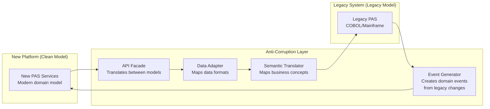

### 6.2 Data Translation Layer

```java
// ACL: Translate legacy COBOL data structures to modern domain model
@Component
public class LegacyPolicyTranslator {
    
    // Legacy status codes (2-character COBOL field POL-STATUS)
    private static final Map<String, PolicyStatus> STATUS_MAP = Map.ofEntries(
        Map.entry("AC", PolicyStatus.ACTIVE),
        Map.entry("AP", PolicyStatus.APPROVED),
        Map.entry("AS", PolicyStatus.APPLICATION),
        Map.entry("DC", PolicyStatus.DECLINED),
        Map.entry("ET", PolicyStatus.EXTENDED_TERM),
        Map.entry("LA", PolicyStatus.LAPSED),
        Map.entry("MA", PolicyStatus.MATURED),
        Map.entry("PU", PolicyStatus.PAID_UP),
        Map.entry("RP", PolicyStatus.REDUCED_PAID_UP),
        Map.entry("SR", PolicyStatus.SURRENDERED),
        Map.entry("TM", PolicyStatus.TERMINATED),
        Map.entry("WD", PolicyStatus.WITHDRAWN)
    );
    
    // Legacy plan codes use different naming than new system
    private static final Map<String, String> PLAN_CODE_MAP = Map.of(
        "WL20", "WHOLE-LIFE-20PAY",
        "WL65", "WHOLE-LIFE-PAY-TO-65",
        "WLOL", "WHOLE-LIFE-ORDINARY",
        "T10R", "TERM-10-RENEWABLE",
        "T20C", "TERM-20-CONVERTIBLE",
        "UL01", "UNIVERSAL-LIFE-FLEX",
        "VL01", "VARIABLE-LIFE-STANDARD"
    );
    
    public Policy translateFromLegacy(LegacyPolicyRecord legacy) {
        return Policy.builder()
            .policyNumber(legacy.getPolicyNumber().trim())
            .status(translateStatus(legacy.getStatusCode()))
            .planCode(translatePlanCode(legacy.getPlanCode()))
            .effectiveDate(translateDate(legacy.getEffectiveDate()))
            .issueDate(translateDate(legacy.getIssueDate()))
            .terminationDate(translateDate(legacy.getTerminationDate()))
            .owner(translatePartyReference(legacy.getOwnerFields()))
            .faceAmount(translateAmount(legacy.getFaceAmount()))
            .modalPremium(translateAmount(legacy.getModalPremium()))
            .billingMode(translateBillingMode(legacy.getBillingFrequency()))
            .issueAge(legacy.getIssueAge())
            .issueState(translateState(legacy.getIssueState()))
            .riskClass(translateRiskClass(legacy.getRatingClass()))
            .coverages(translateCoverages(legacy.getCoverageRecords()))
            .beneficiaries(translateBeneficiaries(legacy.getBeneficiaryRecords()))
            .values(translatePolicyValues(legacy.getValueFields()))
            .metadata(Map.of(
                "legacySystem", "MAINFRAME_PAS",
                "migrationDate", Instant.now().toString(),
                "legacyRecordVersion", String.valueOf(legacy.getRecordVersion())
            ))
            .build();
    }
    
    private PolicyStatus translateStatus(String legacyCode) {
        PolicyStatus status = STATUS_MAP.get(legacyCode.trim());
        if (status == null) {
            throw new DataTranslationException(
                "Unknown legacy status code: '" + legacyCode + "'"
            );
        }
        return status;
    }
    
    // Legacy dates: YYYYMMDD (PIC 9(8)) or CYYMMDD (PIC 9(7)) 
    private LocalDate translateDate(String legacyDate) {
        if (legacyDate == null || legacyDate.trim().isEmpty() || 
            legacyDate.trim().equals("0") || legacyDate.trim().equals("00000000")) {
            return null;
        }
        
        String trimmed = legacyDate.trim();
        if (trimmed.length() == 7) {
            // CYYMMDD format (C = century: 0=19xx, 1=20xx)
            int century = trimmed.charAt(0) == '0' ? 1900 : 2000;
            int year = century + Integer.parseInt(trimmed.substring(1, 3));
            int month = Integer.parseInt(trimmed.substring(3, 5));
            int day = Integer.parseInt(trimmed.substring(5, 7));
            return LocalDate.of(year, month, day);
        } else if (trimmed.length() == 8) {
            return LocalDate.parse(trimmed, DateTimeFormatter.ofPattern("yyyyMMdd"));
        }
        
        throw new DataTranslationException("Invalid date format: " + legacyDate);
    }
    
    // Legacy amounts: stored as implied decimal (PIC S9(11)V99 COMP-3)
    // The extraction layer handles COMP-3 → long conversion
    // We receive the value already as cents
    private BigDecimal translateAmount(long legacyCents) {
        return BigDecimal.valueOf(legacyCents, 2);
    }
}
```

### 6.3 Event Generation from Legacy

```java
// Change Data Capture from legacy DB2 to generate domain events
@Component
public class LegacyChangeDataCapture {
    
    // Using Debezium to capture DB2 changes
    // Debezium connector configuration in separate infrastructure
    
    @KafkaListener(
        topics = "legacy-db2.POLICY_MASTER",
        groupId = "legacy-cdc-translator"
    )
    public void onLegacyPolicyChange(ConsumerRecord<String, String> record) {
        DebeziumChangeEvent change = parseChangeEvent(record.value());
        
        switch (change.getOperation()) {
            case "c" -> handleInsert(change);  // Create
            case "u" -> handleUpdate(change);  // Update
            case "d" -> handleDelete(change);  // Delete
        }
    }
    
    private void handleUpdate(DebeziumChangeEvent change) {
        Map<String, Object> before = change.getBefore();
        Map<String, Object> after = change.getAfter();
        
        String policyNumber = (String) after.get("POL_NUMBER");
        
        // Detect status change
        String oldStatus = (String) before.get("POL_STATUS");
        String newStatus = (String) after.get("POL_STATUS");
        
        if (!oldStatus.equals(newStatus)) {
            // Generate domain event
            DomainEvent event = switch (newStatus.trim()) {
                case "AC" -> new PolicyActivatedEvent(policyNumber);
                case "LA" -> new PolicyLapsedEvent(policyNumber);
                case "TM" -> new PolicyTerminatedEvent(policyNumber);
                case "SR" -> new PolicySurrenderedEvent(policyNumber);
                default -> new PolicyStatusChangedEvent(
                    policyNumber, oldStatus, newStatus
                );
            };
            
            eventPublisher.publish("legacy.policy.events", event);
        }
        
        // Detect value changes
        BigDecimal oldCashValue = translateAmount(before.get("POL_CASH_VALUE"));
        BigDecimal newCashValue = translateAmount(after.get("POL_CASH_VALUE"));
        
        if (oldCashValue.compareTo(newCashValue) != 0) {
            eventPublisher.publish("legacy.policy.values-changed",
                new PolicyValuesChangedEvent(policyNumber, oldCashValue, newCashValue));
        }
    }
}
```

---

## 7. Data Migration

### 7.1 Data Migration Architecture

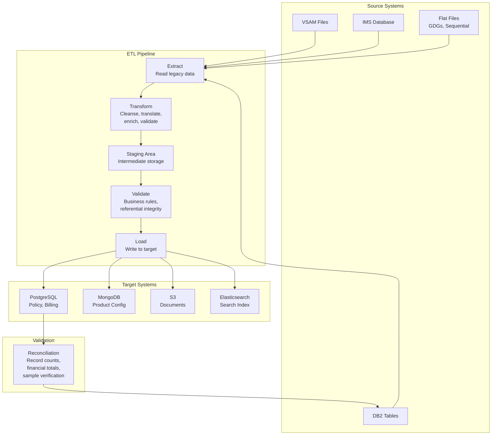

### 7.2 Data Migration Planning

```yaml
# Data migration plan
migration_plan:
  phases:
    phase_1_analysis:
      duration: "8-12 weeks"
      activities:
        - name: "Source data profiling"
          tools: ["Informatica Data Quality", "custom SQL analysis"]
          outputs:
            - "Data dictionary for all legacy entities"
            - "Data quality report (nulls, invalid values, inconsistencies)"
            - "Volume analysis (row counts, growth rates)"
            - "Relationship mapping (implicit joins, foreign keys)"
            
        - name: "Target data model mapping"
          activities:
            - "Map each legacy field to target field"
            - "Document transformation rules"
            - "Identify data enrichment needs"
            - "Define default values for new required fields"
            
        - name: "Migration scope definition"
          decisions:
            - "Which policy statuses to migrate (Active, PaidUp, Lapsed within reinstatement period)"
            - "Historical data depth (all transactions vs. summary)"
            - "Document migration scope"
            
    phase_2_development:
      duration: "12-16 weeks"
      activities:
        - "Build ETL pipelines (Apache Spark or custom Java)"
        - "Build validation framework"
        - "Build reconciliation reports"
        - "Build rollback procedures"
        
    phase_3_testing:
      duration: "8-12 weeks"
      cycles:
        - name: "Mock Migration 1"
          scope: "1,000 policies (sampled across product types)"
          focus: "Data mapping correctness"
          
        - name: "Mock Migration 2"
          scope: "10,000 policies"
          focus: "Data quality, edge cases"
          
        - name: "Mock Migration 3"
          scope: "100,000 policies"
          focus: "Performance, full validation"
          
        - name: "Dress Rehearsal"
          scope: "Full production data"
          focus: "End-to-end process, timing"
          
    phase_4_execution:
      duration: "2-4 weeks (per batch)"
      activities:
        - "Final delta extract"
        - "Production migration run"
        - "Validation and reconciliation"
        - "Smoke testing on new platform"
        - "Routing table update"
```

### 7.3 Data Mapping Example

```yaml
# Legacy VSAM Policy Master → New PostgreSQL policies table
data_mapping:
  source: "VSAM:POLICY.MASTER"
  target: "PostgreSQL:policies"
  
  field_mappings:
    - source_field: "POL-NUMBER"
      source_type: "PIC X(12)"
      target_field: "policy_number"
      target_type: "VARCHAR(20)"
      transformation: "TRIM"
      
    - source_field: "POL-STATUS"
      source_type: "PIC X(2)"
      target_field: "status"
      target_type: "VARCHAR(30)"
      transformation: "LOOKUP:status_code_map"
      
    - source_field: "POL-PLAN-CODE"
      source_type: "PIC X(4)"
      target_field: "plan_code"
      target_type: "VARCHAR(10)"
      transformation: "LOOKUP:plan_code_map"
      
    - source_field: "POL-EFF-DATE"
      source_type: "PIC 9(8)"
      target_field: "effective_date"
      target_type: "DATE"
      transformation: "DATE_CONVERT:YYYYMMDD"
      validation: "MUST_BE_VALID_DATE"
      
    - source_field: "POL-FACE-AMT"
      source_type: "PIC S9(11)V99 COMP-3"
      target_field: "face_amount"  # in coverages table
      target_type: "NUMERIC(15,2)"
      transformation: "COMP3_TO_DECIMAL"
      validation: "MUST_BE_POSITIVE"
      
    - source_field: "POL-OWNER-ID"
      source_type: "PIC X(10)"
      target_field: "owner_party_id"
      target_type: "UUID"
      transformation: "LOOKUP:party_crossref"
      note: "Must migrate parties first; cross-reference table maps legacy ID to UUID"
      
    - source_field: null
      target_field: "policy_id"
      target_type: "UUID"
      transformation: "GENERATE_UUID"
      note: "New field; generated during migration"
      
    - source_field: null
      target_field: "created_at"
      target_type: "TIMESTAMP WITH TIME ZONE"
      transformation: "CURRENT_TIMESTAMP"
      
    - source_field: null
      target_field: "version"
      target_type: "BIGINT"
      transformation: "CONSTANT:0"
```

### 7.4 Reconciliation Framework

```java
// Post-migration reconciliation
@Service
public class MigrationReconciliationService {
    
    public ReconciliationReport reconcile(String migrationBatchId) {
        ReconciliationReport report = new ReconciliationReport(migrationBatchId);
        
        // Level 1: Record count reconciliation
        RecordCountReconciliation countRecon = reconcileRecordCounts(migrationBatchId);
        report.addSection(countRecon);
        
        // Level 2: Financial total reconciliation
        FinancialReconciliation financialRecon = reconcileFinancialTotals(migrationBatchId);
        report.addSection(financialRecon);
        
        // Level 3: Sample verification (detailed field-by-field)
        SampleVerification sampleRecon = verifySample(migrationBatchId, 100);
        report.addSection(sampleRecon);
        
        // Level 4: Business rule validation
        BusinessRuleValidation ruleRecon = validateBusinessRules(migrationBatchId);
        report.addSection(ruleRecon);
        
        report.setOverallResult(
            countRecon.isPassed() && financialRecon.isPassed() &&
            sampleRecon.isPassed() && ruleRecon.isPassed()
        );
        
        return report;
    }
    
    private RecordCountReconciliation reconcileRecordCounts(String batchId) {
        RecordCountReconciliation recon = new RecordCountReconciliation();
        
        // Compare counts for each entity
        Map<String, Long> legacyCounts = legacyDataAccess.getRecordCounts(batchId);
        Map<String, Long> newCounts = newDataAccess.getRecordCounts(batchId);
        
        for (String entity : legacyCounts.keySet()) {
            long legacy = legacyCounts.getOrDefault(entity, 0L);
            long target = newCounts.getOrDefault(entity, 0L);
            
            recon.addComparison(entity, legacy, target, legacy == target);
        }
        
        return recon;
    }
    
    private FinancialReconciliation reconcileFinancialTotals(String batchId) {
        FinancialReconciliation recon = new FinancialReconciliation();
        BigDecimal tolerance = new BigDecimal("0.01"); // 1 cent per policy
        
        // Total face amount
        BigDecimal legacyFace = legacyDataAccess.totalFaceAmount(batchId);
        BigDecimal newFace = newDataAccess.totalFaceAmount(batchId);
        recon.addComparison("Total Face Amount", legacyFace, newFace,
            legacyFace.subtract(newFace).abs().compareTo(tolerance) <= 0);
        
        // Total cash value
        BigDecimal legacyCash = legacyDataAccess.totalCashValue(batchId);
        BigDecimal newCash = newDataAccess.totalCashValue(batchId);
        recon.addComparison("Total Cash Value", legacyCash, newCash,
            legacyCash.subtract(newCash).abs().compareTo(
                tolerance.multiply(BigDecimal.valueOf(legacyDataAccess.getPolicyCount(batchId)))
            ) <= 0);
        
        // Total premium due
        BigDecimal legacyPremium = legacyDataAccess.totalPremiumDue(batchId);
        BigDecimal newPremium = newDataAccess.totalPremiumDue(batchId);
        recon.addComparison("Total Premium Due", legacyPremium, newPremium,
            legacyPremium.subtract(newPremium).abs().compareTo(tolerance) <= 0);
        
        return recon;
    }
    
    private SampleVerification verifySample(String batchId, int sampleSize) {
        SampleVerification verification = new SampleVerification();
        
        // Stratified random sample across product types
        List<String> samplePolicies = selectStratifiedSample(batchId, sampleSize);
        
        for (String policyNumber : samplePolicies) {
            PolicyComparisonResult comparison = comparePolicyDetailExhaustive(policyNumber);
            verification.addResult(comparison);
        }
        
        return verification;
    }
}
```

### 7.5 Delta Migration Strategy

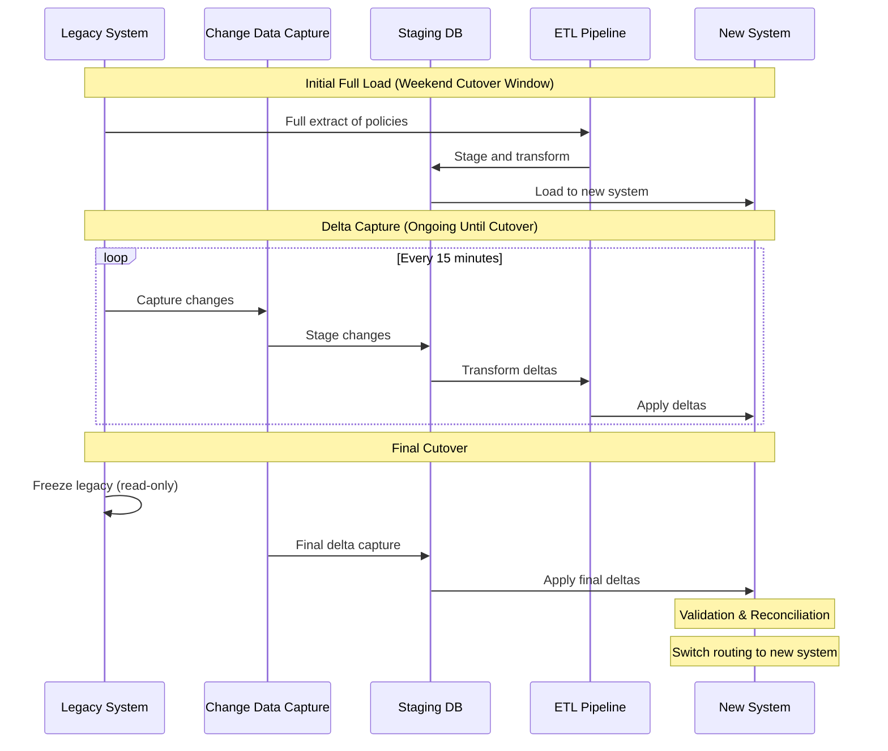

---

## 8. COBOL Migration Specifics

### 8.1 COBOL-to-Java Conversion Approaches

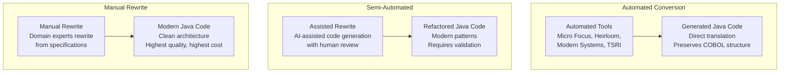

| Approach | Speed | Code Quality | Cost | Risk | Best For |
|---|---|---|---|---|---|
| Automated conversion | Fast (months) | Low (COBOL-like Java) | Low-Medium | Low (preserves logic) | Large codebases, quick migration |
| Semi-automated | Medium (6-18 months) | Medium | Medium | Medium | Moderate codebases with clear structure |
| Manual rewrite | Slow (years) | Highest | Highest | Highest (logic reinterpretation) | Core domain logic, competitive advantage |

### 8.2 Copybook-to-Class Mapping

```cobol
      * COBOL Copybook: POL-MASTER-REC (POLICY MASTER RECORD)
       01  POL-MASTER-REC.
           05  POL-KEY.
               10  POL-COMPANY-CD     PIC X(2).
               10  POL-NUMBER          PIC X(12).
           05  POL-STATUS              PIC X(2).
           05  POL-PLAN-CODE           PIC X(4).
           05  POL-EFF-DATE            PIC 9(8).
           05  POL-ISSUE-DATE          PIC 9(8).
           05  POL-TERM-DATE           PIC 9(8).
           05  POL-ISSUE-AGE           PIC 9(3).
           05  POL-ISSUE-STATE         PIC X(2).
           05  POL-GENDER              PIC X(1).
           05  POL-TOBACCO             PIC X(1).
           05  POL-RATING-CLASS        PIC X(2).
           05  POL-TABLE-RATING        PIC 9(2).
           05  POL-FLAT-EXTRA          PIC S9(5)V9(4) COMP-3.
           05  POL-FACE-AMT            PIC S9(11)V99 COMP-3.
           05  POL-MODAL-PREM          PIC S9(9)V99 COMP-3.
           05  POL-BILLING-FREQ        PIC X(1).
               88  POL-MONTHLY         VALUE 'M'.
               88  POL-QUARTERLY       VALUE 'Q'.
               88  POL-SEMIANNUAL      VALUE 'S'.
               88  POL-ANNUAL          VALUE 'A'.
           05  POL-OWNER-INFO.
               10  POL-OWNER-ID        PIC X(10).
               10  POL-OWNER-NAME      PIC X(30).
           05  POL-INSURED-INFO.
               10  POL-INSURED-ID      PIC X(10).
               10  POL-INSURED-NAME    PIC X(30).
           05  POL-CASH-VALUE          PIC S9(11)V99 COMP-3.
           05  POL-DEATH-BENEFIT       PIC S9(11)V99 COMP-3.
           05  POL-SURRENDER-VALUE     PIC S9(11)V99 COMP-3.
           05  POL-LOAN-BALANCE        PIC S9(11)V99 COMP-3.
           05  POL-ACCUMULATED-VALUE   PIC S9(11)V99 COMP-3.
           05  POL-FILLER              PIC X(100).
```

```java
// Java equivalent: Modern domain class
// NOT a direct 1:1 translation — redesigned for modern patterns
public record LegacyPolicyRecord(
    String companyCode,
    String policyNumber,
    String statusCode,
    String planCode,
    String effectiveDate,     // YYYYMMDD string
    String issueDate,
    String terminationDate,
    int issueAge,
    String issueState,
    String gender,
    String tobaccoStatus,
    String ratingClass,
    int tableRating,
    long flatExtra,           // S9(5)V9(4) as long with 4 implied decimals
    long faceAmount,          // S9(11)V99 as long with 2 implied decimals
    long modalPremium,
    String billingFrequency,
    String ownerId,
    String ownerName,
    String insuredId,
    String insuredName,
    long cashValue,
    long deathBenefit,
    long surrenderValue,
    long loanBalance,
    long accumulatedValue
) {
    // Factory method to parse from raw VSAM/EBCDIC record
    public static LegacyPolicyRecord fromBytes(byte[] record) {
        return new LegacyPolicyRecord(
            EbcdicDecoder.getString(record, 0, 2),      // POL-COMPANY-CD
            EbcdicDecoder.getString(record, 2, 12),      // POL-NUMBER
            EbcdicDecoder.getString(record, 14, 2),      // POL-STATUS
            EbcdicDecoder.getString(record, 16, 4),      // POL-PLAN-CODE
            EbcdicDecoder.getString(record, 20, 8),      // POL-EFF-DATE
            EbcdicDecoder.getString(record, 28, 8),      // POL-ISSUE-DATE
            EbcdicDecoder.getString(record, 36, 8),      // POL-TERM-DATE
            EbcdicDecoder.getPackedInt(record, 44, 3),   // POL-ISSUE-AGE
            EbcdicDecoder.getString(record, 46, 2),      // POL-ISSUE-STATE
            EbcdicDecoder.getString(record, 48, 1),      // POL-GENDER
            EbcdicDecoder.getString(record, 49, 1),      // POL-TOBACCO
            EbcdicDecoder.getString(record, 50, 2),      // POL-RATING-CLASS
            EbcdicDecoder.getPackedInt(record, 52, 2),   // POL-TABLE-RATING
            EbcdicDecoder.getPackedLong(record, 53, 5),  // POL-FLAT-EXTRA
            EbcdicDecoder.getPackedLong(record, 58, 7),  // POL-FACE-AMT
            EbcdicDecoder.getPackedLong(record, 65, 6),  // POL-MODAL-PREM
            EbcdicDecoder.getString(record, 71, 1),      // POL-BILLING-FREQ
            EbcdicDecoder.getString(record, 72, 10),     // POL-OWNER-ID
            EbcdicDecoder.getString(record, 82, 30),     // POL-OWNER-NAME
            EbcdicDecoder.getString(record, 112, 10),    // POL-INSURED-ID
            EbcdicDecoder.getString(record, 122, 30),    // POL-INSURED-NAME
            EbcdicDecoder.getPackedLong(record, 152, 7), // POL-CASH-VALUE
            EbcdicDecoder.getPackedLong(record, 159, 7), // POL-DEATH-BENEFIT
            EbcdicDecoder.getPackedLong(record, 166, 7), // POL-SURRENDER-VALUE
            EbcdicDecoder.getPackedLong(record, 173, 7), // POL-LOAN-BALANCE
            EbcdicDecoder.getPackedLong(record, 180, 7)  // POL-ACCUMULATED-VALUE
        );
    }
}
```

### 8.3 CICS Transaction Migration

```yaml
# CICS transaction inventory and migration plan
cics_transactions:
  - transaction_id: "POLINQ"
    program: "POLIQ000"
    description: "Policy inquiry — display policy summary"
    volume: "15,000/day"
    migration_strategy: "API replacement"
    new_endpoint: "GET /api/v3/policies/{policyNumber}"
    priority: 1
    
  - transaction_id: "POLCHG"
    program: "POLCH000"
    description: "Policy change — process endorsements"
    volume: "2,000/day"
    migration_strategy: "API replacement"
    new_endpoint: "POST /api/v3/policies/{policyNumber}/transactions"
    priority: 2
    
  - transaction_id: "NEWAPP"
    program: "NWAP000"
    description: "New application entry"
    volume: "500/day"
    migration_strategy: "New platform (first to migrate)"
    new_endpoint: "POST /api/v3/applications"
    priority: 1
    
  - transaction_id: "CLMINQ"
    program: "CLMI000"
    description: "Claims inquiry"
    volume: "3,000/day"
    migration_strategy: "API replacement"
    new_endpoint: "GET /api/v3/claims/{claimId}"
    priority: 3
    
  - transaction_id: "PAYMNT"
    program: "PYMT000"
    description: "Payment application"
    volume: "8,000/day"
    migration_strategy: "API replacement"
    new_endpoint: "POST /api/v3/billing/payments"
    priority: 2
```

### 8.4 Batch JCL Migration

```yaml
# Legacy batch job → modern equivalent
batch_migration:
  - legacy_job: "BILLING CYCLE (JCLBILL)"
    schedule: "1st of each month, 2:00 AM"
    runtime: "4-6 hours"
    steps:
      - "STEP010: Sort policy file by billing date"
      - "STEP020: Calculate premiums due"
      - "STEP030: Generate billing statements"
      - "STEP040: Create ACH file"
      - "STEP050: Update policy records"
      - "STEP060: Generate reports"
    modern_equivalent:
      type: "Kubernetes CronJob + Kafka"
      architecture: |
        EventBridge Scheduler → Step Function → 
          Parallel workers (Kafka partitioned by billing account) →
          Each worker: calculate premium, create statement, publish event
      benefits:
        - "Parallel processing (4 hours → 30 minutes)"
        - "Incremental (no batch window needed)"
        - "Restartable from any point"
        - "Observable (real-time progress tracking)"
        
  - legacy_job: "MONTHLY VALUATION (JCLVAL)"
    schedule: "Last day of month, 6:00 PM"
    runtime: "8-12 hours"
    steps:
      - "STEP010: Extract in-force policies"
      - "STEP020: Calculate statutory reserves"
      - "STEP030: Calculate GAAP reserves"
      - "STEP040: Calculate tax reserves"
      - "STEP050: Generate valuation reports"
      - "STEP060: Post to GL"
    modern_equivalent:
      type: "Kubernetes Job with parallel workers"
      architecture: |
        CronJob → Partitioned Job (10 parallel workers) →
          Each worker: valuation calculation per policy batch →
          Aggregation step → GL posting
      infrastructure:
        node_type: "compute-optimized (c6i.4xlarge)"
        parallelism: 10
        estimated_runtime: "45 minutes"
```

---

## 9. Integration During Modernization

### 9.1 Bi-Directional Synchronization

During the migration period, legacy and new systems must stay in sync:

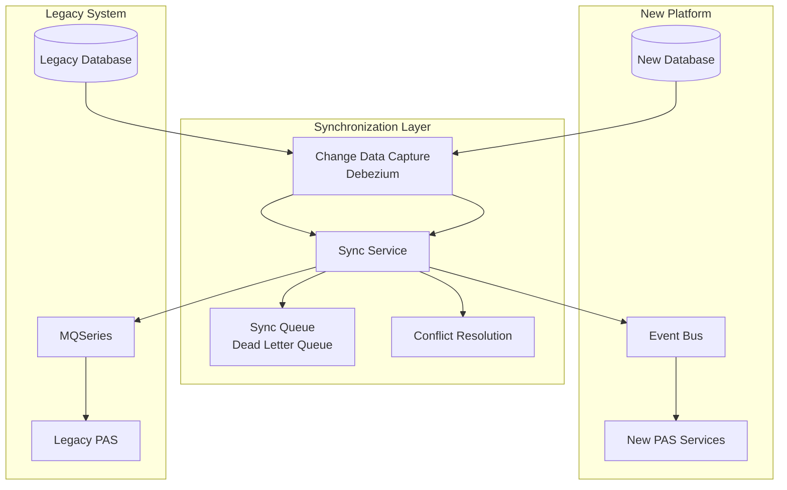

### 9.2 Synchronization Patterns

```java
// Bi-directional sync service
@Service
public class PolicySyncService {
    
    // New → Legacy sync (for policies managed on new platform)
    @KafkaListener(topics = "policy.policy.changed", groupId = "legacy-sync")
    public void syncToLegacy(PolicyChangedEvent event) {
        // Only sync policies that are also tracked in legacy
        if (!isTrackedInLegacy(event.getPolicyNumber())) {
            return;
        }
        
        try {
            LegacyUpdateCommand command = translator.tolegacyUpdate(event);
            legacyMqGateway.send("POLICY.SYNC.QUEUE", command);
            
            syncAuditLog.recordSync(
                event.getPolicyNumber(), 
                SyncDirection.NEW_TO_LEGACY,
                SyncStatus.SUCCESS
            );
        } catch (Exception e) {
            syncAuditLog.recordSync(
                event.getPolicyNumber(),
                SyncDirection.NEW_TO_LEGACY,
                SyncStatus.FAILED,
                e.getMessage()
            );
            deadLetterService.enqueue(event, e);
        }
    }
    
    // Legacy → New sync (for policies still managed on legacy)
    @JmsListener(destination = "LEGACY.POLICY.CHANGES")
    public void syncFromLegacy(LegacyPolicyChangeMessage message) {
        // Only sync if policy exists in new system (migrated or replicated)
        if (!existsInNewSystem(message.getPolicyNumber())) {
            return;
        }
        
        try {
            PolicyUpdateCommand command = translator.fromLegacyChange(message);
            policyService.applyExternalUpdate(command);
            
            syncAuditLog.recordSync(
                message.getPolicyNumber(),
                SyncDirection.LEGACY_TO_NEW,
                SyncStatus.SUCCESS
            );
        } catch (ConflictException e) {
            conflictResolver.resolve(message, e);
        }
    }
}
```

### 9.3 Rollback Strategy

```yaml
# Rollback procedures by migration phase
rollback_strategies:
  phase_new_business:
    trigger: "Critical defect rate > 5% or financial discrepancy"
    procedure:
      - "Switch routing: new business → legacy"
      - "Migrate policies created on new platform back to legacy"
      - "Verify all data migrated correctly"
      - "Resume legacy processing"
    data_rollback: "Export from new DB, transform, load to legacy"
    estimated_time: "4-8 hours"
    risk: "LOW — limited data created on new platform"
    
  phase_in_force_canary:
    trigger: "Mismatch rate > 1% or CSR escalation spike"
    procedure:
      - "Switch routing for affected policies → legacy"
      - "Reverse any changes made on new platform"
      - "Reconcile financial positions"
    data_rollback: "Point-in-time recovery to pre-migration snapshot"
    estimated_time: "2-4 hours for canary batch"
    risk: "MEDIUM — must reconcile changes made during canary"
    
  phase_full_migration:
    trigger: "Major system failure or regulatory concern"
    procedure:
      - "Activate legacy system (maintained in warm standby)"
      - "Apply delta changes from new system to legacy"
      - "Switch all routing to legacy"
      - "Validate critical business operations"
    data_rollback: "Delta sync: new → legacy for all changes since migration"
    estimated_time: "8-24 hours"
    risk: "HIGH — significant data reconciliation required"
    mitigation: "Maintain legacy warm standby for 12 months post-migration"
```

---

## 10. Phased Migration Approach

### 10.1 Four-Phase Strategy

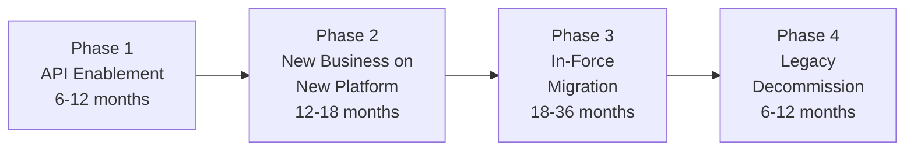

### 10.2 Phase 1: API Enablement

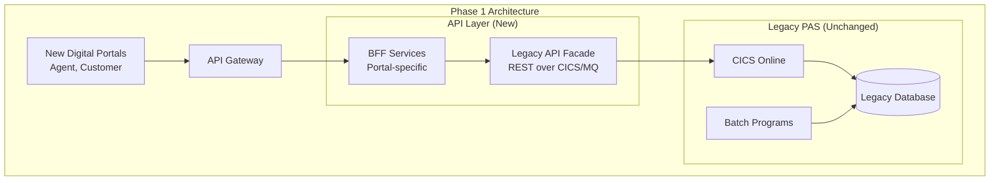

**Goals**:
- Expose legacy functionality through modern REST APIs
- Enable new digital channels (agent portal, customer self-service)
- Establish API gateway and security infrastructure
- No changes to legacy system itself
- Build integration expertise

### 10.3 Phase 2: New Business on New Platform

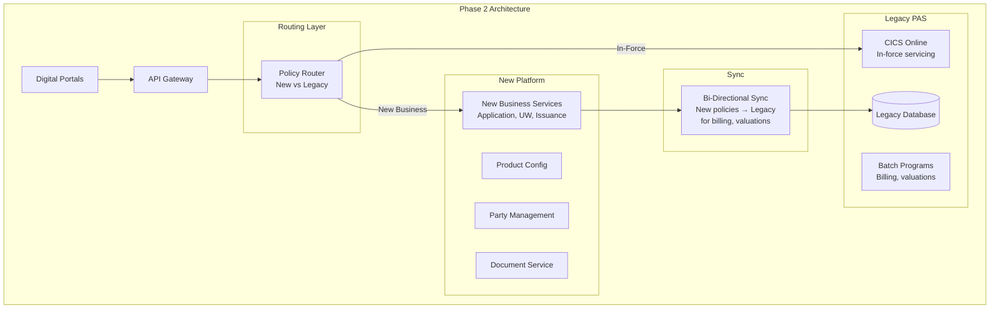

**Key decision**: New business issued on the new platform but synced to legacy for downstream processing (billing, valuations) until those services are also migrated. This avoids the complexity of migrating billing and financial systems simultaneously.

### 10.4 Phase 3: In-Force Migration

This is the most complex and highest-risk phase:

```yaml
# In-force migration batching strategy
in_force_migration:
  batch_strategy: "Product type, simplest first"
  
  batches:
    - batch: 1
      products: ["10-Year Level Term", "20-Year Level Term"]
      characteristics: "Simplest — no cash value, no riders"
      estimated_policies: 150000
      timeline: "8 weeks"
      
    - batch: 2
      products: ["30-Year Level Term", "Annual Renewable Term"]
      characteristics: "Slightly more complex — conversion options"
      estimated_policies: 100000
      timeline: "6 weeks"
      
    - batch: 3
      products: ["Whole Life (Ordinary Life, 20-Pay, Paid-Up at 65)"]
      characteristics: "Cash values, dividends, loans, paid-up additions"
      estimated_policies: 200000
      timeline: "12 weeks"
      
    - batch: 4
      products: ["Universal Life"]
      characteristics: "Complex — flexible premiums, cost of insurance, credited rates"
      estimated_policies: 180000
      timeline: "14 weeks"
      
    - batch: 5
      products: ["Variable Universal Life"]
      characteristics: "Most complex — subaccounts, fund values, daily processing"
      estimated_policies: 80000
      timeline: "16 weeks"
      
    - batch: 6
      products: ["Fixed Annuities, Variable Annuities"]
      characteristics: "Different product structure — accumulation, annuitization"
      estimated_policies: 120000
      timeline: "12 weeks"
      
  total_estimated_timeline: "12-18 months"
  
  per_batch_process:
    - "Data extraction and transformation (2 weeks)"
    - "Mock migration and validation (2 weeks)"
    - "Dress rehearsal (1 week)"
    - "Production migration (1 weekend)"
    - "Validation and parallel run (2-4 weeks)"
    - "Routing cutover (1 day)"
    - "Monitoring period (4 weeks)"
```

### 10.5 Phase 4: Legacy Decommission

```yaml
# Decommission checklist
decommission:
  prerequisites:
    - "All policies migrated and validated"
    - "All batch processes running on new platform"
    - "All integrations pointed to new platform"
    - "Regulatory approval (if required)"
    - "12-month parallel run completed"
    - "Reconciliation reports clean for 6 consecutive months"
    
  steps:
    - name: "Archive legacy data"
      details: |
        Extract all legacy data to long-term archive (S3 Glacier)
        Maintain for regulatory retention period (10+ years)
        Index for examiner access
        
    - name: "Decommission legacy infrastructure"
      details: |
        Power down mainframe partitions
        Cancel mainframe software licenses
        Terminate mainframe support contracts
        Archive source code and documentation
        
    - name: "Update DR plans"
      details: |
        Remove legacy from disaster recovery procedures
        Update BCP documentation
        
    - name: "Financial reconciliation"
      details: |
        Final reconciliation between legacy archive and new system
        Sign-off from finance and actuarial
        
    - name: "Regulatory notification"
      details: |
        Notify domicile state of system change
        Update vendor management documentation
        Archive examination readiness materials
```

---

## 11. Organizational Change Management

### 11.1 Skills Transformation

```mermaid
graph TB
    subgraph "Legacy Skills"
        LS1[COBOL Programming]
        LS2[Mainframe Operations<br/>JCL, CICS, DB2]
        LS3[Waterfall Project Mgmt]
        LS4[Manual Testing]
        LS5[Legacy Vendor Mgmt]
    end
    
    subgraph "Transition Path"
        TP1[Training Programs]
        TP2[Paired Programming]
        TP3[Mentoring]
        TP4[Certification]
    end
    
    subgraph "Modern Skills"
        MS1[Java/Python/TypeScript]
        MS2[Cloud/Kubernetes/DevOps]
        MS3[Agile/Product Mgmt]
        MS4[Automated Testing/CI/CD]
        MS5[Cloud Vendor Mgmt]
    end
    
    LS1 --> TP1 --> MS1
    LS2 --> TP2 --> MS2
    LS3 --> TP3 --> MS3
    LS4 --> TP4 --> MS4
    LS5 --> TP1 --> MS5
```

### 11.2 Team Structure: Two-Speed IT

```yaml
# Organization structure during modernization
team_structure:
  legacy_team:
    name: "Legacy Operations Team"
    responsibility: "Maintain and support legacy PAS"
    size: "Gradually decreasing"
    activities:
      - "Bug fixes and regulatory changes on legacy"
      - "Support parallel run validation"
      - "Knowledge transfer to modern team"
      - "Legacy data extraction support"
    
  modern_team:
    name: "New Platform Team"
    responsibility: "Build and operate new PAS"
    size: "Gradually increasing"
    sub_teams:
      - name: "Policy Domain Team"
        size: "8-10 engineers"
        skills: "Java, Spring Boot, PostgreSQL, Kafka"
        
      - name: "Billing Domain Team"
        size: "6-8 engineers"
        skills: "Java, Spring Boot, Payment processing"
        
      - name: "Claims Domain Team"
        size: "5-7 engineers"
        
      - name: "Platform/SRE Team"
        size: "6-8 engineers"
        skills: "Kubernetes, Terraform, CI/CD, observability"
        
      - name: "Data Migration Team"
        size: "4-6 engineers"
        skills: "ETL, data transformation, COBOL data formats"
        
      - name: "Integration Team"
        size: "4-6 engineers"
        skills: "API design, MQ, sync patterns"
    
  bridge_roles:
    - name: "Domain SMEs"
      description: "Business experts who understand legacy system behavior"
      critical: true
      note: "These are often the legacy developers who understand the business rules"
      
    - name: "Data Architects"
      description: "Understand both legacy and modern data models"
      
    - name: "Integration Architects"
      description: "Design the coexistence architecture"
```

### 11.3 Knowledge Transfer

```yaml
# Knowledge extraction and transfer plan
knowledge_transfer:
  methods:
    - name: "Legacy Code Archaeology"
      description: "Systematic analysis of COBOL code to extract business rules"
      approach: |
        1. Use static analysis tools (CAST, SonarQube COBOL) to map code structure
        2. Identify business rule hotspots (high complexity, many conditions)
        3. Extract rules into decision tables and documentation
        4. Validate with business SMEs
      tools: ["CAST Software Intelligence", "SonarQube COBOL plugin", "custom scripts"]
      
    - name: "SME Interview Program"
      description: "Structured interviews with legacy developers and business experts"
      approach: |
        1. Identify all SMEs with legacy knowledge
        2. Conduct recorded interview sessions (2-4 hours each)
        3. Focus on: undocumented business rules, edge cases, 
           regulatory requirements, historical decisions
        4. Transcribe and catalog knowledge
      frequency: "Weekly over 3-6 months"
      
    - name: "Paired Implementation"
      description: "Legacy expert pairs with modern developer during rewrite"
      approach: |
        Legacy developer explains business logic
        Modern developer implements in new codebase
        Both validate against test cases
      
    - name: "Test Case Extraction"
      description: "Extract test cases from production data"
      approach: |
        1. Capture production transactions (sanitized)
        2. Record inputs and outputs
        3. Use as regression test suite for new system
        4. Ensure edge cases are covered
```

---

## 12. Risk Management

### 12.1 Risk Categories

```mermaid
graph TB
    subgraph "Regulatory Risk"
        RR1[Non-compliance during transition]
        RR2[Failed regulatory examination]
        RR3[Data breach during migration]
        RR4[Reporting disruption]
    end
    
    subgraph "Operational Risk"
        OR1[Service disruption to policyholders]
        OR2[Billing errors during cutover]
        OR3[Claims processing delays]
        OR4[Agent portal downtime]
    end
    
    subgraph "Data Risk"
        DR1[Data loss during migration]
        DR2[Data corruption]
        DR3[Data inconsistency between systems]
        DR4[PII exposure during migration]
    end
    
    subgraph "Financial Risk"
        FR1[Budget overruns]
        FR2[Dual-system operating costs]
        FR3[Premium accounting errors]
        FR4[Reserve calculation errors]
    end
    
    subgraph "People Risk"
        PR1[Key person departure]
        PR2[Skill gaps]
        PR3[Change resistance]
        PR4[Vendor dependency]
    end
```

### 12.2 Risk Mitigation Matrix

| Risk | Likelihood | Impact | Mitigation | Contingency |
|---|---|---|---|---|
| Data loss during migration | Medium | Critical | Multiple validation checkpoints, full backups, reversible migration | Restore from legacy backup, re-run migration |
| Billing errors post-cutover | High | High | Parallel run for 6+ months, automated reconciliation | Manual billing corrections, customer communication, regulatory notification |
| Key SME departure | Medium | Critical | Knowledge documentation, cross-training, retention bonuses | Engage consulting firm with legacy expertise |
| Budget overrun | High | Medium | Phased funding with gates, fixed-price components | Reduce scope, extend timeline, phase migration |
| Regulatory examination during migration | Medium | High | Maintain examination readiness for both systems, brief examiners proactively | Pause migration for examination period |
| Reserve calculation discrepancy | Low | Critical | Actuarial validation at each batch, regulatory approval of new methodology | Fall back to legacy calculations, regulatory notification |
| Performance degradation | Medium | Medium | Load testing at each phase, capacity planning | Scale infrastructure, optimize critical paths |
| Integration failure | Medium | High | Comprehensive integration testing, circuit breakers, fallback routing | Route affected transactions to legacy |

### 12.3 Governance Framework

```yaml
# Modernization governance structure
governance:
  steering_committee:
    frequency: "Monthly"
    members: ["CIO", "COO", "CFO", "Chief Actuary", "Chief Compliance Officer"]
    agenda:
      - "Program status (timeline, budget, risks)"
      - "Major decision approvals"
      - "Regulatory impact assessment"
      - "Go/no-go decisions for phase gates"
      
  program_board:
    frequency: "Bi-weekly"
    members: ["Program Director", "Domain Leads", "Architecture Lead", "QA Lead"]
    agenda:
      - "Sprint demos and progress"
      - "Technical decisions"
      - "Dependency management"
      - "Risk escalation"
      
  phase_gates:
    gate_1_api_enablement:
      criteria:
        - "All critical legacy functions accessible via API"
        - "API security validated"
        - "Performance baseline established"
        
    gate_2_new_business:
      criteria:
        - "New business end-to-end flow operational"
        - "Parallel run with legacy for 100+ policies"
        - "Agent acceptance testing complete"
        - "Regulatory review complete (if required)"
        
    gate_3_in_force_batch:
      criteria_per_batch:
        - "Mock migration 100% reconciled"
        - "Dress rehearsal within time window"
        - "All financial values within tolerance"
        - "Actuarial sign-off on reserves"
        - "No open P1/P2 defects"
        
    gate_4_decommission:
      criteria:
        - "All policies migrated and validated"
        - "12-month parallel run complete"
        - "Regulatory sign-off"
        - "Data archived per retention policy"
        - "Legacy support contracts terminated"
```

---

## 13. Case Studies

### 13.1 Case Study 1: Mid-Size Carrier — COBOL Mainframe to Cloud-Native

```yaml
case_study_1:
  carrier: "Mid-size mutual life insurance company"
  book_size: "800,000 policies"
  products: "Whole Life, Term, UL, Fixed Annuity"
  legacy_system: "Custom COBOL on IBM z/OS, 4M lines of code, in use since 1982"
  
  challenge: |
    - 2 remaining COBOL developers (both over 60)
    - IFRS 17 compliance required new calculation capabilities
    - Agent portal initiative blocked by integration limitations
    - $8M annual mainframe cost
    
  strategy: "Strangler Fig with cloud-native new platform"
  
  timeline:
    year_1:
      - "Assessment and planning (Q1-Q2)"
      - "Cloud foundation (Q2-Q3)"
      - "API enablement of legacy (Q3-Q4)"
      - "Product configuration on new platform (Q4)"
    year_2:
      - "Party management migration (Q1)"
      - "New business on new platform — Term only (Q2)"
      - "New business — all products (Q3-Q4)"
      - "Begin in-force Term migration (Q4)"
    year_3:
      - "In-force Term migration complete (Q1)"
      - "In-force Whole Life migration (Q2-Q3)"
      - "In-force UL migration (Q3-Q4)"
    year_4:
      - "In-force Fixed Annuity migration (Q1)"
      - "Parallel run and validation (Q2)"
      - "Legacy decommission (Q3)"
      
  budget:
    total: "$45M over 4 years"
    breakdown:
      cloud_infrastructure: "$6M"
      software_development: "$22M"
      data_migration: "$8M"
      testing_and_validation: "$5M"
      change_management: "$4M"
      
  outcomes:
    - "Mainframe decommissioned, saving $8M/year"
    - "Product launch cycle reduced from 14 months to 6 weeks"
    - "Agent portal live within 12 months"
    - "IFRS 17 compliance achieved on new platform"
    - "Zero data loss, zero financial discrepancy"
    
  lessons_learned:
    - "Knowledge transfer from legacy developers was the #1 risk — started too late"
    - "UL migration was 3x more complex than estimated due to historical crediting rate logic"
    - "Parallel run reconciliation automated early saved enormous manual effort"
    - "Business engagement was critical — dedicated business analysts per domain"
```

### 13.2 Case Study 2: Large Carrier — Replace with Commercial PAS

```yaml
case_study_2:
  carrier: "Top-20 US life insurance company"
  book_size: "5M policies across 3 legacy PAS platforms"
  legacy_systems:
    - "CyberLife on z/OS (Individual Life — 2.5M policies)"
    - "Custom AS/400 (Group Life — 1.5M certificates)"
    - "Custom J2EE (Annuities — 1M contracts)"
    
  strategy: "Replace with commercial PAS (COTS) — OIPA selected"
  
  timeline: "7 years (originally planned for 5)"
  budget: "$180M (originally budgeted $120M)"
  
  phases:
    phase_1: "New business on OIPA — Individual Life (18 months)"
    phase_2: "In-force migration — Term Life (12 months)"
    phase_3: "In-force migration — Whole Life (14 months)"
    phase_4: "In-force migration — UL/VUL (18 months)"
    phase_5: "Annuity platform migration (16 months)"
    phase_6: "Group platform consolidation (12 months)"
    
  challenges:
    - "Scope creep: customization of COTS exceeded estimates"
    - "Data quality: legacy data had significant quality issues discovered during migration"
    - "Organizational resistance: legacy teams reluctant to transition"
    - "Vendor dependency: COTS configuration required specialized vendor consultants"
    - "Regulatory: state examination during Year 3 required pause"
    
  outcomes:
    - "Consolidated 3 platforms to 1"
    - "Infrastructure cost reduced by 40%"
    - "Product speed to market improved by 60%"
    - "Agent satisfaction significantly improved"
    
  lessons_learned:
    - "COTS is not a silver bullet — significant configuration/customization required"
    - "Budget should include 50% contingency for first major PAS replacement"
    - "Data quality remediation should be a pre-migration investment"
    - "Strong vendor management is essential for COTS implementations"
```

---

## 14. Decision Frameworks

### 14.1 Build vs Buy vs Modernize

```mermaid
graph TB
    START[Modernization Decision] --> Q1{Unique competitive<br/>advantage in PAS?}
    
    Q1 -->|Yes - Custom products,<br/>proprietary rules| BUILD[Build Custom<br/>Cloud-Native PAS]
    Q1 -->|No - Standard products| Q2{Book size?}
    
    Q2 -->|Small: < 200K policies| REPLACE_SAAS[Replace with<br/>SaaS PAS<br/>Socotra, EIS]
    Q2 -->|Medium: 200K - 2M| Q3{Budget?}
    Q2 -->|Large: > 2M| Q4{Timeline pressure?}
    
    Q3 -->|< $30M| MODERNIZE_INCR[Modernize Incrementally<br/>Strangler Fig]
    Q3 -->|$30M - $80M| REPLACE_COTS[Replace with COTS<br/>OIPA, AdminServer]
    
    Q4 -->|Urgent: < 3 years| REHOST_WRAP[Rehost + API Wrap<br/>Then incremental]
    Q4 -->|Can invest 5+ years| REPLACE_PHASE[Phased Replacement<br/>COTS or Custom]
```

### 14.2 Technology Selection Matrix

| Factor | Weight | Custom Build | COTS (OIPA, etc.) | SaaS (Socotra, etc.) | Modernize In-Place |
|---|---|---|---|---|---|
| Time to value | 20% | Low (3-5 years) | Medium (2-4 years) | High (1-2 years) | Medium (1-3 years) |
| Total cost (5-year) | 20% | High ($50-150M) | High ($40-100M) | Medium ($20-50M) | Low-Medium ($15-40M) |
| Flexibility | 15% | Highest | Medium | Low-Medium | Medium |
| Risk | 15% | High | Medium-High | Low-Medium | Medium |
| Vendor independence | 10% | Highest | Low | Low | Highest |
| Skill availability | 10% | High (modern skills) | Medium (vendor-specific) | High (API-based) | Low (legacy + modern) |
| Regulatory comfort | 10% | Medium (unproven) | High (established) | Medium (cloud-only) | High (known system) |

---

## 15. Architecture Patterns

### 15.1 Target State Architecture

```mermaid
graph TB
    subgraph "Digital Channels"
        WEB[Web Portal]
        MOB[Mobile App]
        API_EXT[Partner APIs]
    end
    
    subgraph "API Gateway"
        GW[Kong / AWS API GW<br/>Auth, Rate Limit, Route]
    end
    
    subgraph "Cloud-Native PAS"
        subgraph "Application Services (EKS)"
            PS[Policy Service]
            BS[Billing Service]
            CS[Claims Service]
            UWS[Underwriting Service]
            PRODS[Product Service]
            PTS[Party Service]
            COMS[Commission Service]
            FS[Financial Service]
        end
        
        subgraph "Event Infrastructure"
            KAFKA[Kafka Event Bus]
        end
        
        subgraph "Data Stores"
            PG[(PostgreSQL)]
            REDIS[(Redis Cache)]
            S3[(S3 Documents)]
            ES[(Elasticsearch)]
        end
    end
    
    subgraph "Integration"
        IPAAS[iPaaS Layer<br/>MuleSoft/Boomi]
        GL[General Ledger]
        BANK[Banking]
        REIN[Reinsurers]
        VENDOR[Vendors]
    end
    
    WEB --> GW
    MOB --> GW
    API_EXT --> GW
    GW --> PS
    GW --> BS
    GW --> CS
    
    PS --> KAFKA
    KAFKA --> BS
    KAFKA --> COMS
    KAFKA --> FS
    
    PS --> PG
    PRODS --> REDIS
    CS --> S3
    PTS --> ES
    
    FS --> IPAAS --> GL
    BS --> IPAAS --> BANK
```

### 15.2 Transition Architecture (During Migration)

```mermaid
graph TB
    subgraph "Channels"
        WEB_T[Web Portal<br/>New]
        TERM_T[3270 Terminal<br/>Legacy - being retired]
        API_T[APIs<br/>New]
    end
    
    subgraph "Routing Layer"
        ROUTER[Policy Router<br/>Determines platform<br/>per policy]
    end
    
    subgraph "New Platform"
        NEW_SVC[Cloud-Native<br/>Microservices]
        NEW_DB[(New Databases)]
    end
    
    subgraph "Legacy Platform"
        LEGACY_SVC[COBOL/CICS<br/>Mainframe]
        LEGACY_DB[(VSAM/DB2)]
    end
    
    subgraph "Synchronization"
        SYNC[Bi-Directional<br/>Sync Service]
        CDC[Change Data<br/>Capture]
    end
    
    WEB_T --> ROUTER
    API_T --> ROUTER
    TERM_T --> LEGACY_SVC
    
    ROUTER -->|New/Migrated Policies| NEW_SVC
    ROUTER -->|Legacy Policies| LEGACY_SVC
    
    NEW_SVC --> NEW_DB
    LEGACY_SVC --> LEGACY_DB
    
    NEW_DB --> CDC --> SYNC --> LEGACY_DB
    LEGACY_DB --> CDC --> SYNC --> NEW_DB
```

### 15.3 Integration Architecture During Migration

```mermaid
graph TB
    subgraph "Upstream Systems"
        DIST[Distribution<br/>Agent Portal, Aggregators]
        CUST[Customer<br/>Self-Service Portal]
    end
    
    subgraph "Integration Hub"
        APIGW_I[API Gateway<br/>Unified Entry Point]
        ESB[Event Bus / iPaaS<br/>Route to correct platform]
    end
    
    subgraph "New Platform"
        NP[New PAS Services]
    end
    
    subgraph "Legacy Platform"
        LP[Legacy PAS<br/>with API Facade]
    end
    
    subgraph "Downstream Systems"
        GL_I[General Ledger]
        REIN_I[Reinsurance]
        BANK_I[Banking/ACH]
        REG[Regulatory Reporting]
    end
    
    DIST --> APIGW_I --> ESB
    CUST --> APIGW_I
    
    ESB -->|New Business| NP
    ESB -->|In-Force (Legacy)| LP
    
    NP --> ESB
    LP --> ESB
    
    ESB --> GL_I
    ESB --> REIN_I
    ESB --> BANK_I
    ESB --> REG
```

---

## 16. Conclusion

Legacy PAS modernization is one of the most consequential and challenging technology programs an insurance company will undertake. The systems being replaced contain the core operational logic of the business, accumulated over decades, and any disruption has immediate business and regulatory impact.

### Key Success Factors

1. **Executive commitment**: This is a multi-year, enterprise-level transformation requiring sustained C-suite sponsorship and funding
2. **Business engagement**: Technology cannot succeed without deep business domain expertise; the modernization team must include insurance SMEs
3. **Incremental approach**: The Strangler Fig pattern, combined with phased migration, dramatically reduces risk compared to big-bang replacement
4. **Data quality investment**: Address data quality issues before migration, not during it
5. **Parallel validation**: Run old and new systems in parallel with automated reconciliation for every migration batch
6. **Knowledge preservation**: Extract business knowledge from legacy systems and people before it's lost
7. **Rollback readiness**: Maintain the ability to roll back at every stage until the legacy is decommissioned
8. **Regulatory alignment**: Brief regulators proactively; conduct examinations on both platforms during transition

### Common Failure Modes

1. **Underestimating complexity**: Insurance business logic is deeper than it appears; budget and timeline with significant contingency
2. **Big-bang approach**: Attempting to replace everything at once almost always fails for large books of business
3. **Ignoring organizational change**: Technology is the easy part; people and process change determine success
4. **Poor data migration**: Bad data in the new system erodes trust and forces workarounds
5. **Losing legacy knowledge**: Retired legacy developers take irreplaceable knowledge with them
6. **Scope creep**: Clear scope boundaries with change control are essential

The path forward is clear even if the journey is long: every insurer will eventually modernize its PAS. The question is whether it will be a planned, well-executed transformation or an emergency response to a crisis (mainframe failure, last COBOL developer retiring, regulatory non-compliance). Architects who understand both the legacy landscape and modern patterns are uniquely positioned to guide their organizations through this critical transition.

---

*This article is part of the Life Insurance PAS Architect's Encyclopedia. See also: Article 38 (Microservices Architecture), Article 39 (Cloud-Native PAS Design), Article 41 (Security Architecture for PAS).*
