# Article 41: Security Architecture for Policy Administration Systems

## Table of Contents

1. [Introduction](#1-introduction)
2. [Threat Landscape for Insurance](#2-threat-landscape-for-insurance)
3. [Zero Trust Architecture](#3-zero-trust-architecture)
4. [Identity & Access Management](#4-identity--access-management)
5. [Data Protection](#5-data-protection)
6. [PII/PHI Handling](#6-piiphi-handling)
7. [Application Security](#7-application-security)
8. [API Security](#8-api-security)
9. [Network Security](#9-network-security)
10. [Compliance & Audit](#10-compliance--audit)
11. [Incident Response](#11-incident-response)
12. [Vendor & Third-Party Security](#12-vendor--third-party-security)
13. [Security Architecture Reference](#13-security-architecture-reference)
14. [Security Controls Matrix](#14-security-controls-matrix)
15. [IAM Role Definitions](#15-iam-role-definitions)
16. [Conclusion](#16-conclusion)

---

## 1. Introduction

Life insurance Policy Administration Systems are among the highest-value targets in the financial services sector. A single PAS may contain millions of records with Social Security numbers, dates of birth, health information (including medical underwriting records), financial data (income, net worth, bank accounts), and beneficiary relationships. This data, combined with the payment processing capabilities of billing and claims systems, creates a target-rich environment for threat actors.

The security architecture for a PAS must address multiple dimensions simultaneously:

- **Confidentiality**: Protect PII, PHI, and financial data from unauthorized access and disclosure
- **Integrity**: Ensure policy data, financial calculations, and transaction records cannot be tampered with
- **Availability**: Maintain continuous access for policyholders, agents, and operational staff
- **Non-repudiation**: Provide irrefutable proof of who did what, when, and why — essential for regulatory examination
- **Compliance**: Meet the requirements of NYDFS 23 NYCRR 500, NAIC Model Law #668, GLBA, HIPAA, PCI-DSS, and state-specific privacy laws

This article provides a comprehensive security architecture for PAS platforms, covering every layer from network infrastructure to application code, with insurance-specific threat models, compliance requirements, and practical implementation guidance.

---

## 2. Threat Landscape for Insurance

### 2.1 Insurance-Specific Threat Model

```mermaid
graph TB
    subgraph "External Threats"
        ET1[Organized Cybercrime<br/>PII/PHI data theft for<br/>identity fraud]
        ET2[Ransomware Groups<br/>Encrypt policy data,<br/>demand payment]
        ET3[Nation-State Actors<br/>Intelligence gathering,<br/>economic espionage]
        ET4[Hacktivists<br/>Data exposure for<br/>ideological reasons]
    end
    
    subgraph "Insider Threats"
        IT1[Malicious Insider<br/>Data theft by employee<br/>or contractor]
        IT2[Negligent Insider<br/>Accidental data exposure,<br/>misconfiguration]
        IT3[Compromised Insider<br/>Credential theft via<br/>phishing/social engineering]
    end
    
    subgraph "Third-Party Threats"
        TP1[Vendor Compromise<br/>Supply chain attack<br/>via PAS vendor]
        TP2[Partner Breach<br/>Compromise via<br/>distribution partner]
        TP3[Cloud Provider<br/>Shared infrastructure<br/>vulnerability]
    end
    
    subgraph "Insurance-Specific Threats"
        IS1[Producer Fraud<br/>Fake policies,<br/>churning, forgery]
        IS2[Payment Diversion<br/>Redirect claim payments<br/>or commissions]
        IS3[Social Engineering<br/>Call center impersonation<br/>for policy changes]
        IS4[Regulatory Data Exposure<br/>Over-disclosure during<br/>examination]
    end
    
    subgraph "PAS Attack Surface"
        PAS[Policy Administration<br/>System]
    end
    
    ET1 --> PAS
    ET2 --> PAS
    IT1 --> PAS
    IT3 --> PAS
    TP1 --> PAS
    IS1 --> PAS
    IS2 --> PAS
    IS3 --> PAS
```

### 2.2 Threat Scenarios

| Threat | Attack Vector | Impact | Likelihood | PAS Component Targeted |
|---|---|---|---|---|
| **Mass PII theft** | SQL injection, API abuse, insider access | Data breach notification, regulatory fines, lawsuits | High | Party Service, Policy Service DB |
| **Ransomware** | Phishing → lateral movement → encryption | Operational shutdown, ransom demand, data loss | High | All services, databases, document stores |
| **Claim payment diversion** | Account takeover, insider manipulation | Financial loss, policyholder harm | Medium | Claims Payment Service, Billing Service |
| **Producer fraud** | Credential misuse, application manipulation | Fraudulent policies, regulatory penalties | Medium | New Business Service, Commission Service |
| **Call center social engineering** | Impersonation of policyholder | Unauthorized policy changes, beneficiary changes | High | Policy Service (servicing), Party Service |
| **PHI exposure** | API misconfiguration, excessive logging | HIPAA violation, regulatory fines | Medium | Underwriting Service, Claims Service |
| **Supply chain attack** | Compromised library, vendor backdoor | System compromise, data exfiltration | Low-Medium | All services (dependency chain) |
| **Insider data theft** | Privileged access abuse, bulk data export | PII sold on dark web, regulatory breach | Medium | Database access, report generation |

### 2.3 Attack Surface Analysis

```yaml
attack_surface:
  external_facing:
    - component: "Agent Portal"
      exposure: "Internet-facing web application"
      threats: ["XSS", "CSRF", "Authentication bypass", "Session hijacking"]
      
    - component: "Customer Self-Service Portal"
      exposure: "Internet-facing web application"
      threats: ["Account takeover", "Credential stuffing", "Data scraping"]
      
    - component: "External APIs (Partner/Aggregator)"
      exposure: "Internet-facing REST APIs"
      threats: ["API abuse", "Injection", "Broken authentication", "Excessive data exposure"]
      
    - component: "File Transfer (SFTP/Connect:Direct)"
      exposure: "Network-accessible file transfer"
      threats: ["Man-in-the-middle", "File manipulation", "Credential theft"]
      
  internal_facing:
    - component: "Operations Workstation"
      exposure: "Internal network web application"
      threats: ["Insider threat", "Privilege escalation", "Session hijacking"]
      
    - component: "Inter-service APIs"
      exposure: "Service mesh network"
      threats: ["Service impersonation", "Data interception", "Unauthorized access"]
      
    - component: "Database Access"
      exposure: "Internal network database connections"
      threats: ["SQL injection", "Privilege escalation", "Data exfiltration"]
      
    - component: "Message Broker (Kafka)"
      exposure: "Internal network messaging"
      threats: ["Message tampering", "Unauthorized consumption", "Replay attacks"]
```

---

## 3. Zero Trust Architecture

### 3.1 Zero Trust Principles for PAS

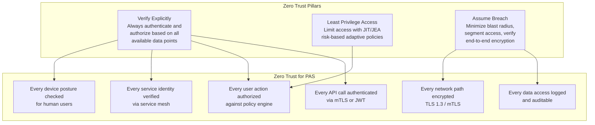

### 3.2 Zero Trust Architecture for PAS

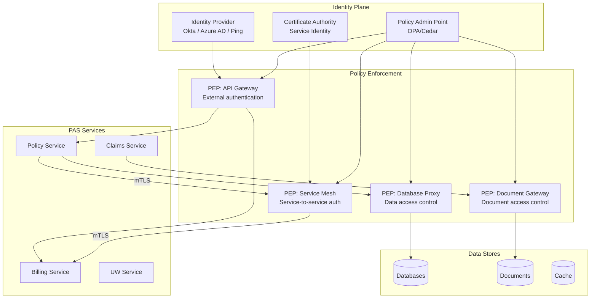

### 3.3 Micro-Segmentation

```yaml
# Zero Trust network micro-segmentation for PAS
microsegmentation:
  policy_service:
    allowed_inbound:
      - source: "api-gateway"
        ports: [8080]
        protocol: "HTTPS"
      - source: "billing-service"
        ports: [8080]
        protocol: "gRPC/mTLS"
        paths: ["/api/v3/policies/*/billing-data"]
      - source: "claims-service"
        ports: [8080]
        protocol: "gRPC/mTLS"
        paths: ["/api/v3/policies/*/coverage-at-date"]
      - source: "prometheus"
        ports: [8081]
        protocol: "HTTP"
        paths: ["/actuator/prometheus"]
    allowed_outbound:
      - destination: "policy-db"
        ports: [5432]
        protocol: "TLS"
      - destination: "kafka-broker"
        ports: [9092]
        protocol: "SASL_SSL"
      - destination: "redis-cache"
        ports: [6379]
        protocol: "TLS"
      - destination: "party-service"
        ports: [8080]
        protocol: "gRPC/mTLS"
    denied: "ALL other traffic (default deny)"

  claims_service:
    allowed_inbound:
      - source: "api-gateway"
        ports: [8080]
      - source: "claims-bff"
        ports: [8080]
    allowed_outbound:
      - destination: "claims-db"
        ports: [5432]
      - destination: "policy-service"
        ports: [8080]
        paths: ["/api/v3/policies/*/coverage-at-date"]
      - destination: "document-service"
        ports: [8080]
      - destination: "kafka-broker"
        ports: [9092]
    denied: "ALL other traffic"
```

### 3.4 Continuous Verification

```java
// Continuous trust evaluation for PAS user sessions
@Component
public class ContinuousTrustEvaluator {
    
    private final RiskScoringService riskScoring;
    private final DevicePostureService devicePosture;
    private final BehaviorAnalyticsService behaviorAnalytics;
    
    public TrustDecision evaluate(SecurityContext context, 
                                   RequestContext request) {
        TrustScore score = TrustScore.initial();
        
        // Factor 1: Authentication strength
        AuthenticationMethod authMethod = context.getAuthenticationMethod();
        score = score.adjust(evaluateAuthStrength(authMethod));
        
        // Factor 2: Device posture
        DevicePostureResult posture = devicePosture.evaluate(context.getDeviceId());
        score = score.adjust(evaluateDevicePosture(posture));
        
        // Factor 3: Location/network context
        NetworkContext network = request.getNetworkContext();
        score = score.adjust(evaluateNetworkContext(network));
        
        // Factor 4: Behavioral analytics (anomaly detection)
        BehaviorProfile profile = behaviorAnalytics.getProfile(context.getUserId());
        score = score.adjust(evaluateBehavior(profile, request));
        
        // Factor 5: Sensitivity of requested resource
        ResourceSensitivity sensitivity = classifyResource(request);
        
        return makeDecision(score, sensitivity, request);
    }
    
    private TrustDecision makeDecision(TrustScore score, 
                                        ResourceSensitivity sensitivity,
                                        RequestContext request) {
        // High-sensitivity resources (PII, financial data) require higher trust
        if (sensitivity == ResourceSensitivity.RESTRICTED) {
            if (score.getValue() < 0.8) {
                return TrustDecision.STEP_UP_AUTH; // Require additional MFA
            }
            if (score.getValue() < 0.6) {
                return TrustDecision.DENY;
            }
        }
        
        // Bulk data access always requires elevated trust
        if (request.isBulkOperation()) {
            if (score.getValue() < 0.9) {
                return TrustDecision.REQUIRE_APPROVAL;
            }
        }
        
        if (score.getValue() >= 0.5) {
            return TrustDecision.ALLOW;
        }
        
        return TrustDecision.DENY;
    }
}
```

---

## 4. Identity & Access Management

### 4.1 Authentication Architecture

```mermaid
graph TB
    subgraph "User Types"
        CSR[CSR / Operations Staff]
        UW[Underwriters]
        AGENT[Agents / Producers]
        CUST[Policyholders / Customers]
        ADMIN[System Administrators]
        AUDITOR[Auditors / Examiners]
        API_USER[API Partners]
    end
    
    subgraph "Authentication Methods"
        MFA[MFA (Required for all)]
        PWD[Password + MFA<br/>Internal Users]
        FIDO[FIDO2/WebAuthn<br/>Passwordless]
        CERT[Certificate-Based<br/>B2B Partners]
        SOCIAL[Social Login + MFA<br/>Customers (optional)]
        API_KEY[API Key + OAuth<br/>API Partners]
    end
    
    subgraph "Identity Providers"
        CORP_IDP[Corporate IdP<br/>Azure AD / Okta]
        CUST_IDP[Customer IdP<br/>Cognito / Auth0]
        PARTNER_IDP[Partner Federation<br/>SAML / OIDC]
    end
    
    CSR --> PWD --> CORP_IDP
    UW --> PWD --> CORP_IDP
    AGENT --> FIDO --> CORP_IDP
    CUST --> SOCIAL --> CUST_IDP
    ADMIN --> FIDO --> CORP_IDP
    AUDITOR --> CERT --> PARTNER_IDP
    API_USER --> API_KEY --> CORP_IDP
```

### 4.2 Authorization Model

#### 4.2.1 RBAC — Role Definitions

```yaml
# PAS Role-Based Access Control
rbac_roles:
  customer_service_representative:
    abbreviation: "CSR"
    description: "Frontline policy servicing staff"
    permissions:
      policy:
        - "policy:read"
        - "policy:search"
        - "policy:change:basic"  # Address change, beneficiary change
      party:
        - "party:read"
        - "party:update:contact"
      billing:
        - "billing:read"
        - "billing:payment:apply"
      claims:
        - "claims:read"
        - "claims:create"
      documents:
        - "document:read"
        - "document:upload"
    restrictions:
      - "Cannot view SSN (masked)"
      - "Cannot process surrenders > $25,000"
      - "Cannot access underwriting medical records"
      
  senior_csr:
    abbreviation: "SR_CSR"
    inherits: "customer_service_representative"
    additional_permissions:
      policy:
        - "policy:change:financial"  # Loan, withdrawal, surrender
      billing:
        - "billing:refund"
        - "billing:waive"
    restrictions:
      - "Cannot process surrenders > $100,000"
      
  underwriter:
    abbreviation: "UW"
    description: "Risk assessment and decision-making"
    permissions:
      underwriting:
        - "underwriting:read"
        - "underwriting:decide"
        - "underwriting:evidence:order"
        - "underwriting:evidence:review"
      policy:
        - "policy:read"
      party:
        - "party:read"
        - "party:read:medical"  # Can see medical/PHI data
      documents:
        - "document:read"
        - "document:read:medical"
    restrictions:
      - "Cannot modify policy data directly"
      - "Cannot access billing or claims"
      
  chief_underwriter:
    abbreviation: "CHIEF_UW"
    inherits: "underwriter"
    additional_permissions:
      underwriting:
        - "underwriting:override"  # Can override automated decisions
        - "underwriting:approve:jumbo"  # Face amounts > $5M
        
  claims_adjudicator:
    abbreviation: "CLM_ADJ"
    description: "Claims review and settlement"
    permissions:
      claims:
        - "claims:read"
        - "claims:adjudicate"
        - "claims:approve"
      policy:
        - "policy:read"
      party:
        - "party:read"
      documents:
        - "document:read"
        - "document:read:claims"
    restrictions:
      - "Cannot approve claims > $500,000 (requires supervisor)"
      - "Cannot access underwriting records"
      
  claims_supervisor:
    abbreviation: "CLM_SUP"
    inherits: "claims_adjudicator"
    additional_permissions:
      claims:
        - "claims:approve:high_value"
        - "claims:reopen"
        - "claims:deny:override"
        
  actuary:
    abbreviation: "ACT"
    description: "Actuarial analysis and valuation"
    permissions:
      financial:
        - "financial:read"
        - "financial:valuation:run"
        - "financial:reserve:review"
      policy:
        - "policy:read:aggregate"  # Aggregate data, not individual PII
      product:
        - "product:read"
        - "product:rate:review"
    restrictions:
      - "Cannot access individual PII"
      - "Cannot modify policy data"
      
  system_administrator:
    abbreviation: "SYS_ADMIN"
    description: "System configuration and management"
    permissions:
      system:
        - "system:config:read"
        - "system:config:modify"
        - "system:user:manage"
        - "system:role:manage"
      audit:
        - "audit:read"
    restrictions:
      - "Cannot access policy data directly"
      - "Cannot process transactions"
      - "All actions logged and reviewed"
      
  auditor:
    abbreviation: "AUDITOR"
    description: "Internal/external audit and regulatory examination"
    permissions:
      audit:
        - "audit:read"
        - "audit:export"
      policy:
        - "policy:read"
      billing:
        - "billing:read"
      claims:
        - "claims:read"
      financial:
        - "financial:read"
    restrictions:
      - "Read-only access to all systems"
      - "Cannot modify any data"
      - "PII masked unless examination requires it"
      
  agent:
    abbreviation: "AGENT"
    description: "Licensed insurance producer"
    permissions:
      policy:
        - "policy:read:own"    # Only policies they wrote
        - "policy:search:own"
      commission:
        - "commission:read:own"
      application:
        - "application:create"
        - "application:read:own"
      quote:
        - "quote:create"
        - "quote:read:own"
    restrictions:
      - "Can only see policies associated with their agent code"
      - "SSN masked"
      - "Cannot see other agents' data"
      
  policyholder:
    abbreviation: "PH"
    description: "Insurance policy owner (customer)"
    permissions:
      policy:
        - "policy:read:own"
      billing:
        - "billing:read:own"
        - "billing:payment:make"
      claims:
        - "claims:create:own"
        - "claims:read:own"
      party:
        - "party:read:own"
        - "party:update:own:contact"
      documents:
        - "document:read:own"
    restrictions:
      - "Can only see own policies"
      - "Cannot see internal notes or underwriting decisions"
```

#### 4.2.2 ABAC — Attribute-Based Policies

```java
// Attribute-Based Access Control using OPA (Open Policy Agent)
// Policy: PAS authorization rules

// OPA Rego policy for PAS authorization
/*
package pas.authz

import future.keywords.in
import future.keywords.if

default allow := false

# CSR can read policies in their assigned states
allow if {
    input.action == "policy:read"
    input.user.role == "CSR"
    input.resource.issue_state in input.user.assigned_states
}

# CSR can process surrenders up to their authority level
allow if {
    input.action == "policy:surrender"
    input.user.role == "CSR"
    input.resource.surrender_value <= input.user.dollar_limit
}

# Underwriter can only see cases assigned to them or their team
allow if {
    input.action == "underwriting:review"
    input.user.role == "UW"
    input.resource.assigned_to in input.user.team_members
}

# Agent can only see their own policies (and their downline's)
allow if {
    input.action == "policy:read"
    input.user.role == "AGENT"
    input.resource.agent_code in input.user.agent_hierarchy
}

# Claims: approve up to dollar limit based on role
allow if {
    input.action == "claims:approve"
    input.user.role == "CLM_ADJ"
    input.resource.claim_amount <= 500000
}

allow if {
    input.action == "claims:approve"
    input.user.role == "CLM_SUP"
    # Supervisor can approve any amount
}

# Time-based restriction: financial operations only during business hours
allow if {
    input.action == "financial:valuation:run"
    input.user.role == "ACT"
    is_business_hours(input.timestamp)
}

# Deny PII access in non-production environments
deny if {
    input.action == "party:read"
    input.environment != "production"
    contains(input.resource.fields, "ssn")
    not input.resource.is_synthetic
}
*/

// Java integration with OPA
@Component
public class OPAAuthorizationService {
    
    private final WebClient opaClient;
    
    public AuthorizationDecision authorize(AuthorizationRequest request) {
        OPAInput input = OPAInput.builder()
            .action(request.getAction())
            .user(OPAUser.builder()
                .userId(request.getUserId())
                .role(request.getRole())
                .assignedStates(request.getAssignedStates())
                .dollarLimit(request.getDollarLimit())
                .agentHierarchy(request.getAgentHierarchy())
                .teamMembers(request.getTeamMembers())
                .build())
            .resource(OPAResource.builder()
                .resourceType(request.getResourceType())
                .resourceId(request.getResourceId())
                .issueState(request.getResourceState())
                .amount(request.getResourceAmount())
                .agentCode(request.getResourceAgentCode())
                .build())
            .environment(request.getEnvironment())
            .timestamp(Instant.now())
            .build();
        
        OPAResponse response = opaClient.post()
            .uri("/v1/data/pas/authz/allow")
            .bodyValue(Map.of("input", input))
            .retrieve()
            .bodyToMono(OPAResponse.class)
            .block();
        
        return new AuthorizationDecision(
            response.getResult(),
            response.getDecisionId()
        );
    }
}
```

### 4.3 SSO and Identity Federation

```yaml
# SSO configuration for PAS
sso_configuration:
  internal_users:
    protocol: "OIDC"
    provider: "Okta"
    flows:
      - "Authorization Code with PKCE (web apps)"
      - "Device Authorization (CLI tools)"
    mfa_policy: "Required for all users"
    session_duration: "8 hours (extendable)"
    idle_timeout: "30 minutes"
    
  agent_portal:
    protocol: "OIDC"
    provider: "Okta (dedicated realm)"
    mfa_policy: "Required for all agents"
    mfa_methods: ["FIDO2", "Push notification", "TOTP"]
    session_duration: "4 hours"
    idle_timeout: "15 minutes"
    
  customer_portal:
    protocol: "OIDC"
    provider: "Amazon Cognito"
    mfa_policy: "Required for sensitive operations"
    mfa_methods: ["SMS", "Email", "TOTP"]
    session_duration: "2 hours"
    idle_timeout: "15 minutes"
    step_up_auth:
      triggers:
        - "Beneficiary change"
        - "Address change"
        - "Payment method change"
        - "Surrender/withdrawal"
        - "Loan request"
        
  b2b_partners:
    protocol: "SAML 2.0 / OIDC"
    federation: "IdP-initiated or SP-initiated"
    certificate_validation: "Strict (pinned certificates)"
    attribute_mapping:
      - "partner_id → tenantId"
      - "user_role → partnerRole"
      - "authorized_products → productAccess"
```

---

## 5. Data Protection

### 5.1 Data Classification

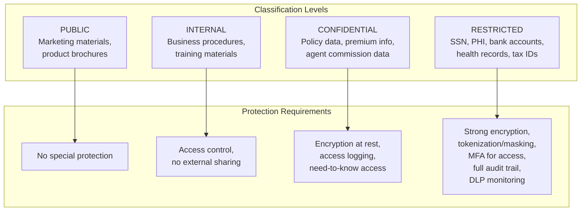

### 5.2 PAS Data Classification Map

| Data Element | Classification | Storage Location | Encryption | Access Control |
|---|---|---|---|---|
| SSN / Tax ID | RESTRICTED | Party Service DB | Column-level AES-256 + tokenized | MFA + need-to-know |
| Date of Birth | RESTRICTED | Party Service DB | Column-level AES-256 | Role-based |
| Medical Records (APS) | RESTRICTED (PHI) | Underwriting DB + Document Store | AES-256 at rest | UW role only |
| Health Questions | RESTRICTED (PHI) | Underwriting DB | AES-256 at rest | UW role only |
| Bank Account Numbers | RESTRICTED | Billing DB | Column-level AES-256 + tokenized | Billing role only |
| Policy Number | CONFIDENTIAL | Policy DB | TDE at rest | Role-based |
| Face Amount | CONFIDENTIAL | Policy DB | TDE at rest | Role-based |
| Premium Amount | CONFIDENTIAL | Billing DB | TDE at rest | Role-based |
| Claim Amount | CONFIDENTIAL | Claims DB | TDE at rest | Claims role only |
| Agent Commission | CONFIDENTIAL | Commission DB | TDE at rest | Agent (own) + admin |
| Product Configuration | INTERNAL | Product DB | TDE at rest | All authenticated |
| Policy Status | CONFIDENTIAL | Policy DB | TDE at rest | Role-based |

### 5.3 Encryption Architecture

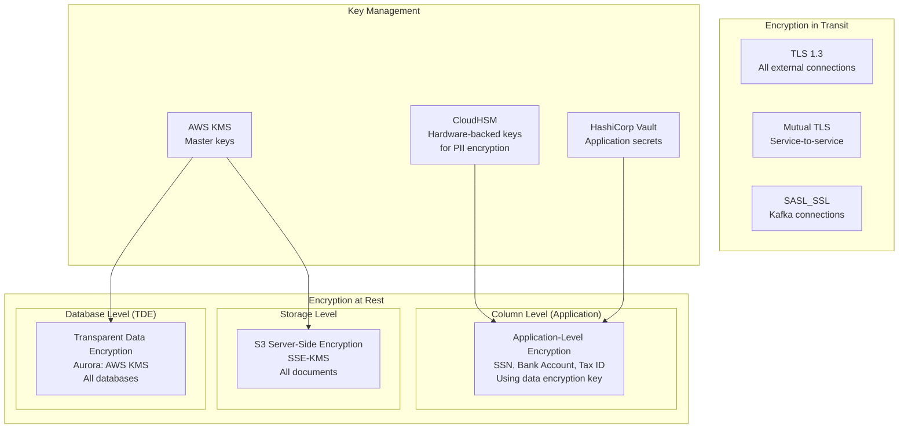

### 5.4 Application-Level Encryption

```java
// Application-level encryption for PII fields
@Component
public class PIIEncryptionService {
    
    private final AwsCrypto awsCrypto;
    private final KmsMasterKeyProvider keyProvider;
    
    // Envelope encryption: AWS KMS wraps data keys,
    // data keys encrypt the actual data
    
    public EncryptedValue encrypt(String plaintext, 
                                   Map<String, String> encryptionContext) {
        CryptoResult<byte[], KmsMasterKey> result = awsCrypto.encryptData(
            keyProvider,
            plaintext.getBytes(StandardCharsets.UTF_8),
            encryptionContext  // AAD: policyNumber, fieldName, tenantId
        );
        
        return new EncryptedValue(
            Base64.getEncoder().encodeToString(result.getResult()),
            result.getMasterKeyIds().get(0)
        );
    }
    
    public String decrypt(EncryptedValue encrypted,
                          Map<String, String> encryptionContext) {
        byte[] ciphertext = Base64.getDecoder().decode(encrypted.getCiphertext());
        
        CryptoResult<byte[], KmsMasterKey> result = awsCrypto.decryptData(
            keyProvider,
            ciphertext
        );
        
        // Verify encryption context matches (prevents context swapping attacks)
        if (!result.getEncryptionContext().equals(encryptionContext)) {
            throw new SecurityException("Encryption context mismatch");
        }
        
        return new String(result.getResult(), StandardCharsets.UTF_8);
    }
}

// JPA attribute converter for automatic field encryption
@Converter
public class EncryptedStringConverter implements AttributeConverter<String, String> {
    
    @Autowired
    private PIIEncryptionService encryptionService;
    
    @Override
    public String convertToDatabaseColumn(String attribute) {
        if (attribute == null) return null;
        Map<String, String> context = Map.of(
            "purpose", "database-storage",
            "field", "pii"
        );
        return encryptionService.encrypt(attribute, context).getCiphertext();
    }
    
    @Override
    public String convertToEntityAttribute(String dbData) {
        if (dbData == null) return null;
        Map<String, String> context = Map.of(
            "purpose", "database-storage",
            "field", "pii"
        );
        return encryptionService.decrypt(new EncryptedValue(dbData), context);
    }
}

// Usage in entity
@Entity
@Table(name = "individuals")
public class Individual {
    
    @Id
    private UUID partyId;
    
    private String firstName;
    private String lastName;
    
    @Convert(converter = EncryptedStringConverter.class)
    private String ssn;
    
    @Convert(converter = EncryptedStringConverter.class)
    private String dateOfBirth;
    
    // SSN is also tokenized for search
    private String ssnToken;
}
```

### 5.5 Tokenization

```java
// PII tokenization service for search and reference without exposing actual values
@Service
public class TokenizationService {
    
    private final TokenVaultClient tokenVault;
    
    public String tokenize(String sensitiveValue, TokenType type) {
        // Generate a format-preserving token
        // SSN: XXX-XX-XXXX → token that looks like SSN but isn't
        return tokenVault.tokenize(
            TokenizeRequest.builder()
                .value(sensitiveValue)
                .type(type)
                .formatPreserving(true)
                .build()
        ).getToken();
    }
    
    public String detokenize(String token) {
        // Only authorized callers can detokenize
        return tokenVault.detokenize(
            DetokenizeRequest.builder()
                .token(token)
                .build()
        ).getValue();
    }
}
```

### 5.6 Data Masking for Non-Production

```yaml
# Data masking rules for non-production environments
data_masking:
  strategy: "Synthetic data generation preferred; masked production data as fallback"
  
  masking_rules:
    ssn:
      method: "format_preserving_randomize"
      pattern: "###-##-####"
      example: "123-45-6789 → 987-65-4321"
      
    date_of_birth:
      method: "date_shift"
      range: "+/- 365 days"
      preserve: "age_band"  # Keep within same 5-year age band
      
    name:
      method: "fake_name_generator"
      preserve: "gender, ethnicity distribution"
      
    address:
      method: "fake_address_generator"
      preserve: "state, zip code prefix"
      
    phone:
      method: "format_preserving_randomize"
      
    email:
      method: "format_preserving_hash"
      domain: "@testinsurer.com"
      
    bank_account:
      method: "format_preserving_randomize"
      
    face_amount:
      method: "range_preserving_randomize"
      precision: "10000"
      
    policy_number:
      method: "format_preserving_hash"
      
  process:
    tool: "Delphix / Informatica TDM / custom"
    frequency: "Weekly refresh of staging environment"
    validation: "Automated check that no real PII exists in non-production"
```

---

## 6. PII/PHI Handling

### 6.1 PII Data Elements in PAS

```yaml
pii_inventory:
  party_service:
    restricted:
      - field: "ssn"
        type: "Government ID"
        regulation: "GLBA, state privacy laws"
        retention: "Life of relationship + 7 years"
        
      - field: "date_of_birth"
        type: "Personal identifier"
        regulation: "GLBA"
        retention: "Life of relationship + 7 years"
        
      - field: "bank_account_number"
        type: "Financial account"
        regulation: "GLBA, PCI-DSS"
        retention: "Active + 7 years"
        
      - field: "credit_card_number"
        type: "Payment card"
        regulation: "PCI-DSS"
        retention: "Active + 2 years"
        
    confidential:
      - field: "name"
        type: "Personal identifier"
      - field: "address"
        type: "Personal identifier"
      - field: "phone"
        type: "Contact information"
      - field: "email"
        type: "Contact information"
      - field: "income"
        type: "Financial information"
      - field: "net_worth"
        type: "Financial information"
        
  underwriting_service:
    restricted_phi:
      - field: "medical_records"
        type: "PHI"
        regulation: "HIPAA, GLBA"
        retention: "Life of policy + 10 years"
        
      - field: "health_questionnaire_responses"
        type: "PHI"
        regulation: "HIPAA, GLBA"
        
      - field: "prescription_history"
        type: "PHI"
        regulation: "HIPAA"
        
      - field: "lab_results"
        type: "PHI"
        regulation: "HIPAA"
        
      - field: "attending_physician_statement"
        type: "PHI"
        regulation: "HIPAA"
        
  claims_service:
    restricted:
      - field: "death_certificate"
        type: "PHI + PII"
      - field: "medical_records"
        type: "PHI"
      - field: "autopsy_report"
        type: "PHI"
        
  billing_service:
    restricted:
      - field: "payment_method_details"
        type: "Financial account"
      - field: "bank_routing_number"
        type: "Financial account"
```

### 6.2 PII in Logs and Error Messages

```java
// PII scrubbing for logs
@Component
public class PIIScrubber {
    
    private static final List<Pattern> PII_PATTERNS = List.of(
        Pattern.compile("\\b\\d{3}-\\d{2}-\\d{4}\\b"),           // SSN
        Pattern.compile("\\b\\d{9}\\b"),                           // SSN without dashes
        Pattern.compile("\\b\\d{4}[- ]?\\d{4}[- ]?\\d{4}[- ]?\\d{4}\\b"), // Credit card
        Pattern.compile("\\b\\d{8,17}\\b"),                        // Bank account
        Pattern.compile("(?i)\\b[A-Z0-9._%+-]+@[A-Z0-9.-]+\\.[A-Z]{2,}\\b"), // Email
        Pattern.compile("\\b(0[1-9]|1[0-2])/(0[1-9]|[12]\\d|3[01])/\\d{4}\\b") // DOB
    );
    
    private static final String REDACTED = "[REDACTED]";
    
    public String scrub(String logMessage) {
        String scrubbed = logMessage;
        for (Pattern pattern : PII_PATTERNS) {
            scrubbed = pattern.matcher(scrubbed).replaceAll(REDACTED);
        }
        return scrubbed;
    }
}

// Custom Logback layout that scrubs PII
public class PIIScrubLayout extends PatternLayout {
    
    private final PIIScrubber scrubber = new PIIScrubber();
    
    @Override
    public String doLayout(ILoggingEvent event) {
        String original = super.doLayout(event);
        return scrubber.scrub(original);
    }
}
```

```xml
<!-- logback-spring.xml with PII scrubbing -->
<configuration>
    <appender name="STDOUT" class="ch.qos.logback.core.ConsoleAppender">
        <encoder class="ch.qos.logback.core.encoder.LayoutWrappingEncoder">
            <layout class="com.insurer.pas.security.PIIScrubLayout">
                <pattern>%d{ISO8601} [%thread] %-5level %logger{36} - %msg%n</pattern>
            </layout>
        </encoder>
    </appender>
</configuration>
```

### 6.3 PII Retention and Deletion

```java
// PII retention and right-to-delete management
@Service
public class PIIRetentionService {
    
    private final PartyRepository partyRepository;
    private final PolicyRepository policyRepository;
    private final AuditService auditService;
    
    @Scheduled(cron = "0 0 2 * * *") // Daily at 2 AM
    public void processRetentionPolicies() {
        List<Party> expiredParties = partyRepository.findPartiesExceedingRetention();
        
        for (Party party : expiredParties) {
            if (canDelete(party)) {
                anonymizeParty(party);
                auditService.logDeletion(party.getPartyId(), "RETENTION_POLICY");
            }
        }
    }
    
    // Right to delete (privacy law compliance)
    public DeletionResult processDeleteRequest(String partyId, 
                                                 DeletionRequest request) {
        Party party = partyRepository.findById(partyId).orElseThrow();
        
        // Check for legal holds
        if (hasLegalHold(party)) {
            return DeletionResult.denied("Active legal hold on record");
        }
        
        // Check for active policies — cannot delete party with active policy
        List<Policy> activePolicies = policyRepository
            .findActiveByPartyId(partyId);
        if (!activePolicies.isEmpty()) {
            return DeletionResult.denied(
                "Party has active policies: " + 
                activePolicies.stream()
                    .map(Policy::getPolicyNumber)
                    .collect(Collectors.joining(", "))
            );
        }
        
        // Check regulatory retention period
        if (!retentionPeriodExpired(party)) {
            return DeletionResult.denied(
                "Regulatory retention period not yet expired"
            );
        }
        
        // Anonymize rather than delete (preserve referential integrity)
        anonymizeParty(party);
        
        auditService.logDeletion(partyId, "PRIVACY_REQUEST", request.getRequestId());
        
        return DeletionResult.completed(
            "Party data anonymized. Policy records retained with anonymized references."
        );
    }
    
    private void anonymizeParty(Party party) {
        party.setFirstName("ANONYMIZED");
        party.setLastName("ANONYMIZED");
        party.setSsn(null);
        party.setDateOfBirth(null);
        party.getAddresses().clear();
        party.getPhones().clear();
        party.getEmails().clear();
        party.setAnonymized(true);
        party.setAnonymizedDate(Instant.now());
        
        partyRepository.save(party);
    }
}
```

---

## 7. Application Security

### 7.1 OWASP Top 10 for PAS

| # | Vulnerability | PAS-Specific Risk | Mitigation |
|---|---|---|---|
| A01 | Broken Access Control | Agent sees another agent's policies; CSR accesses UW medical records | ABAC policy engine, role-based data filtering, ownership checks |
| A02 | Cryptographic Failures | PII stored in plaintext; weak encryption; hard-coded keys | AES-256 column encryption, KMS key management, no secrets in code |
| A03 | Injection | SQL injection in policy search; command injection in report generation | Parameterized queries, ORM, input validation, WAF |
| A04 | Insecure Design | Bulk data export without controls; no rate limiting on quote API | Threat modeling, abuse case analysis, rate limiting |
| A05 | Security Misconfiguration | Debug endpoints exposed; default credentials on admin panels | CIS benchmarks, automated configuration scanning, no defaults |
| A06 | Vulnerable Components | Outdated libraries (Log4j, Spring); unpatched container images | Dependency scanning (Snyk), container scanning (Trivy), patch SLA |
| A07 | Auth Failures | Credential stuffing on customer portal; weak session management | MFA, account lockout, session binding, passwordless options |
| A08 | Data Integrity Failures | Unsigned ACORD messages; CI/CD pipeline compromise | Message signing, code signing, pipeline security |
| A09 | Logging Failures | PII in logs; insufficient audit trail; no SIEM integration | PII scrubbing, comprehensive audit logging, SIEM forwarding |
| A10 | SSRF | Internal service URLs exposed through API; document URL manipulation | URL validation, network segmentation, blocklist internal ranges |

### 7.2 Secure Coding Standards

```java
// Input validation for policy search — prevent injection and data leakage
@RestController
@RequestMapping("/api/v3/policies")
public class PolicySearchController {
    
    private final PolicySearchService searchService;
    private final InputValidator validator;
    
    @PostMapping("/search")
    public ResponseEntity<SearchResult<PolicySummaryDTO>> searchPolicies(
            @Valid @RequestBody PolicySearchRequest request,
            @AuthenticationPrincipal JwtAuthenticationToken principal) {
        
        // Validate and sanitize all inputs
        validator.validateSearchCriteria(request);
        
        // Apply data access scope based on user's role and assignments
        DataAccessScope scope = buildScope(principal);
        request.setScope(scope);
        
        // Execute search with row-level security
        SearchResult<PolicySummaryDTO> results = searchService.search(request);
        
        // Filter response based on user's field-level permissions
        results.getItems().forEach(item -> 
            applyFieldLevelSecurity(item, principal));
        
        return ResponseEntity.ok(results);
    }
    
    private DataAccessScope buildScope(JwtAuthenticationToken principal) {
        String role = principal.getTokenAttributes().get("role").toString();
        
        return switch (role) {
            case "AGENT" -> DataAccessScope.forAgent(
                (String) principal.getTokenAttributes().get("agent_code"),
                (List<String>) principal.getTokenAttributes().get("agent_hierarchy")
            );
            case "CSR" -> DataAccessScope.forCSR(
                (List<String>) principal.getTokenAttributes().get("assigned_states")
            );
            case "POLICYHOLDER" -> DataAccessScope.forPolicyholder(
                (String) principal.getTokenAttributes().get("party_id")
            );
            default -> DataAccessScope.forRole(role);
        };
    }
    
    private void applyFieldLevelSecurity(PolicySummaryDTO dto, 
                                          JwtAuthenticationToken principal) {
        String role = principal.getTokenAttributes().get("role").toString();
        
        // Mask SSN for all roles except those with explicit PII access
        if (!hasPermission(principal, "party:read:ssn")) {
            dto.setOwnerSsn(maskSSN(dto.getOwnerSsn()));
        }
        
        // Hide financial details from agents
        if (role.equals("AGENT")) {
            dto.setCashValue(null);
            dto.setSurrenderValue(null);
            dto.setLoanBalance(null);
        }
    }
    
    private String maskSSN(String ssn) {
        if (ssn == null || ssn.length() < 4) return "***-**-****";
        return "***-**-" + ssn.substring(ssn.length() - 4);
    }
}
```

### 7.3 SAST/DAST/IAST Integration

```yaml
# Security testing pipeline integration
security_testing:
  sast:
    tool: "SonarQube + Checkmarx"
    integration: "CI pipeline — every PR"
    gate: "No Critical or High findings"
    rules:
      - "SQL injection detection"
      - "XSS detection"
      - "Hard-coded credentials"
      - "PII in code/comments"
      - "Weak cryptography"
      - "Insecure deserialization"
    
  dependency_scanning:
    tool: "Snyk + GitHub Dependabot"
    integration: "CI pipeline + continuous monitoring"
    gate: "No Critical vulnerabilities"
    sla:
      critical: "24 hours to patch"
      high: "7 days to patch"
      medium: "30 days to patch"
    
  container_scanning:
    tool: "Trivy + AWS ECR scanning"
    integration: "CI pipeline — before registry push"
    gate: "No Critical or High OS vulnerabilities"
    
  dast:
    tool: "OWASP ZAP"
    integration: "CD pipeline — after staging deployment"
    scope: "All external-facing endpoints"
    schedule: "Every deployment + weekly full scan"
    
  iast:
    tool: "Contrast Security"
    integration: "Runtime agent in staging environment"
    scope: "All integration and E2E tests"
    
  penetration_testing:
    frequency: "Annual (minimum) + after major releases"
    scope: "Full application, infrastructure, social engineering"
    provider: "Third-party specialized firm"
    standard: "PTES (Penetration Testing Execution Standard)"
    
  bug_bounty:
    platform: "HackerOne (private program)"
    scope: "Customer portal, agent portal, external APIs"
    rewards: "$500 - $25,000 based on severity"
```

---

## 8. API Security

### 8.1 OAuth 2.0 / OIDC Implementation

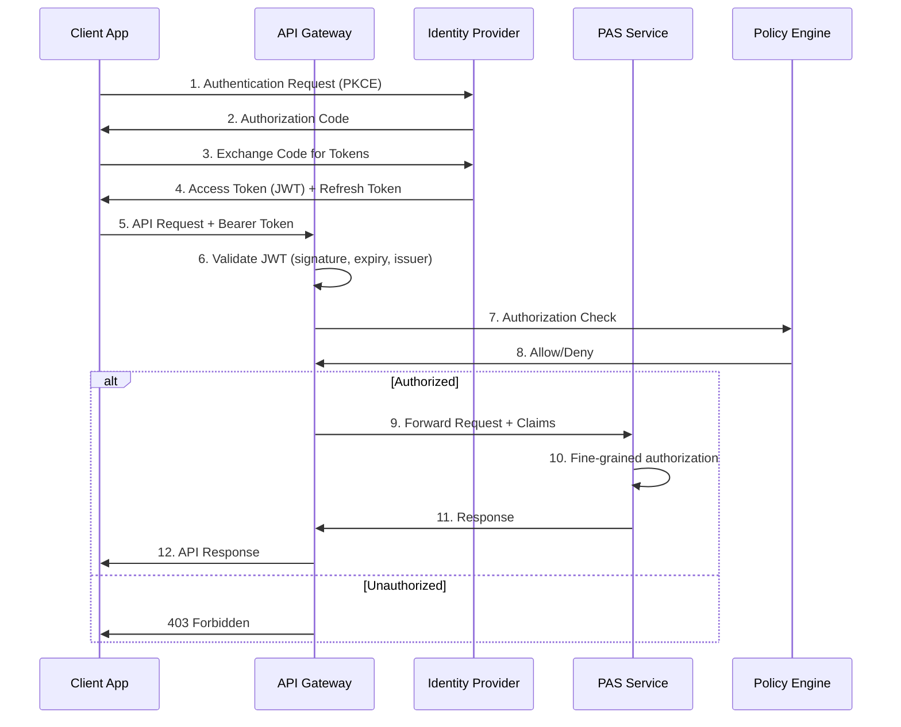

### 8.2 JWT Token Design

```json
{
  "header": {
    "alg": "RS256",
    "typ": "JWT",
    "kid": "pas-signing-key-2025-01"
  },
  "payload": {
    "iss": "https://auth.insurer.com",
    "sub": "user-uuid-12345",
    "aud": "https://api.insurer.com",
    "exp": 1735689600,
    "iat": 1735686000,
    "nbf": 1735686000,
    "jti": "unique-token-id",
    
    "tenant_id": "CARRIER_ABC",
    "role": "CSR",
    "permissions": [
      "policy:read",
      "policy:search",
      "policy:change:basic",
      "billing:read",
      "billing:payment:apply"
    ],
    "assigned_states": ["NY", "NJ", "CT"],
    "dollar_limit": 25000,
    "department": "customer-service",
    "mfa_completed": true,
    "auth_time": 1735685900,
    "device_id": "device-fingerprint-hash"
  }
}
```

### 8.3 API Rate Limiting

```yaml
# Rate limiting strategy per consumer type
rate_limiting:
  agent_portal:
    burst: 100       # requests per second
    sustained: 1000   # requests per minute
    daily: 50000
    per_policy: 10    # requests per minute per policy
    
  customer_portal:
    burst: 50
    sustained: 300
    daily: 5000
    per_session: 100  # requests per minute per session
    
  partner_api:
    burst: 200
    sustained: 2000
    daily: 100000
    per_key: 500      # per API key per minute
    
  internal_services:
    burst: 1000
    sustained: 10000
    circuit_breaker: true  # Instead of hard rate limit
    
  sensitive_endpoints:
    # Lower limits for endpoints that access PII or process transactions
    ssn_lookup:
      burst: 5
      sustained: 20
      daily: 100
    beneficiary_change:
      burst: 2
      sustained: 10
    surrender:
      burst: 1
      sustained: 5
```

### 8.4 Input Validation

```java
// Comprehensive input validation for PAS APIs
@Component
public class PASInputValidator {
    
    public void validatePolicyNumber(String policyNumber) {
        if (policyNumber == null || policyNumber.isBlank()) {
            throw new ValidationException("Policy number is required");
        }
        if (!policyNumber.matches("^[A-Z]{2,4}-[A-Z0-9]{6,12}$")) {
            throw new ValidationException("Invalid policy number format");
        }
        if (policyNumber.length() > 20) {
            throw new ValidationException("Policy number too long");
        }
    }
    
    public void validateMoneyAmount(BigDecimal amount, String fieldName) {
        if (amount == null) {
            throw new ValidationException(fieldName + " is required");
        }
        if (amount.compareTo(BigDecimal.ZERO) < 0) {
            throw new ValidationException(fieldName + " cannot be negative");
        }
        if (amount.compareTo(new BigDecimal("999999999.99")) > 0) {
            throw new ValidationException(fieldName + " exceeds maximum");
        }
        if (amount.scale() > 2) {
            throw new ValidationException(fieldName + " cannot have more than 2 decimal places");
        }
    }
    
    public void validateDate(LocalDate date, String fieldName) {
        if (date == null) {
            throw new ValidationException(fieldName + " is required");
        }
        if (date.isBefore(LocalDate.of(1900, 1, 1))) {
            throw new ValidationException(fieldName + " is too far in the past");
        }
        if (date.isAfter(LocalDate.now().plusYears(100))) {
            throw new ValidationException(fieldName + " is too far in the future");
        }
    }
    
    // Prevent IDOR (Insecure Direct Object Reference)
    public void validateResourceOwnership(String resourceId, String userId, 
                                           String userRole) {
        if ("POLICYHOLDER".equals(userRole)) {
            boolean isOwner = policyService.isPolicyOwner(resourceId, userId);
            if (!isOwner) {
                auditService.logUnauthorizedAccess(userId, resourceId);
                throw new ForbiddenException("Access denied");
            }
        }
    }
}
```

---

## 9. Network Security

### 9.1 VPC Architecture for PAS

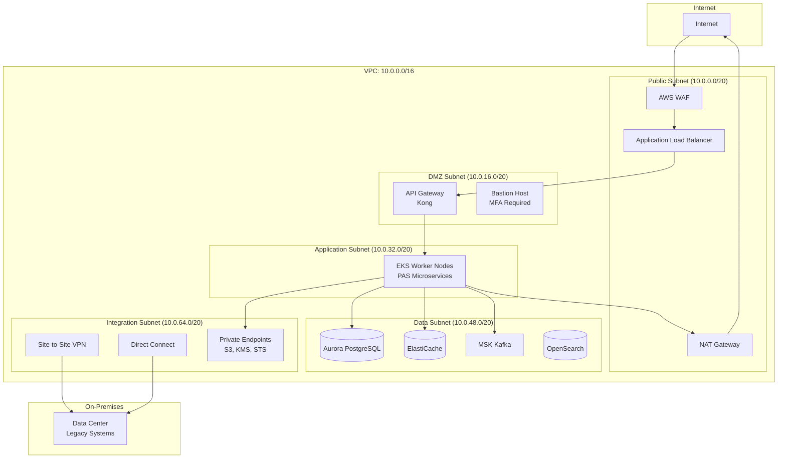

### 9.2 WAF Rules for Insurance Applications

```yaml
# AWS WAF custom rules for PAS
waf_rules:
  # Protect against common attacks
  - name: "BlockSQLInjection"
    priority: 1
    action: "BLOCK"
    statement:
      sqli_match:
        field_to_match: ["BODY", "QUERY_STRING", "URI_PATH"]
    
  - name: "BlockXSS"
    priority: 2
    action: "BLOCK"
    statement:
      xss_match:
        field_to_match: ["BODY", "QUERY_STRING"]
    
  # Insurance-specific rules
  - name: "ProtectPIIEndpoints"
    priority: 10
    action: "COUNT"  # Monitor, then switch to BLOCK
    statement:
      rate_based:
        limit: 100
        scope: "IP"
        scope_down:
          uri_regex: "/api/.*/parties/.*/ssn|/api/.*/parties/.*/dob"
    
  - name: "ProtectBulkExport"
    priority: 11
    action: "BLOCK"
    statement:
      rate_based:
        limit: 10
        scope: "IP"
        scope_down:
          uri_regex: "/api/.*/export|/api/.*/report|/api/.*/download"
    
  - name: "GeoBlock"
    priority: 20
    action: "BLOCK"
    statement:
      not:
        geo_match:
          country_codes: ["US", "CA"]
    note: "Only allow access from US and Canada (adjust for global operations)"
    
  - name: "RequireContentType"
    priority: 30
    action: "BLOCK"
    statement:
      and:
        - method: ["POST", "PUT", "PATCH"]
        - not:
            header_match:
              name: "content-type"
              value: "application/json"
```

---

## 10. Compliance & Audit

### 10.1 Regulatory Requirements Mapping

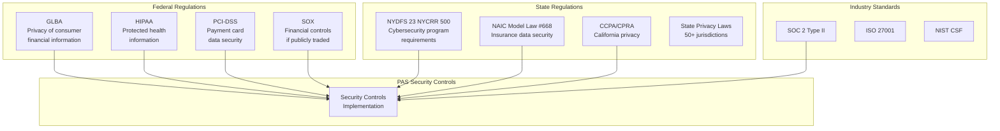

### 10.2 NYDFS 23 NYCRR 500 Compliance

```yaml
# NYDFS 23 NYCRR 500 compliance mapping
nydfs_compliance:
  section_500_02_cybersecurity_program:
    requirement: "Maintain a cybersecurity program"
    implementation:
      - "Information security policy document"
      - "Annual risk assessment"
      - "Cybersecurity program approved by Board/senior officer"
      
  section_500_03_cybersecurity_policy:
    requirement: "Written cybersecurity policy"
    implementation:
      - "Information security policies covering all 14 areas"
      - "Annual review and update"
      - "Board-level approval"
      
  section_500_04_ciso:
    requirement: "Designate a CISO"
    implementation:
      - "CISO appointed and reporting to Board"
      - "Annual written report to Board"
      
  section_500_05_penetration_testing:
    requirement: "Penetration testing and vulnerability assessment"
    implementation:
      - "Annual penetration testing by third party"
      - "Bi-annual vulnerability scanning"
      - "Continuous automated scanning in CI/CD pipeline"
      
  section_500_06_audit_trail:
    requirement: "Maintain audit trail"
    implementation:
      - "All financial transactions logged"
      - "All access to nonpublic information logged"
      - "Logs retained for minimum 5 years"
      - "Tamper-proof log storage (S3 Object Lock)"
      
  section_500_07_access_privileges:
    requirement: "Limit access privileges"
    implementation:
      - "RBAC + ABAC authorization"
      - "Quarterly access reviews"
      - "Automated deprovisioning"
      - "Privileged access management (CyberArk/Vault)"
      
  section_500_11_third_party_service_providers:
    requirement: "Third-party security policy"
    implementation:
      - "Vendor risk assessment program"
      - "Contractual security requirements"
      - "Annual vendor security reviews"
      - "Cloud provider SOC 2 review"
      
  section_500_12_mfa:
    requirement: "Multi-factor authentication"
    implementation:
      - "MFA required for all remote access"
      - "MFA required for all privileged access"
      - "MFA required for all web application access"
      
  section_500_15_encryption:
    requirement: "Encryption of nonpublic information"
    implementation:
      - "AES-256 encryption at rest"
      - "TLS 1.3 encryption in transit"
      - "Application-level encryption for PII"
      - "KMS-managed encryption keys"
      
  section_500_17_incident_response:
    requirement: "Incident response plan"
    implementation:
      - "Written IR plan with roles and procedures"
      - "Annual tabletop exercises"
      - "72-hour breach notification to DFS"
```

### 10.3 Audit Trail Design

```java
// Comprehensive audit trail for PAS
@Entity
@Table(name = "audit_trail")
public class AuditEntry {
    
    @Id
    @GeneratedValue(strategy = GenerationType.IDENTITY)
    private Long auditId;
    
    @Column(nullable = false)
    private Instant timestamp;
    
    @Column(nullable = false)
    private String eventType; // CREATE, READ, UPDATE, DELETE, LOGIN, LOGOUT, AUTH_FAILURE
    
    @Column(nullable = false)
    private String userId;
    
    @Column(nullable = false)
    private String userRole;
    
    private String tenantId;
    
    @Column(nullable = false)
    private String resourceType; // POLICY, PARTY, CLAIM, BILLING, etc.
    
    private String resourceId;
    
    @Column(nullable = false)
    private String action; // policy:read, policy:change:beneficiary, etc.
    
    private String ipAddress;
    private String userAgent;
    private String sessionId;
    private String correlationId;
    
    @Column(columnDefinition = "jsonb")
    private String details; // Additional context
    
    @Column(columnDefinition = "jsonb")
    private String beforeState; // For updates: previous state
    
    @Column(columnDefinition = "jsonb")
    private String afterState; // For updates: new state
    
    @Column(nullable = false)
    private String result; // SUCCESS, FAILURE, DENIED
    
    private String failureReason;
}

// Audit interceptor — captures all significant actions
@Aspect
@Component
public class AuditAspect {
    
    private final AuditService auditService;
    
    @Around("@annotation(Audited)")
    public Object auditAction(ProceedingJoinPoint joinPoint) throws Throwable {
        Audited audited = getAnnotation(joinPoint);
        
        AuditEntry entry = AuditEntry.builder()
            .timestamp(Instant.now())
            .eventType(audited.eventType())
            .userId(SecurityContext.getCurrentUserId())
            .userRole(SecurityContext.getCurrentRole())
            .tenantId(TenantContext.getCurrentTenant())
            .resourceType(audited.resourceType())
            .resourceId(extractResourceId(joinPoint))
            .action(audited.action())
            .ipAddress(RequestContext.getClientIp())
            .userAgent(RequestContext.getUserAgent())
            .sessionId(SecurityContext.getSessionId())
            .correlationId(CorrelationContext.getId())
            .build();
        
        // Capture before state for updates
        if (audited.captureBeforeState()) {
            entry.setBeforeState(captureBeforeState(joinPoint));
        }
        
        try {
            Object result = joinPoint.proceed();
            entry.setResult("SUCCESS");
            
            if (audited.captureAfterState()) {
                entry.setAfterState(serialize(result));
            }
            
            auditService.log(entry);
            return result;
            
        } catch (Exception e) {
            entry.setResult("FAILURE");
            entry.setFailureReason(e.getMessage());
            auditService.log(entry);
            throw e;
        }
    }
}

// Usage
@Service
public class PolicyService {
    
    @Audited(
        eventType = "UPDATE",
        resourceType = "POLICY",
        action = "policy:change:beneficiary",
        captureBeforeState = true,
        captureAfterState = true
    )
    public Policy updateBeneficiaries(String policyId, 
                                       BeneficiaryUpdateRequest request) {
        // ... business logic ...
    }
}
```

### 10.4 SIEM Integration

```yaml
# SIEM integration configuration (Splunk/ELK)
siem_integration:
  log_sources:
    - source: "PAS Application Logs"
      format: "JSON structured"
      transport: "Fluent Bit → Kafka → SIEM"
      fields: ["timestamp", "service", "level", "correlationId", "userId", "action"]
      
    - source: "Audit Trail"
      format: "JSON"
      transport: "Direct SIEM API"
      fields: ["all audit entry fields"]
      
    - source: "API Gateway Access Logs"
      format: "JSON"
      transport: "CloudWatch → SIEM"
      fields: ["requestId", "clientIp", "method", "path", "status", "latency"]
      
    - source: "Database Audit Logs"
      format: "PostgreSQL audit extension"
      transport: "CloudWatch → SIEM"
      
    - source: "Kubernetes Audit Logs"
      format: "JSON"
      transport: "CloudWatch → SIEM"
      
    - source: "VPC Flow Logs"
      format: "AWS VPC Flow"
      transport: "S3 → SIEM"
      
  correlation_rules:
    - name: "Brute Force Detection"
      condition: "> 5 failed login attempts from same IP in 5 minutes"
      action: "Alert + auto-block IP"
      
    - name: "Unusual PII Access"
      condition: "User accesses > 50 SSN records in 1 hour"
      action: "Alert + suspend session"
      
    - name: "Off-Hours Admin Access"
      condition: "Admin login outside business hours + not on-call"
      action: "Alert + require step-up auth"
      
    - name: "Bulk Data Export"
      condition: "Export or download of > 1000 records"
      action: "Alert + require manager approval"
      
    - name: "Payment Diversion Indicator"
      condition: "Bank account change followed by surrender/withdrawal within 24 hours"
      action: "Alert + hold payment for review"
      
    - name: "Privilege Escalation"
      condition: "User role changed + immediate access to restricted resources"
      action: "Alert + review"
```

---

## 11. Incident Response

### 11.1 Insurance-Specific Incident Response Plan

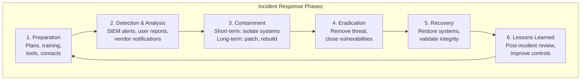

### 11.2 Breach Notification Requirements

```yaml
# State-by-state breach notification timelines (selected states)
breach_notification:
  federal:
    - regulation: "HIPAA (if PHI involved)"
      timeline: "60 days to HHS, 60 days to individuals"
      threshold: "500+ records: media notification required"
      
  state_requirements:
    new_york:
      regulator: "NY DFS"
      timeline: "72 hours to DFS (23 NYCRR 500)"
      individuals: "Without unreasonable delay"
      attorney_general: "Required"
      
    california:
      regulator: "CA AG"
      timeline: "Without unreasonable delay"
      individuals: "Without unreasonable delay"
      threshold: "500+ CA residents: AG notification"
      
    florida:
      regulator: "FL OIR"
      timeline: "30 days to individuals"
      individuals: "30 days"
      
    texas:
      regulator: "TX AG"
      timeline: "60 days to individuals"
      individuals: "60 days"
      threshold: "250+ residents: AG notification"
      
    connecticut:
      regulator: "CT AG"
      timeline: "60 days to individuals"
      individuals: "60 days"
      attorney_general: "Required"
      
  notification_content:
    required_elements:
      - "Description of the incident"
      - "Type of information compromised"
      - "Date of breach and date of discovery"
      - "Steps taken to address the breach"
      - "Contact information for questions"
      - "Identity theft prevention resources"
      - "Credit monitoring offer (if SSN compromised)"
```

### 11.3 Incident Response Playbook for PAS

```yaml
# Ransomware incident playbook
playbook_ransomware:
  name: "Ransomware Attack on PAS"
  severity: "P1 - Critical"
  
  detection:
    indicators:
      - "Mass file encryption detected by endpoint protection"
      - "Anomalous database access patterns"
      - "Ransom note displayed or communicated"
      - "Services becoming unavailable in rapid succession"
      
  immediate_actions:
    within_15_minutes:
      - "Activate incident response team"
      - "Isolate affected network segments"
      - "Preserve forensic evidence (memory dumps, logs)"
      - "Do NOT power off systems (may destroy evidence)"
      - "Activate out-of-band communication (not email)"
      
    within_1_hour:
      - "Assess scope of encryption/damage"
      - "Determine if data was exfiltrated (double extortion)"
      - "Engage forensics team (internal or external)"
      - "Notify CISO and executive team"
      - "Begin DR activation if primary systems compromised"
      
    within_4_hours:
      - "Notify legal counsel"
      - "Notify cyber insurance carrier"
      - "Engage law enforcement (FBI IC3)"
      - "Begin regulatory notification assessment"
      - "Activate business continuity plan"
      
  recovery:
    priority_order:
      1: "Policy inquiry services (agent and customer access)"
      2: "Claims processing (policyholder financial impact)"
      3: "Billing and payment processing"
      4: "New business processing"
      5: "Reporting and analytics"
      
    steps:
      - "Restore from clean backups (verified malware-free)"
      - "Rebuild compromised infrastructure"
      - "Validate data integrity (reconciliation)"
      - "Gradual service restoration with monitoring"
      - "Enhanced monitoring for 90 days"
      
  communication:
    internal:
      - "Executive team: Immediate"
      - "Board of Directors: Within 24 hours"
      - "All employees: Within 24 hours (need-to-know basis)"
    external:
      - "Regulators: Per state requirements (72 hours for NYDFS)"
      - "Affected individuals: Per state requirements"
      - "Business partners: Within 48 hours"
      - "Media: Coordinate with communications team"
```

---

## 12. Vendor & Third-Party Security

### 12.1 Vendor Risk Assessment

```yaml
# Vendor security assessment framework for PAS
vendor_assessment:
  tier_classification:
    tier_1_critical:
      description: "Processes, stores, or has access to PII/PHI"
      examples: ["Cloud provider", "PAS vendor", "Payment processor", "Lab vendors"]
      assessment_frequency: "Annual"
      requirements:
        - "SOC 2 Type II report"
        - "Penetration test results"
        - "Business continuity plan"
        - "Incident response plan"
        - "Insurance coverage (cyber liability)"
        - "Right-to-audit clause"
        - "Data processing agreement"
        
    tier_2_important:
      description: "Has access to internal systems but not PII"
      examples: ["IT consulting firms", "Development vendors", "MQ/Integration vendors"]
      assessment_frequency: "Annual"
      requirements:
        - "SOC 2 Type II or ISO 27001"
        - "Background checks for personnel"
        - "NDA and security addendum"
        
    tier_3_standard:
      description: "Limited system access, no PII"
      examples: ["Office supplies", "Facilities vendors"]
      assessment_frequency: "Every 2 years"
      requirements:
        - "Basic security questionnaire"
        - "NDA"
        
  assessment_questionnaire_topics:
    - "Information security governance"
    - "Access control and authentication"
    - "Data encryption (at rest and in transit)"
    - "Vulnerability management"
    - "Incident response capabilities"
    - "Business continuity and disaster recovery"
    - "Employee security training"
    - "Physical security"
    - "Subcontractor management"
    - "Data retention and destruction"
    - "Compliance certifications"
    - "Insurance coverage"
```

### 12.2 Cloud Provider Security Assessment

```yaml
# Cloud provider security assessment checklist
cloud_provider_assessment:
  certifications:
    required:
      - "SOC 2 Type II"
      - "SOC 1 Type II (SSAE 18)"
      - "ISO 27001"
      - "ISO 27017 (cloud security)"
      - "ISO 27018 (PII protection)"
      - "PCI DSS Level 1"
    preferred:
      - "FedRAMP High"
      - "HITRUST CSF"
      
  data_protection:
    - "Encryption at rest with customer-managed keys"
    - "Encryption in transit (TLS 1.2+)"
    - "Data residency controls (US region selection)"
    - "Data deletion and destruction procedures"
    - "Multi-tenant isolation verification"
    
  access_management:
    - "IAM with MFA enforcement"
    - "Service accounts with least privilege"
    - "CloudTrail/Activity Log for all API calls"
    - "Root account monitoring and alerting"
    
  incident_management:
    - "Incident notification SLA (< 24 hours)"
    - "Shared incident response procedures"
    - "Forensics support capabilities"
    - "Post-incident reporting"
    
  business_continuity:
    - "Multi-AZ and multi-region options"
    - "SLA with financial backing"
    - "DR testing support"
    - "Data portability and exit provisions"
```

---

## 13. Security Architecture Reference

### 13.1 Complete Security Architecture

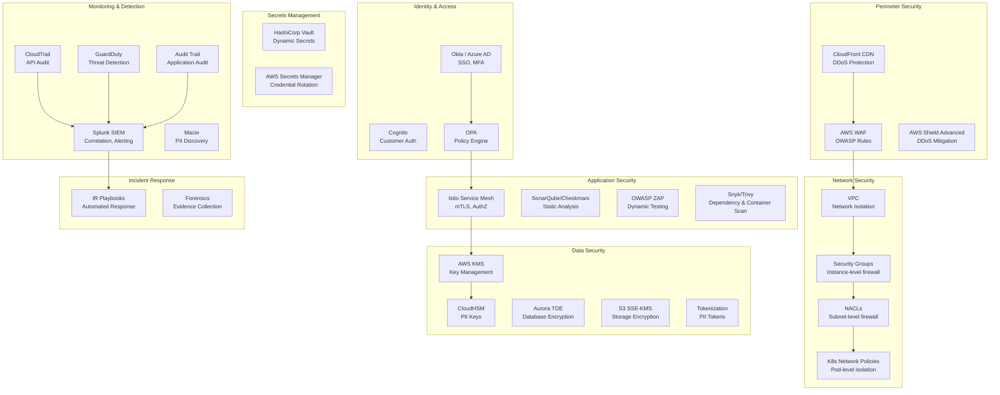

### 13.2 Defense in Depth Layers

```
┌──────────────────────────────────────────────────┐
│ Layer 1: Perimeter (CDN, WAF, DDoS Protection)   │
├──────────────────────────────────────────────────┤
│ Layer 2: Network (VPC, Subnets, Security Groups)  │
├──────────────────────────────────────────────────┤
│ Layer 3: Identity (SSO, MFA, RBAC, ABAC)         │
├──────────────────────────────────────────────────┤
│ Layer 4: Application (Input validation, AuthZ)    │
├──────────────────────────────────────────────────┤
│ Layer 5: Service Mesh (mTLS, Service AuthZ)       │
├──────────────────────────────────────────────────┤
│ Layer 6: Data (Encryption, Tokenization, Masking) │
├──────────────────────────────────────────────────┤
│ Layer 7: Monitoring (SIEM, Audit, Alerting)       │
├──────────────────────────────────────────────────┤
│ Layer 8: Response (IR Plan, Forensics, Recovery)  │
└──────────────────────────────────────────────────┘
```

---

## 14. Security Controls Matrix

### 14.1 Controls Mapped to PAS Components

| PAS Component | Authentication | Authorization | Encryption (Rest) | Encryption (Transit) | Audit | DLP | Input Validation |
|---|---|---|---|---|---|---|---|
| **API Gateway** | OAuth 2.0/JWT | Rate limiting, API key | N/A | TLS 1.3 | Access logs | N/A | WAF rules |
| **Policy Service** | JWT (from gateway) | RBAC + ABAC (OPA) | TDE + column-level | mTLS | Full audit trail | PII scrubbing | Schema validation |
| **Party Service** | JWT (from gateway) | RBAC + ABAC + ownership | TDE + column-level + tokenization | mTLS | Full audit trail | PII detection | Strict validation |
| **Billing Service** | JWT (from gateway) | RBAC + dollar limits | TDE + column-level | mTLS | Transaction audit | Payment data | Amount validation |
| **Claims Service** | JWT (from gateway) | RBAC + dollar limits | TDE + column-level | mTLS | Full audit trail | PHI protection | Document validation |
| **Underwriting Service** | JWT (from gateway) | UW role + team assignment | TDE + PHI encryption | mTLS | PHI access audit | PHI detection | Medical data validation |
| **Financial Service** | JWT (service account) | Actuary/Finance role | TDE + event store encryption | mTLS | GL audit trail | N/A | Financial validation |
| **Commission Service** | JWT (from gateway) | Agent hierarchy + role | TDE | mTLS | Payment audit | N/A | Amount validation |
| **Correspondence** | JWT (service account) | Template role | TDE + document encryption | mTLS | Generation audit | PII in templates | Template validation |
| **Document Service** | JWT (from gateway) | Document type + policy ownership | S3 SSE-KMS | TLS 1.3 | Access audit | Document classification | File type validation |
| **Kafka** | SASL/SCRAM | Topic-level ACLs | Broker-level encryption | SASL_SSL | Message audit | Event filtering | Schema validation |
| **Database** | Dynamic credentials (Vault) | Schema-level isolation | Aurora TDE | TLS | Query audit | Data masking | Parameterized queries |

---

## 15. IAM Role Definitions

### 15.1 Complete Role Hierarchy

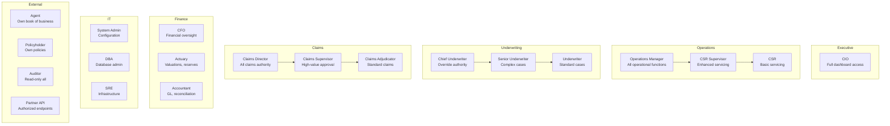

### 15.2 Permission Matrix

```yaml
# Detailed permission matrix for all PAS roles
permission_matrix:
  
  # Format: resource.action → list of roles with access
  
  policy:
    read:
      - CSR
      - SR_CSR
      - UW (cases assigned)
      - CLM_ADJ (policy for claim)
      - AGENT (own policies)
      - POLICYHOLDER (own policies)
      - AUDITOR
      - OPS_MGR
    search:
      - CSR (assigned states)
      - SR_CSR (assigned states)
      - AGENT (own hierarchy)
      - OPS_MGR
      - AUDITOR
    create_application:
      - CSR
      - AGENT
    change_basic:
      - CSR
      - SR_CSR
      - OPS_MGR
    change_financial:
      - SR_CSR
      - OPS_MGR
    surrender:
      - SR_CSR (up to $100K)
      - OPS_MGR (unlimited)
      
  party:
    read:
      - CSR
      - UW
      - CLM_ADJ
      - AGENT (own parties)
      - POLICYHOLDER (own record)
      - AUDITOR
    read_ssn:
      - SR_CSR
      - OPS_MGR
      - AUDITOR (with examination order)
    read_medical:
      - UW
      - CHIEF_UW
      - CLM_ADJ (claim-related)
    update:
      - CSR (contact info)
      - POLICYHOLDER (own contact info)
      
  underwriting:
    review:
      - UW (assigned cases)
      - SR_UW (team cases)
      - CHIEF_UW (all cases)
    decide:
      - UW (up to auto-issue limit)
      - SR_UW (up to $2M)
      - CHIEF_UW (unlimited)
    override:
      - CHIEF_UW
      
  claims:
    create:
      - CSR
      - CLM_ADJ
      - POLICYHOLDER
    adjudicate:
      - CLM_ADJ
      - CLM_SUP
    approve:
      - CLM_ADJ (up to $500K)
      - CLM_SUP (up to $2M)
      - CLM_DIR (unlimited)
      
  billing:
    read:
      - CSR
      - POLICYHOLDER (own)
      - AGENT (own policies)
      - AUDITOR
    payment_apply:
      - CSR
      - SR_CSR
    refund:
      - SR_CSR
      - OPS_MGR
      
  commission:
    read_own:
      - AGENT
    read_all:
      - OPS_MGR
      - AUDITOR
    adjust:
      - OPS_MGR
      
  financial:
    read:
      - ACT
      - ACCT
      - CFO
      - AUDITOR
    valuation_run:
      - ACT
    gl_post:
      - ACCT
      
  system:
    config:
      - SYS_ADMIN
    user_manage:
      - SYS_ADMIN
    audit_read:
      - SYS_ADMIN
      - AUDITOR
      - OPS_MGR
```

---

## 16. Conclusion

Security architecture for a Policy Administration System is not a one-time design exercise — it is an ongoing program that must evolve with the threat landscape, regulatory environment, and technology stack. The architecture presented in this article provides a comprehensive framework that addresses the unique challenges of securing insurance data and operations.

### Key Principles

1. **Defense in depth**: No single control is sufficient. Layer security at every level — perimeter, network, identity, application, data, and monitoring.

2. **Zero trust**: Assume breach. Verify every request, authenticate every identity, authorize every action, encrypt every communication.

3. **Data-centric security**: The data is the target. Classify it, encrypt it, tokenize it, mask it, audit access to it, and limit who can see it.

4. **Compliance as baseline, not ceiling**: Regulatory requirements (NYDFS, NAIC, GLBA) set the floor. Good security architecture exceeds these minimums.

5. **Automation over manual process**: Automated security testing in CI/CD, automated threat detection, automated incident response — manual processes don't scale and are error-prone.

6. **Least privilege everywhere**: Every user, service, database connection, and API key should have the minimum permissions needed. Review and revoke regularly.

### Insurance-Specific Considerations

- **PII volume**: A PAS contains concentrated PII — millions of SSNs, DOBs, health records, and financial accounts. The blast radius of a breach is enormous.
- **Regulatory scrutiny**: Insurance regulators increasingly focus on cybersecurity. The NYDFS regulation is the model that other states are adopting.
- **Examination readiness**: Security architecture must support regulatory examination access while maintaining controls.
- **Long-lived data**: Policies last decades. Security controls must protect data for its entire lifecycle, including archival and eventual destruction.
- **Multi-party access**: PAS data is accessed by carriers, agents, policyholders, vendors, and regulators — each with different trust levels and access needs.

### Implementation Priority

For organizations building or modernizing PAS security:

1. **Immediate**: MFA everywhere, encryption at rest and in transit, audit logging, vulnerability scanning
2. **Near-term**: Zero trust network segmentation, RBAC/ABAC authorization, SIEM integration, incident response plan
3. **Medium-term**: Full ABAC with policy engine, behavioral analytics, automated threat response, comprehensive DLP
4. **Ongoing**: Penetration testing, red team exercises, security culture training, continuous compliance monitoring

Security is not a feature to be added later — it is a foundational architectural concern that must be embedded in every design decision from the first line of code.

---

*This article is part of the Life Insurance PAS Architect's Encyclopedia. See also: Article 38 (Microservices Architecture), Article 39 (Cloud-Native PAS Design), Article 40 (Legacy Modernization Strategies).*
