# Article 42: Canonical Data Model for Life PAS

## Table of Contents

1. [Introduction](#1-introduction)
2. [Policy-Centric Data Model](#2-policy-centric-data-model)
3. [Party Model](#3-party-model)
4. [Product Model](#4-product-model)
5. [Coverage Model](#5-coverage-model)
6. [Financial Model](#6-financial-model)
7. [Billing Model](#7-billing-model)
8. [Claim Model](#8-claim-model)
9. [Correspondence Model](#9-correspondence-model)
10. [Agent/Producer Model](#10-agentproducer-model)
11. [Full Enterprise ERD (80+ Entities)](#11-full-enterprise-erd-80-entities)
12. [Data Dictionary](#12-data-dictionary)
13. [Sample DDL (PostgreSQL)](#13-sample-ddl-postgresql)
14. [Temporal Data Management Patterns](#14-temporal-data-management-patterns)
15. [Canonical vs Physical Model](#15-canonical-vs-physical-model)
16. [ACORD Alignment](#16-acord-alignment)
17. [Implementation Guidance](#17-implementation-guidance)

---

## 1. Introduction

A **Canonical Data Model (CDM)** for a Life Insurance Policy Administration System (PAS) is the single, authoritative representation of all business entities, relationships, and attributes that flow through the enterprise. It serves as the lingua franca between underwriting, policy servicing, billing, claims, reinsurance, accounting, compliance, and analytics domains.

### 1.1 Why a Canonical Data Model Matters

| Concern | Without CDM | With CDM |
|---------|-------------|----------|
| Integration | Point-to-point mappings between every pair of systems (N×(N−1)/2) | Each system maps to/from one canonical format (2×N) |
| Data Quality | Ambiguous field semantics, duplicate definitions | Single authoritative definition per concept |
| Regulatory Reporting | Manual reconciliation across disparate models | Consistent, auditable lineage from source to report |
| Vendor Flexibility | Locked into a single vendor's proprietary schema | Abstraction layer enabling swap-out |
| Analytics | Inconsistent measures across data marts | Conformed dimensions and measures |

### 1.2 Design Principles

1. **Business-First Semantics** — Every entity and attribute is named for the business concept it represents, not the technical implementation.
2. **Temporal Completeness** — All business-significant changes are captured with effective dating (bi-temporal where required).
3. **ACORD Alignment** — Naming conventions and structures draw from ACORD Life data standards where applicable.
4. **Extensibility** — The model supports new product types, party roles, and transaction categories without structural change.
5. **Normalization with Purpose** — Third normal form (3NF) for the canonical model; denormalization is a physical-model concern.
6. **Role-Based Party Model** — Parties are modeled once and linked to policies/claims/transactions through role associations.
7. **Product Independence** — The schema accommodates term, whole life, universal life, variable life, indexed universal life, annuities, and supplementary riders within one unified structure.

### 1.3 Scope of This Article

This article defines the **logical canonical model** — the technology-agnostic blueprint. Physical implementation choices (column types for a specific RDBMS, partitioning, indexing) appear in the DDL section as illustrative examples, but the canonical model itself is portable across PostgreSQL, Oracle, SQL Server, or a document store.

---

## 2. Policy-Centric Data Model

The policy is the gravitational center of the life insurance data universe. Every other entity — party, coverage, transaction, document — exists in relation to a policy.

### 2.1 Core Entity-Relationship Overview

```mermaid
erDiagram
    POLICY ||--o{ COVERAGE : "has"
    POLICY ||--o{ POLICY_PARTY_ROLE : "involves"
    POLICY ||--o{ FINANCIAL_TRANSACTION : "records"
    POLICY ||--o{ BILLING_SCHEDULE : "billed via"
    POLICY ||--o{ DOCUMENT : "generates"
    POLICY ||--o{ NOTE_DIARY : "annotated by"
    POLICY ||--o{ POLICY_STATUS_HISTORY : "tracks status"
    POLICY }o--|| PRODUCT_PLAN : "issued under"

    PARTY ||--o{ POLICY_PARTY_ROLE : "plays"
    PARTY ||--o{ PARTY_ADDRESS : "located at"
    PARTY ||--o{ PARTY_PHONE : "contacted via"
    PARTY ||--o{ PARTY_EMAIL : "emailed at"
    PARTY ||--o{ PARTY_BANKING : "paid through"
    PARTY ||--o{ PARTY_IDENTIFICATION : "identified by"
    PARTY ||--o{ PARTY_RELATIONSHIP : "related to"

    COVERAGE ||--o{ COVERAGE_INSURED : "covers"
    COVERAGE ||--o{ COVERAGE_RIDER : "enhanced by"
    COVERAGE ||--o{ COI_RATE : "charged per"

    FINANCIAL_TRANSACTION ||--o{ TRANSACTION_DETAIL : "detailed in"
    FINANCIAL_TRANSACTION }o--o| FUND_ALLOCATION : "allocated to"

    DOCUMENT ||--o{ DOCUMENT_DELIVERY : "delivered via"
    NOTE_DIARY }o--|| USER_PROFILE : "created by"
```

### 2.2 Policy Entity — The Master Record

The **Policy** entity is the anchor. It carries the attributes that are true of the contract as a whole — not of any individual coverage, party, or transaction.

| Attribute | Type | Description |
|-----------|------|-------------|
| `policy_id` | BIGINT (PK) | System-generated surrogate key |
| `policy_number` | VARCHAR(20) | Human-readable policy number (unique, natural key) |
| `company_code` | VARCHAR(10) | Issuing legal entity |
| `admin_system_code` | VARCHAR(10) | Source administration system identifier |
| `product_plan_id` | BIGINT (FK) | Reference to the product/plan under which the policy is issued |
| `policy_status_code` | VARCHAR(10) | Current status (APPLIED, ISSUED, INFORCE, LAPSED, SURRENDERED, MATURED, DEATHCLAIM, TERMINATED) |
| `policy_status_reason_code` | VARCHAR(10) | Reason for last status change |
| `application_date` | DATE | Date application was signed |
| `application_received_date` | DATE | Date application was received by carrier |
| `issue_date` | DATE | Date policy was issued |
| `policy_date` | DATE | Policy effective date (may differ from issue date) |
| `paid_to_date` | DATE | Premiums paid through this date |
| `maturity_date` | DATE | Date policy matures (endowment, term expiry) |
| `termination_date` | DATE | Date policy terminated (if applicable) |
| `last_anniversary_date` | DATE | Last policy anniversary processed |
| `next_anniversary_date` | DATE | Next policy anniversary |
| `issue_state_code` | VARCHAR(2) | US state / Canadian province of issue |
| `issue_country_code` | VARCHAR(3) | ISO 3166 country code |
| `tax_qualification_code` | VARCHAR(10) | Tax qualification status (NQUAL, QUAL_IRA, QUAL_401K, QUAL_403B, QUAL_SEP, QUAL_ROTH, etc.) |
| `section_1035_exchange_ind` | BOOLEAN | Whether the policy originated from a 1035 exchange |
| `replacement_ind` | BOOLEAN | Whether the policy replaced another |
| `replacement_type_code` | VARCHAR(10) | INTERNAL or EXTERNAL replacement |
| `mec_status_code` | VARCHAR(10) | Modified Endowment Contract status (NOT_MEC, MEC, PENDING) |
| `mec_date` | DATE | Date MEC status was triggered |
| `seven_pay_premium_amount` | DECIMAL(15,2) | 7-pay test premium limit |
| `cumulative_premium_amount` | DECIMAL(15,2) | Cumulative premiums paid (for MEC testing) |
| `face_amount` | DECIMAL(15,2) | Total initial face amount |
| `current_face_amount` | DECIMAL(15,2) | Current total face amount (may differ due to changes) |
| `death_benefit_option_code` | VARCHAR(5) | A (level), B (increasing), C (return of premium) |
| `premium_mode_code` | VARCHAR(5) | ANNUAL, SEMI, QUARTERLY, MONTHLY, SINGLE |
| `modal_premium_amount` | DECIMAL(15,2) | Current modal premium |
| `annual_premium_amount` | DECIMAL(15,2) | Annualized premium |
| `total_account_value` | DECIMAL(15,4) | Current total account/cash value |
| `total_surrender_value` | DECIMAL(15,4) | Current surrender value (CSV − surrender charge) |
| `total_loan_balance` | DECIMAL(15,4) | Total outstanding loan principal + accrued interest |
| `cost_basis_amount` | DECIMAL(15,4) | Investment in the contract (for tax purposes) |
| `last_valuation_date` | DATE | Date of last account value calculation |
| `reinsurance_ind` | BOOLEAN | Whether any coverage is reinsured |
| `group_policy_ind` | BOOLEAN | Group vs individual |
| `created_timestamp` | TIMESTAMP | Record creation timestamp |
| `created_by` | VARCHAR(50) | User or process that created the record |
| `updated_timestamp` | TIMESTAMP | Last modification timestamp |
| `updated_by` | VARCHAR(50) | User or process that last modified |
| `version_number` | INT | Optimistic concurrency control |

### 2.3 Policy Status Lifecycle

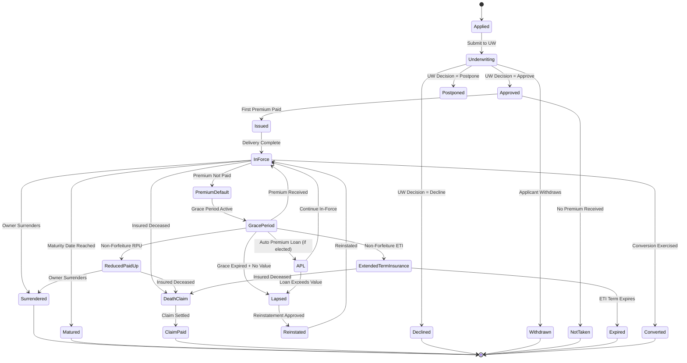

### 2.4 Policy Status History

Every status change is recorded as an immutable audit row:

| Attribute | Type | Description |
|-----------|------|-------------|
| `policy_status_history_id` | BIGINT (PK) | Surrogate key |
| `policy_id` | BIGINT (FK) | Reference to Policy |
| `previous_status_code` | VARCHAR(10) | Status before transition |
| `new_status_code` | VARCHAR(10) | Status after transition |
| `status_reason_code` | VARCHAR(10) | Reason code for transition |
| `effective_date` | DATE | Business effective date of the change |
| `system_timestamp` | TIMESTAMP | When the change was recorded in the system |
| `user_id` | VARCHAR(50) | User or process that triggered the change |
| `notes` | TEXT | Free-form notes about the change |

---

## 3. Party Model

### 3.1 Party Abstraction

The canonical model uses a **Party** supertype with subtypes for Individual, Organization, Trust, and Estate. This avoids duplicating address, phone, and banking structures across different entity types.

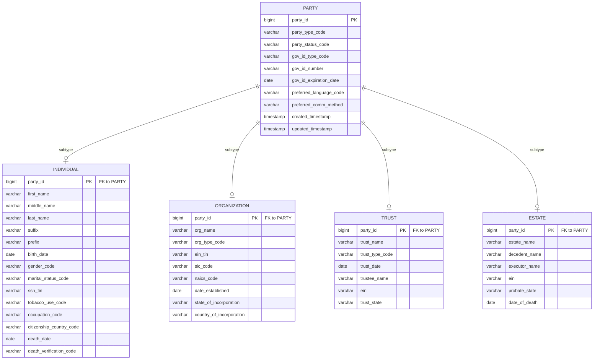

### 3.2 Party Identification

A party may carry multiple identification documents:

| Attribute | Type | Description |
|-----------|------|-------------|
| `party_identification_id` | BIGINT (PK) | Surrogate key |
| `party_id` | BIGINT (FK) | Reference to Party |
| `id_type_code` | VARCHAR(10) | SSN, TIN, ITIN, PASSPORT, DRIVER_LIC, STATE_ID, MILITARY_ID, GREEN_CARD, VISA, OTHER |
| `id_number` | VARCHAR(30) | Encrypted or tokenized identification number |
| `id_issuing_authority` | VARCHAR(50) | Issuing state, country, or entity |
| `id_issue_date` | DATE | Date issued |
| `id_expiration_date` | DATE | Date of expiration |
| `id_verification_status` | VARCHAR(10) | VERIFIED, UNVERIFIED, EXPIRED, FAILED |
| `id_verification_date` | DATE | When last verified |
| `primary_ind` | BOOLEAN | Primary identification flag |
| `effective_start_date` | DATE | Effective start (for temporal tracking) |
| `effective_end_date` | DATE | Effective end (NULL = current) |

### 3.3 Party Roles (Policy–Party Association)

The **Policy_Party_Role** junction table connects parties to policies with specific roles. A single party can play multiple roles on the same policy and multiple roles across different policies.

| Attribute | Type | Description |
|-----------|------|-------------|
| `policy_party_role_id` | BIGINT (PK) | Surrogate key |
| `policy_id` | BIGINT (FK) | Reference to Policy |
| `party_id` | BIGINT (FK) | Reference to Party |
| `role_code` | VARCHAR(15) | OWNER, JOINT_OWNER, INSURED, JOINT_INSURED, ANNUITANT, JOINT_ANNUITANT, BENEFICIARY, CONTINGENT_BENEF, TERTIARY_BENEF, IRREVOC_BENEF, PAYOR, ASSIGNEE, CUSTODIAN, AGENT, WRITING_AGENT, SERVICING_AGENT, TRUSTEE, POWER_OF_ATTORNEY, GUARDIAN, COLLATERAL_ASSIGNEE |
| `role_subtype_code` | VARCHAR(15) | Additional classification (e.g., PRIMARY, CONTINGENT for beneficiaries) |
| `benefit_percentage` | DECIMAL(7,4) | Beneficiary share (e.g., 50.0000%) |
| `per_stirpes_ind` | BOOLEAN | Per stirpes distribution |
| `irrevocable_ind` | BOOLEAN | Irrevocable designation |
| `effective_date` | DATE | Date role became effective |
| `termination_date` | DATE | Date role ended (NULL = active) |
| `sequence_number` | INT | Ordering within role class |
| `relationship_to_insured` | VARCHAR(20) | SELF, SPOUSE, CHILD, PARENT, SIBLING, BUSINESS, TRUST, ESTATE, OTHER |
| `insurable_interest_desc` | VARCHAR(200) | Narrative for insurable interest |

### 3.4 Party-to-Party Relationships

Distinct from the policy-party-role, this captures interpersonal or organizational relationships between parties themselves (independent of any specific policy):

| Attribute | Type | Description |
|-----------|------|-------------|
| `party_relationship_id` | BIGINT (PK) | Surrogate key |
| `party_id_from` | BIGINT (FK) | Source party |
| `party_id_to` | BIGINT (FK) | Target party |
| `relationship_type_code` | VARCHAR(15) | SPOUSE, PARENT_CHILD, SIBLING, BUSINESS_PARTNER, EMPLOYER_EMPLOYEE, TRUST_BENEFICIARY, TRUST_GRANTOR, GUARDIAN_WARD, POA |
| `relationship_desc` | VARCHAR(200) | Additional description |
| `effective_date` | DATE | Effective start |
| `termination_date` | DATE | Effective end |
| `verified_ind` | BOOLEAN | Whether verified |
| `verified_date` | DATE | Date verified |

### 3.5 Address Model

| Attribute | Type | Description |
|-----------|------|-------------|
| `party_address_id` | BIGINT (PK) | Surrogate key |
| `party_id` | BIGINT (FK) | Reference to Party |
| `address_type_code` | VARCHAR(10) | HOME, MAILING, BUSINESS, LEGAL, SEASONAL, PREVIOUS |
| `address_line_1` | VARCHAR(100) | Street address line 1 |
| `address_line_2` | VARCHAR(100) | Apt, Suite, Unit |
| `address_line_3` | VARCHAR(100) | Additional address line |
| `city` | VARCHAR(50) | City |
| `state_province_code` | VARCHAR(5) | State or province |
| `postal_code` | VARCHAR(15) | Zip/postal code |
| `country_code` | VARCHAR(3) | ISO 3166 country code |
| `county_code` | VARCHAR(10) | County FIPS code |
| `address_validation_status` | VARCHAR(10) | USPS validated, unvalidated |
| `primary_ind` | BOOLEAN | Primary address for this type |
| `effective_start_date` | DATE | Effective start (historical tracking) |
| `effective_end_date` | DATE | Effective end (NULL = current) |

### 3.6 Phone, Email, Banking Models

**Party_Phone:**

| Attribute | Type | Description |
|-----------|------|-------------|
| `party_phone_id` | BIGINT (PK) | Surrogate key |
| `party_id` | BIGINT (FK) | Reference to Party |
| `phone_type_code` | VARCHAR(10) | HOME, MOBILE, WORK, FAX |
| `country_dialing_code` | VARCHAR(5) | Country code (e.g., +1) |
| `area_code` | VARCHAR(5) | Area code |
| `phone_number` | VARCHAR(15) | Phone number |
| `extension` | VARCHAR(10) | Extension |
| `sms_capable_ind` | BOOLEAN | Can receive SMS |
| `primary_ind` | BOOLEAN | Primary phone |
| `do_not_call_ind` | BOOLEAN | DNC preference |
| `effective_start_date` | DATE | Effective start |
| `effective_end_date` | DATE | Effective end |

**Party_Email:**

| Attribute | Type | Description |
|-----------|------|-------------|
| `party_email_id` | BIGINT (PK) | Surrogate key |
| `party_id` | BIGINT (FK) | Reference to Party |
| `email_type_code` | VARCHAR(10) | PERSONAL, WORK |
| `email_address` | VARCHAR(256) | Email address |
| `primary_ind` | BOOLEAN | Primary email |
| `verified_ind` | BOOLEAN | Email verified |
| `opt_in_marketing_ind` | BOOLEAN | Marketing opt-in |
| `effective_start_date` | DATE | Effective start |
| `effective_end_date` | DATE | Effective end |

**Party_Banking:**

| Attribute | Type | Description |
|-----------|------|-------------|
| `party_banking_id` | BIGINT (PK) | Surrogate key |
| `party_id` | BIGINT (FK) | Reference to Party |
| `bank_account_type_code` | VARCHAR(10) | CHECKING, SAVINGS |
| `bank_name` | VARCHAR(100) | Financial institution name |
| `routing_number` | VARCHAR(9) | ABA routing number |
| `account_number_token` | VARCHAR(50) | Tokenized bank account number |
| `account_holder_name` | VARCHAR(100) | Name on account |
| `bank_account_status_code` | VARCHAR(10) | ACTIVE, INACTIVE, PRENOTE, VERIFIED, FAILED |
| `prenote_date` | DATE | Date pre-notification was sent |
| `prenote_status` | VARCHAR(10) | PENDING, CONFIRMED, REJECTED |
| `primary_ind` | BOOLEAN | Primary bank account |
| `usage_type_code` | VARCHAR(10) | PREMIUM_PAY, DISBURSEMENT, BOTH |
| `effective_start_date` | DATE | Effective start |
| `effective_end_date` | DATE | Effective end |

### 3.7 Historical Name/Address Tracking

The canonical model uses **effective dating** on name and address records. When a party changes their name or address:

1. The existing record's `effective_end_date` is set to the change date − 1 day.
2. A new record is inserted with `effective_start_date` = change date and `effective_end_date` = NULL (current).

This pattern is applied consistently to:
- `PARTY_ADDRESS` (address changes)
- `INDIVIDUAL` name fields (via a `PARTY_NAME_HISTORY` table for married name changes, legal name changes, etc.)
- `PARTY_PHONE` (number changes)
- `PARTY_EMAIL` (email changes)
- `PARTY_BANKING` (bank changes)

**Party_Name_History:**

| Attribute | Type | Description |
|-----------|------|-------------|
| `party_name_history_id` | BIGINT (PK) | Surrogate key |
| `party_id` | BIGINT (FK) | Reference to Party |
| `first_name` | VARCHAR(50) | First name |
| `middle_name` | VARCHAR(50) | Middle name |
| `last_name` | VARCHAR(50) | Last name |
| `suffix` | VARCHAR(10) | Suffix |
| `prefix` | VARCHAR(10) | Prefix |
| `name_change_reason_code` | VARCHAR(10) | MARRIAGE, DIVORCE, LEGAL, CORRECTION |
| `effective_start_date` | DATE | Effective start |
| `effective_end_date` | DATE | Effective end |

---

## 4. Product Model

### 4.1 Product Hierarchy

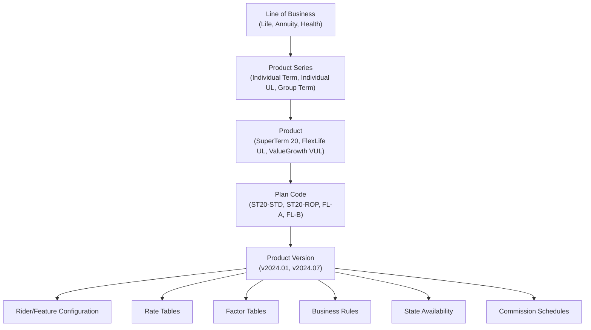

### 4.2 Product Entity Structure

| Attribute | Type | Description |
|-----------|------|-------------|
| `product_plan_id` | BIGINT (PK) | Surrogate key |
| `product_code` | VARCHAR(20) | Product identifier |
| `plan_code` | VARCHAR(20) | Plan variation within product |
| `product_name` | VARCHAR(100) | Marketing name |
| `product_series_code` | VARCHAR(10) | Product series grouping |
| `lob_code` | VARCHAR(10) | LIFE, ANNUITY, HEALTH, SUPPLEMENTAL |
| `product_type_code` | VARCHAR(20) | TERM, WHOLE_LIFE, UNIVERSAL_LIFE, VARIABLE_LIFE, INDEXED_UL, VARIABLE_UL, FIXED_ANNUITY, VARIABLE_ANNUITY, INDEXED_ANNUITY, SPIA, DIA |
| `version_number` | INT | Product version (increments with filing changes) |
| `version_effective_date` | DATE | Date this version becomes effective |
| `version_end_date` | DATE | Date this version is superseded |
| `product_status_code` | VARCHAR(10) | DESIGN, TESTING, APPROVED, ACTIVE, CLOSED_NEW, RETIRED |
| `min_issue_age` | INT | Minimum issue age |
| `max_issue_age` | INT | Maximum issue age |
| `min_face_amount` | DECIMAL(15,2) | Minimum face amount |
| `max_face_amount` | DECIMAL(15,2) | Maximum face amount |
| `face_amount_increment` | DECIMAL(15,2) | Face amount band increment |
| `premium_type_code` | VARCHAR(10) | FIXED, FLEXIBLE, SINGLE |
| `cash_value_ind` | BOOLEAN | Builds cash value |
| `participating_ind` | BOOLEAN | Eligible for dividends |
| `tax_qualified_eligible_ind` | BOOLEAN | Can be issued as qualified plan |
| `valuation_basis_code` | VARCHAR(10) | CRVM, NLP, GPT (for statutory valuation) |
| `naic_product_code` | VARCHAR(10) | NAIC annual statement line of business code |
| `filing_state_form_number` | VARCHAR(50) | State filing form reference |

### 4.3 Product Version Management

Product versions are triggered by:
- Regulatory changes (e.g., new CSO mortality table adoption)
- Rate changes (e.g., revised COI rates, credited rate changes)
- Benefit formula changes
- State-specific filing amendments

The canonical model versions at the **plan** level:

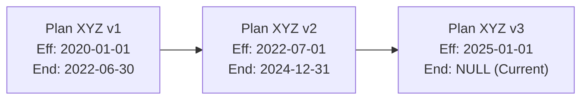

Existing policies remain on their **issue version** unless explicitly converted. New policies receive the **currently active version**.

### 4.4 Feature Configuration

| Entity | Key Attributes |
|--------|---------------|
| `PRODUCT_COVERAGE_TYPE` | product_plan_id, coverage_type_code (BASE, RIDER_WP, RIDER_ADB, RIDER_CHILD, RIDER_GIB, etc.), required_ind, max_count |
| `PRODUCT_FUND_OPTION` | product_plan_id, fund_id, fund_type (GENERAL_ACCT, SEPARATE_ACCT, INDEXED_SEGMENT), default_allocation_pct |
| `PRODUCT_CREDITING_STRATEGY` | product_plan_id, strategy_code (FIXED, DECLARED, INDEXED_PTP, INDEXED_MONTHLY_AVG, INDEXED_CAP_SPREAD), index_id, cap_rate, floor_rate, spread_rate, participation_rate |
| `PRODUCT_CHARGE_CONFIG` | product_plan_id, charge_type_code (COI, EXPENSE, SURRENDER, M_AND_E, ADMIN, RIDER, PER_UNIT), charge_basis, charge_timing, charge_rate_table_id |
| `PRODUCT_PREMIUM_RULE` | product_plan_id, premium_type, min_annual, max_annual, target_annual, guideline_single, guideline_level_annual |
| `PRODUCT_NONFORFEITURE` | product_plan_id, nf_type (ETI, RPU, CSV), calculation_method, minimum_value_basis |
| `PRODUCT_COMMISSION_SCHEDULE` | product_plan_id, commission_schedule_id, commission_type (FYC, RENEWAL, TRAIL, BONUS, PERSISTENCY) |

### 4.5 Rate Table Structure

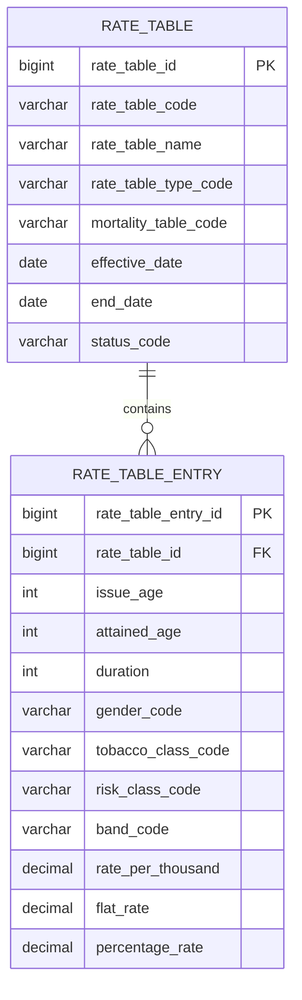

### 4.6 Factor Table Structure

| Attribute | Type | Description |
|-----------|------|-------------|
| `factor_table_id` | BIGINT (PK) | Surrogate key |
| `factor_table_code` | VARCHAR(20) | Identifier |
| `factor_type_code` | VARCHAR(20) | ANNUITY_FACTOR, PV_FACTOR, NSP_FACTOR, CONVERSION_FACTOR, NF_FACTOR, RESERVE_FACTOR |
| `mortality_table_code` | VARCHAR(20) | Underlying mortality table |
| `interest_rate` | DECIMAL(7,5) | Interest rate assumption |
| `effective_date` | DATE | Effective date |
| `end_date` | DATE | End date |

### 4.7 State Availability

| Attribute | Type | Description |
|-----------|------|-------------|
| `product_state_id` | BIGINT (PK) | Surrogate key |
| `product_plan_id` | BIGINT (FK) | Reference to product/plan |
| `state_code` | VARCHAR(2) | US state or territory |
| `approval_status_code` | VARCHAR(10) | FILED, APPROVED, DISAPPROVED, WITHDRAWN |
| `approval_date` | DATE | Date approved |
| `effective_date` | DATE | Date available for sale |
| `withdrawal_date` | DATE | Date withdrawn from state |
| `state_form_number` | VARCHAR(50) | State-specific form number |
| `state_variation_id` | BIGINT (FK) | Reference to state-specific overrides |

---

## 5. Coverage Model

### 5.1 Coverage Entity

| Attribute | Type | Description |
|-----------|------|-------------|
| `coverage_id` | BIGINT (PK) | Surrogate key |
| `policy_id` | BIGINT (FK) | Parent policy |
| `coverage_number` | INT | Sequence within policy (1 = base) |
| `parent_coverage_id` | BIGINT (FK) | Self-referencing for rider-to-base or rider-to-rider |
| `coverage_type_code` | VARCHAR(20) | BASE, RIDER_WP, RIDER_ADB, RIDER_CHILD, RIDER_GIB, RIDER_LTC, RIDER_CHRONIC, RIDER_INCOME, RIDER_TERM, RIDER_GPO |
| `coverage_status_code` | VARCHAR(10) | ACTIVE, TERMINATED, EXPIRED, EXERCISED, WAIVED |
| `coverage_status_reason_code` | VARCHAR(10) | Reason for last status change |
| `plan_code` | VARCHAR(20) | Product plan for this coverage |
| `coverage_effective_date` | DATE | Coverage start |
| `coverage_termination_date` | DATE | Coverage end |
| `coverage_expiry_date` | DATE | When the coverage expires by terms |
| `coverage_amount` | DECIMAL(15,2) | Face amount for this coverage |
| `coverage_units` | DECIMAL(10,4) | Units of coverage (for some riders) |
| `number_of_units` | DECIMAL(10,4) | Number of insured units (e.g., child rider) |
| `premium_amount` | DECIMAL(15,4) | Annual premium for this coverage |
| `coi_rate_table_id` | BIGINT (FK) | Cost of insurance rate table |
| `risk_class_code` | VARCHAR(10) | PREFERRED_PLUS, PREFERRED, STANDARD, SUBSTANDARD, TABLE_RATED |
| `table_rating` | INT | Extra mortality table rating (1-16) |
| `flat_extra_amount` | DECIMAL(10,4) | Flat extra premium per $1000 |
| `flat_extra_duration` | INT | Duration of flat extra (years) |
| `flat_extra_remaining` | INT | Remaining years of flat extra |
| `tobacco_class_code` | VARCHAR(5) | NT (non-tobacco), T (tobacco), NS (non-smoker), SM (smoker) |
| `underwriting_class_code` | VARCHAR(10) | Full underwriting class |
| `waiver_of_premium_ind` | BOOLEAN | Whether WP is active |
| `net_amount_at_risk` | DECIMAL(15,4) | Death benefit − account value (for COI and reinsurance) |

### 5.2 Coverage-Insured Linkage

A coverage can cover one or more insureds (e.g., joint first-to-die, joint last-to-die):

| Attribute | Type | Description |
|-----------|------|-------------|
| `coverage_insured_id` | BIGINT (PK) | Surrogate key |
| `coverage_id` | BIGINT (FK) | Reference to Coverage |
| `party_id` | BIGINT (FK) | Reference to Party (insured) |
| `insured_type_code` | VARCHAR(10) | PRIMARY, JOINT, DEPENDENT |
| `issue_age` | INT | Age at issue |
| `issue_gender_code` | VARCHAR(1) | Gender at issue |
| `issue_risk_class_code` | VARCHAR(10) | Risk class at issue |

### 5.3 Coverage Status Lifecycle

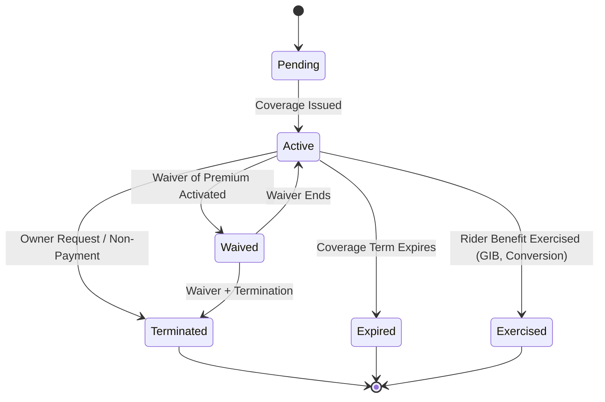

### 5.4 Rider Hierarchy

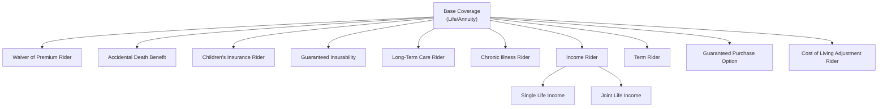

---

## 6. Financial Model

### 6.1 Account Value Architecture

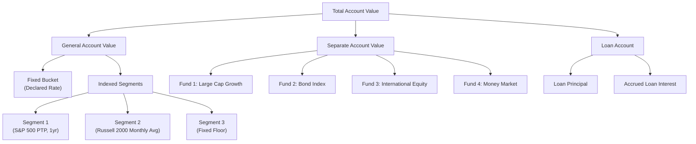

### 6.2 Account Value Entity

| Attribute | Type | Description |
|-----------|------|-------------|
| `account_value_id` | BIGINT (PK) | Surrogate key |
| `policy_id` | BIGINT (FK) | Reference to Policy |
| `account_type_code` | VARCHAR(10) | GENERAL, SEPARATE, LOAN |
| `sub_account_id` | BIGINT (FK) | Reference to fund/segment (NULL for general fixed) |
| `current_value` | DECIMAL(18,6) | Current dollar value |
| `current_units` | DECIMAL(18,8) | Current units (variable products) |
| `unit_value` | DECIMAL(12,6) | Current unit value (NAV) |
| `cost_basis` | DECIMAL(18,6) | Tax basis for this sub-account |
| `effective_date` | DATE | As-of date for this snapshot |
| `last_transaction_date` | DATE | Date of last activity |

### 6.3 Financial Transaction Ledger

The transaction ledger is the immutable financial audit trail. Every monetary event generates one or more transaction records.

| Attribute | Type | Description |
|-----------|------|-------------|
| `transaction_id` | BIGINT (PK) | Surrogate key |
| `policy_id` | BIGINT (FK) | Reference to Policy |
| `transaction_type_code` | VARCHAR(20) | See Transaction Type Codes below |
| `transaction_subtype_code` | VARCHAR(20) | Subcategory |
| `transaction_date` | DATE | Business effective date |
| `processing_date` | DATE | Date processed in system |
| `amount` | DECIMAL(15,4) | Transaction amount (positive = credit to policy, negative = debit) |
| `running_balance` | DECIMAL(18,4) | Account value after this transaction |
| `currency_code` | VARCHAR(3) | ISO currency code |
| `coverage_id` | BIGINT (FK) | Coverage association (if applicable) |
| `fund_id` | BIGINT (FK) | Fund/sub-account association |
| `units` | DECIMAL(18,8) | Units bought/sold (variable products) |
| `unit_value` | DECIMAL(12,6) | Unit value at transaction time |
| `reversal_ind` | BOOLEAN | Whether this reverses a prior transaction |
| `reversed_transaction_id` | BIGINT (FK) | Original transaction being reversed |
| `reversal_reason_code` | VARCHAR(10) | Reason for reversal |
| `source_system_code` | VARCHAR(10) | Originating system |
| `batch_id` | VARCHAR(30) | Batch processing reference |
| `check_number` | VARCHAR(20) | Check number (if check payment) |
| `wire_reference` | VARCHAR(30) | Wire transfer reference |
| `gl_posting_status` | VARCHAR(10) | PENDING, POSTED, FAILED |
| `gl_posting_date` | DATE | Date posted to general ledger |
| `tax_year` | INT | Tax year for reporting |
| `taxable_amount` | DECIMAL(15,4) | Taxable portion of the transaction |
| `tax_withholding_amount` | DECIMAL(15,4) | Federal/state withholding |
| `created_timestamp` | TIMESTAMP | Record creation time |
| `created_by` | VARCHAR(50) | User or process |

**Transaction Type Codes:**

| Code | Category | Description |
|------|----------|-------------|
| `PREM_INIT` | Premium | Initial premium |
| `PREM_RENEWAL` | Premium | Renewal premium |
| `PREM_ADD` | Premium | Additional/unscheduled premium |
| `PREM_1035` | Premium | 1035 exchange premium |
| `PREM_ROLLOVER` | Premium | Qualified rollover |
| `CHG_COI` | Charge | Cost of insurance deduction |
| `CHG_EXPENSE` | Charge | Monthly expense charge |
| `CHG_ADMIN` | Charge | Administrative charge |
| `CHG_ME` | Charge | Mortality & expense risk charge |
| `CHG_RIDER` | Charge | Rider charge |
| `CHG_SURRENDER` | Charge | Surrender charge |
| `CHG_PER_UNIT` | Charge | Per-unit charge |
| `CHG_PREMIUM_LOAD` | Charge | Front-end premium load |
| `CR_INTEREST` | Credit | Interest credit (general account) |
| `CR_INDEX` | Credit | Indexed interest credit |
| `CR_DIVIDEND` | Credit | Policyholder dividend |
| `CR_BONUS` | Credit | Persistency/premium bonus |
| `WD_PARTIAL` | Withdrawal | Partial withdrawal |
| `WD_SYSTEMATIC` | Withdrawal | Systematic withdrawal |
| `WD_FULL_SURR` | Withdrawal | Full surrender |
| `WD_FREE_LOOK` | Withdrawal | Free look refund |
| `WD_RMD` | Withdrawal | Required minimum distribution |
| `LOAN_ADVANCE` | Loan | Loan principal advance |
| `LOAN_REPAY` | Loan | Loan repayment |
| `LOAN_INT_ACCRUE` | Loan | Loan interest accrual |
| `LOAN_INT_CHARGE` | Loan | Loan interest capitalization |
| `XFER_IN` | Transfer | Fund transfer in |
| `XFER_OUT` | Transfer | Fund transfer out |
| `XFER_REBALANCE` | Transfer | Automatic rebalance |
| `XFER_DCA` | Transfer | Dollar cost averaging |
| `CLAIM_DB` | Claim | Death benefit payment |
| `CLAIM_ADB` | Claim | Accidental death benefit |
| `CLAIM_WP` | Claim | Waiver of premium benefit |
| `CLAIM_LTC` | Claim | Long-term care benefit |
| `ANNUITY_PAYOUT` | Annuity | Annuity payout |
| `MATURITY` | Maturity | Maturity benefit |
| `FEE_REVERSAL` | Reversal | Fee/charge reversal |

### 6.4 Fund/Sub-Account Allocation

| Attribute | Type | Description |
|-----------|------|-------------|
| `fund_allocation_id` | BIGINT (PK) | Surrogate key |
| `policy_id` | BIGINT (FK) | Reference to Policy |
| `fund_id` | BIGINT (FK) | Reference to Fund |
| `allocation_type_code` | VARCHAR(10) | PREMIUM, TRANSFER, REBALANCE |
| `allocation_percentage` | DECIMAL(7,4) | Percentage allocated to this fund |
| `effective_date` | DATE | Date allocation is effective |
| `end_date` | DATE | Date allocation ends |

**Fund Entity:**

| Attribute | Type | Description |
|-----------|------|-------------|
| `fund_id` | BIGINT (PK) | Surrogate key |
| `fund_code` | VARCHAR(20) | Fund identifier |
| `fund_name` | VARCHAR(100) | Fund name |
| `fund_type_code` | VARCHAR(15) | GENERAL_FIXED, GENERAL_INDEXED, SEPARATE_EQUITY, SEPARATE_BOND, SEPARATE_BALANCED, SEPARATE_MONEY_MARKET, SEPARATE_SPECIALTY |
| `fund_manager` | VARCHAR(100) | Investment manager |
| `cusip` | VARCHAR(9) | CUSIP identifier (for separate accounts) |
| `ticker` | VARCHAR(10) | Ticker symbol |
| `inception_date` | DATE | Fund inception |
| `status_code` | VARCHAR(10) | OPEN, CLOSED, MERGED |

### 6.5 Indexed Segment Tracking

For Indexed Universal Life (IUL) and Fixed Indexed Annuity (FIA) products:

| Attribute | Type | Description |
|-----------|------|-------------|
| `segment_id` | BIGINT (PK) | Surrogate key |
| `policy_id` | BIGINT (FK) | Reference to Policy |
| `crediting_strategy_id` | BIGINT (FK) | Reference to crediting strategy (PTP, monthly avg, etc.) |
| `index_id` | BIGINT (FK) | Market index (S&P 500, Russell 2000, DJIA, custom) |
| `segment_start_date` | DATE | Segment term start |
| `segment_end_date` | DATE | Segment term end |
| `segment_amount` | DECIMAL(18,6) | Amount allocated to this segment |
| `index_start_value` | DECIMAL(15,6) | Index value at segment start |
| `index_end_value` | DECIMAL(15,6) | Index value at segment end |
| `raw_index_return` | DECIMAL(10,6) | Unadjusted index return |
| `cap_rate` | DECIMAL(7,5) | Cap rate in effect |
| `floor_rate` | DECIMAL(7,5) | Floor rate in effect |
| `spread_rate` | DECIMAL(7,5) | Spread/margin rate |
| `participation_rate` | DECIMAL(7,5) | Participation rate |
| `credited_rate` | DECIMAL(10,6) | Final credited rate |
| `credited_amount` | DECIMAL(18,6) | Dollar amount credited |
| `segment_status_code` | VARCHAR(10) | ACTIVE, MATURED, SURRENDERED |

### 6.6 Surrender Charge Schedule

| Attribute | Type | Description |
|-----------|------|-------------|
| `surrender_schedule_id` | BIGINT (PK) | Surrogate key |
| `product_plan_id` | BIGINT (FK) | Product reference |
| `policy_year` | INT | Year (1, 2, 3, … up to 20) |
| `surrender_charge_pct` | DECIMAL(7,5) | Percentage of premium/value |
| `surrender_charge_per_unit` | DECIMAL(10,4) | Flat amount per $1000 |

### 6.7 Cost Basis / Tax Lot Tracking

| Attribute | Type | Description |
|-----------|------|-------------|
| `tax_lot_id` | BIGINT (PK) | Surrogate key |
| `policy_id` | BIGINT (FK) | Reference to Policy |
| `lot_type_code` | VARCHAR(10) | PREMIUM, GAIN, EXCHANGE |
| `contribution_date` | DATE | Date of contribution |
| `contribution_amount` | DECIMAL(15,4) | Amount contributed |
| `remaining_basis` | DECIMAL(15,4) | Remaining undistributed basis |
| `tax_qualification_code` | VARCHAR(10) | PRE_TAX, AFTER_TAX, ROTH |

---

## 7. Billing Model

### 7.1 Billing Schedule

| Attribute | Type | Description |
|-----------|------|-------------|
| `billing_schedule_id` | BIGINT (PK) | Surrogate key |
| `policy_id` | BIGINT (FK) | Reference to Policy |
| `billing_mode_code` | VARCHAR(10) | ANNUAL, SEMI, QUARTERLY, MONTHLY, SINGLE |
| `billing_method_code` | VARCHAR(15) | DIRECT_BILL, LIST_BILL, PRE_AUTH_CHECK, EFT, PAYROLL_DEDUCT, GOVT_ALLOTMENT, CREDIT_CARD |
| `billing_day_of_month` | INT | Day of month for billing (1-28) |
| `next_bill_date` | DATE | Next scheduled bill date |
| `last_bill_date` | DATE | Date of last bill generation |
| `modal_premium_amount` | DECIMAL(15,2) | Amount billed each mode |
| `billing_status_code` | VARCHAR(10) | ACTIVE, SUSPENDED, WAIVED, TERMINATED |
| `auto_pay_ind` | BOOLEAN | Auto-payment enrolled |
| `party_banking_id` | BIGINT (FK) | Bank account for auto-pay |

### 7.2 Payment History

| Attribute | Type | Description |
|-----------|------|-------------|
| `payment_id` | BIGINT (PK) | Surrogate key |
| `policy_id` | BIGINT (FK) | Reference to Policy |
| `payment_amount` | DECIMAL(15,2) | Amount paid |
| `payment_date` | DATE | Date payment received |
| `payment_method_code` | VARCHAR(10) | CHECK, EFT, WIRE, CREDIT_CARD, INTERNAL |
| `payment_source_code` | VARCHAR(10) | OWNER, PAYOR, EMPLOYER, OTHER |
| `payment_status_code` | VARCHAR(10) | RECEIVED, APPLIED, RETURNED, NSF, REVERSED |
| `nsf_count` | INT | NSF counter |
| `check_number` | VARCHAR(20) | Check number |
| `reference_number` | VARCHAR(30) | External reference |
| `applied_date` | DATE | Date applied to policy |
| `suspense_amount` | DECIMAL(15,2) | Amount held in suspense |

### 7.3 Premium Allocation

| Attribute | Type | Description |
|-----------|------|-------------|
| `premium_allocation_id` | BIGINT (PK) | Surrogate key |
| `payment_id` | BIGINT (FK) | Reference to Payment |
| `policy_id` | BIGINT (FK) | Reference to Policy |
| `coverage_id` | BIGINT (FK) | Coverage to which premium is allocated |
| `allocation_amount` | DECIMAL(15,4) | Amount allocated |
| `allocation_type_code` | VARCHAR(10) | PLANNED, EXCESS, DUMP_IN |

### 7.4 Grace Period Tracking

| Attribute | Type | Description |
|-----------|------|-------------|
| `grace_period_id` | BIGINT (PK) | Surrogate key |
| `policy_id` | BIGINT (FK) | Reference to Policy |
| `grace_start_date` | DATE | Start of grace period |
| `grace_end_date` | DATE | End of grace period |
| `grace_status_code` | VARCHAR(10) | ACTIVE, CURED, LAPSED |
| `notice_sent_date` | DATE | Date grace notice sent |
| `amount_due` | DECIMAL(15,2) | Premium amount due |

---

## 8. Claim Model

### 8.1 Claim Header

| Attribute | Type | Description |
|-----------|------|-------------|
| `claim_id` | BIGINT (PK) | Surrogate key |
| `claim_number` | VARCHAR(20) | Human-readable claim number |
| `policy_id` | BIGINT (FK) | Reference to Policy |
| `coverage_id` | BIGINT (FK) | Coverage under which claim is filed |
| `claim_type_code` | VARCHAR(15) | DEATH, ADB, WAIVER, LTC, CHRONIC, DISABILITY, MATURITY, ANNUITIZATION |
| `claim_status_code` | VARCHAR(10) | REPORTED, UNDER_REVIEW, APPROVED, DENIED, PAID, CLOSED, REOPENED, LITIGATED |
| `claim_status_reason_code` | VARCHAR(10) | Reason for status |
| `date_of_loss` | DATE | Date of insured event (death, disability onset) |
| `date_reported` | DATE | Date claim was reported |
| `date_received` | DATE | Date claim was received by company |
| `claimant_party_id` | BIGINT (FK) | Party filing the claim |
| `cause_of_loss_code` | VARCHAR(20) | ICD-10 or internal code |
| `manner_of_death_code` | VARCHAR(10) | NATURAL, ACCIDENT, SUICIDE, HOMICIDE, UNDETERMINED |
| `contestability_ind` | BOOLEAN | Whether policy is within contestability period |
| `contestability_end_date` | DATE | End of contestability period |
| `benefit_amount` | DECIMAL(15,2) | Eligible benefit amount |
| `settlement_amount` | DECIMAL(15,2) | Actual settlement amount |
| `interest_amount` | DECIMAL(15,4) | Interest payable on claim |
| `examiner_user_id` | VARCHAR(50) | Assigned claim examiner |
| `siu_referral_ind` | BOOLEAN | Referred to Special Investigation Unit |
| `litigation_ind` | BOOLEAN | In litigation |

### 8.2 Proof of Loss / Claim Documents

| Attribute | Type | Description |
|-----------|------|-------------|
| `claim_document_id` | BIGINT (PK) | Surrogate key |
| `claim_id` | BIGINT (FK) | Reference to Claim |
| `document_type_code` | VARCHAR(20) | DEATH_CERT, CLAIMANT_STATEMENT, PHYSICIAN_STATEMENT, POLICE_REPORT, AUTOPSY, MEDICAL_RECORDS, BENEFICIARY_FORM, TAX_FORM, OTHER |
| `document_status_code` | VARCHAR(10) | REQUESTED, RECEIVED, REVIEWED, REJECTED |
| `requested_date` | DATE | Date document was requested |
| `received_date` | DATE | Date document was received |
| `reviewed_date` | DATE | Date document was reviewed |
| `reviewer_user_id` | VARCHAR(50) | Reviewer |
| `document_reference` | VARCHAR(200) | ECM reference / storage location |

### 8.3 Claim Decision & Settlement

| Attribute | Type | Description |
|-----------|------|-------------|
| `claim_decision_id` | BIGINT (PK) | Surrogate key |
| `claim_id` | BIGINT (FK) | Reference to Claim |
| `decision_type_code` | VARCHAR(10) | APPROVE, DENY, PARTIAL, COMPROMISE |
| `decision_date` | DATE | Decision date |
| `decision_reason_code` | VARCHAR(20) | Reason code |
| `decision_narrative` | TEXT | Detailed narrative |
| `decided_by_user_id` | VARCHAR(50) | Decision maker |
| `approval_level_code` | VARCHAR(10) | Authority level (EXAMINER, SUPERVISOR, VP, SIU) |
| `appeal_ind` | BOOLEAN | Whether decision was appealed |

### 8.4 Claim Payment

| Attribute | Type | Description |
|-----------|------|-------------|
| `claim_payment_id` | BIGINT (PK) | Surrogate key |
| `claim_id` | BIGINT (FK) | Reference to Claim |
| `payee_party_id` | BIGINT (FK) | Payee (beneficiary) |
| `payment_amount` | DECIMAL(15,2) | Payment amount |
| `interest_amount` | DECIMAL(15,4) | Interest included |
| `tax_withholding_amount` | DECIMAL(15,2) | Tax withheld |
| `net_payment_amount` | DECIMAL(15,2) | Net amount paid |
| `payment_method_code` | VARCHAR(10) | CHECK, EFT, WIRE, RETAINED_ASSET |
| `payment_date` | DATE | Date of payment |
| `payment_status_code` | VARCHAR(10) | ISSUED, CLEARED, VOIDED, REISSUED, ESCHEAT |
| `check_number` | VARCHAR(20) | Check number (if applicable) |
| `settlement_option_code` | VARCHAR(10) | LUMP_SUM, INSTALLMENT, RETAINED_ASSET, ANNUITY |
| `tax_form_type` | VARCHAR(10) | 1099-R, 1099-INT, etc. |

---

## 9. Correspondence Model

### 9.1 Template

| Attribute | Type | Description |
|-----------|------|-------------|
| `template_id` | BIGINT (PK) | Surrogate key |
| `template_code` | VARCHAR(30) | Template identifier |
| `template_name` | VARCHAR(100) | Human-readable name |
| `template_category_code` | VARCHAR(15) | NOTICE, CONFIRMATION, STATEMENT, REGULATORY, MARKETING, FORM |
| `template_version` | INT | Version number |
| `effective_date` | DATE | Effective date |
| `end_date` | DATE | End date |
| `state_code` | VARCHAR(2) | State-specific (NULL = all states) |
| `product_plan_id` | BIGINT (FK) | Product-specific (NULL = all products) |
| `output_format_code` | VARCHAR(10) | PDF, HTML, TEXT |
| `template_content` | TEXT | Template body with merge fields |
| `approval_status_code` | VARCHAR(10) | DRAFT, REVIEW, APPROVED, RETIRED |

### 9.2 Generated Document

| Attribute | Type | Description |
|-----------|------|-------------|
| `generated_document_id` | BIGINT (PK) | Surrogate key |
| `template_id` | BIGINT (FK) | Template used |
| `policy_id` | BIGINT (FK) | Policy reference |
| `party_id` | BIGINT (FK) | Recipient party |
| `document_type_code` | VARCHAR(20) | Document type (mirroring template category) |
| `generation_date` | DATE | Date generated |
| `generation_trigger_code` | VARCHAR(15) | TRANSACTION, SCHEDULED, MANUAL, REGULATORY |
| `document_reference` | VARCHAR(200) | ECM reference |
| `status_code` | VARCHAR(10) | GENERATED, QUEUED, SENT, DELIVERED, RETURNED, FAILED |

### 9.3 Delivery Tracking

| Attribute | Type | Description |
|-----------|------|-------------|
| `document_delivery_id` | BIGINT (PK) | Surrogate key |
| `generated_document_id` | BIGINT (FK) | Document reference |
| `delivery_method_code` | VARCHAR(10) | MAIL, EMAIL, PORTAL, FAX, SMS |
| `delivery_address` | VARCHAR(256) | Address, email, or portal location |
| `delivery_date` | DATE | Date sent |
| `delivery_status_code` | VARCHAR(10) | SENT, DELIVERED, BOUNCED, RETURNED |
| `tracking_number` | VARCHAR(50) | Postal or delivery tracking |

### 9.4 Response Tracking

| Attribute | Type | Description |
|-----------|------|-------------|
| `document_response_id` | BIGINT (PK) | Surrogate key |
| `generated_document_id` | BIGINT (FK) | Correspondence sent |
| `response_type_code` | VARCHAR(10) | SIGNED_FORM, REPLY, ACKNOWLEDGMENT, NO_RESPONSE |
| `response_received_date` | DATE | Date response received |
| `response_document_ref` | VARCHAR(200) | ECM reference for response |
| `follow_up_required_ind` | BOOLEAN | Needs follow-up |
| `follow_up_date` | DATE | Follow-up due date |

---

## 10. Agent/Producer Model

### 10.1 Agent Demographics

| Attribute | Type | Description |
|-----------|------|-------------|
| `agent_id` | BIGINT (PK) | Surrogate key |
| `party_id` | BIGINT (FK) | Reference to Party model |
| `agent_number` | VARCHAR(20) | Agent/producer number |
| `agent_type_code` | VARCHAR(10) | CAPTIVE, INDEPENDENT, BROKER, MGA, BGA, IMO |
| `national_producer_number` | VARCHAR(10) | NPN from NIPR |
| `tax_id_type_code` | VARCHAR(5) | SSN or EIN |
| `tax_id_token` | VARCHAR(50) | Tokenized tax ID |
| `agent_status_code` | VARCHAR(10) | ACTIVE, SUSPENDED, TERMINATED, RETIRED, DECEASED |
| `original_contract_date` | DATE | Date first contracted |
| `termination_date` | DATE | Date terminated |
| `termination_reason_code` | VARCHAR(10) | Reason for termination |
| `e_and_o_carrier` | VARCHAR(100) | E&O insurance carrier |
| `e_and_o_policy_number` | VARCHAR(30) | E&O policy number |
| `e_and_o_expiration_date` | DATE | E&O expiration |
| `anti_money_laundering_training_date` | DATE | Last AML training |
| `suitability_training_date` | DATE | Last suitability training |

### 10.2 Licensing

| Attribute | Type | Description |
|-----------|------|-------------|
| `agent_license_id` | BIGINT (PK) | Surrogate key |
| `agent_id` | BIGINT (FK) | Reference to Agent |
| `state_code` | VARCHAR(2) | Licensed state |
| `license_number` | VARCHAR(30) | License number |
| `license_type_code` | VARCHAR(10) | LIFE, HEALTH, VARIABLE, LIFE_HEALTH, PRODUCER |
| `license_status_code` | VARCHAR(10) | ACTIVE, EXPIRED, REVOKED, SUSPENDED |
| `effective_date` | DATE | License effective date |
| `expiration_date` | DATE | License expiration date |
| `renewal_date` | DATE | Last renewal |
| `ce_hours_completed` | DECIMAL(5,1) | Continuing education hours |
| `ce_hours_required` | DECIMAL(5,1) | CE hours required |

### 10.3 Appointments

| Attribute | Type | Description |
|-----------|------|-------------|
| `agent_appointment_id` | BIGINT (PK) | Surrogate key |
| `agent_id` | BIGINT (FK) | Reference to Agent |
| `company_code` | VARCHAR(10) | Appointing company |
| `state_code` | VARCHAR(2) | Appointment state |
| `lob_code` | VARCHAR(10) | Line of business |
| `appointment_status_code` | VARCHAR(10) | ACTIVE, PENDING, TERMINATED |
| `appointment_date` | DATE | Appointment date |
| `termination_date` | DATE | Termination date |
| `appointment_type_code` | VARCHAR(10) | FULL, LIMITED |

### 10.4 Agent Hierarchy

| Attribute | Type | Description |
|-----------|------|-------------|
| `agent_hierarchy_id` | BIGINT (PK) | Surrogate key |
| `agent_id` | BIGINT (FK) | Agent in hierarchy |
| `parent_agent_id` | BIGINT (FK) | Upline agent |
| `hierarchy_type_code` | VARCHAR(10) | WRITING, SERVICING, OVERRIDE |
| `hierarchy_level_code` | VARCHAR(10) | AGENT, MANAGER, RVP, SVP, GA, MGA |
| `effective_date` | DATE | Start date |
| `end_date` | DATE | End date |
| `territory_code` | VARCHAR(10) | Assigned territory |

### 10.5 Commission Contract

| Attribute | Type | Description |
|-----------|------|-------------|
| `commission_contract_id` | BIGINT (PK) | Surrogate key |
| `agent_id` | BIGINT (FK) | Reference to Agent |
| `contract_type_code` | VARCHAR(10) | STANDARD, ENHANCED, REDUCED, CUSTOM |
| `commission_schedule_id` | BIGINT (FK) | Commission schedule |
| `effective_date` | DATE | Contract effective date |
| `end_date` | DATE | Contract end date |
| `vesting_ind` | BOOLEAN | Whether commissions are vested |
| `chargeback_period_months` | INT | Months subject to chargeback |
| `advance_ind` | BOOLEAN | Commission advances allowed |
| `advance_percentage` | DECIMAL(5,2) | Advance percentage |

### 10.6 Commission Schedule Detail

| Attribute | Type | Description |
|-----------|------|-------------|
| `commission_schedule_detail_id` | BIGINT (PK) | Surrogate key |
| `commission_schedule_id` | BIGINT (FK) | Schedule reference |
| `policy_year` | INT | Policy year (1 = first year) |
| `commission_type_code` | VARCHAR(10) | FYC, RENEWAL, TRAIL, BONUS, OVERRIDE, PERSISTENCY |
| `commission_basis_code` | VARCHAR(10) | PREMIUM, TARGET, EXCESS, ACCOUNT_VALUE |
| `commission_rate` | DECIMAL(7,5) | Commission percentage |
| `min_premium_for_full_rate` | DECIMAL(15,2) | Minimum premium for full commission |

### 10.7 Production Tracking

| Attribute | Type | Description |
|-----------|------|-------------|
| `agent_production_id` | BIGINT (PK) | Surrogate key |
| `agent_id` | BIGINT (FK) | Agent reference |
| `policy_id` | BIGINT (FK) | Policy reference |
| `production_credit_pct` | DECIMAL(7,4) | Share of production credit |
| `annualized_premium` | DECIMAL(15,2) | Annualized premium credited |
| `face_amount_credit` | DECIMAL(15,2) | Face amount credited |
| `issue_date` | DATE | Policy issue date |
| `writing_agent_ind` | BOOLEAN | Writing vs servicing |

---

## 11. Full Enterprise ERD (80+ Entities)

The full canonical model contains **87 entities**. Below is the master entity-relationship diagram organized by domain.

```mermaid
erDiagram
    %% ===== POLICY DOMAIN =====
    POLICY ||--o{ COVERAGE : "has coverages"
    POLICY ||--o{ POLICY_PARTY_ROLE : "involves parties"
    POLICY ||--o{ FINANCIAL_TRANSACTION : "records transactions"
    POLICY ||--o{ BILLING_SCHEDULE : "billed via"
    POLICY ||--o{ PAYMENT : "receives payments"
    POLICY ||--o{ ACCOUNT_VALUE : "tracks values"
    POLICY ||--o{ FUND_ALLOCATION : "allocates to funds"
    POLICY ||--o{ INDEXED_SEGMENT : "tracks segments"
    POLICY ||--o{ LOAN : "has loans"
    POLICY ||--o{ TAX_LOT : "tracks basis"
    POLICY ||--o{ CLAIM : "claims against"
    POLICY ||--o{ GENERATED_DOCUMENT : "generates docs"
    POLICY ||--o{ NOTE_DIARY : "has notes"
    POLICY ||--o{ POLICY_STATUS_HISTORY : "status audit"
    POLICY ||--o{ AGENT_PRODUCTION : "production credit"
    POLICY ||--o{ REINSURANCE_CESSION : "ceded to reinsurer"
    POLICY ||--o{ POLICY_DIVIDEND : "dividend history"
    POLICY ||--o{ POLICY_ANNIVERSARY : "anniversary processing"
    POLICY ||--o{ POLICY_CHANGE_REQUEST : "service requests"
    POLICY ||--o{ SUSPENSE : "suspense items"
    POLICY ||--o{ GRACE_PERIOD : "grace tracking"
    POLICY ||--o{ TAX_REPORTING : "tax forms"
    POLICY }o--|| PRODUCT_PLAN : "issued under product"

    %% ===== PARTY DOMAIN =====
    PARTY ||--o| INDIVIDUAL : "is individual"
    PARTY ||--o| ORGANIZATION : "is organization"
    PARTY ||--o| TRUST : "is trust"
    PARTY ||--o| ESTATE : "is estate"
    PARTY ||--o{ PARTY_ADDRESS : "has addresses"
    PARTY ||--o{ PARTY_PHONE : "has phones"
    PARTY ||--o{ PARTY_EMAIL : "has emails"
    PARTY ||--o{ PARTY_BANKING : "has bank accounts"
    PARTY ||--o{ PARTY_IDENTIFICATION : "has IDs"
    PARTY ||--o{ PARTY_RELATIONSHIP : "related to parties"
    PARTY ||--o{ PARTY_NAME_HISTORY : "name changes"
    PARTY ||--o{ POLICY_PARTY_ROLE : "plays roles"

    %% ===== COVERAGE DOMAIN =====
    COVERAGE ||--o{ COVERAGE_INSURED : "insured linkage"
    COVERAGE ||--o{ COVERAGE_STATUS_HISTORY : "coverage status audit"
    COVERAGE }o--o| COVERAGE : "rider to base"
    COVERAGE }o--|| RATE_TABLE : "COI rates"

    %% ===== PRODUCT DOMAIN =====
    PRODUCT_PLAN ||--o{ PRODUCT_COVERAGE_TYPE : "available coverage types"
    PRODUCT_PLAN ||--o{ PRODUCT_FUND_OPTION : "available funds"
    PRODUCT_PLAN ||--o{ PRODUCT_CREDITING_STRATEGY : "crediting strategies"
    PRODUCT_PLAN ||--o{ PRODUCT_CHARGE_CONFIG : "charge configuration"
    PRODUCT_PLAN ||--o{ PRODUCT_PREMIUM_RULE : "premium rules"
    PRODUCT_PLAN ||--o{ PRODUCT_NONFORFEITURE : "NF options"
    PRODUCT_PLAN ||--o{ PRODUCT_COMMISSION_SCHEDULE : "commission schedules"
    PRODUCT_PLAN ||--o{ PRODUCT_STATE_AVAILABILITY : "state availability"
    PRODUCT_PLAN ||--o{ SURRENDER_CHARGE_SCHEDULE : "surrender schedule"
    PRODUCT_PLAN }o--|| PRODUCT_SERIES : "belongs to series"
    PRODUCT_SERIES }o--|| LINE_OF_BUSINESS : "belongs to LOB"

    %% ===== FINANCIAL DOMAIN =====
    FINANCIAL_TRANSACTION ||--o{ TRANSACTION_DETAIL : "has details"
    FINANCIAL_TRANSACTION }o--o| FUND : "fund association"

    %% ===== CLAIM DOMAIN =====
    CLAIM ||--o{ CLAIM_DOCUMENT : "supporting docs"
    CLAIM ||--o{ CLAIM_DECISION : "decisions"
    CLAIM ||--o{ CLAIM_PAYMENT : "payments"
    CLAIM ||--o{ CLAIM_INVESTIGATION : "investigations"
    CLAIM ||--o{ CLAIM_NOTE : "claim notes"

    %% ===== CORRESPONDENCE DOMAIN =====
    TEMPLATE ||--o{ GENERATED_DOCUMENT : "generates"
    GENERATED_DOCUMENT ||--o{ DOCUMENT_DELIVERY : "delivered via"
    GENERATED_DOCUMENT ||--o{ DOCUMENT_RESPONSE : "responses to"

    %% ===== AGENT DOMAIN =====
    AGENT }o--|| PARTY : "is a party"
    AGENT ||--o{ AGENT_LICENSE : "holds licenses"
    AGENT ||--o{ AGENT_APPOINTMENT : "appointments"
    AGENT ||--o{ AGENT_HIERARCHY : "in hierarchy"
    AGENT ||--o{ COMMISSION_CONTRACT : "contracts"
    AGENT ||--o{ AGENT_PRODUCTION : "production"
    AGENT ||--o{ COMMISSION_STATEMENT : "statements"
    AGENT ||--o{ COMMISSION_TRANSACTION : "earned commissions"

    %% ===== RATE/FACTOR DOMAIN =====
    RATE_TABLE ||--o{ RATE_TABLE_ENTRY : "has entries"
    FACTOR_TABLE ||--o{ FACTOR_TABLE_ENTRY : "has entries"

    %% ===== REINSURANCE DOMAIN =====
    REINSURANCE_TREATY ||--o{ REINSURANCE_CESSION : "cessions under treaty"
    REINSURANCE_CESSION ||--o{ CESSION_TRANSACTION : "cession financials"

    %% ===== REFERENCE/LOOKUP DOMAIN =====
    CODE_TABLE ||--o{ CODE_TABLE_ENTRY : "code values"
```

### 11.1 Complete Entity Inventory (87 Entities)

| # | Domain | Entity | Description |
|---|--------|--------|-------------|
| 1 | Policy | POLICY | Master policy record |
| 2 | Policy | POLICY_STATUS_HISTORY | Status change audit trail |
| 3 | Policy | POLICY_CHANGE_REQUEST | Service/change requests |
| 4 | Policy | POLICY_CHANGE_REQUEST_DETAIL | Change request line items |
| 5 | Policy | POLICY_ANNIVERSARY | Anniversary processing records |
| 6 | Policy | POLICY_DIVIDEND | Dividend history |
| 7 | Policy | SUSPENSE | Unapplied money |
| 8 | Policy | GRACE_PERIOD | Grace period tracking |
| 9 | Policy | TAX_REPORTING | Tax form generation (1099-R, 5498) |
| 10 | Party | PARTY | Party supertype |
| 11 | Party | INDIVIDUAL | Person subtype |
| 12 | Party | ORGANIZATION | Company subtype |
| 13 | Party | TRUST | Trust subtype |
| 14 | Party | ESTATE | Estate subtype |
| 15 | Party | PARTY_ADDRESS | Addresses |
| 16 | Party | PARTY_PHONE | Phone numbers |
| 17 | Party | PARTY_EMAIL | Email addresses |
| 18 | Party | PARTY_BANKING | Bank accounts |
| 19 | Party | PARTY_IDENTIFICATION | ID documents |
| 20 | Party | PARTY_RELATIONSHIP | Party-to-party links |
| 21 | Party | PARTY_NAME_HISTORY | Name change history |
| 22 | Party | POLICY_PARTY_ROLE | Party roles on policies |
| 23 | Party | PARTY_PREFERENCE | Communication preferences |
| 24 | Coverage | COVERAGE | Coverage/rider records |
| 25 | Coverage | COVERAGE_INSURED | Coverage-to-insured linkage |
| 26 | Coverage | COVERAGE_STATUS_HISTORY | Coverage status audit |
| 27 | Coverage | COVERAGE_BENEFIT | Benefit parameters per coverage |
| 28 | Product | LINE_OF_BUSINESS | LOB master |
| 29 | Product | PRODUCT_SERIES | Product series grouping |
| 30 | Product | PRODUCT_PLAN | Product/plan definition |
| 31 | Product | PRODUCT_COVERAGE_TYPE | Available coverage types |
| 32 | Product | PRODUCT_FUND_OPTION | Available funds |
| 33 | Product | PRODUCT_CREDITING_STRATEGY | Crediting strategy configuration |
| 34 | Product | PRODUCT_CHARGE_CONFIG | Charge parameters |
| 35 | Product | PRODUCT_PREMIUM_RULE | Premium rules |
| 36 | Product | PRODUCT_NONFORFEITURE | NF options |
| 37 | Product | PRODUCT_COMMISSION_SCHEDULE | Commission schedule headers |
| 38 | Product | PRODUCT_STATE_AVAILABILITY | State availability |
| 39 | Product | PRODUCT_STATE_VARIATION | State-specific overrides |
| 40 | Product | PRODUCT_FORM | Policy forms/endorsements |
| 41 | Product | PRODUCT_ELIGIBILITY_RULE | Eligibility rules |
| 42 | Product | SURRENDER_CHARGE_SCHEDULE | Surrender charge table |
| 43 | Financial | ACCOUNT_VALUE | Account value by sub-account |
| 44 | Financial | ACCOUNT_VALUE_HISTORY | Account value snapshots |
| 45 | Financial | FINANCIAL_TRANSACTION | Master transaction ledger |
| 46 | Financial | TRANSACTION_DETAIL | Transaction line items |
| 47 | Financial | FUND | Fund/sub-account master |
| 48 | Financial | FUND_NAV_HISTORY | Daily fund NAV |
| 49 | Financial | FUND_ALLOCATION | Premium/transfer allocation |
| 50 | Financial | INDEXED_SEGMENT | IUL/FIA segment tracking |
| 51 | Financial | MARKET_INDEX | Market index master |
| 52 | Financial | MARKET_INDEX_VALUE | Daily index values |
| 53 | Financial | LOAN | Loan record |
| 54 | Financial | LOAN_TRANSACTION | Loan advances and repayments |
| 55 | Financial | TAX_LOT | Cost basis tracking |
| 56 | Financial | GL_JOURNAL_ENTRY | General ledger posting |
| 57 | Financial | GL_ACCOUNT | Chart of accounts |
| 58 | Billing | BILLING_SCHEDULE | Billing setup |
| 59 | Billing | BILLING_NOTICE | Generated bills |
| 60 | Billing | PAYMENT | Received payments |
| 61 | Billing | PREMIUM_ALLOCATION | Premium distribution |
| 62 | Billing | PAYMENT_BATCH | Payment batch header |
| 63 | Billing | GRACE_PERIOD | Grace period tracking |
| 64 | Claim | CLAIM | Claim header |
| 65 | Claim | CLAIM_CLAIMANT | Claimant information |
| 66 | Claim | CLAIM_DOCUMENT | Supporting documents |
| 67 | Claim | CLAIM_INVESTIGATION | Investigation records |
| 68 | Claim | CLAIM_DECISION | Decisions |
| 69 | Claim | CLAIM_PAYMENT | Claim disbursements |
| 70 | Claim | CLAIM_RESERVE | Claim reserves |
| 71 | Claim | CLAIM_NOTE | Claim-specific notes |
| 72 | Correspondence | TEMPLATE | Correspondence templates |
| 73 | Correspondence | TEMPLATE_VARIABLE | Template merge fields |
| 74 | Correspondence | GENERATED_DOCUMENT | Generated documents |
| 75 | Correspondence | DOCUMENT_DELIVERY | Delivery tracking |
| 76 | Correspondence | DOCUMENT_RESPONSE | Response tracking |
| 77 | Agent | AGENT | Agent master |
| 78 | Agent | AGENT_LICENSE | Licensing |
| 79 | Agent | AGENT_APPOINTMENT | Appointments |
| 80 | Agent | AGENT_HIERARCHY | Upline/downline |
| 81 | Agent | COMMISSION_CONTRACT | Commission contracts |
| 82 | Agent | COMMISSION_SCHEDULE_DETAIL | Commission rate detail |
| 83 | Agent | COMMISSION_TRANSACTION | Earned commissions |
| 84 | Agent | COMMISSION_STATEMENT | Agent statements |
| 85 | Agent | AGENT_PRODUCTION | Production credit |
| 86 | Reinsurance | REINSURANCE_TREATY | Treaty master |
| 87 | Reinsurance | REINSURANCE_CESSION | Cession records |
| 88 | Reinsurance | CESSION_TRANSACTION | Cession financial transactions |
| 89 | Reference | CODE_TABLE | Lookup table header |
| 90 | Reference | CODE_TABLE_ENTRY | Lookup values |
| 91 | Reference | RATE_TABLE | Rate table header |
| 92 | Reference | RATE_TABLE_ENTRY | Rate table values |
| 93 | Reference | FACTOR_TABLE | Factor table header |
| 94 | Reference | FACTOR_TABLE_ENTRY | Factor table values |
| 95 | Audit | AUDIT_LOG | System audit trail |
| 96 | Audit | USER_PROFILE | System users |
| 97 | Workflow | WORK_ITEM | Work queue items |
| 98 | Workflow | WORK_ITEM_HISTORY | Work item status changes |
| 99 | Notes | NOTE_DIARY | Policy/claim notes and diary entries |

---

## 12. Data Dictionary

### 12.1 Key Attribute Definitions

| Attribute | Definition | Data Type | Domain/Valid Values | ACORD Mapping |
|-----------|------------|-----------|---------------------|---------------|
| `policy_number` | The unique alphanumeric identifier assigned to a life insurance contract by the issuing company | VARCHAR(20) | Company-specific format; typically 8-15 characters | `OLifE.Holding.HoldingKey` |
| `policy_status_code` | The current administrative state of the policy contract | VARCHAR(10) | APPLIED, ISSUED, INFORCE, LAPSED, SURRENDERED, MATURED, DEATHCLAIM, TERMINATED, REINSTATED, CONVERTED, DECLINED, WITHDRAWN, NOT_TAKEN | `OLifE.Holding.HoldingSysKey → Policy.PolicyStatus (tc=1=Active, tc=2=Inactive, etc.)` |
| `policy_date` | The date on which the policy contract becomes effective for purposes of premium calculation, anniversary dating, and benefit determination | DATE | Any valid date | `OLifE.Policy.EffDate` |
| `issue_date` | The date on which the insurer formally issued the policy contract following underwriting approval and initial premium receipt | DATE | Any valid date ≥ application_date | `OLifE.Policy.IssueDate` |
| `face_amount` | The stated death benefit amount specified in the policy schedule, before any adjustments for riders, dividends, or death benefit options | DECIMAL(15,2) | > 0 | `OLifE.Life.FaceAmt` |
| `premium_mode_code` | The frequency at which the policyholder is billed for premium payments | VARCHAR(5) | ANNUAL (tc=1), SEMI (tc=2), QUARTERLY (tc=4), MONTHLY (tc=12), SINGLE (tc=0) | `OLifE.Policy.PaymentMode` |
| `total_account_value` | The sum of all sub-account values in the policy's general account, separate accounts, and any declared but uncredited interest or bonuses, before deduction of any outstanding loans or surrender charges | DECIMAL(15,4) | ≥ 0 | `OLifE.Life.AccountValue` |
| `death_benefit_option_code` | The method by which the death benefit is determined relative to the account value for universal life and variable products | VARCHAR(5) | A (Level DB: greater of face or AV), B (Increasing DB: face + AV), C (ROP: face + cumulative premiums – withdrawals) | `OLifE.Life.DBOptType` |
| `tax_qualification_code` | The Internal Revenue Code section under which the policy qualifies for tax-advantaged treatment | VARCHAR(10) | NQUAL (Non-Qualified), QUAL_IRA (§408), QUAL_401K (§401(k)), QUAL_403B (§403(b)), QUAL_SEP (§408(k)), QUAL_ROTH (§408A), QUAL_457 (§457) | `OLifE.Policy.QualPlanType` |
| `mec_status_code` | Whether the policy has been classified as a Modified Endowment Contract under IRC §7702A | VARCHAR(10) | NOT_MEC, MEC, PENDING, GRANDFATHERED | `OLifE.Life.MECStatus (tc=0=Unknown, tc=1=MEC, tc=2=NotMEC)` |
| `ssn_tin` | Social Security Number (for individuals) or Taxpayer Identification Number (for organizations) used for tax reporting | VARCHAR(11) | NNN-NN-NNNN (SSN) or NN-NNNNNNN (EIN) — stored encrypted/tokenized | `OLifE.Party.GovtID` |
| `role_code` | The functional role a party plays with respect to a specific policy | VARCHAR(15) | See Party Roles enumeration | `OLifE.Relation.RelationRoleCode` |
| `coverage_type_code` | Classification of a coverage component within a policy | VARCHAR(20) | BASE, RIDER_WP, RIDER_ADB, RIDER_CHILD, RIDER_GIB, RIDER_LTC, RIDER_CHRONIC, RIDER_INCOME, RIDER_TERM, RIDER_GPO, RIDER_COLA | `OLifE.Coverage.IndicatorCode` |
| `transaction_type_code` | Classification of a financial transaction affecting policy values | VARCHAR(20) | See Transaction Type Codes table | `OLifE.FinancialActivity.FinActivityType` |
| `claim_type_code` | The type of insurance claim based on the insured event | VARCHAR(15) | DEATH, ADB, WAIVER, LTC, CHRONIC, DISABILITY, MATURITY, ANNUITIZATION | `OLifE.Claim.ClaimType` |

### 12.2 Code Table Pattern

All coded values (status codes, type codes, reason codes) are stored in a centralized code table structure:

| Attribute | Type | Description |
|-----------|------|-------------|
| `code_table_id` | BIGINT (PK) | Surrogate key |
| `code_table_name` | VARCHAR(50) | e.g., POLICY_STATUS, CLAIM_TYPE |
| `description` | VARCHAR(200) | Table description |

| Attribute | Type | Description |
|-----------|------|-------------|
| `code_table_entry_id` | BIGINT (PK) | Surrogate key |
| `code_table_id` | BIGINT (FK) | Parent code table |
| `code_value` | VARCHAR(20) | The code value |
| `code_description` | VARCHAR(200) | Human-readable description |
| `acord_type_code` | VARCHAR(20) | ACORD OLifE TypeCode mapping |
| `display_order` | INT | Sort order |
| `effective_date` | DATE | Valid from |
| `end_date` | DATE | Valid until |
| `active_ind` | BOOLEAN | Currently active |

---

## 13. Sample DDL (PostgreSQL)

### 13.1 Schema Setup

```sql
CREATE SCHEMA IF NOT EXISTS life_pas;
SET search_path TO life_pas;

-- Audit columns mixin (applied via convention; shown inline below)
-- created_timestamp TIMESTAMPTZ NOT NULL DEFAULT NOW(),
-- created_by VARCHAR(50) NOT NULL DEFAULT CURRENT_USER,
-- updated_timestamp TIMESTAMPTZ NOT NULL DEFAULT NOW(),
-- updated_by VARCHAR(50) NOT NULL DEFAULT CURRENT_USER,
-- version_number INT NOT NULL DEFAULT 1
```

### 13.2 Core Tables

```sql
-- ==========================================
-- PARTY DOMAIN
-- ==========================================

CREATE TABLE life_pas.party (
    party_id             BIGSERIAL       PRIMARY KEY,
    party_type_code      VARCHAR(10)     NOT NULL CHECK (party_type_code IN ('INDIVIDUAL','ORGANIZATION','TRUST','ESTATE')),
    party_status_code    VARCHAR(10)     NOT NULL DEFAULT 'ACTIVE',
    preferred_language   VARCHAR(5)      DEFAULT 'en',
    preferred_comm_method VARCHAR(10)    DEFAULT 'MAIL',
    created_timestamp    TIMESTAMPTZ     NOT NULL DEFAULT NOW(),
    created_by           VARCHAR(50)     NOT NULL,
    updated_timestamp    TIMESTAMPTZ     NOT NULL DEFAULT NOW(),
    updated_by           VARCHAR(50)     NOT NULL,
    version_number       INT             NOT NULL DEFAULT 1
);

CREATE TABLE life_pas.individual (
    party_id                  BIGINT      PRIMARY KEY REFERENCES life_pas.party(party_id),
    first_name                VARCHAR(50) NOT NULL,
    middle_name               VARCHAR(50),
    last_name                 VARCHAR(50) NOT NULL,
    suffix                    VARCHAR(10),
    prefix                    VARCHAR(10),
    birth_date                DATE        NOT NULL,
    gender_code               VARCHAR(1)  CHECK (gender_code IN ('M','F','X')),
    marital_status_code       VARCHAR(10),
    ssn_tin_token             VARCHAR(50),
    tobacco_use_code          VARCHAR(5),
    occupation_code           VARCHAR(10),
    citizenship_country_code  VARCHAR(3)  DEFAULT 'USA',
    death_date                DATE,
    death_verification_code   VARCHAR(10)
);

CREATE INDEX idx_individual_last_name ON life_pas.individual(last_name, first_name);
CREATE INDEX idx_individual_birth_date ON life_pas.individual(birth_date);

CREATE TABLE life_pas.organization (
    party_id                  BIGINT       PRIMARY KEY REFERENCES life_pas.party(party_id),
    org_name                  VARCHAR(200) NOT NULL,
    org_type_code             VARCHAR(10),
    ein_tin_token             VARCHAR(50),
    sic_code                  VARCHAR(10),
    naics_code                VARCHAR(10),
    date_established          DATE,
    state_of_incorporation    VARCHAR(2),
    country_of_incorporation  VARCHAR(3)   DEFAULT 'USA'
);

CREATE TABLE life_pas.trust (
    party_id         BIGINT       PRIMARY KEY REFERENCES life_pas.party(party_id),
    trust_name       VARCHAR(200) NOT NULL,
    trust_type_code  VARCHAR(10),
    trust_date       DATE,
    trustee_name     VARCHAR(100),
    ein_token        VARCHAR(50),
    trust_state      VARCHAR(2)
);

CREATE TABLE life_pas.estate (
    party_id         BIGINT       PRIMARY KEY REFERENCES life_pas.party(party_id),
    estate_name      VARCHAR(200) NOT NULL,
    decedent_name    VARCHAR(100),
    executor_name    VARCHAR(100),
    ein_token        VARCHAR(50),
    probate_state    VARCHAR(2),
    date_of_death    DATE
);

CREATE TABLE life_pas.party_address (
    party_address_id          BIGSERIAL    PRIMARY KEY,
    party_id                  BIGINT       NOT NULL REFERENCES life_pas.party(party_id),
    address_type_code         VARCHAR(10)  NOT NULL,
    address_line_1            VARCHAR(100) NOT NULL,
    address_line_2            VARCHAR(100),
    address_line_3            VARCHAR(100),
    city                      VARCHAR(50)  NOT NULL,
    state_province_code       VARCHAR(5),
    postal_code               VARCHAR(15),
    country_code              VARCHAR(3)   DEFAULT 'USA',
    county_code               VARCHAR(10),
    address_validation_status VARCHAR(10)  DEFAULT 'UNVALIDATED',
    primary_ind               BOOLEAN      DEFAULT FALSE,
    effective_start_date      DATE         NOT NULL DEFAULT CURRENT_DATE,
    effective_end_date        DATE
);

CREATE INDEX idx_party_address_party ON life_pas.party_address(party_id);
CREATE INDEX idx_party_address_effective ON life_pas.party_address(party_id, effective_start_date, effective_end_date);

CREATE TABLE life_pas.party_identification (
    party_identification_id   BIGSERIAL   PRIMARY KEY,
    party_id                  BIGINT      NOT NULL REFERENCES life_pas.party(party_id),
    id_type_code              VARCHAR(15) NOT NULL,
    id_number_token           VARCHAR(50) NOT NULL,
    id_issuing_authority      VARCHAR(50),
    id_issue_date             DATE,
    id_expiration_date        DATE,
    id_verification_status    VARCHAR(10) DEFAULT 'UNVERIFIED',
    id_verification_date      DATE,
    primary_ind               BOOLEAN     DEFAULT FALSE,
    effective_start_date      DATE        NOT NULL DEFAULT CURRENT_DATE,
    effective_end_date        DATE
);

CREATE TABLE life_pas.party_phone (
    party_phone_id    BIGSERIAL   PRIMARY KEY,
    party_id          BIGINT      NOT NULL REFERENCES life_pas.party(party_id),
    phone_type_code   VARCHAR(10) NOT NULL,
    country_dial_code VARCHAR(5)  DEFAULT '+1',
    area_code         VARCHAR(5),
    phone_number      VARCHAR(15) NOT NULL,
    extension         VARCHAR(10),
    sms_capable_ind   BOOLEAN     DEFAULT FALSE,
    primary_ind       BOOLEAN     DEFAULT FALSE,
    do_not_call_ind   BOOLEAN     DEFAULT FALSE,
    effective_start_date DATE     NOT NULL DEFAULT CURRENT_DATE,
    effective_end_date   DATE
);

CREATE TABLE life_pas.party_email (
    party_email_id    BIGSERIAL    PRIMARY KEY,
    party_id          BIGINT       NOT NULL REFERENCES life_pas.party(party_id),
    email_type_code   VARCHAR(10)  NOT NULL,
    email_address     VARCHAR(256) NOT NULL,
    primary_ind       BOOLEAN      DEFAULT FALSE,
    verified_ind      BOOLEAN      DEFAULT FALSE,
    opt_in_marketing  BOOLEAN      DEFAULT FALSE,
    effective_start_date DATE      NOT NULL DEFAULT CURRENT_DATE,
    effective_end_date   DATE
);

CREATE TABLE life_pas.party_banking (
    party_banking_id        BIGSERIAL    PRIMARY KEY,
    party_id                BIGINT       NOT NULL REFERENCES life_pas.party(party_id),
    bank_account_type_code  VARCHAR(10)  NOT NULL,
    bank_name               VARCHAR(100),
    routing_number          VARCHAR(9),
    account_number_token    VARCHAR(50)  NOT NULL,
    account_holder_name     VARCHAR(100),
    bank_account_status     VARCHAR(10)  DEFAULT 'ACTIVE',
    prenote_date            DATE,
    prenote_status          VARCHAR(10),
    primary_ind             BOOLEAN      DEFAULT FALSE,
    usage_type_code         VARCHAR(10)  DEFAULT 'BOTH',
    effective_start_date    DATE         NOT NULL DEFAULT CURRENT_DATE,
    effective_end_date      DATE
);

-- ==========================================
-- PRODUCT DOMAIN
-- ==========================================

CREATE TABLE life_pas.line_of_business (
    lob_id    SERIAL      PRIMARY KEY,
    lob_code  VARCHAR(10) NOT NULL UNIQUE,
    lob_name  VARCHAR(50) NOT NULL
);

CREATE TABLE life_pas.product_series (
    product_series_id   SERIAL      PRIMARY KEY,
    product_series_code VARCHAR(20) NOT NULL UNIQUE,
    product_series_name VARCHAR(100) NOT NULL,
    lob_id              INT         NOT NULL REFERENCES life_pas.line_of_business(lob_id)
);

CREATE TABLE life_pas.product_plan (
    product_plan_id       BIGSERIAL    PRIMARY KEY,
    product_code          VARCHAR(20)  NOT NULL,
    plan_code             VARCHAR(20)  NOT NULL,
    product_name          VARCHAR(100) NOT NULL,
    product_series_id     INT          REFERENCES life_pas.product_series(product_series_id),
    product_type_code     VARCHAR(20)  NOT NULL,
    version_number        INT          NOT NULL DEFAULT 1,
    version_effective_date DATE        NOT NULL,
    version_end_date      DATE,
    product_status_code   VARCHAR(10)  NOT NULL DEFAULT 'DESIGN',
    min_issue_age         INT,
    max_issue_age         INT,
    min_face_amount       DECIMAL(15,2),
    max_face_amount       DECIMAL(15,2),
    premium_type_code     VARCHAR(10),
    cash_value_ind        BOOLEAN      DEFAULT FALSE,
    participating_ind     BOOLEAN      DEFAULT FALSE,
    created_timestamp     TIMESTAMPTZ  NOT NULL DEFAULT NOW(),
    updated_timestamp     TIMESTAMPTZ  NOT NULL DEFAULT NOW(),
    UNIQUE (product_code, plan_code, version_number)
);

-- ==========================================
-- POLICY DOMAIN
-- ==========================================

CREATE TABLE life_pas.policy (
    policy_id                 BIGSERIAL      PRIMARY KEY,
    policy_number             VARCHAR(20)    NOT NULL UNIQUE,
    company_code              VARCHAR(10)    NOT NULL,
    admin_system_code         VARCHAR(10)    NOT NULL DEFAULT 'PAS',
    product_plan_id           BIGINT         NOT NULL REFERENCES life_pas.product_plan(product_plan_id),
    policy_status_code        VARCHAR(10)    NOT NULL DEFAULT 'APPLIED',
    policy_status_reason_code VARCHAR(10),
    application_date          DATE,
    application_received_date DATE,
    issue_date                DATE,
    policy_date               DATE,
    paid_to_date              DATE,
    maturity_date             DATE,
    termination_date          DATE,
    last_anniversary_date     DATE,
    next_anniversary_date     DATE,
    issue_state_code          VARCHAR(2),
    issue_country_code        VARCHAR(3)     DEFAULT 'USA',
    tax_qualification_code    VARCHAR(10)    DEFAULT 'NQUAL',
    section_1035_exchange_ind BOOLEAN        DEFAULT FALSE,
    replacement_ind           BOOLEAN        DEFAULT FALSE,
    mec_status_code           VARCHAR(10)    DEFAULT 'NOT_MEC',
    mec_date                  DATE,
    seven_pay_premium         DECIMAL(15,2),
    cumulative_premium        DECIMAL(15,2)  DEFAULT 0,
    face_amount               DECIMAL(15,2),
    current_face_amount       DECIMAL(15,2),
    death_benefit_option_code VARCHAR(5),
    premium_mode_code         VARCHAR(5),
    modal_premium_amount      DECIMAL(15,2),
    annual_premium_amount     DECIMAL(15,2),
    total_account_value       DECIMAL(15,4)  DEFAULT 0,
    total_surrender_value     DECIMAL(15,4)  DEFAULT 0,
    total_loan_balance        DECIMAL(15,4)  DEFAULT 0,
    cost_basis_amount         DECIMAL(15,4)  DEFAULT 0,
    last_valuation_date       DATE,
    reinsurance_ind           BOOLEAN        DEFAULT FALSE,
    group_policy_ind          BOOLEAN        DEFAULT FALSE,
    created_timestamp         TIMESTAMPTZ    NOT NULL DEFAULT NOW(),
    created_by                VARCHAR(50)    NOT NULL,
    updated_timestamp         TIMESTAMPTZ    NOT NULL DEFAULT NOW(),
    updated_by                VARCHAR(50)    NOT NULL,
    version_number            INT            NOT NULL DEFAULT 1
);

CREATE INDEX idx_policy_status ON life_pas.policy(policy_status_code);
CREATE INDEX idx_policy_product ON life_pas.policy(product_plan_id);
CREATE INDEX idx_policy_issue_date ON life_pas.policy(issue_date);
CREATE INDEX idx_policy_issue_state ON life_pas.policy(issue_state_code);

CREATE TABLE life_pas.policy_party_role (
    policy_party_role_id    BIGSERIAL    PRIMARY KEY,
    policy_id               BIGINT       NOT NULL REFERENCES life_pas.policy(policy_id),
    party_id                BIGINT       NOT NULL REFERENCES life_pas.party(party_id),
    role_code               VARCHAR(15)  NOT NULL,
    role_subtype_code       VARCHAR(15),
    benefit_percentage      DECIMAL(7,4),
    per_stirpes_ind         BOOLEAN      DEFAULT FALSE,
    irrevocable_ind         BOOLEAN      DEFAULT FALSE,
    effective_date          DATE         NOT NULL,
    termination_date        DATE,
    sequence_number         INT          DEFAULT 1,
    relationship_to_insured VARCHAR(20),
    insurable_interest_desc VARCHAR(200)
);

CREATE INDEX idx_ppr_policy ON life_pas.policy_party_role(policy_id);
CREATE INDEX idx_ppr_party ON life_pas.policy_party_role(party_id);
CREATE INDEX idx_ppr_role ON life_pas.policy_party_role(role_code);

CREATE TABLE life_pas.policy_status_history (
    policy_status_history_id BIGSERIAL   PRIMARY KEY,
    policy_id                BIGINT      NOT NULL REFERENCES life_pas.policy(policy_id),
    previous_status_code     VARCHAR(10),
    new_status_code          VARCHAR(10) NOT NULL,
    status_reason_code       VARCHAR(10),
    effective_date           DATE        NOT NULL,
    system_timestamp         TIMESTAMPTZ NOT NULL DEFAULT NOW(),
    user_id                  VARCHAR(50),
    notes                    TEXT
);

-- ==========================================
-- COVERAGE DOMAIN
-- ==========================================

CREATE TABLE life_pas.coverage (
    coverage_id               BIGSERIAL    PRIMARY KEY,
    policy_id                 BIGINT       NOT NULL REFERENCES life_pas.policy(policy_id),
    coverage_number           INT          NOT NULL,
    parent_coverage_id        BIGINT       REFERENCES life_pas.coverage(coverage_id),
    coverage_type_code        VARCHAR(20)  NOT NULL,
    coverage_status_code      VARCHAR(10)  NOT NULL DEFAULT 'PENDING',
    plan_code                 VARCHAR(20),
    coverage_effective_date   DATE         NOT NULL,
    coverage_termination_date DATE,
    coverage_expiry_date      DATE,
    coverage_amount           DECIMAL(15,2),
    premium_amount            DECIMAL(15,4),
    risk_class_code           VARCHAR(10),
    table_rating              INT,
    flat_extra_amount         DECIMAL(10,4),
    flat_extra_duration       INT,
    flat_extra_remaining      INT,
    tobacco_class_code        VARCHAR(5),
    net_amount_at_risk        DECIMAL(15,4),
    created_timestamp         TIMESTAMPTZ  NOT NULL DEFAULT NOW(),
    updated_timestamp         TIMESTAMPTZ  NOT NULL DEFAULT NOW(),
    UNIQUE (policy_id, coverage_number)
);

CREATE TABLE life_pas.coverage_insured (
    coverage_insured_id   BIGSERIAL   PRIMARY KEY,
    coverage_id           BIGINT      NOT NULL REFERENCES life_pas.coverage(coverage_id),
    party_id              BIGINT      NOT NULL REFERENCES life_pas.party(party_id),
    insured_type_code     VARCHAR(10) NOT NULL DEFAULT 'PRIMARY',
    issue_age             INT         NOT NULL,
    issue_gender_code     VARCHAR(1),
    issue_risk_class_code VARCHAR(10)
);

-- ==========================================
-- FINANCIAL DOMAIN
-- ==========================================

CREATE TABLE life_pas.financial_transaction (
    transaction_id            BIGSERIAL      PRIMARY KEY,
    policy_id                 BIGINT         NOT NULL REFERENCES life_pas.policy(policy_id),
    transaction_type_code     VARCHAR(20)    NOT NULL,
    transaction_subtype_code  VARCHAR(20),
    transaction_date          DATE           NOT NULL,
    processing_date           DATE           NOT NULL DEFAULT CURRENT_DATE,
    amount                    DECIMAL(15,4)  NOT NULL,
    running_balance           DECIMAL(18,4),
    currency_code             VARCHAR(3)     DEFAULT 'USD',
    coverage_id               BIGINT         REFERENCES life_pas.coverage(coverage_id),
    fund_id                   BIGINT,
    units                     DECIMAL(18,8),
    unit_value                DECIMAL(12,6),
    reversal_ind              BOOLEAN        DEFAULT FALSE,
    reversed_transaction_id   BIGINT         REFERENCES life_pas.financial_transaction(transaction_id),
    source_system_code        VARCHAR(10),
    batch_id                  VARCHAR(30),
    gl_posting_status         VARCHAR(10)    DEFAULT 'PENDING',
    gl_posting_date           DATE,
    tax_year                  INT,
    taxable_amount            DECIMAL(15,4),
    tax_withholding_amount    DECIMAL(15,4),
    created_timestamp         TIMESTAMPTZ    NOT NULL DEFAULT NOW(),
    created_by                VARCHAR(50)    NOT NULL
);

CREATE INDEX idx_fin_txn_policy ON life_pas.financial_transaction(policy_id);
CREATE INDEX idx_fin_txn_date ON life_pas.financial_transaction(transaction_date);
CREATE INDEX idx_fin_txn_type ON life_pas.financial_transaction(transaction_type_code);
CREATE INDEX idx_fin_txn_batch ON life_pas.financial_transaction(batch_id);

CREATE TABLE life_pas.account_value (
    account_value_id    BIGSERIAL     PRIMARY KEY,
    policy_id           BIGINT        NOT NULL REFERENCES life_pas.policy(policy_id),
    account_type_code   VARCHAR(10)   NOT NULL,
    sub_account_id      BIGINT,
    current_value       DECIMAL(18,6) NOT NULL DEFAULT 0,
    current_units       DECIMAL(18,8),
    unit_value          DECIMAL(12,6),
    cost_basis          DECIMAL(18,6) DEFAULT 0,
    effective_date      DATE          NOT NULL,
    last_transaction_date DATE
);

CREATE TABLE life_pas.fund (
    fund_id        BIGSERIAL    PRIMARY KEY,
    fund_code      VARCHAR(20)  NOT NULL UNIQUE,
    fund_name      VARCHAR(100) NOT NULL,
    fund_type_code VARCHAR(15)  NOT NULL,
    fund_manager   VARCHAR(100),
    cusip          VARCHAR(9),
    ticker         VARCHAR(10),
    inception_date DATE,
    status_code    VARCHAR(10)  DEFAULT 'OPEN'
);

-- ==========================================
-- BILLING DOMAIN
-- ==========================================

CREATE TABLE life_pas.billing_schedule (
    billing_schedule_id    BIGSERIAL    PRIMARY KEY,
    policy_id              BIGINT       NOT NULL REFERENCES life_pas.policy(policy_id),
    billing_mode_code      VARCHAR(10)  NOT NULL,
    billing_method_code    VARCHAR(15)  NOT NULL,
    billing_day_of_month   INT          CHECK (billing_day_of_month BETWEEN 1 AND 28),
    next_bill_date         DATE,
    last_bill_date         DATE,
    modal_premium_amount   DECIMAL(15,2),
    billing_status_code    VARCHAR(10)  DEFAULT 'ACTIVE',
    auto_pay_ind           BOOLEAN      DEFAULT FALSE,
    party_banking_id       BIGINT       REFERENCES life_pas.party_banking(party_banking_id)
);

CREATE TABLE life_pas.payment (
    payment_id           BIGSERIAL    PRIMARY KEY,
    policy_id            BIGINT       NOT NULL REFERENCES life_pas.policy(policy_id),
    payment_amount       DECIMAL(15,2) NOT NULL,
    payment_date         DATE         NOT NULL,
    payment_method_code  VARCHAR(10)  NOT NULL,
    payment_source_code  VARCHAR(10),
    payment_status_code  VARCHAR(10)  DEFAULT 'RECEIVED',
    check_number         VARCHAR(20),
    reference_number     VARCHAR(30),
    applied_date         DATE,
    suspense_amount      DECIMAL(15,2) DEFAULT 0,
    created_timestamp    TIMESTAMPTZ  NOT NULL DEFAULT NOW()
);

-- ==========================================
-- CLAIM DOMAIN
-- ==========================================

CREATE TABLE life_pas.claim (
    claim_id                 BIGSERIAL    PRIMARY KEY,
    claim_number             VARCHAR(20)  NOT NULL UNIQUE,
    policy_id                BIGINT       NOT NULL REFERENCES life_pas.policy(policy_id),
    coverage_id              BIGINT       REFERENCES life_pas.coverage(coverage_id),
    claim_type_code          VARCHAR(15)  NOT NULL,
    claim_status_code        VARCHAR(10)  NOT NULL DEFAULT 'REPORTED',
    claim_status_reason_code VARCHAR(10),
    date_of_loss             DATE         NOT NULL,
    date_reported            DATE,
    date_received            DATE,
    claimant_party_id        BIGINT       REFERENCES life_pas.party(party_id),
    cause_of_loss_code       VARCHAR(20),
    manner_of_death_code     VARCHAR(10),
    contestability_ind       BOOLEAN      DEFAULT FALSE,
    benefit_amount           DECIMAL(15,2),
    settlement_amount        DECIMAL(15,2),
    interest_amount          DECIMAL(15,4),
    examiner_user_id         VARCHAR(50),
    siu_referral_ind         BOOLEAN      DEFAULT FALSE,
    created_timestamp        TIMESTAMPTZ  NOT NULL DEFAULT NOW()
);

-- ==========================================
-- AGENT DOMAIN
-- ==========================================

CREATE TABLE life_pas.agent (
    agent_id                BIGSERIAL   PRIMARY KEY,
    party_id                BIGINT      NOT NULL REFERENCES life_pas.party(party_id),
    agent_number            VARCHAR(20) NOT NULL UNIQUE,
    agent_type_code         VARCHAR(10) NOT NULL,
    national_producer_number VARCHAR(10),
    agent_status_code       VARCHAR(10) NOT NULL DEFAULT 'ACTIVE',
    original_contract_date  DATE,
    termination_date        DATE,
    e_and_o_expiration_date DATE,
    aml_training_date       DATE,
    suitability_training_date DATE,
    created_timestamp       TIMESTAMPTZ NOT NULL DEFAULT NOW()
);

CREATE TABLE life_pas.agent_license (
    agent_license_id     BIGSERIAL   PRIMARY KEY,
    agent_id             BIGINT      NOT NULL REFERENCES life_pas.agent(agent_id),
    state_code           VARCHAR(2)  NOT NULL,
    license_number       VARCHAR(30),
    license_type_code    VARCHAR(10) NOT NULL,
    license_status_code  VARCHAR(10) NOT NULL DEFAULT 'ACTIVE',
    effective_date       DATE        NOT NULL,
    expiration_date      DATE,
    ce_hours_completed   DECIMAL(5,1) DEFAULT 0,
    ce_hours_required    DECIMAL(5,1)
);

CREATE TABLE life_pas.commission_transaction (
    commission_txn_id     BIGSERIAL     PRIMARY KEY,
    agent_id              BIGINT        NOT NULL REFERENCES life_pas.agent(agent_id),
    policy_id             BIGINT        NOT NULL REFERENCES life_pas.policy(policy_id),
    commission_type_code  VARCHAR(10)   NOT NULL,
    commission_basis_code VARCHAR(10),
    basis_amount          DECIMAL(15,4),
    commission_rate       DECIMAL(7,5),
    commission_amount     DECIMAL(15,4) NOT NULL,
    earned_date           DATE          NOT NULL,
    payable_date          DATE,
    payment_status_code   VARCHAR(10)   DEFAULT 'EARNED',
    chargeback_ind        BOOLEAN       DEFAULT FALSE,
    created_timestamp     TIMESTAMPTZ   NOT NULL DEFAULT NOW()
);

-- ==========================================
-- CORRESPONDENCE DOMAIN
-- ==========================================

CREATE TABLE life_pas.template (
    template_id            BIGSERIAL    PRIMARY KEY,
    template_code          VARCHAR(30)  NOT NULL,
    template_name          VARCHAR(100) NOT NULL,
    template_category_code VARCHAR(15)  NOT NULL,
    template_version       INT          NOT NULL DEFAULT 1,
    effective_date         DATE         NOT NULL,
    end_date               DATE,
    state_code             VARCHAR(2),
    output_format_code     VARCHAR(10)  DEFAULT 'PDF',
    approval_status_code   VARCHAR(10)  DEFAULT 'DRAFT',
    UNIQUE (template_code, template_version)
);

CREATE TABLE life_pas.generated_document (
    generated_document_id    BIGSERIAL    PRIMARY KEY,
    template_id              BIGINT       REFERENCES life_pas.template(template_id),
    policy_id                BIGINT       REFERENCES life_pas.policy(policy_id),
    party_id                 BIGINT       REFERENCES life_pas.party(party_id),
    document_type_code       VARCHAR(20),
    generation_date          DATE         NOT NULL DEFAULT CURRENT_DATE,
    generation_trigger_code  VARCHAR(15),
    document_reference       VARCHAR(200),
    status_code              VARCHAR(10)  DEFAULT 'GENERATED'
);

-- ==========================================
-- NOTES / DIARY
-- ==========================================

CREATE TABLE life_pas.note_diary (
    note_diary_id     BIGSERIAL   PRIMARY KEY,
    policy_id         BIGINT      REFERENCES life_pas.policy(policy_id),
    claim_id          BIGINT      REFERENCES life_pas.claim(claim_id),
    note_type_code    VARCHAR(10) NOT NULL,
    note_category     VARCHAR(20),
    subject           VARCHAR(200),
    note_text         TEXT        NOT NULL,
    diary_date        DATE,
    diary_status_code VARCHAR(10),
    priority_code     VARCHAR(5),
    assigned_to       VARCHAR(50),
    created_by        VARCHAR(50) NOT NULL,
    created_timestamp TIMESTAMPTZ NOT NULL DEFAULT NOW()
);
```

---

## 14. Temporal Data Management Patterns

### 14.1 Type 2 Slowly Changing Dimensions (SCD-2)

SCD-2 preserves the full history of changes by adding new rows with `effective_start_date` and `effective_end_date`.

**Pattern applied to `PARTY_ADDRESS`:**

```
party_address_id | party_id | address_type | city       | effective_start | effective_end
100              | 5001     | HOME         | Chicago    | 2018-03-15      | 2021-07-31
101              | 5001     | HOME         | Austin     | 2021-08-01      | NULL
```

**Querying the current address:**

```sql
SELECT *
FROM life_pas.party_address
WHERE party_id = 5001
  AND address_type_code = 'HOME'
  AND effective_end_date IS NULL;
```

**Querying the address as of a specific date:**

```sql
SELECT *
FROM life_pas.party_address
WHERE party_id = 5001
  AND address_type_code = 'HOME'
  AND effective_start_date <= '2020-06-15'
  AND (effective_end_date IS NULL OR effective_end_date > '2020-06-15');
```

### 14.2 Effective Dating for Business Entities

Every configurable business entity (product parameters, rate tables, commission schedules, correspondence templates) uses `effective_date` / `end_date` pairs:

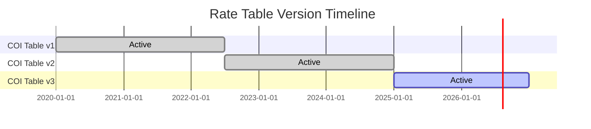

**Lookup Rule:** When processing a policy, look up the rate table version whose `effective_date <= policy_issue_date < end_date`.

### 14.3 Bi-Temporal Modeling

Bi-temporal modeling tracks two independent time dimensions:

1. **Business Time** (`effective_date` / `effective_end_date`) — When the fact was true in the real world.
2. **System Time** (`system_start_timestamp` / `system_end_timestamp`) — When the fact was recorded in the database.

This enables:
- Correcting historical errors while preserving the audit trail of what the system previously believed
- Regulatory audits that reconstruct the system state at any point in time
- Back-dated transactions

**Bi-temporal example for account value:**

| av_id | policy_id | value | effective_date | effective_end | sys_start | sys_end |
|-------|-----------|-------|----------------|---------------|-----------|---------|
| 1 | 100 | 50000.00 | 2024-01-01 | 2024-01-31 | 2024-02-01 08:00 | 2024-03-15 10:00 |
| 2 | 100 | 50000.00 | 2024-01-01 | 2024-01-31 | 2024-03-15 10:00 | 9999-12-31 |
| 3 | 100 | 51250.00 | 2024-02-01 | 2024-02-28 | 2024-03-01 08:00 | 9999-12-31 |

Row 1 was the original record. Row 2 is the corrected version (same business time, different system time). The original row's `sys_end` was updated when the correction was made.

```sql
CREATE TABLE life_pas.account_value_bitemporal (
    av_id               BIGSERIAL      PRIMARY KEY,
    policy_id           BIGINT         NOT NULL,
    account_type_code   VARCHAR(10)    NOT NULL,
    sub_account_id      BIGINT,
    value_amount        DECIMAL(18,6)  NOT NULL,
    effective_date      DATE           NOT NULL,
    effective_end_date  DATE           NOT NULL,
    sys_start_ts        TIMESTAMPTZ    NOT NULL DEFAULT NOW(),
    sys_end_ts          TIMESTAMPTZ    NOT NULL DEFAULT '9999-12-31'::TIMESTAMPTZ,
    EXCLUDE USING gist (
        policy_id WITH =,
        account_type_code WITH =,
        daterange(effective_date, effective_end_date) WITH &&,
        tstzrange(sys_start_ts, sys_end_ts) WITH &&
    )
);
```

### 14.4 Transaction Time vs Valid Time — Decision Matrix

| Scenario | Business Time | System Time | Approach |
|----------|---------------|-------------|----------|
| Normal processing | Current date | Now | Standard insert |
| Back-dated transaction | Past date | Now | Insert with past effective_date |
| Correction of prior error | Original date | Now (new sys_start) | Bi-temporal update: close old system row, insert corrected row |
| Regulatory "what-did-we-know-when" | Any date | Specific past timestamp | Bi-temporal query on system time |
| Projection / illustration | Future date | Now | Insert with future effective_date |

---

## 15. Canonical vs Physical Model

### 15.1 Key Differences

| Aspect | Canonical (Logical) Model | Physical Model |
|--------|--------------------------|----------------|
| Purpose | Business communication, integration contract | Database implementation |
| Normalization | 3NF / 4NF | Selectively denormalized for performance |
| Naming | Business-friendly (policy_status_code) | May use abbreviations (pol_stat_cd) |
| Data Types | Generic (VARCHAR, DECIMAL, DATE) | Platform-specific (TEXT, NUMERIC(18,6), TIMESTAMPTZ) |
| Keys | Natural keys and surrogates | Surrogates with natural key indexes |
| Partitioning | Not specified | Partition by date, status, or LOB |
| Indexing | Not specified | B-tree, GiST, GIN as needed |
| Compression | Not specified | Column compression, TOAST |
| Materialized Views | Not specified | Precomputed aggregates |
| Sharding | Not specified | Shard by policy_id range or hash |

### 15.2 Physical Optimization Patterns

**Partitioning `financial_transaction` by year:**

```sql
CREATE TABLE life_pas.financial_transaction (
    -- columns as above
) PARTITION BY RANGE (transaction_date);

CREATE TABLE life_pas.financial_transaction_2023
    PARTITION OF life_pas.financial_transaction
    FOR VALUES FROM ('2023-01-01') TO ('2024-01-01');

CREATE TABLE life_pas.financial_transaction_2024
    PARTITION OF life_pas.financial_transaction
    FOR VALUES FROM ('2024-01-01') TO ('2025-01-01');

CREATE TABLE life_pas.financial_transaction_2025
    PARTITION OF life_pas.financial_transaction
    FOR VALUES FROM ('2025-01-01') TO ('2026-01-01');
```

**Materialized view for policy summary:**

```sql
CREATE MATERIALIZED VIEW life_pas.mv_policy_summary AS
SELECT
    p.policy_id,
    p.policy_number,
    p.policy_status_code,
    p.product_plan_id,
    pp.product_name,
    pp.product_type_code,
    p.issue_date,
    p.face_amount,
    p.total_account_value,
    p.total_loan_balance,
    i.first_name || ' ' || i.last_name AS insured_name,
    i.birth_date AS insured_dob,
    own_i.first_name || ' ' || own_i.last_name AS owner_name
FROM life_pas.policy p
JOIN life_pas.product_plan pp ON p.product_plan_id = pp.product_plan_id
LEFT JOIN life_pas.policy_party_role ins_r ON p.policy_id = ins_r.policy_id AND ins_r.role_code = 'INSURED' AND ins_r.termination_date IS NULL
LEFT JOIN life_pas.individual i ON ins_r.party_id = i.party_id
LEFT JOIN life_pas.policy_party_role own_r ON p.policy_id = own_r.policy_id AND own_r.role_code = 'OWNER' AND own_r.termination_date IS NULL
LEFT JOIN life_pas.individual own_i ON own_r.party_id = own_i.party_id
WITH DATA;

CREATE UNIQUE INDEX idx_mv_policy_summary_pk ON life_pas.mv_policy_summary(policy_id);
```

### 15.3 API Projection Model

The canonical model also serves as the source for API resource representations. A typical REST API projection flattens the normalized model:

```json
{
  "policyNumber": "UL2024001234",
  "status": "INFORCE",
  "product": {
    "code": "FLEXUL",
    "name": "FlexLife Universal Life",
    "type": "UNIVERSAL_LIFE"
  },
  "issueDate": "2024-03-15",
  "faceAmount": 500000.00,
  "accountValue": 12543.67,
  "surrenderValue": 10234.50,
  "loanBalance": 0.00,
  "owner": {
    "partyId": 5001,
    "name": "John A. Smith",
    "relationship": "SELF"
  },
  "insured": {
    "partyId": 5001,
    "name": "John A. Smith",
    "age": 42,
    "gender": "M",
    "riskClass": "PREFERRED"
  },
  "beneficiaries": [
    {
      "partyId": 5002,
      "name": "Jane M. Smith",
      "role": "PRIMARY",
      "percentage": 100.0,
      "relationship": "SPOUSE"
    }
  ],
  "coverages": [
    {
      "coverageNumber": 1,
      "type": "BASE",
      "amount": 500000.00,
      "status": "ACTIVE"
    },
    {
      "coverageNumber": 2,
      "type": "RIDER_WP",
      "amount": 500000.00,
      "status": "ACTIVE"
    }
  ]
}
```

---

## 16. ACORD Alignment

### 16.1 ACORD Life Data Model Overview

The **ACORD (Association for Cooperative Operations Research and Development)** Life data standard defines an XML-based information model. Key mappings:

| Canonical Entity | ACORD Element | Notes |
|------------------|---------------|-------|
| POLICY | `OLifE.Holding` + `OLifE.Holding.Policy` | Holding is the container; Policy is the life-specific detail |
| COVERAGE | `OLifE.Holding.Policy.Life.Coverage` | Nested within Life |
| PARTY (Individual) | `OLifE.Party` + `OLifE.Party.Person` | Party is supertype; Person is subtype |
| PARTY (Organization) | `OLifE.Party` + `OLifE.Party.Organization` | |
| POLICY_PARTY_ROLE | `OLifE.Relation` | Connects Party to Holding |
| FINANCIAL_TRANSACTION | `OLifE.Holding.Policy.FinancialActivity` | |
| CLAIM | `OLifE.Claim` | |
| AGENT | `OLifE.Party` + `OLifE.Producer` | Producer contains agent-specific data |
| PRODUCT_PLAN | `OLifE.ProductInfo` | Not as detailed as needed for PAS |

### 16.2 ACORD TypeCode Mapping Example

```xml
<!-- ACORD Policy Status TypeCodes -->
<PolicyStatus tc="1">Active</PolicyStatus>        <!-- Maps to INFORCE -->
<PolicyStatus tc="2">Inactive</PolicyStatus>      <!-- Maps to LAPSED, SURRENDERED, etc. -->
<PolicyStatus tc="3">Pending</PolicyStatus>        <!-- Maps to APPLIED, UNDERWRITING -->
<PolicyStatus tc="6">Death Claim Pending</PolicyStatus> <!-- Maps to DEATHCLAIM -->
```

The canonical model intentionally uses **more granular status codes** than ACORD TypeCodes, with a mapping table that translates between the two:

| Canonical Status | ACORD tc | ACORD Description |
|------------------|----------|-------------------|
| APPLIED | 3 | Pending |
| UNDERWRITING | 3 | Pending |
| APPROVED | 3 | Pending |
| ISSUED | 1 | Active |
| INFORCE | 1 | Active |
| LAPSED | 2 | Inactive |
| SURRENDERED | 2 | Inactive |
| MATURED | 2 | Inactive |
| DEATHCLAIM | 6 | Death Claim Pending |
| TERMINATED | 2 | Inactive |

---

## 17. Implementation Guidance

### 17.1 Phased Implementation Roadmap

```mermaid
gantt
    title CDM Implementation Phases
    dateFormat  YYYY-Q
    section Phase 1: Core
    Party Model           :done, 2025-Q1, 2025-Q2
    Product Model         :done, 2025-Q1, 2025-Q2
    Policy Model          :done, 2025-Q2, 2025-Q3
    Coverage Model        :done, 2025-Q2, 2025-Q3
    section Phase 2: Financial
    Transaction Ledger    :active, 2025-Q3, 2025-Q4
    Account Value         :active, 2025-Q3, 2025-Q4
    Fund/Segment          :2025-Q4, 2026-Q1
    section Phase 3: Operational
    Billing Model         :2026-Q1, 2026-Q2
    Claim Model           :2026-Q1, 2026-Q2
    Correspondence        :2026-Q2, 2026-Q3
    section Phase 4: Distribution
    Agent Model           :2026-Q2, 2026-Q3
    Commission Model      :2026-Q3, 2026-Q4
    section Phase 5: Advanced
    Reinsurance Model     :2026-Q3, 2026-Q4
    Bi-temporal Support   :2026-Q4, 2027-Q1
```

### 17.2 Data Governance Checklist

| # | Governance Area | Action |
|---|-----------------|--------|
| 1 | Data Ownership | Assign a business data owner to each domain (Party, Policy, Product, Financial, Claim, Agent) |
| 2 | Data Stewardship | Designate data stewards responsible for data quality within each domain |
| 3 | Naming Standards | Enforce naming conventions (snake_case for columns, PascalCase for entities, _code suffix for coded values, _ind for boolean indicators, _date/_timestamp for temporal) |
| 4 | Code Table Governance | All new coded values must be reviewed and approved before addition to code tables |
| 5 | Versioning | Every schema change tracked via migration scripts (Flyway/Liquibase) |
| 6 | Sensitive Data | PII fields (SSN, bank accounts) must be tokenized or encrypted at rest |
| 7 | Referential Integrity | Foreign keys enforced in OLTP; advisory in analytics layers |
| 8 | Data Lineage | Document transformations from source to canonical to target |
| 9 | Quality Rules | Automated data quality checks (completeness, consistency, referential integrity) run daily |
| 10 | Change Management | All model changes go through a Change Advisory Board (CAB) review |

### 17.3 Performance Considerations

| Pattern | When to Apply | Example |
|---------|---------------|---------|
| Table partitioning | Transaction tables with >100M rows | Partition `financial_transaction` by year |
| Read replicas | High query load on operational DB | Route reporting queries to replica |
| Materialized views | Frequently-joined policy summaries | `mv_policy_summary` refreshed every 15 min |
| Connection pooling | High-concurrency environments | PgBouncer with 200 max connections |
| Batch inserts | High-volume processing (billing, valuation) | Bulk `COPY` for month-end transactions |
| Archival | Old terminated policies rarely accessed | Move to cold storage after 10 years |
| Caching | Frequently-accessed reference data | Redis cache for product/rate tables with 1-hour TTL |

### 17.4 Migration from Legacy

When migrating from a legacy PAS (e.g., VANTAGE, CyberLife, CLAS):

1. **Map legacy fields** to canonical attributes using the data dictionary.
2. **Handle code translation** via the `CODE_TABLE_ENTRY.acord_type_code` crosswalk.
3. **Reconstruct history** from legacy transaction logs into `FINANCIAL_TRANSACTION` and `POLICY_STATUS_HISTORY`.
4. **Validate party deduplication** — legacy systems often have duplicate party records per policy.
5. **Reconcile financial totals** — ensure cash values, loan balances, and premium totals match between legacy and canonical.

### 17.5 Common Anti-Patterns to Avoid

| Anti-Pattern | Problem | Canonical Solution |
|--------------|---------|-------------------|
| Embedding party details directly on the policy record | Duplication, inability to track a party across policies | Use the Party model with role-based associations |
| Separate table structures for owners vs. beneficiaries vs. agents | Redundant schemas, inconsistent contact management | Unified Party model with POLICY_PARTY_ROLE |
| Product-specific policy tables (one table per product type) | Schema changes for every new product, N-way UNIONs for reporting | Single policy + coverage structure with product configuration |
| Hard-coded rate lookups in application code | Rate changes require code deployments | Rate table / factor table entities with effective dating |
| Single address field on the policy | Cannot track historical addresses, multiple address types | PARTY_ADDRESS with types, effective dating |
| Using policy status alone (no history) | Cannot audit status transitions, cannot determine when a lapse occurred | POLICY_STATUS_HISTORY with full audit trail |
| Storing monetary amounts as floating-point | Rounding errors in financial calculations | DECIMAL / NUMERIC with explicit precision |

---

## Appendix A: Entity Count Summary

| Domain | Entity Count |
|--------|-------------|
| Policy | 9 |
| Party | 14 |
| Coverage | 4 |
| Product | 15 |
| Financial | 13 |
| Billing | 5 |
| Claim | 7 |
| Correspondence | 5 |
| Agent | 9 |
| Reinsurance | 3 |
| Reference | 6 |
| Audit/Workflow/Notes | 4 |
| **Total** | **94** |

## Appendix B: Glossary

| Term | Definition |
|------|-----------|
| **CDM** | Canonical Data Model — the single authoritative data representation |
| **ACORD** | Association for Cooperative Operations Research and Development |
| **SCD-2** | Slowly Changing Dimension Type 2 — preserves full history via row versioning |
| **Bi-Temporal** | Tracking both business time and system time independently |
| **COI** | Cost of Insurance — monthly mortality charge in universal life products |
| **MEC** | Modified Endowment Contract — a life insurance policy that has lost certain tax advantages |
| **NAR** | Net Amount at Risk — death benefit minus account value |
| **NF** | Non-Forfeiture — statutory guaranteed minimum values |
| **ETI** | Extended Term Insurance — non-forfeiture option |
| **RPU** | Reduced Paid-Up Insurance — non-forfeiture option |
| **CSV** | Cash Surrender Value |
| **GPT** | Guideline Premium Test — IRC §7702 compliance test |
| **CVAT** | Cash Value Accumulation Test — IRC §7702 compliance test |
| **PTP** | Point-to-Point — indexed crediting method |
| **NAV** | Net Asset Value — unit value for variable product sub-accounts |

---

*This article is part of the Life Insurance PAS Architect's Encyclopedia. For related topics, see Article 43 (Data Warehousing & Analytics), Article 44 (Data Migration & Conversion), and Article 46 (Product Configuration & Rules-Driven Design).*
