# Article 43: Data Warehousing & Analytics for Life Insurance PAS

## Table of Contents

1. [Introduction](#1-introduction)
2. [Insurance Data Warehouse Architecture](#2-insurance-data-warehouse-architecture)
3. [Dimensional Modeling for Insurance](#3-dimensional-modeling-for-insurance)
4. [ETL/ELT Processing](#4-etlelt-processing)
5. [Actuarial Data Mart](#5-actuarial-data-mart)
6. [Financial Reporting Data Mart](#6-financial-reporting-data-mart)
7. [Marketing & Customer Analytics](#7-marketing--customer-analytics)
8. [Compliance & Regulatory Data Mart](#8-compliance--regulatory-data-mart)
9. [Operational Analytics](#9-operational-analytics)
10. [Real-Time Analytics](#10-real-time-analytics)
11. [Data Governance for Analytics](#11-data-governance-for-analytics)
12. [Technology Stack](#12-technology-stack)
13. [Sample Star Schema Diagrams](#13-sample-star-schema-diagrams)
14. [Sample dbt Models](#14-sample-dbt-models)
15. [Modern Data Platform Architecture](#15-modern-data-platform-architecture)
16. [Implementation Guidance](#16-implementation-guidance)

---

## 1. Introduction

A life insurance enterprise generates vast quantities of structured, semi-structured, and unstructured data across policy administration, underwriting, claims, billing, investments, reinsurance, distribution, and compliance domains. Transforming this raw data into actionable intelligence requires a deliberate, layered analytics architecture.

### 1.1 Business Drivers for Insurance Analytics

| Business Driver | Analytics Need | Impact |
|----------------|----------------|--------|
| Actuarial pricing accuracy | Experience study data, actual-to-expected analysis | ±50 bps on mortality assumptions can move reserves by $100M+ |
| Regulatory compliance | Statutory reporting, PBR, LDTI/IFRS 17 | Non-compliance = fines, market conduct actions |
| Profitability management | Product/channel/vintage profitability | Identify unprofitable blocks for repricing or closure |
| Customer retention | Lapse prediction, policyholder behavior | 1% lapse improvement = millions in retained premium |
| Distribution effectiveness | Agent productivity, commission ROI | Optimize compensation to incentivize profitable sales |
| Operational efficiency | STP rates, processing times, exception rates | Reduce unit costs by 20-40% through automation targeting |
| Risk management | Concentration risk, pandemic scenarios, ALM | Capital adequacy and solvency monitoring |
| Investment performance | Separate account performance, crediting rate optimization | Competitive positioning on credited rates |

### 1.2 Analytics Maturity Model

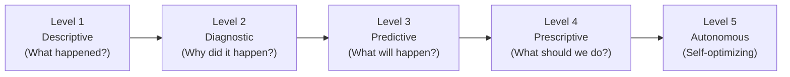

| Level | Insurance Examples |
|-------|--------------------|
| Descriptive | Monthly premium reports, claim counts, policy inventory |
| Diagnostic | Lapse variance analysis, claim spike root cause |
| Predictive | Lapse propensity models, mortality trend forecasting |
| Prescriptive | Optimal crediting rate recommendation, targeted retention offers |
| Autonomous | Real-time pricing adjustments, automated underwriting decisions |

---

## 2. Insurance Data Warehouse Architecture

### 2.1 Layered Architecture Overview

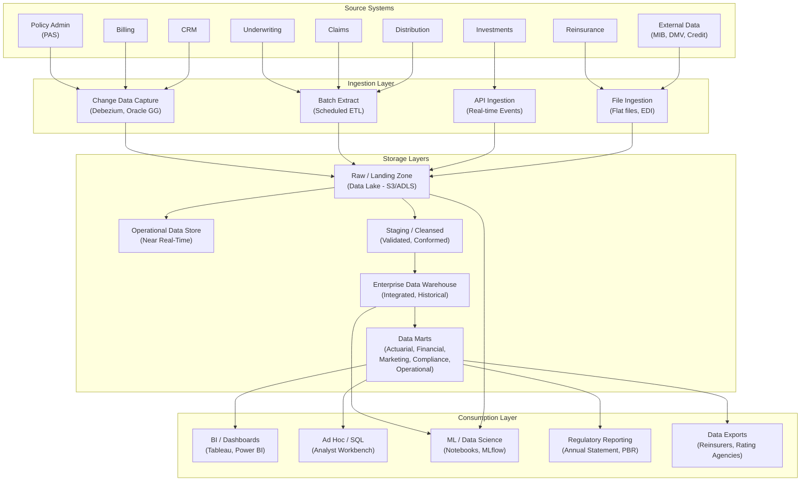

### 2.2 Operational Data Store (ODS)

The ODS provides a **near-real-time**, lightly transformed view of the operational PAS data. It serves as the integration point for operational reporting and feeds downstream to the EDW.

| Characteristic | ODS | EDW |
|---------------|-----|-----|
| Latency | Minutes to hours | Daily or less frequent |
| History Depth | Current + recent (30-90 days) | Full history (7-20 years) |
| Modeling Style | Subject-oriented, 3NF | Dimensional (star/snowflake) |
| Primary Users | Operations, call center, real-time dashboards | Actuaries, finance, executives, regulators |
| Grain | Transaction-level, current state | Summarized and historical snapshots |
| Volume | Moderate (current state) | Very large (full history + aggregations) |

### 2.3 Data Lake / Raw Zone

The data lake stores raw, unprocessed data in its native format:

| Data Type | Format | Example |
|-----------|--------|---------|
| PAS transactional data | Parquet, Delta | Daily CDC extracts, transaction logs |
| Underwriting documents | PDF, TIFF | Applications, medical records |
| Call recordings | WAV, MP3 | Customer service calls |
| Correspondence | PDF, HTML | Generated letters, emails |
| External data feeds | CSV, XML, JSON | MIB reports, credit data, DMV |
| Market data | CSV, API JSON | Fund NAVs, index values, interest rates |
| Agent/producer data | CSV, XML | NIPR licensing feeds, commission runs |
| Regulatory filings | XBRL, XML | Statutory annual statement data |

### 2.4 Enterprise Data Warehouse (EDW)

The EDW is the **single source of truth** for historical, integrated, non-volatile insurance data. It is modeled dimensionally (star schema) for query performance and business user accessibility.

**Key Design Decisions:**

| Decision | Recommendation | Rationale |
|----------|---------------|-----------|
| Modeling Approach | Kimball dimensional modeling | Business-user friendly, query performant |
| Conformed Dimensions | Yes — shared across all fact tables | Consistent drill-across analysis |
| History Strategy | SCD Type 2 for critical dimensions | Full audit trail for regulatory compliance |
| Grain | Lowest meaningful grain per fact | Maximum flexibility for aggregation |
| Partitioning | By date (month or year) | Efficient time-based queries |
| Incremental Load | Preferred over full refresh | Minimize processing window |

---

## 3. Dimensional Modeling for Insurance

### 3.1 Bus Matrix

The bus matrix maps business processes (fact tables) to shared dimensions:

| Fact Table / Dimension | Date | Policy | Product | Party | Agent | Geography | Coverage | Fund | Claim | Reinsurance Treaty |
|------------------------|------|--------|---------|-------|-------|-----------|----------|------|-------|-------------------|
| **Policy Snapshot Fact** | X | X | X | X | X | X | | | | |
| **Premium Fact** | X | X | X | X | X | X | X | X | | |
| **Transaction Fact** | X | X | X | X | | | X | X | | |
| **Claim Fact** | X | X | X | X | | X | X | | X | |
| **Commission Fact** | X | X | X | | X | X | | | | |
| **Valuation Fact** | X | X | X | | | | X | X | | |
| **Reinsurance Fact** | X | X | X | | | | X | | | X |
| **Lapse Fact** | X | X | X | X | X | X | X | | | |
| **Mortality Fact** | X | X | X | X | | X | X | | X | |

### 3.2 Dimension Tables

#### 3.2.1 Date Dimension

```sql
CREATE TABLE dim_date (
    date_key             INT          PRIMARY KEY,   -- YYYYMMDD
    full_date            DATE         NOT NULL UNIQUE,
    day_of_week          INT          NOT NULL,       -- 1=Monday
    day_name             VARCHAR(10)  NOT NULL,
    day_of_month         INT          NOT NULL,
    day_of_year          INT          NOT NULL,
    week_of_year         INT          NOT NULL,
    month_number         INT          NOT NULL,
    month_name           VARCHAR(10)  NOT NULL,
    month_abbrev         VARCHAR(3)   NOT NULL,
    quarter_number       INT          NOT NULL,
    quarter_name         VARCHAR(6)   NOT NULL,       -- Q1-2025
    year_number          INT          NOT NULL,
    fiscal_year          INT          NOT NULL,
    fiscal_quarter       INT          NOT NULL,
    fiscal_month         INT          NOT NULL,
    is_weekend           BOOLEAN      NOT NULL,
    is_holiday           BOOLEAN      NOT NULL DEFAULT FALSE,
    holiday_name         VARCHAR(50),
    is_business_day      BOOLEAN      NOT NULL,
    is_month_end         BOOLEAN      NOT NULL,
    is_quarter_end       BOOLEAN      NOT NULL,
    is_year_end          BOOLEAN      NOT NULL,
    is_leap_year         BOOLEAN      NOT NULL,
    days_in_month        INT          NOT NULL
);
```

#### 3.2.2 Policy Dimension (SCD Type 2)

```sql
CREATE TABLE dim_policy (
    policy_dim_key            BIGINT       PRIMARY KEY,   -- Surrogate key
    policy_id                 BIGINT       NOT NULL,       -- Natural key (from PAS)
    policy_number             VARCHAR(20)  NOT NULL,
    company_code              VARCHAR(10),
    policy_status_code        VARCHAR(10),
    policy_status_desc        VARCHAR(50),
    application_date          DATE,
    issue_date                DATE,
    policy_date               DATE,
    maturity_date             DATE,
    termination_date          DATE,
    issue_state_code          VARCHAR(2),
    issue_state_name          VARCHAR(50),
    tax_qualification_code    VARCHAR(10),
    tax_qualification_desc    VARCHAR(50),
    mec_status_code           VARCHAR(10),
    death_benefit_option      VARCHAR(5),
    premium_mode_code         VARCHAR(5),
    premium_mode_desc         VARCHAR(20),
    replacement_ind           BOOLEAN,
    section_1035_ind          BOOLEAN,
    group_policy_ind          BOOLEAN,
    face_amount_band          VARCHAR(20),       -- Banded (0-50K, 50K-100K, ...)
    issue_age_band            VARCHAR(10),       -- Banded (0-25, 26-35, ...)
    policy_duration_years     INT,
    -- SCD Type 2 tracking
    effective_start_date      DATE         NOT NULL,
    effective_end_date        DATE,
    is_current                BOOLEAN      NOT NULL DEFAULT TRUE,
    -- ETL metadata
    source_system             VARCHAR(10),
    etl_load_timestamp        TIMESTAMP
);

CREATE INDEX idx_dim_policy_natural ON dim_policy(policy_id, is_current);
CREATE INDEX idx_dim_policy_number ON dim_policy(policy_number, is_current);
```

#### 3.2.3 Product Dimension

```sql
CREATE TABLE dim_product (
    product_dim_key          BIGINT       PRIMARY KEY,
    product_plan_id          BIGINT       NOT NULL,
    product_code             VARCHAR(20),
    plan_code                VARCHAR(20),
    product_name             VARCHAR(100),
    product_type_code        VARCHAR(20),
    product_type_desc        VARCHAR(50),
    product_series_code      VARCHAR(20),
    product_series_name      VARCHAR(100),
    lob_code                 VARCHAR(10),
    lob_name                 VARCHAR(50),
    premium_type_code        VARCHAR(10),
    premium_type_desc        VARCHAR(30),
    cash_value_ind           BOOLEAN,
    participating_ind        BOOLEAN,
    product_generation       VARCHAR(20),       -- Legacy, Current, Next-Gen
    product_launch_year      INT,
    naic_product_code        VARCHAR(10),
    -- SCD Type 2
    effective_start_date     DATE         NOT NULL,
    effective_end_date       DATE,
    is_current               BOOLEAN      NOT NULL DEFAULT TRUE
);
```

#### 3.2.4 Party/Customer Dimension

```sql
CREATE TABLE dim_customer (
    customer_dim_key         BIGINT       PRIMARY KEY,
    party_id                 BIGINT       NOT NULL,
    party_type_code          VARCHAR(10),
    full_name                VARCHAR(200),
    first_name               VARCHAR(50),
    last_name                VARCHAR(50),
    gender_code              VARCHAR(1),
    birth_date               DATE,
    current_age              INT,
    age_band                 VARCHAR(10),       -- Banded
    marital_status_code      VARCHAR(10),
    state_code               VARCHAR(2),
    state_name               VARCHAR(50),
    zip_code                 VARCHAR(10),
    zip3                     VARCHAR(3),
    metro_area               VARCHAR(50),
    country_code             VARCHAR(3),
    citizenship_code         VARCHAR(3),
    tobacco_use_code         VARCHAR(5),
    occupation_code          VARCHAR(10),
    occupation_desc          VARCHAR(50),
    income_band              VARCHAR(20),
    net_worth_band           VARCHAR(20),
    customer_since_date      DATE,
    customer_tenure_years    INT,
    total_policies_owned     INT,
    total_face_amount        DECIMAL(15,2),
    total_account_value      DECIMAL(15,2),
    customer_segment         VARCHAR(20),       -- High Net Worth, Mass Affluent, etc.
    -- SCD Type 2
    effective_start_date     DATE         NOT NULL,
    effective_end_date       DATE,
    is_current               BOOLEAN      NOT NULL DEFAULT TRUE
);
```

#### 3.2.5 Agent/Producer Dimension

```sql
CREATE TABLE dim_agent (
    agent_dim_key            BIGINT       PRIMARY KEY,
    agent_id                 BIGINT       NOT NULL,
    agent_number             VARCHAR(20),
    agent_name               VARCHAR(200),
    agent_type_code          VARCHAR(10),
    agent_type_desc          VARCHAR(30),
    agent_status_code        VARCHAR(10),
    national_producer_number VARCHAR(10),
    hierarchy_level_code     VARCHAR(10),
    hierarchy_level_desc     VARCHAR(30),
    upline_agent_number      VARCHAR(20),
    upline_agent_name        VARCHAR(200),
    region_code              VARCHAR(10),
    region_name              VARCHAR(50),
    district_code            VARCHAR(10),
    district_name            VARCHAR(50),
    territory_code           VARCHAR(10),
    contract_date            DATE,
    tenure_years             INT,
    production_tier          VARCHAR(20),       -- Platinum, Gold, Silver, Bronze
    -- SCD Type 2
    effective_start_date     DATE         NOT NULL,
    effective_end_date       DATE,
    is_current               BOOLEAN      NOT NULL DEFAULT TRUE
);
```

#### 3.2.6 Geography Dimension

```sql
CREATE TABLE dim_geography (
    geography_dim_key   BIGINT       PRIMARY KEY,
    state_code          VARCHAR(2)   NOT NULL,
    state_name          VARCHAR(50)  NOT NULL,
    state_abbrev        VARCHAR(2)   NOT NULL,
    region_code         VARCHAR(10),
    region_name         VARCHAR(30),       -- Northeast, Southeast, Midwest, West
    division_name       VARCHAR(30),       -- Census divisions
    country_code        VARCHAR(3)   DEFAULT 'USA',
    country_name        VARCHAR(50)  DEFAULT 'United States',
    naic_zone           VARCHAR(10),       -- NAIC zone grouping
    time_zone           VARCHAR(30),
    regulatory_env      VARCHAR(20)        -- Strict, Moderate, Permissive
);
```

#### 3.2.7 Coverage Dimension

```sql
CREATE TABLE dim_coverage (
    coverage_dim_key         BIGINT       PRIMARY KEY,
    coverage_id              BIGINT       NOT NULL,
    coverage_type_code       VARCHAR(20),
    coverage_type_desc       VARCHAR(50),
    is_base_coverage         BOOLEAN,
    is_rider                 BOOLEAN,
    rider_category           VARCHAR(30),       -- Death Benefit, Living Benefit, Waiver, Guarantee
    risk_class_code          VARCHAR(10),
    risk_class_desc          VARCHAR(30),
    tobacco_class_code       VARCHAR(5),
    underwriting_method      VARCHAR(20),       -- Full UW, Simplified, Guaranteed Issue, Accelerated
    coverage_amount_band     VARCHAR(20),
    -- SCD Type 2
    effective_start_date     DATE         NOT NULL,
    effective_end_date       DATE,
    is_current               BOOLEAN      NOT NULL DEFAULT TRUE
);
```

### 3.3 Fact Tables

#### 3.3.1 Policy Snapshot Fact (Periodic Snapshot)

Captures the state of every in-force policy at the end of each month.

**Grain:** One row per policy per month.

```sql
CREATE TABLE fact_policy_snapshot (
    snapshot_date_key         INT          NOT NULL,  -- FK to dim_date (month-end)
    policy_dim_key            BIGINT       NOT NULL,  -- FK to dim_policy
    product_dim_key           BIGINT       NOT NULL,  -- FK to dim_product
    owner_dim_key             BIGINT,                 -- FK to dim_customer
    insured_dim_key           BIGINT,                 -- FK to dim_customer
    agent_dim_key             BIGINT,                 -- FK to dim_agent
    geography_dim_key         BIGINT,                 -- FK to dim_geography
    -- Measures
    face_amount               DECIMAL(15,2),
    account_value             DECIMAL(15,4),
    cash_surrender_value      DECIMAL(15,4),
    loan_balance              DECIMAL(15,4),
    net_amount_at_risk        DECIMAL(15,4),
    annualized_premium        DECIMAL(15,2),
    modal_premium             DECIMAL(15,2),
    ytd_premium_received      DECIMAL(15,2),
    ytd_coi_charges           DECIMAL(15,4),
    ytd_expense_charges       DECIMAL(15,4),
    ytd_interest_credited     DECIMAL(15,4),
    ytd_withdrawals           DECIMAL(15,4),
    cost_basis                DECIMAL(15,4),
    policy_duration_months    INT,
    policy_count              INT          DEFAULT 1, -- Always 1 (for aggregation)
    -- Metadata
    etl_load_timestamp        TIMESTAMP
);

CREATE INDEX idx_fps_date ON fact_policy_snapshot(snapshot_date_key);
CREATE INDEX idx_fps_policy ON fact_policy_snapshot(policy_dim_key);
```

#### 3.3.2 Premium Fact (Transaction Grain)

**Grain:** One row per premium transaction.

```sql
CREATE TABLE fact_premium (
    transaction_date_key      INT          NOT NULL,  -- FK to dim_date
    applied_date_key          INT,                    -- FK to dim_date
    policy_dim_key            BIGINT       NOT NULL,
    product_dim_key           BIGINT       NOT NULL,
    owner_dim_key             BIGINT,
    agent_dim_key             BIGINT,
    geography_dim_key         BIGINT,
    coverage_dim_key          BIGINT,
    fund_dim_key              BIGINT,                 -- FK to dim_fund
    -- Measures
    gross_premium_amount      DECIMAL(15,4),
    net_premium_amount        DECIMAL(15,4),          -- After loads
    premium_load_amount       DECIMAL(15,4),
    premium_tax_amount        DECIMAL(15,4),
    suspense_amount           DECIMAL(15,4),
    -- Attributes
    premium_type_code         VARCHAR(20),             -- INITIAL, RENEWAL, ADDITIONAL, 1035, ROLLOVER
    payment_method_code       VARCHAR(10),
    billing_mode_code         VARCHAR(10),
    -- Counts
    transaction_count         INT          DEFAULT 1,
    -- Metadata
    source_transaction_id     BIGINT,
    etl_load_timestamp        TIMESTAMP
);
```

#### 3.3.3 Claim Fact (Transaction Grain)

**Grain:** One row per claim event (may have multiple payments).

```sql
CREATE TABLE fact_claim (
    loss_date_key             INT          NOT NULL,  -- FK to dim_date
    reported_date_key         INT,
    decision_date_key         INT,
    payment_date_key          INT,
    policy_dim_key            BIGINT       NOT NULL,
    product_dim_key           BIGINT       NOT NULL,
    claimant_dim_key          BIGINT,
    insured_dim_key           BIGINT,
    geography_dim_key         BIGINT,
    coverage_dim_key          BIGINT,
    -- Measures
    benefit_amount            DECIMAL(15,2),
    settlement_amount         DECIMAL(15,2),
    interest_on_claim         DECIMAL(15,4),
    total_paid_amount         DECIMAL(15,2),
    tax_withholding           DECIMAL(15,2),
    claim_reserve_amount      DECIMAL(15,2),
    -- Attributes
    claim_type_code           VARCHAR(15),
    claim_status_code         VARCHAR(10),
    cause_of_loss_code        VARCHAR(20),
    manner_of_death_code      VARCHAR(10),
    decision_type_code        VARCHAR(10),
    settlement_option_code    VARCHAR(10),
    contestability_ind        BOOLEAN,
    siu_referral_ind          BOOLEAN,
    -- Duration measures
    days_to_report            INT,                     -- loss_date to reported_date
    days_to_decide            INT,                     -- reported_date to decision_date
    days_to_pay               INT,                     -- decision_date to payment_date
    total_cycle_days          INT,                     -- loss_date to payment_date
    -- Counts
    claim_count               INT          DEFAULT 1,
    -- Metadata
    source_claim_id           BIGINT,
    etl_load_timestamp        TIMESTAMP
);
```

#### 3.3.4 Commission Fact

**Grain:** One row per commission payment per agent per policy.

```sql
CREATE TABLE fact_commission (
    earned_date_key           INT          NOT NULL,
    payable_date_key          INT,
    policy_dim_key            BIGINT       NOT NULL,
    product_dim_key           BIGINT       NOT NULL,
    agent_dim_key             BIGINT       NOT NULL,
    geography_dim_key         BIGINT,
    -- Measures
    commission_amount         DECIMAL(15,4),
    basis_premium_amount      DECIMAL(15,4),
    commission_rate           DECIMAL(7,5),
    chargeback_amount         DECIMAL(15,4),
    net_commission_amount     DECIMAL(15,4),
    override_amount           DECIMAL(15,4),
    bonus_amount              DECIMAL(15,4),
    -- Attributes
    commission_type_code      VARCHAR(10),  -- FYC, RENEWAL, TRAIL, BONUS, OVERRIDE
    policy_year               INT,
    chargeback_ind            BOOLEAN,
    -- Counts
    commission_count          INT          DEFAULT 1,
    -- Metadata
    source_commission_id      BIGINT,
    etl_load_timestamp        TIMESTAMP
);
```

#### 3.3.5 Valuation Fact (Periodic Snapshot)

**Grain:** One row per policy per valuation date (monthly or quarterly).

```sql
CREATE TABLE fact_valuation (
    valuation_date_key        INT          NOT NULL,
    policy_dim_key            BIGINT       NOT NULL,
    product_dim_key           BIGINT       NOT NULL,
    -- Reserve measures
    statutory_reserve         DECIMAL(18,4),
    gaap_reserve              DECIMAL(18,4),
    tax_reserve               DECIMAL(18,4),
    deficiency_reserve        DECIMAL(18,4),
    -- Account value components
    general_account_value     DECIMAL(18,4),
    separate_account_value    DECIMAL(18,4),
    fixed_account_value       DECIMAL(18,4),
    indexed_account_value     DECIMAL(18,4),
    loan_balance              DECIMAL(18,4),
    -- Risk measures
    net_amount_at_risk        DECIMAL(18,4),
    guaranteed_minimum_value  DECIMAL(18,4),
    -- Assumptions
    valuation_interest_rate   DECIMAL(7,5),
    mortality_table_code      VARCHAR(20),
    -- Counts
    policy_count              INT          DEFAULT 1,
    -- Metadata
    valuation_basis_code      VARCHAR(10),  -- STAT, GAAP, TAX
    etl_load_timestamp        TIMESTAMP
);
```

#### 3.3.6 Transaction Fact (Transaction Grain)

**Grain:** One row per financial transaction.

```sql
CREATE TABLE fact_transaction (
    transaction_date_key      INT          NOT NULL,
    processing_date_key       INT,
    policy_dim_key            BIGINT       NOT NULL,
    product_dim_key           BIGINT       NOT NULL,
    coverage_dim_key          BIGINT,
    fund_dim_key              BIGINT,
    -- Measures
    transaction_amount        DECIMAL(15,4),
    units                     DECIMAL(18,8),
    unit_value                DECIMAL(12,6),
    tax_withholding_amount    DECIMAL(15,4),
    taxable_amount            DECIMAL(15,4),
    -- Attributes
    transaction_type_code     VARCHAR(20),
    transaction_category      VARCHAR(20),  -- PREMIUM, CHARGE, CREDIT, WITHDRAWAL, LOAN, TRANSFER, CLAIM
    transaction_subtype       VARCHAR(20),
    reversal_ind              BOOLEAN,
    -- Counts
    transaction_count         INT          DEFAULT 1,
    -- Metadata
    source_transaction_id     BIGINT,
    etl_load_timestamp        TIMESTAMP
);
```

---

## 4. ETL/ELT Processing

### 4.1 Source Extraction Strategies

#### 4.1.1 Change Data Capture (CDC)

CDC captures row-level changes from the PAS database in near-real-time.

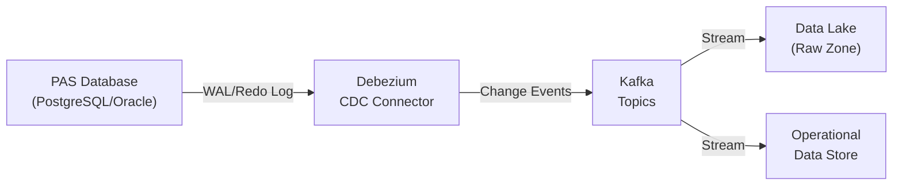

**CDC Configuration Example (Debezium for PostgreSQL):**

```json
{
  "name": "pas-cdc-connector",
  "config": {
    "connector.class": "io.debezium.connector.postgresql.PostgresConnector",
    "database.hostname": "pas-primary.internal",
    "database.port": "5432",
    "database.user": "cdc_reader",
    "database.password": "${vault:pas-cdc-password}",
    "database.dbname": "life_pas",
    "database.server.name": "pas",
    "schema.include.list": "life_pas",
    "table.include.list": "life_pas.policy,life_pas.coverage,life_pas.financial_transaction,life_pas.party,life_pas.individual,life_pas.policy_party_role,life_pas.payment,life_pas.claim,life_pas.agent,life_pas.commission_transaction",
    "plugin.name": "pgoutput",
    "slot.name": "debezium_edw",
    "publication.name": "dbz_publication",
    "transforms": "route",
    "transforms.route.type": "org.apache.kafka.connect.transforms.RegexRouter",
    "transforms.route.regex": "pas.life_pas.(.*)",
    "transforms.route.replacement": "pas.cdc.$1",
    "key.converter": "org.apache.kafka.connect.json.JsonConverter",
    "value.converter": "org.apache.kafka.connect.json.JsonConverter",
    "tombstones.on.delete": "false",
    "snapshot.mode": "initial"
  }
}
```

#### 4.1.2 Batch Extraction

For systems that don't support CDC or for full reconciliation loads:

| Extraction Pattern | Description | Use Case |
|-------------------|-------------|----------|
| Full extract | Extract entire table | Small reference tables, initial load |
| Incremental (timestamp) | Extract rows WHERE updated_timestamp > last_extract | Large transaction tables |
| Incremental (sequence) | Extract rows WHERE sequence_id > last_sequence | Append-only audit tables |
| Watermark | Use a high-water mark (max processed ID/date) | Reliable incremental |
| Delta detect | Compare current extract to previous extract | Legacy systems without timestamps |

### 4.2 Transformation Logic

#### 4.2.1 Common Transformation Patterns

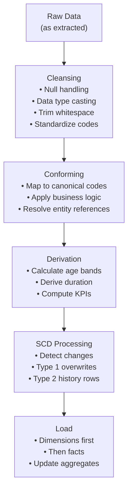

#### 4.2.2 Key Derivation Rules

| Derived Field | Source Fields | Logic |
|---------------|-------------- |-------|
| `issue_age` | `insured.birth_date`, `policy.issue_date` | `DATEDIFF(year, birth_date, issue_date)` with ANB/ALB adjustment |
| `policy_duration_months` | `policy.issue_date`, snapshot date | `DATEDIFF(month, issue_date, snapshot_date)` |
| `face_amount_band` | `policy.face_amount` | CASE: 0-25K, 25K-50K, 50K-100K, 100K-250K, 250K-500K, 500K-1M, 1M+ |
| `age_band` | `individual.birth_date`, current date | CASE: 0-17, 18-25, 26-35, 36-45, 46-55, 56-65, 66-75, 76-85, 86+ |
| `net_amount_at_risk` | `coverage_amount`, `account_value` | `MAX(coverage_amount - account_value, 0)` |
| `annualized_premium` | `modal_premium`, `premium_mode` | `modal_premium × mode_factor` (Annual=1, Semi=2, Qtr=4, Monthly=12) |
| `customer_tenure_years` | `min(policy.issue_date)` across all policies | `DATEDIFF(year, first_issue_date, current_date)` |
| `lapse_rate` | Lapse count / exposure count | By product, duration, risk class |

### 4.3 Data Quality Framework

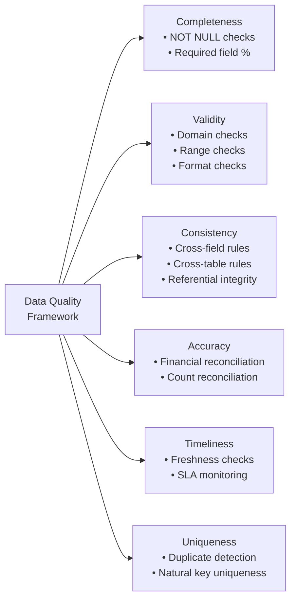

**Sample Data Quality Rules:**

| Rule ID | Domain | Rule | Severity | Action |
|---------|--------|------|----------|--------|
| DQ-001 | Policy | `policy_number` is NOT NULL and unique | Critical | Reject record |
| DQ-002 | Policy | `issue_date <= CURRENT_DATE` | Critical | Reject record |
| DQ-003 | Policy | `face_amount > 0` for status = INFORCE | High | Quarantine |
| DQ-004 | Party | `birth_date` is NOT NULL for role = INSURED | Critical | Reject |
| DQ-005 | Financial | `SUM(transactions) = account_value` (± tolerance) | Critical | Alert actuarial team |
| DQ-006 | Billing | `paid_to_date >= issue_date` | Medium | Warning |
| DQ-007 | Agent | Agent has active license in policy issue state | High | Alert compliance |
| DQ-008 | Claim | `date_of_loss <= date_reported` | High | Quarantine |
| DQ-009 | Cross-domain | Premium count in EDW = premium count in PAS (± 0.01%) | Critical | Reconciliation alert |
| DQ-010 | Timeliness | EDW data freshness < 24 hours | High | Operations alert |

---

## 5. Actuarial Data Mart

### 5.1 Purpose and Consumers

The actuarial data mart serves actuaries for:
- **Experience studies** (mortality, morbidity, lapse, expense)
- **Assumption setting** for pricing and valuation
- **Model validation** (comparing PAS outputs to actuarial models)
- **PBR (Principle-Based Reserving)** data requirements
- **Predictive modeling** input datasets

### 5.2 Seriatim Policy Extract

The seriatim extract provides one row per policy with 100+ fields needed for actuarial analysis.

| # | Field | Description | Source |
|---|-------|-------------|--------|
| 1 | policy_number | Policy identifier | policy.policy_number |
| 2 | company_code | Legal entity | policy.company_code |
| 3 | plan_code | Product plan code | product_plan.plan_code |
| 4 | product_type | Product classification | product_plan.product_type_code |
| 5 | lob_code | Line of business | line_of_business.lob_code |
| 6 | issue_date | Policy issue date | policy.issue_date |
| 7 | policy_date | Policy effective date | policy.policy_date |
| 8 | issue_state | State of issue | policy.issue_state_code |
| 9 | policy_status | Current status | policy.policy_status_code |
| 10 | face_amount | Current face amount | policy.current_face_amount |
| 11-15 | insured_* | Issue age, gender, risk class, tobacco, DOB | coverage_insured + individual |
| 16-20 | premium_* | Mode, annual, modal, target, excess | policy + product_premium_rule |
| 21-25 | account_value_* | Total, general, separate, indexed, fixed | account_value |
| 26-30 | cash_value_* | CSV, surrender charge, net CSV | Derived from account_value + surrender_charge |
| 31-35 | loan_* | Balance, interest rate, max loan, available loan | loan |
| 36-40 | COI_* | Current COI rate, monthly COI charge, NAR | coverage + rate_table |
| 41-50 | reserve_* | Statutory reserve, GAAP reserve, tax reserve, deficiency, valuation basis, interest rate, mortality table | valuation |
| 51-60 | rider_* | Rider types, amounts, statuses, charges | coverage (riders) |
| 61-70 | fund_allocation_* | Fund codes, allocation percentages, fund values, units | fund_allocation + account_value |
| 71-80 | billing_* | Billing mode, method, paid_to_date, grace status | billing_schedule |
| 81-90 | reinsurance_* | Retention, cession amount, treaty type, reinsurer | reinsurance_cession |
| 91-100 | derived_* | Duration, curtate duration, fractional duration, expected mortality, A/E ratio | Calculated |
| 101-110 | YTD_financials | YTD premium, charges, credits, withdrawals | financial_transaction aggregated |

### 5.3 Experience Study Data Structure

#### Mortality Study

```sql
CREATE TABLE actuarial.mortality_study (
    study_id              INT,
    observation_year      INT,
    policy_number         VARCHAR(20),
    product_type          VARCHAR(20),
    gender_code           VARCHAR(1),
    issue_age             INT,
    attained_age          INT,
    duration              INT,            -- Policy year
    risk_class            VARCHAR(10),
    tobacco_class         VARCHAR(5),
    face_amount_band      VARCHAR(20),
    underwriting_method   VARCHAR(20),
    issue_year            INT,
    -- Exposure and claims
    exposure_amount       DECIMAL(18,2),  -- In-force face amount × fraction of year exposed
    exposure_count        DECIMAL(10,4),  -- Fraction of year exposed (0 to 1)
    claim_amount          DECIMAL(18,2),  -- Death benefit paid
    claim_count           INT,            -- 0 or 1
    -- Expected (from standard table)
    expected_mortality_rate DECIMAL(10,8),
    expected_claims        DECIMAL(18,4),
    -- A/E ratio
    ae_ratio_amount       DECIMAL(10,6),
    ae_ratio_count        DECIMAL(10,6)
);
```

#### Lapse Study

```sql
CREATE TABLE actuarial.lapse_study (
    study_id              INT,
    observation_year      INT,
    policy_number         VARCHAR(20),
    product_type          VARCHAR(20),
    issue_age             INT,
    duration              INT,
    risk_class            VARCHAR(10),
    premium_mode          VARCHAR(10),
    distribution_channel  VARCHAR(20),
    face_amount_band      VARCHAR(20),
    surrender_charge_pct  DECIMAL(7,5),   -- Current surrender charge
    itm_otm_indicator     VARCHAR(5),     -- In-the-money / Out-of-the-money (for cash value products)
    -- Exposure
    exposure_count        DECIMAL(10,4),
    exposure_amount       DECIMAL(18,2),  -- Annualized premium exposed
    -- Lapses
    lapse_count           INT,
    lapse_amount          DECIMAL(18,2),
    -- Expected
    expected_lapse_rate   DECIMAL(7,5),
    expected_lapses       DECIMAL(18,4),
    -- A/E
    ae_ratio              DECIMAL(10,6)
);
```

### 5.4 Actual-to-Expected (A/E) Analysis

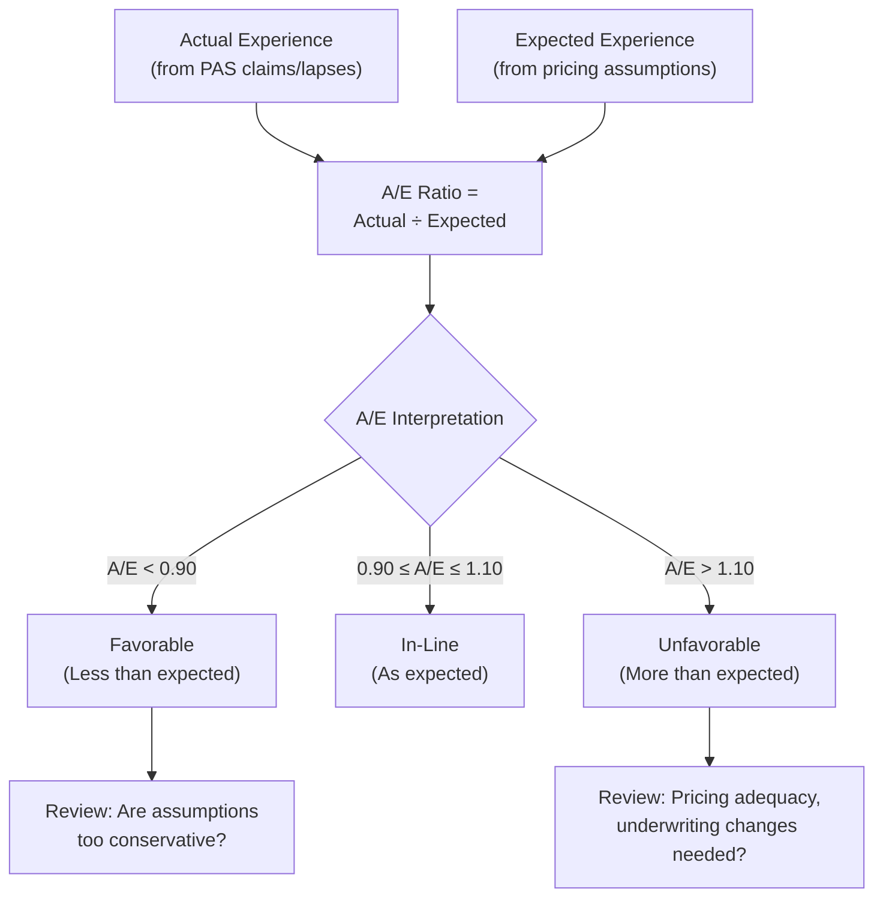

### 5.5 PBR Data Requirements

Principle-Based Reserving (VM-20) requires:

| Data Element | Description | Frequency |
|-------------|-------------|-----------|
| Seriatim policy data | 100+ fields per in-force policy | Quarterly/Annual |
| Mortality experience | Company experience by risk class | Annual (3-5 year studies) |
| Lapse experience | By product, duration, surrender charge | Annual |
| Expense experience | Unit costs by transaction type | Annual |
| Premium persistency | Premium payment patterns (for UL/VUL) | Annual |
| Investment data | Asset portfolios, reinvestment rates | Quarterly |
| Economic scenarios | Interest rate scenarios (deterministic + stochastic) | Quarterly |

---

## 6. Financial Reporting Data Mart

### 6.1 Statutory Reporting

#### Annual Statement Exhibits

| Exhibit | Content | Data Source |
|---------|---------|-------------|
| Exhibit 1 | Premiums and Annuity Considerations | fact_premium |
| Exhibit 2 | Investment Income | Investment system + policy loans |
| Exhibit 3 | Capital Gains/Losses | Investment system |
| Exhibit 5 | Aggregate Reserves | fact_valuation |
| Exhibit 6 | Aggregate Life Reserve Changes | fact_valuation (period-over-period) |
| Exhibit 7 | Deposit-Type Contracts | fact_transaction (annuity deposits) |
| Exhibit 8 | Claims and Benefits | fact_claim |
| Exhibit 9 | Surrender Benefits | fact_transaction (surrenders) |
| Exhibit 11 | Commissions | fact_commission |
| Schedule S | Reinsurance | fact_reinsurance |

#### Sample Statutory Premium Report Query

```sql
SELECT
    dd.year_number,
    dd.quarter_number,
    dp.lob_code,
    dp.product_type_code,
    dg.state_code,
    SUM(fp.gross_premium_amount) AS gross_premium,
    SUM(fp.net_premium_amount) AS net_premium,
    SUM(fp.premium_load_amount) AS premium_loads,
    SUM(fp.premium_tax_amount) AS premium_taxes,
    COUNT(DISTINCT fp.policy_dim_key) AS policy_count,
    SUM(fp.transaction_count) AS transaction_count
FROM fact_premium fp
JOIN dim_date dd ON fp.transaction_date_key = dd.date_key
JOIN dim_product dp ON fp.product_dim_key = dp.product_dim_key
JOIN dim_geography dg ON fp.geography_dim_key = dg.geography_dim_key
WHERE dd.year_number = 2025
GROUP BY dd.year_number, dd.quarter_number, dp.lob_code, dp.product_type_code, dg.state_code
ORDER BY dp.lob_code, dp.product_type_code, dg.state_code, dd.quarter_number;
```

### 6.2 GAAP / IFRS 17 / LDTI Reporting

| Reporting Standard | Key Measures | Data Requirements |
|-------------------|--------------|-------------------|
| US GAAP (LDTI — ASU 2018-12) | Net premium ratio, liability for future policy benefits, market risk benefits, DAC amortization | Cash flow projections, actual experience, discount rates, MRB fair values |
| IFRS 17 | Building Block Approach (BBA): fulfillment cash flows + CSM; Premium Allocation Approach (PAA) for short-duration | Discounted cash flow projections, risk adjustment, contractual service margin, coverage units |
| Statutory (US) | Net level premium reserve, CRVM/NLP, deficiency reserves | Mortality tables, interest rates, in-force data |
| Tax (US) | Federally prescribed mortality/interest | IRC §807 requirements |

### 6.3 Profitability Analysis

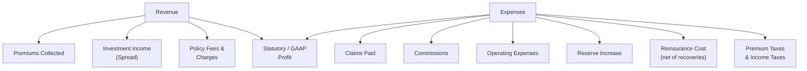

**Profitability Dimensions:**

| Dimension | Analysis Example |
|-----------|------------------|
| Product | Which products are most/least profitable? |
| Vintage (Issue Year) | How does profitability vary by issue cohort? |
| State | State-level profitability (considering regulatory costs) |
| Distribution Channel | Captive vs. independent vs. DTC profitability |
| Risk Class | Preferred vs. standard vs. substandard margins |
| Duration | Profitability by policy year (breakeven analysis) |

---

## 7. Marketing & Customer Analytics

### 7.1 Customer Segmentation

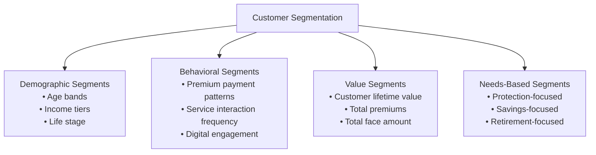

**Customer Value Tiers:**

| Tier | Definition | Typical Characteristics | Strategy |
|------|-----------|------------------------|----------|
| Platinum | Top 5% by CLV | Multiple policies, high face amounts, long tenure | White-glove service, exclusive offers |
| Gold | Next 15% by CLV | 2+ policies, consistent premium payers | Cross-sell, retention programs |
| Silver | Next 30% by CLV | Single policy, moderate face | Upsell coverage, digital engagement |
| Bronze | Bottom 50% by CLV | Small face, term only, newer | Self-service, education |

### 7.2 Customer Lifetime Value (CLV)

```sql
WITH customer_revenue AS (
    SELECT
        dc.customer_dim_key,
        dc.party_id,
        dc.full_name,
        SUM(fp.gross_premium_amount) AS total_premiums,
        COUNT(DISTINCT fp.policy_dim_key) AS total_policies
    FROM fact_premium fp
    JOIN dim_customer dc ON fp.owner_dim_key = dc.customer_dim_key
    GROUP BY dc.customer_dim_key, dc.party_id, dc.full_name
),
customer_claims AS (
    SELECT
        dc.customer_dim_key,
        SUM(fc.total_paid_amount) AS total_claims
    FROM fact_claim fc
    JOIN dim_customer dc ON fc.insured_dim_key = dc.customer_dim_key
    GROUP BY dc.customer_dim_key
),
customer_commissions AS (
    SELECT
        fps.owner_dim_key AS customer_dim_key,
        SUM(fcom.commission_amount) AS total_commissions
    FROM fact_commission fcom
    JOIN fact_policy_snapshot fps ON fcom.policy_dim_key = fps.policy_dim_key
    GROUP BY fps.owner_dim_key
)
SELECT
    cr.customer_dim_key,
    cr.full_name,
    cr.total_premiums,
    cr.total_policies,
    COALESCE(cc.total_claims, 0) AS total_claims,
    COALESCE(ccom.total_commissions, 0) AS total_commissions,
    cr.total_premiums - COALESCE(cc.total_claims, 0) - COALESCE(ccom.total_commissions, 0) AS estimated_clv
FROM customer_revenue cr
LEFT JOIN customer_claims cc ON cr.customer_dim_key = cc.customer_dim_key
LEFT JOIN customer_commissions ccom ON cr.customer_dim_key = ccom.customer_dim_key
ORDER BY estimated_clv DESC;
```

### 7.3 Lapse Prediction Model Features

| Feature Category | Features |
|-----------------|----------|
| Policy Attributes | Product type, face amount, premium mode, issue age, duration, risk class |
| Financial Behavior | Paid-to-date vs current, premium payment gaps, loan-to-value ratio, surrender charge remaining |
| Customer Demographics | Age, income band, marital status, state, urban/rural |
| Interaction History | Service calls (count, recency), complaints, correspondence, digital logins |
| External Factors | Interest rate environment (competitive pressure), economic conditions, unemployment rate |
| Derived | Cash value surrender charge ratio, account value growth trend, premium burden (premium/income estimate) |

### 7.4 Cross-Sell / Upsell Propensity

| Scenario | Target | Model Inputs | Action |
|----------|--------|-------------|--------|
| Term policyholder → Permanent | Conversion propensity | Age, income, term duration remaining, family status | Offer conversion before expiry |
| Single policy → Additional coverage | Cross-sell propensity | Coverage gap analysis, life events, household needs | Recommend riders or new policy |
| Low face amount → Higher coverage | Upsell propensity | Income growth, asset growth, family size change | GIB rider exercise, coverage increase |
| No annuity → Retirement product | Product expansion | Age (approaching retirement), assets, risk tolerance | Annuity illustration |

---

## 8. Compliance & Regulatory Data Mart

### 8.1 Market Conduct Metrics

| Metric | Formula | Target | Source |
|--------|---------|--------|--------|
| Replacement Rate | Replacement policies / Total new policies | < 5% | policy.replacement_ind |
| Free-Look Return Rate | Free-look cancellations / Policies issued | < 3% | financial_transaction (WD_FREE_LOOK) |
| Complaint Rate | Complaints / Policies in force | < 0.5 per 1000 | Complaint tracking system |
| Claim Denial Rate | Denied claims / Total claims | < 2% | fact_claim |
| Claim Payment Timeliness | Claims paid within 30 days / Total claims | > 95% | fact_claim.days_to_pay |
| Illustration Accuracy | Illustrated vs. actual credited rates | Within 50 bps | Illustration system vs PAS |
| Agent Licensing Compliance | Licensed agents / Total agents per state | 100% | dim_agent, agent_license |
| Suitability Review Rate | Reviews completed / Sales requiring review | 100% | Suitability tracking |

### 8.2 Regulatory Reporting Data

| Report | Regulator | Frequency | Key Data |
|--------|-----------|-----------|----------|
| Annual Statement (Blue Book) | State DOI via NAIC | Annual | All financial exhibits, schedules |
| Quarterly Statement | State DOI via NAIC | Quarterly | Key financial data |
| Schedule S | State DOI | Annual | Reinsurance details |
| Separate Account Annual Statement | State DOI | Annual | Variable product details |
| Actuarial Opinion | State DOI | Annual | Reserve adequacy |
| VM-20 PBR Report | State DOI | Annual | Principle-based reserve details |
| 1099-R / 5498 / 1099-INT | IRS | Annual | Tax reporting |
| SARs (Suspicious Activity Reports) | FinCEN | As needed | AML monitoring |
| Market Conduct Annual Statement (MCAS) | NAIC | Annual | Market conduct metrics |

### 8.3 AML Monitoring Data

| Data Element | Description | Analytics Use |
|-------------|-------------|---------------|
| Large cash transactions | Premiums > $10,000 in cash | CTR filing triggers |
| Structured transactions | Multiple transactions just below $10,000 | Pattern detection |
| Premium source changes | Unusual changes in payment method/source | Suspicious activity flags |
| Rapid surrender after purchase | Policy surrendered within 2 years of issue | Money laundering indicator |
| Name screening hits | OFAC, PEP, sanctions list matches | Watchlist monitoring |
| Beneficiary changes | Frequent or unusual beneficiary changes | Fraud/laundering indicator |

---

## 9. Operational Analytics

### 9.1 Key Operational Metrics

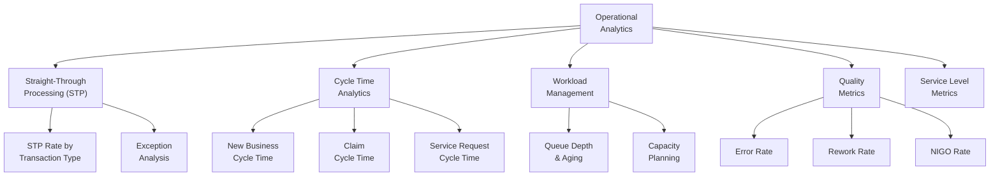

### 9.2 STP Metrics Dashboard

| Transaction Type | Target STP Rate | Typical Exceptions |
|-----------------|----------------|-------------------|
| Premium payment (EFT) | 98% | NSF, amount mismatch, policy not found |
| Premium payment (check) | 85% | Illegible, amount discrepancy, missing policy number |
| Address change | 95% | Foreign address, USPS undeliverable |
| Beneficiary change | 70% | Missing signatures, irrevocable consent needed |
| Loan request | 85% | Exceeds max loan, policy in grace |
| Withdrawal | 80% | Tax withholding election missing, free withdrawal exceeded |
| Death claim notification | 30% | Always requires human review |
| New application | 40% | Underwriting required |
| Reinstatement | 20% | Evidence of insurability required |

### 9.3 Processing Time Analytics

```sql
SELECT
    pcr.request_type_code,
    DATE_TRUNC('month', pcr.received_date) AS month,
    COUNT(*) AS total_requests,
    AVG(pcr.completed_date - pcr.received_date) AS avg_cycle_days,
    PERCENTILE_CONT(0.5) WITHIN GROUP (ORDER BY pcr.completed_date - pcr.received_date) AS median_cycle_days,
    PERCENTILE_CONT(0.9) WITHIN GROUP (ORDER BY pcr.completed_date - pcr.received_date) AS p90_cycle_days,
    SUM(CASE WHEN pcr.completed_date - pcr.received_date <= pcr.sla_days THEN 1 ELSE 0 END)::FLOAT
        / COUNT(*)::FLOAT * 100 AS sla_met_pct
FROM policy_change_request pcr
WHERE pcr.received_date >= '2025-01-01'
GROUP BY pcr.request_type_code, DATE_TRUNC('month', pcr.received_date)
ORDER BY pcr.request_type_code, month;
```

---

## 10. Real-Time Analytics

### 10.1 Streaming Architecture

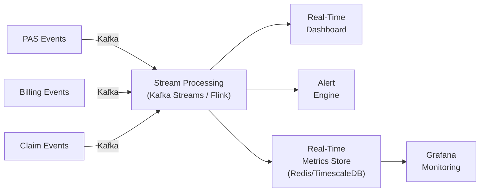

### 10.2 Real-Time Use Cases

| Use Case | Event Source | Processing Logic | Output |
|----------|-------------|------------------|--------|
| Premium payment monitoring | Payment events | Count, sum by hour; detect anomalies | Dashboard + alerts |
| Claim spike detection | Claim notification events | Rolling count by region; threshold alerting | PagerDuty alert |
| Grace period monitoring | Billing events | Policies entering grace, trending toward lapse | Retention team queue |
| New business pipeline | Application events | Application counts, conversion rates | Sales dashboard |
| System health | Transaction processing events | Error rates, processing latency, queue depth | Operations dashboard |

### 10.3 Kafka Streams Topology Example

```java
StreamsBuilder builder = new StreamsBuilder();

KStream<String, PaymentEvent> payments = builder.stream("pas.cdc.payment");

KTable<Windowed<String>, PaymentAggregate> hourlyPremiums = payments
    .filter((key, value) -> value.getPaymentStatusCode().equals("APPLIED"))
    .groupBy((key, value) -> value.getProductTypeCode())
    .windowedBy(TimeWindows.ofSizeWithNoGrace(Duration.ofHours(1)))
    .aggregate(
        PaymentAggregate::new,
        (key, payment, aggregate) -> {
            aggregate.addPayment(payment.getPaymentAmount());
            return aggregate;
        },
        Materialized.with(Serdes.String(), paymentAggregateSerde)
    );

hourlyPremiums.toStream()
    .to("analytics.premium-hourly", Produced.with(windowedSerde, paymentAggregateSerde));
```

---

## 11. Data Governance for Analytics

### 11.1 Data Lineage

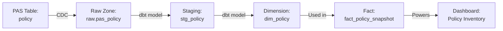

### 11.2 Metadata Management

| Metadata Type | Description | Tool |
|--------------|-------------|------|
| Technical Metadata | Column names, types, constraints, indexes | Data catalog (Collibra, Alation) |
| Business Metadata | Business definitions, ownership, stewardship | Data catalog + wiki |
| Operational Metadata | Load timestamps, row counts, run status | ETL tool + monitoring |
| Data Quality Metadata | DQ scores, rule results, exceptions | Great Expectations, dbt tests |
| Usage Metadata | Query frequency, user access patterns | Query logs, BI tool analytics |
| Lineage Metadata | Source-to-target mappings, transformation logic | dbt docs, data catalog |

### 11.3 Access Control / Data Security

| Data Classification | Examples | Access Control |
|--------------------|----------|----------------|
| Public | Product brochures, rate sheets | Open |
| Internal | Aggregate reports, dashboards | All employees |
| Confidential | Policy-level data, premium amounts | Business need + role-based |
| Restricted | SSN, bank accounts, medical data | PII masking, encryption, audit logging, limited roles |

**Row-Level Security Example (Snowflake):**

```sql
CREATE OR REPLACE ROW ACCESS POLICY rls_policy_state
AS (state_code VARCHAR) RETURNS BOOLEAN ->
    CASE
        WHEN CURRENT_ROLE() IN ('ENTERPRISE_ANALYST', 'ACTUARY', 'EXEC') THEN TRUE
        WHEN CURRENT_ROLE() = 'REGIONAL_ANALYST_NORTHEAST'
            AND state_code IN ('CT','ME','MA','NH','RI','VT','NJ','NY','PA') THEN TRUE
        WHEN CURRENT_ROLE() = 'REGIONAL_ANALYST_SOUTHEAST'
            AND state_code IN ('AL','FL','GA','KY','MS','NC','SC','TN','VA','WV') THEN TRUE
        ELSE FALSE
    END;

ALTER TABLE dim_geography ADD ROW ACCESS POLICY rls_policy_state ON (state_code);
```

### 11.4 Self-Service BI Governance

| Governance Area | Control | Implementation |
|----------------|---------|----------------|
| Certified datasets | Only approved datasets shown by default | BI tool dataset certification |
| Metric definitions | Single definition per metric | Semantic layer (dbt metrics, LookML) |
| Data freshness | Display last refresh timestamp | Dashboard metadata |
| Access requests | Self-service provisioning with approval | IAM workflow |
| Dashboard publication | Review before publish to "Official" | Publisher workflow |
| Usage monitoring | Track adoption and dataset usage | BI tool analytics |

---

## 12. Technology Stack

### 12.1 Reference Architecture Components

| Layer | Component | Recommended Technologies |
|-------|-----------|------------------------|
| Data Ingestion | CDC | Debezium, Oracle GoldenGate, AWS DMS, Fivetran |
| Data Ingestion | Batch ETL | Informatica PowerCenter, IBM DataStage, Apache Spark, AWS Glue |
| Data Ingestion | Streaming | Apache Kafka, Amazon Kinesis, Azure Event Hubs |
| Storage | Data Lake | Amazon S3, Azure Data Lake Storage (ADLS) Gen2, Google Cloud Storage |
| Storage | Data Warehouse | Snowflake, Amazon Redshift, Google BigQuery, Databricks SQL |
| Storage | Real-Time Store | Apache Druid, ClickHouse, Redis, TimescaleDB |
| Transformation | ELT | dbt (data build tool), Spark, Dataform |
| Orchestration | Workflow | Apache Airflow, Dagster, Prefect, dbt Cloud |
| Data Quality | Validation | Great Expectations, dbt tests, Monte Carlo, Soda |
| Metadata | Data Catalog | Collibra, Alation, DataHub, Atlan, Unity Catalog |
| Visualization | BI/Dashboards | Tableau, Power BI, Looker, Apache Superset |
| Data Science | ML Platform | Databricks MLflow, Amazon SageMaker, Vertex AI |
| Governance | Access Control | Snowflake RBAC, Unity Catalog, Immuta, Privacera |

### 12.2 Technology Selection Decision Matrix

| Criteria | Weight | Snowflake | Databricks Lakehouse | Amazon Redshift | Google BigQuery |
|----------|--------|-----------|---------------------|-----------------|-----------------|
| SQL performance | 20% | 9 | 8 | 8 | 9 |
| Streaming support | 10% | 6 | 9 | 7 | 8 |
| ML/Data Science | 15% | 7 | 10 | 7 | 8 |
| Governance | 15% | 9 | 8 | 7 | 7 |
| Cost efficiency | 15% | 8 | 7 | 8 | 8 |
| Ecosystem integration | 10% | 9 | 8 | 9 | 8 |
| Ease of administration | 10% | 9 | 7 | 7 | 9 |
| Insurance domain tools | 5% | 7 | 8 | 6 | 6 |
| **Weighted Score** | **100%** | **8.2** | **8.2** | **7.5** | **7.9** |

---

## 13. Sample Star Schema Diagrams

### 13.1 Premium Analysis Star Schema

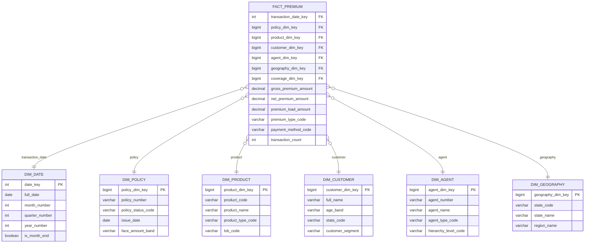

### 13.2 Claims Analysis Star Schema

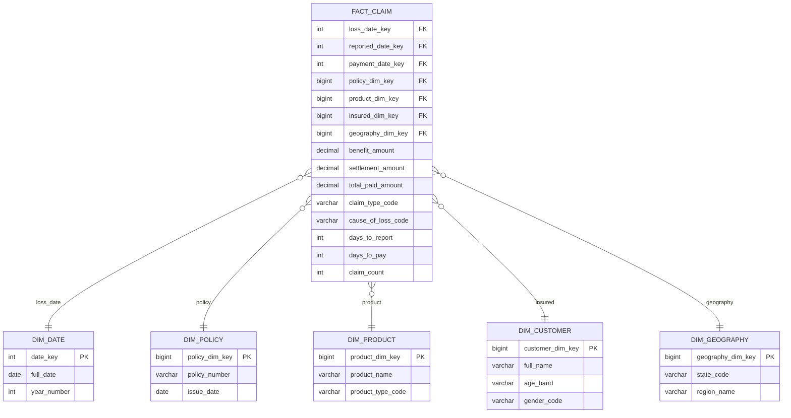

---

## 14. Sample dbt Models

### 14.1 Project Structure

```
dbt_insurance_edw/
├── dbt_project.yml
├── models/
│   ├── staging/
│   │   ├── stg_policy.sql
│   │   ├── stg_party.sql
│   │   ├── stg_individual.sql
│   │   ├── stg_coverage.sql
│   │   ├── stg_financial_transaction.sql
│   │   ├── stg_payment.sql
│   │   ├── stg_claim.sql
│   │   └── stg_agent.sql
│   ├── intermediate/
│   │   ├── int_policy_enriched.sql
│   │   ├── int_customer_profile.sql
│   │   └── int_premium_allocated.sql
│   ├── marts/
│   │   ├── dim_date.sql
│   │   ├── dim_policy.sql
│   │   ├── dim_product.sql
│   │   ├── dim_customer.sql
│   │   ├── dim_agent.sql
│   │   ├── dim_geography.sql
│   │   ├── fact_policy_snapshot.sql
│   │   ├── fact_premium.sql
│   │   ├── fact_claim.sql
│   │   ├── fact_commission.sql
│   │   └── fact_transaction.sql
│   └── metrics/
│       ├── premium_metrics.yml
│       ├── claim_metrics.yml
│       └── operational_metrics.yml
├── tests/
│   ├── assert_premium_reconciliation.sql
│   ├── assert_policy_count_reconciliation.sql
│   └── assert_no_orphan_facts.sql
├── macros/
│   ├── generate_surrogate_key.sql
│   ├── scd_type2.sql
│   └── date_spine.sql
└── seeds/
    ├── code_tables.csv
    └── geography.csv
```

### 14.2 Staging Model: stg_policy

```sql
-- models/staging/stg_policy.sql

WITH source AS (
    SELECT * FROM {{ source('pas', 'policy') }}
),

renamed AS (
    SELECT
        policy_id,
        policy_number,
        company_code,
        admin_system_code,
        product_plan_id,
        policy_status_code,
        policy_status_reason_code,
        application_date,
        application_received_date,
        issue_date,
        policy_date,
        paid_to_date,
        maturity_date,
        termination_date,
        last_anniversary_date,
        next_anniversary_date,
        issue_state_code,
        issue_country_code,
        tax_qualification_code,
        section_1035_exchange_ind,
        replacement_ind,
        mec_status_code,
        mec_date,
        seven_pay_premium,
        cumulative_premium,
        face_amount,
        current_face_amount,
        death_benefit_option_code,
        premium_mode_code,
        modal_premium_amount,
        annual_premium_amount,
        total_account_value,
        total_surrender_value,
        total_loan_balance,
        cost_basis_amount,
        last_valuation_date,
        reinsurance_ind,
        group_policy_ind,
        created_timestamp,
        updated_timestamp
    FROM source
)

SELECT * FROM renamed
```

### 14.3 Dimension Model: dim_policy (SCD Type 2)

```sql
-- models/marts/dim_policy.sql

{{
    config(
        materialized='incremental',
        unique_key='policy_dim_key',
        on_schema_change='sync_all_columns'
    )
}}

WITH source AS (
    SELECT * FROM {{ ref('stg_policy') }}
),

product AS (
    SELECT * FROM {{ ref('stg_product_plan') }}
),

enriched AS (
    SELECT
        {{ dbt_utils.generate_surrogate_key(['s.policy_id', 's.updated_timestamp']) }} AS policy_dim_key,
        s.policy_id,
        s.policy_number,
        s.company_code,
        s.policy_status_code,
        CASE s.policy_status_code
            WHEN 'APPLIED' THEN 'Applied'
            WHEN 'ISSUED' THEN 'Issued'
            WHEN 'INFORCE' THEN 'In Force'
            WHEN 'LAPSED' THEN 'Lapsed'
            WHEN 'SURRENDERED' THEN 'Surrendered'
            WHEN 'MATURED' THEN 'Matured'
            WHEN 'DEATHCLAIM' THEN 'Death Claim'
            WHEN 'TERMINATED' THEN 'Terminated'
            ELSE s.policy_status_code
        END AS policy_status_desc,
        s.application_date,
        s.issue_date,
        s.policy_date,
        s.maturity_date,
        s.termination_date,
        s.issue_state_code,
        s.tax_qualification_code,
        s.mec_status_code,
        s.death_benefit_option_code,
        s.premium_mode_code,
        CASE s.premium_mode_code
            WHEN 'ANNUAL' THEN 'Annual'
            WHEN 'SEMI' THEN 'Semi-Annual'
            WHEN 'QUARTERLY' THEN 'Quarterly'
            WHEN 'MONTHLY' THEN 'Monthly'
            WHEN 'SINGLE' THEN 'Single Premium'
        END AS premium_mode_desc,
        s.replacement_ind,
        s.section_1035_exchange_ind,
        s.group_policy_ind,
        CASE
            WHEN s.face_amount < 25000 THEN '0-25K'
            WHEN s.face_amount < 50000 THEN '25K-50K'
            WHEN s.face_amount < 100000 THEN '50K-100K'
            WHEN s.face_amount < 250000 THEN '100K-250K'
            WHEN s.face_amount < 500000 THEN '250K-500K'
            WHEN s.face_amount < 1000000 THEN '500K-1M'
            ELSE '1M+'
        END AS face_amount_band,
        EXTRACT(YEAR FROM AGE(CURRENT_DATE, s.issue_date)) * 12
            + EXTRACT(MONTH FROM AGE(CURRENT_DATE, s.issue_date)) AS policy_duration_months,
        s.updated_timestamp::DATE AS effective_start_date,
        NULL::DATE AS effective_end_date,
        TRUE AS is_current,
        s.admin_system_code AS source_system,
        CURRENT_TIMESTAMP AS etl_load_timestamp
    FROM source s
    LEFT JOIN product p ON s.product_plan_id = p.product_plan_id
)

SELECT * FROM enriched


WHERE effective_start_date > (SELECT MAX(effective_start_date) FROM {{ this }})

```

### 14.4 Fact Model: fact_premium

```sql
-- models/marts/fact_premium.sql

{{
    config(
        materialized='incremental',
        unique_key='source_transaction_id',
        partition_by={'field': 'transaction_date_key', 'data_type': 'int', 'granularity': 'month'}
    )
}}

WITH transactions AS (
    SELECT * FROM {{ ref('stg_financial_transaction') }}
    WHERE transaction_type_code LIKE 'PREM%'
),

dim_date AS (
    SELECT * FROM {{ ref('dim_date') }}
),

dim_policy AS (
    SELECT * FROM {{ ref('dim_policy') }}
    WHERE is_current = TRUE
),

dim_product AS (
    SELECT * FROM {{ ref('dim_product') }}
    WHERE is_current = TRUE
),

final AS (
    SELECT
        dd.date_key AS transaction_date_key,
        dp.policy_dim_key,
        dprod.product_dim_key,
        t.amount AS gross_premium_amount,
        t.amount * 0.95 AS net_premium_amount,
        t.amount * 0.05 AS premium_load_amount,
        0.00 AS premium_tax_amount,
        t.transaction_type_code AS premium_type_code,
        1 AS transaction_count,
        t.transaction_id AS source_transaction_id,
        CURRENT_TIMESTAMP AS etl_load_timestamp
    FROM transactions t
    JOIN dim_date dd ON t.transaction_date = dd.full_date
    JOIN dim_policy dp ON t.policy_id = dp.policy_id AND dp.is_current = TRUE
    JOIN dim_product dprod ON dp.policy_dim_key IS NOT NULL
)

SELECT * FROM final


WHERE source_transaction_id > (SELECT COALESCE(MAX(source_transaction_id), 0) FROM {{ this }})

```

### 14.5 dbt Tests

```sql
-- tests/assert_premium_reconciliation.sql

WITH pas_total AS (
    SELECT SUM(amount) AS pas_premium
    FROM {{ source('pas', 'financial_transaction') }}
    WHERE transaction_type_code LIKE 'PREM%'
      AND transaction_date >= DATE_TRUNC('month', CURRENT_DATE - INTERVAL '1 month')
      AND transaction_date < DATE_TRUNC('month', CURRENT_DATE)
),
edw_total AS (
    SELECT SUM(gross_premium_amount) AS edw_premium
    FROM {{ ref('fact_premium') }} fp
    JOIN {{ ref('dim_date') }} dd ON fp.transaction_date_key = dd.date_key
    WHERE dd.full_date >= DATE_TRUNC('month', CURRENT_DATE - INTERVAL '1 month')
      AND dd.full_date < DATE_TRUNC('month', CURRENT_DATE)
)
SELECT
    pas_premium,
    edw_premium,
    ABS(pas_premium - edw_premium) AS variance,
    ABS(pas_premium - edw_premium) / NULLIF(pas_premium, 0) * 100 AS variance_pct
FROM pas_total, edw_total
WHERE ABS(pas_premium - edw_premium) / NULLIF(pas_premium, 0) > 0.001
```

---

## 15. Modern Data Platform Architecture (Lakehouse)

### 15.1 Lakehouse Architecture for Insurance

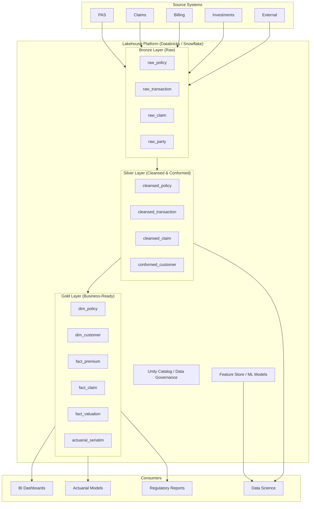

### 15.2 Medallion Architecture Details

| Layer | Purpose | Data Characteristics | Storage Format | Retention |
|-------|---------|---------------------|----------------|-----------|
| **Bronze** | Raw ingestion, immutable landing | Exact copy of source, append-only, schema-on-read | Delta Lake (Parquet) | 7+ years (regulatory) |
| **Silver** | Cleansed, deduplicated, conformed | Validated, standardized codes, resolved references | Delta Lake (Parquet) | 7+ years |
| **Gold** | Business-ready, dimensional | Star schema facts and dimensions, aggregations | Delta Lake (Parquet) | 10+ years |

### 15.3 Delta Lake / Iceberg Features for Insurance

| Feature | Insurance Benefit |
|---------|------------------|
| ACID Transactions | Ensure financial data consistency during ETL |
| Time Travel | Reproduce any past state for regulatory audits |
| Schema Evolution | Add new product attributes without breaking pipelines |
| Merge (Upsert) | Efficient SCD Type 2 processing |
| Partition Pruning | Fast queries on large transaction tables |
| Z-Ordering / Clustering | Optimize query patterns (by policy, by date) |
| Vacuum / Retention | Manage storage costs while meeting retention |

---

## 16. Implementation Guidance

### 16.1 Phased Delivery Roadmap

```mermaid
gantt
    title Data Platform Implementation
    dateFormat  YYYY-Q
    section Phase 1: Foundation
    Platform provisioning         :done, 2025-Q1, 2025-Q1
    Bronze layer (PAS extract)    :done, 2025-Q1, 2025-Q2
    Core dimensions               :done, 2025-Q2, 2025-Q2
    section Phase 2: Core Analytics
    Silver layer transformations  :active, 2025-Q2, 2025-Q3
    Policy snapshot fact          :2025-Q3, 2025-Q3
    Premium fact                  :2025-Q3, 2025-Q3
    BI dashboards (Policy, Premium) :2025-Q3, 2025-Q4
    section Phase 3: Financial & Actuarial
    Valuation fact                :2025-Q4, 2026-Q1
    Actuarial seriatim extract    :2025-Q4, 2026-Q1
    Financial reporting mart      :2026-Q1, 2026-Q1
    section Phase 4: Advanced Analytics
    Claim fact & analytics        :2026-Q1, 2026-Q2
    Commission fact               :2026-Q1, 2026-Q2
    Customer analytics / ML       :2026-Q2, 2026-Q3
    Real-time streaming           :2026-Q2, 2026-Q3
    section Phase 5: Governance & Self-Service
    Data catalog                  :2026-Q3, 2026-Q3
    Self-service BI               :2026-Q3, 2026-Q4
    Data quality monitoring       :2026-Q3, 2026-Q4
```

### 16.2 Organizational Considerations

| Role | Responsibility | FTE Estimate |
|------|---------------|-------------|
| Data Architect | Data model design, standards, governance | 1-2 |
| Analytics Engineer (dbt) | Transformation logic, testing, documentation | 3-5 |
| Data Engineer | Pipeline development, CDC, orchestration | 2-4 |
| BI Developer | Dashboard design, report development | 2-3 |
| Data Scientist | Predictive models, advanced analytics | 1-2 |
| Data Steward | Data quality, metadata, business definitions | 1-2 per domain |
| Platform Engineer | Infrastructure, security, performance | 1-2 |

### 16.3 Key Success Metrics

| Metric | Target | Measurement |
|--------|--------|-------------|
| Data freshness | < 24 hours for EDW; < 1 hour for ODS | Monitor ETL completion times |
| Data quality score | > 99.5% | Automated DQ checks |
| Query performance (P95) | < 30 seconds for standard reports | Query log analysis |
| User adoption | > 80% of target users active monthly | BI tool usage tracking |
| ETL reliability | > 99.9% on-time completion | Orchestration monitoring |
| Cost per GB processed | Declining QoQ | Cloud cost analysis |
| Time to new metric | < 1 week for standard metrics | Intake tracking |

### 16.4 Common Pitfalls

| Pitfall | Impact | Mitigation |
|---------|--------|------------|
| Building too many dashboards before solid data model | Inconsistent metrics, rework | Invest in conformed dimensions and facts first |
| Ignoring data quality until production | Bad decisions from bad data | Implement DQ checks from day 1 |
| Over-engineering for future use cases | Delayed time-to-value | Start with highest-priority use cases; iterate |
| No reconciliation to source | Erosion of trust | Automated reconciliation checks (policy counts, premium totals) |
| Insufficient security for PII | Regulatory violation | Implement masking, RBAC, audit logging from inception |
| Single-threaded development | Long delivery cycles | Parallel workstreams (dimensions, facts, BI) |

---

*This article is part of the Life Insurance PAS Architect's Encyclopedia. For related topics, see Article 42 (Canonical Data Model), Article 44 (Data Migration & Conversion), and Article 47 (Testing Strategies).*
