# Article 44: Data Migration & Conversion for Life Insurance PAS

## Table of Contents

1. [Introduction](#1-introduction)
2. [Migration Scenarios](#2-migration-scenarios)
3. [Migration Planning](#3-migration-planning)
4. [Source Data Analysis](#4-source-data-analysis)
5. [Data Mapping](#5-data-mapping)
6. [Transformation Rules](#6-transformation-rules)
7. [Data Validation](#7-data-validation)
8. [Migration Architecture](#8-migration-architecture)
9. [Mock Migration & Dress Rehearsal](#9-mock-migration--dress-rehearsal)
10. [Cutover Strategy](#10-cutover-strategy)
11. [Historical Data](#11-historical-data)
12. [Complete Migration Project Plan](#12-complete-migration-project-plan)
13. [Sample Data Mapping Document](#13-sample-data-mapping-document)
14. [Migration Architecture Diagrams](#14-migration-architecture-diagrams)
15. [Validation Report Templates](#15-validation-report-templates)
16. [Risk Register](#16-risk-register)
17. [Implementation Guidance](#17-implementation-guidance)

---

## 1. Introduction

Data migration is consistently the **highest-risk, most underestimated workstream** in any life insurance PAS modernization. A carrier's book of business — accumulated over decades — is its core asset. Every policy record, premium payment, cash value calculation, beneficiary designation, and transaction history must be moved to the new system with perfect financial integrity.

### 1.1 Why Migration Is Hard in Life Insurance

| Challenge | Explanation |
|-----------|-------------|
| Decades of accumulated data | Policies issued 40+ years ago under product rules that no longer exist |
| Multiple source systems | Mergers and acquisitions result in 3-10+ legacy PAS platforms |
| Undocumented business rules | Transformation logic embedded in COBOL copybooks and JCL with no documentation |
| Financial precision requirements | Account values, reserves, and cost basis must reconcile to the penny |
| Regulatory scrutiny | State regulators may examine migration quality; policyholders must not be harmed |
| In-flight transactions | Billing, claims, and service transactions continue during migration |
| Product complexity | 50-200+ plan codes with unique calculation rules |
| Data quality debt | Decades of manual processing created inconsistencies, orphan records, and data gaps |

### 1.2 Migration Success Criteria

| Criterion | Definition | Threshold |
|-----------|------------|-----------|
| Financial Reconciliation | Total account values, reserves, and loan balances match between source and target | 100% (zero tolerance) |
| Policy Count | Number of policies in target matches source (by status, by product) | 100% |
| Data Completeness | All required fields populated in target | > 99.95% |
| Data Accuracy | Spot-check sample passes manual verification | > 99.9% |
| Calculation Verification | Cash values, premiums, and benefits calculated correctly on target | 100% within tolerance (±$0.01 per policy) |
| Operational Readiness | All transaction types can be processed on target post-migration | 100% functional |
| Parallel Run Parity | Transactions processed on both systems produce matching results | > 99.5% match rate |

---

## 2. Migration Scenarios

### 2.1 Legacy PAS to Modern PAS

The most common scenario: moving a book of business from a legacy mainframe PAS (e.g., VANTAGE-ONE, CyberLife, LifeComm, CLAS) to a modern platform (e.g., OIPA, LifePRO, Sapiens ALIS, Majesco).

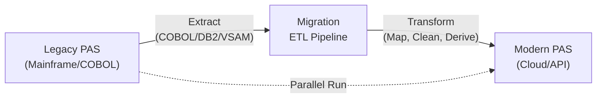

**Key Characteristics:**
- Full book of business (100K to 10M+ policies)
- 20-40+ years of transaction history
- Undocumented COBOL business rules
- VSAM/ISAM/DB2/IMS data stores
- EBCDIC character encoding
- Packed decimal formats

### 2.2 PAS Consolidation

Multiple PAS platforms consolidated into one. Common after M&A activity.

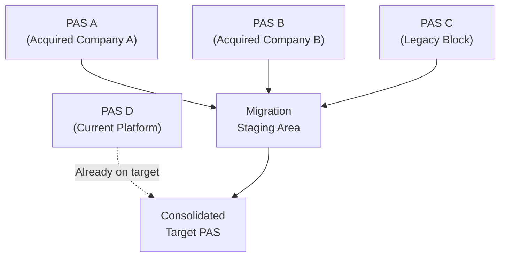

**Additional Challenges:**
- Different policy number formats (must avoid collisions)
- Different product codes (must rationalize to target product catalog)
- Different party records (must deduplicate across systems)
- Different code tables (must map to unified code set)
- Different financial precision (rounding reconciliation)

### 2.3 Acquisition / Merger Integration

Integrating an acquired company's policies into the acquirer's PAS.

**Key Decisions:**
- Policy renumbering (maintain original or assign new numbers?)
- Product mapping (map acquired products to acquirer products or create new product codes?)
- Agent re-appointment (reassign agents to acquirer hierarchy?)
- Reinsurance treaty assignment (novate, recapture, or maintain?)

### 2.4 Reinsurance Assumption

A block of business is assumed from another insurer via reinsurance assumption.

**Characteristics:**
- Typically a defined block (specific product, specific vintage)
- Original insurer provides extract files (ACORD or proprietary format)
- Less historical data available (summary vs. seriatim)
- Must reconstruct sufficient history for ongoing administration

### 2.5 System Upgrade (Major Version)

Upgrading the existing PAS to a new major version that requires data model changes.

**Characteristics:**
- Same vendor, new version
- Data model differences between versions
- In-place conversion scripts (vendor-provided)
- Shorter timeline but still significant testing

---

## 3. Migration Planning

### 3.1 Scope Definition

| Scope Dimension | Options | Decision Factors |
|----------------|---------|-----------------|
| Policy Status | In-force only vs. all statuses | Regulatory requirements, reporting needs, history |
| History Depth | Current state only vs. N years of transactions | Regulatory retention, audit needs, cost |
| Products | All products vs. specific blocks | Complexity, timeline, phasing |
| Data Domains | Policy + party + financial only vs. full (claims, correspondence, notes) | Business requirements, target capabilities |
| Attachments/Images | Migrate scanned documents? | ECM integration, cost, regulatory requirements |

### 3.2 Migration Waves / Phases

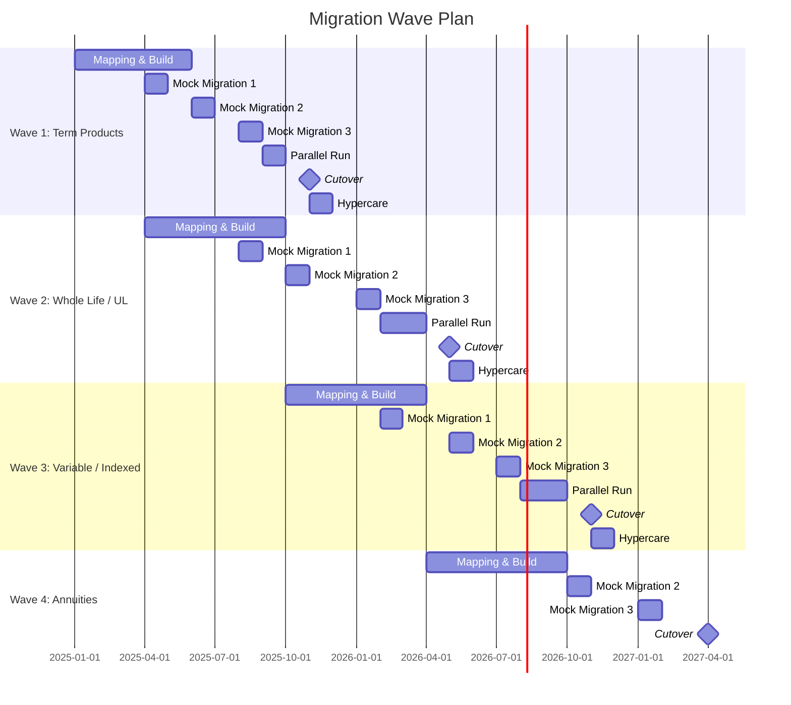

**Wave Sequencing Rationale:**

| Wave | Product Types | Rationale |
|------|--------------|-----------|
| Wave 1 | Term Life | Simplest products (no cash value, limited transactions), fastest to validate |
| Wave 2 | Whole Life, Universal Life | Cash value products with moderate complexity |
| Wave 3 | Variable Life, Indexed UL | Most complex (fund allocation, unit tracking, segment tracking) |
| Wave 4 | Annuities | Different transaction model (accumulation → payout phases) |

### 3.3 Resource Planning

| Role | Responsibility | FTE | Duration |
|------|---------------|-----|----------|
| Migration Lead / PM | Overall migration planning, tracking, risk management | 1 | Full project |
| Data Architect | Source analysis, target mapping, transformation design | 1-2 | Full project |
| Legacy SME (Business) | Legacy system business rules, data interpretation | 2-3 | Phase 1-3 |
| Legacy SME (Technical) | Legacy data extraction, COBOL/JCL interpretation | 2-3 | Phase 1-3 |
| ETL Developer | Migration pipeline development | 3-5 | Phases 2-4 |
| Target PAS Configurator | Target system product setup, data load APIs | 2-3 | Phases 2-4 |
| QA / Validation Analyst | Test case design, validation execution, reconciliation | 3-5 | Phases 3-5 |
| Actuarial Analyst | Cash value / reserve verification | 1-2 | Phases 3-5 |
| Business Analyst | Acceptance criteria, UAT coordination | 2-3 | Phases 3-5 |
| DBA | Database optimization, bulk load, performance tuning | 1 | Phases 3-5 |

### 3.4 Timeline Planning

| Activity | Typical Duration | Dependencies |
|----------|-----------------|-------------|
| Source data analysis | 2-4 months | Access to legacy systems |
| Data mapping (per wave) | 2-3 months | Source analysis complete, target product config |
| ETL development (per wave) | 3-5 months | Mapping approved |
| Mock migration 1 (small sample) | 2-4 weeks | ETL developed |
| Mock migration 2 (medium volume) | 3-4 weeks | Mock 1 defects resolved |
| Mock migration 3 (full volume) | 4-6 weeks | Mock 2 defects resolved |
| Parallel run | 4-8 weeks | Mock 3 passed |
| Cutover | 1-3 days (weekend) | Parallel run signed off |
| Hypercare | 4-8 weeks | Cutover complete |

---

## 4. Source Data Analysis

### 4.1 Legacy Data Profiling

#### 4.1.1 Profiling Dimensions

| Dimension | What to Measure | Tool/Method |
|-----------|----------------|-------------|
| **Completeness** | % of NULL/empty values per field | SQL profiling, Informatica Data Quality, Talend |
| **Uniqueness** | Duplicate keys, duplicate parties | SQL COUNT DISTINCT, fuzzy matching |
| **Consistency** | Cross-field validation (e.g., status=INFORCE but termination_date is populated) | Business rule checks |
| **Accuracy** | Financial totals match general ledger, policy counts match reports | Reconciliation to GL and existing reports |
| **Timeliness** | Data currency (when was the record last updated?) | Timestamp analysis |
| **Validity** | Values within expected domains (e.g., state_code is a valid US state) | Domain checks |
| **Referential Integrity** | FK violations (policy references non-existent party) | SQL JOIN analysis |

#### 4.1.2 Sample Profiling Report

| Table | Column | Total Rows | Non-Null | % Complete | Distinct Values | Min | Max | Top 5 Values |
|-------|--------|-----------|----------|------------|-----------------|-----|-----|--------------|
| POLICY | POLICY_NBR | 850,000 | 850,000 | 100% | 850,000 | A0000001 | Z9999999 | — |
| POLICY | STATUS_CD | 850,000 | 850,000 | 100% | 12 | — | — | IF(450K), LP(120K), SU(100K), TR(80K), DC(50K) |
| POLICY | ISSUE_DT | 850,000 | 849,200 | 99.9% | 14,500 | 1962-03-15 | 2024-12-31 | — |
| POLICY | FACE_AMT | 850,000 | 848,500 | 99.8% | 42,000 | 0 | 50,000,000 | — |
| INSURED | SSN | 800,000 | 785,000 | 98.1% | 780,000 | — | — | (20K duplicates) |
| INSURED | DOB | 800,000 | 799,500 | 99.9% | 28,000 | 1920-01-01 | 2010-12-31 | — |
| ADDRESS | ADDR_LINE1 | 1,200,000 | 1,195,000 | 99.6% | 980,000 | — | — | — |
| ADDRESS | STATE_CD | 1,200,000 | 1,198,000 | 99.8% | 55 | — | — | (includes invalid: ZZ, XX) |
| TRANS | TRAN_AMT | 15,000,000 | 15,000,000 | 100% | 250,000 | -500,000 | 10,000,000 | — |

### 4.2 Data Quality Assessment

#### Quality Score Card

| Domain | Completeness | Validity | Consistency | Uniqueness | Overall |
|--------|-------------|---------|-------------|------------|---------|
| Policy Core | 99.5% | 98.0% | 97.5% | 100% | 98.8% |
| Party / Insured | 98.0% | 96.5% | 95.0% | 96.0% | 96.4% |
| Addresses | 97.0% | 94.0% | 93.0% | — | 94.7% |
| Financial Transactions | 100% | 99.5% | 99.0% | 100% | 99.6% |
| Coverage / Riders | 99.0% | 97.0% | 96.0% | 100% | 98.0% |
| Beneficiaries | 95.0% | 92.0% | 90.0% | — | 92.3% |
| Agent / Commission | 97.0% | 95.0% | 94.0% | 98.0% | 96.0% |
| **Overall** | | | | | **96.5%** |

### 4.3 Source-to-Target Gap Analysis

| Gap Category | Example | Resolution |
|-------------|---------|------------|
| **Missing Source Data** | Target requires email, but legacy has no email field | Default to NULL; populate post-migration via customer outreach |
| **Missing Target Structure** | Legacy has a custom rider table with no target equivalent | Create custom configuration in target or use extension table |
| **Code Mismatch** | Legacy status "IF" = target "INFORCE"; legacy "LP" = target "LAPSED" | Code crosswalk table |
| **Precision Difference** | Legacy stores amounts as DECIMAL(9,2); target requires DECIMAL(15,4) | Scale conversion (no data loss — gaining precision) |
| **Structural Difference** | Legacy stores address as single flat record; target requires separate address/phone/email | Split and parse |
| **Business Rule Gap** | Legacy doesn't track MEC status; target requires it | Derive from premium/7-pay history or default to NOT_MEC with flag for review |
| **Historical Gap** | Target requires full transaction history; legacy only has 5 years online | Archive extraction, reconstruction from summary records |

### 4.4 Legacy Business Rule Documentation

For each legacy data element, document:

1. **Field Name** — Legacy column name and copybook position
2. **Data Type** — PIC clause (COBOL) or DB2 column type
3. **Business Definition** — What does this field mean?
4. **Domain Values** — What are the valid values?
5. **Derivation Logic** — How is this field populated? (e.g., "Calculated by batch JCL VALJ010 on monthly anniversary")
6. **Dependencies** — What other fields are related?
7. **Known Issues** — Known data quality problems
8. **ACORD Mapping** — Corresponding ACORD element (if applicable)

---

## 5. Data Mapping

### 5.1 Mapping Document Structure

| Column | Description |
|--------|-------------|
| Mapping ID | Unique identifier (e.g., MAP-POL-001) |
| Source System | System name (e.g., LEGACY_VANTAGE) |
| Source Table | Legacy table/file name |
| Source Column | Legacy column name |
| Source Data Type | Legacy data type (PIC X(10), DECIMAL(9,2), etc.) |
| Source Sample Values | Examples from production |
| Mapping Type | DIRECT, DERIVATION, DEFAULT, LOOKUP, CONCATENATION, SPLIT, CONDITIONAL |
| Transformation Rule | Detailed transformation logic |
| Target Schema | Target schema name |
| Target Table | Target table name |
| Target Column | Target column name |
| Target Data Type | Target data type |
| Target Required | Y/N |
| Target Default | Default value if source is NULL |
| Code Table Reference | Code crosswalk table (if LOOKUP) |
| Notes | Additional context |
| Status | Draft, Reviewed, Approved, Implemented, Tested |

### 5.2 Mapping Type Examples

#### 5.2.1 Direct Mapping

Source value maps directly to target with no transformation.

| Source | Target | Rule |
|--------|--------|------|
| `LEGACY.POLICY.POL_NBR` | `life_pas.policy.policy_number` | Direct copy |
| `LEGACY.POLICY.ISSUE_DT` | `life_pas.policy.issue_date` | Direct copy (date format conversion if needed) |

#### 5.2.2 Derivation

Target value is calculated from one or more source fields.

| Source | Target | Rule |
|--------|--------|------|
| `LEGACY.INSURED.DOB`, `LEGACY.POLICY.ISSUE_DT` | `life_pas.coverage_insured.issue_age` | `FLOOR(DATEDIFF(ISSUE_DT, DOB) / 365.25)` (Age Nearest Birthday or Age Last Birthday per product) |
| `LEGACY.POLICY.ANN_PREM`, `LEGACY.POLICY.MODE_CD` | `life_pas.policy.modal_premium_amount` | `ANN_PREM ÷ MODE_FACTOR` where FACTOR = {A:1, S:2, Q:4, M:12} |

#### 5.2.3 Default

Source field doesn't exist; target gets a default value.

| Source | Target | Rule |
|--------|--------|------|
| (none) | `life_pas.policy.admin_system_code` | Default: 'MIGRATED' |
| (none) | `life_pas.party.preferred_language` | Default: 'en' |

#### 5.2.4 Lookup / Code Crosswalk

Source coded value is translated to target coded value via a mapping table.

| Source Code | Source Meaning | Target Code | Target Meaning |
|-------------|---------------|-------------|----------------|
| IF | In Force | INFORCE | In Force |
| LP | Lapsed | LAPSED | Lapsed |
| SU | Surrendered | SURRENDERED | Surrendered |
| DP | Death Claim Pending | DEATHCLAIM | Death Claim |
| TR | Terminated | TERMINATED | Terminated |
| PU | Paid Up | PAIDUP | Paid Up |
| ET | Extended Term | ETI | Extended Term Insurance |
| RP | Reduced Paid-Up | RPU | Reduced Paid-Up |
| MA | Matured | MATURED | Matured |

#### 5.2.5 Concatenation

Multiple source fields combined into one target field.

| Source | Target | Rule |
|--------|--------|------|
| `LEGACY.ADDRESS.ADDR1`, `LEGACY.ADDRESS.ADDR2` | `life_pas.party_address.address_line_1` | `TRIM(ADDR1) || CASE WHEN ADDR2 IS NOT NULL THEN ' ' || TRIM(ADDR2) ELSE '' END` |

#### 5.2.6 Split

One source field split into multiple target fields.

| Source | Target | Rule |
|--------|--------|------|
| `LEGACY.INSURED.FULL_NAME` | `life_pas.individual.first_name`, `last_name` | Parse: last part = last_name, first part = first_name, middle parts = middle_name |

#### 5.2.7 Conditional

Mapping logic depends on the value of another field.

| Source | Target | Rule |
|--------|--------|------|
| `LEGACY.POLICY.PROD_CD`, `LEGACY.POLICY.STATUS_CD` | `life_pas.policy.death_benefit_option_code` | IF PROD_CD IN ('UL01','UL02') AND DBO_CD = 'A' THEN 'A'; IF DBO_CD = 'B' THEN 'B'; IF PROD_CD LIKE 'TL%' THEN NULL (not applicable for term) |

### 5.3 Code Table Mapping

A comprehensive crosswalk is needed for every coded field:

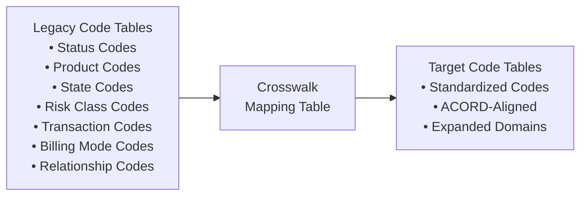

**Crosswalk Table DDL:**

```sql
CREATE TABLE migration.code_crosswalk (
    crosswalk_id        SERIAL PRIMARY KEY,
    domain_name         VARCHAR(50)  NOT NULL,  -- e.g., 'POLICY_STATUS', 'RISK_CLASS'
    source_system       VARCHAR(20)  NOT NULL,
    source_code         VARCHAR(20)  NOT NULL,
    source_description  VARCHAR(100),
    target_code         VARCHAR(20)  NOT NULL,
    target_description  VARCHAR(100),
    notes               VARCHAR(500),
    reviewed_ind        BOOLEAN DEFAULT FALSE,
    UNIQUE (domain_name, source_system, source_code)
);
```

---

## 6. Transformation Rules

### 6.1 Premium History Reconstruction

When migrating to a system that requires detailed premium history but legacy only stores summary data:

**Approach 1: Detailed Transaction Migration**
- Extract all premium transactions from legacy transaction log
- Map each transaction to target transaction format
- Replay into target in chronological order

**Approach 2: Summary + Synthetic History**
- Migrate summary premium totals (YTD, cumulative)
- Generate synthetic transaction entries to match the summary
- Flag synthetic transactions distinctly

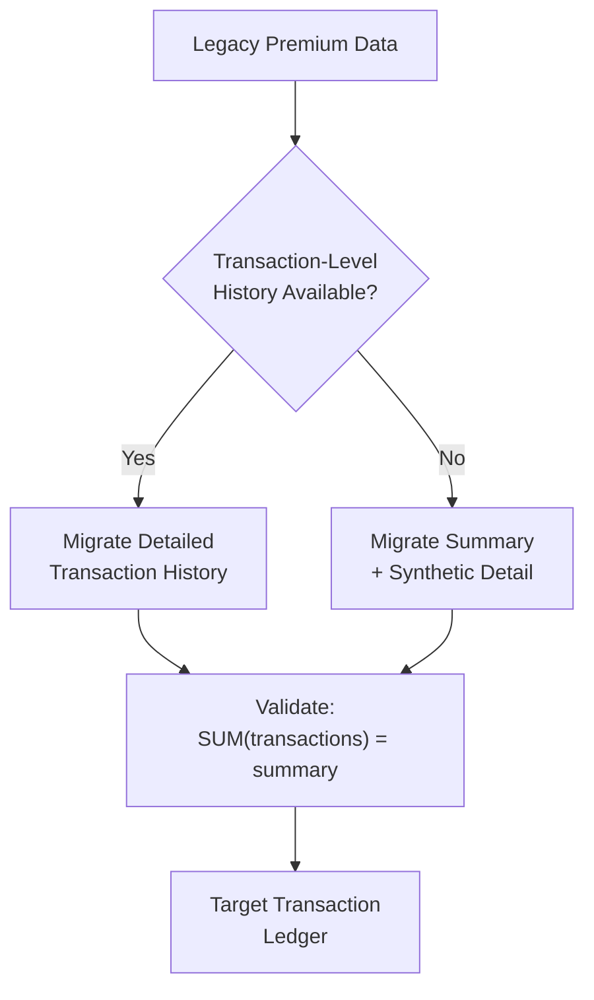

### 6.2 Cash Value Recalculation

**Approach A: Migrate as-is (Balance Forward)**
- Take the current cash value from the legacy system as the starting balance
- All future calculations proceed from this balance
- Pros: Simpler, faster
- Cons: Cannot recalculate from inception; any legacy calculation error carries forward

**Approach B: Recalculate from Inception**
- Replay all premiums, charges, credits, and transactions through the target calculation engine
- Compare target-calculated value to legacy value
- Pros: Validates target calculation engine; clean start
- Cons: Extremely complex; requires all historical rates and rules; may not reproduce legacy rounding

**Recommendation:** Most carriers use Approach A (Balance Forward) with verification that the target system can correctly process future transactions from the migrated balance.

### 6.3 Reserve Recalculation

Reserves should be **recalculated** by the target system's valuation engine after migration, not migrated as static values:

1. Migrate policy data (plan code, issue date, face amount, account value, risk class, etc.)
2. Configure target product with correct valuation parameters (mortality table, interest rate, method)
3. Run target valuation engine
4. Compare target-calculated reserves to legacy reserves
5. Investigate variances > tolerance (typically ±$1 per policy or ±0.1% of reserve)

### 6.4 Party Record Deduplication

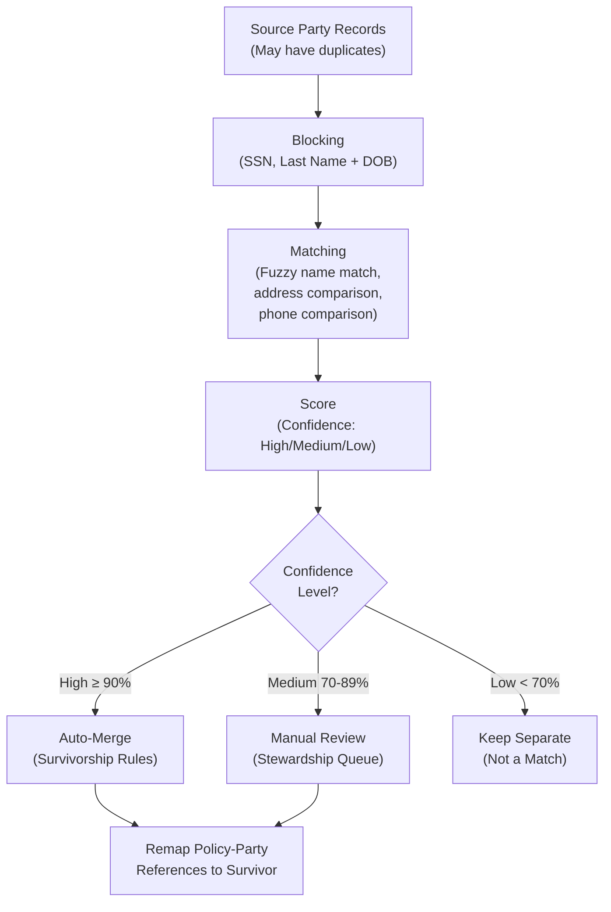

**Survivorship Rules:**

| Attribute | Rule |
|-----------|------|
| SSN | Prefer verified SSN; prefer non-null |
| Name | Prefer most recent; prefer longest (most complete) |
| Address | Prefer USPS-validated; prefer most recent |
| Phone | Prefer most recent; prefer mobile |
| Email | Prefer verified; prefer most recent |
| DOB | Prefer value validated against SSA records |

### 6.5 Address Standardization

All addresses should be standardized during migration using USPS CASS-certified software:

| Step | Action | Tool |
|------|--------|------|
| 1 | Parse raw address into components (street, city, state, zip) | Address parser |
| 2 | Standardize abbreviations (ST → Street, AVE → Avenue) | USPS reference |
| 3 | Validate against USPS database | CASS engine (Melissa, SmartyStreets) |
| 4 | Append zip+4, county FIPS, geocode | CASS engine |
| 5 | Flag undeliverable addresses | NCOA (National Change of Address) |
| 6 | Apply NCOA updates for moved individuals | NCOA processing |

### 6.6 Beneficiary Hierarchy Reconstruction

Legacy systems often store beneficiaries in flat structures that must be restructured:

| Legacy Structure | Target Structure | Transformation |
|-----------------|-----------------|----------------|
| Flat list with BENEF_TYPE = P/C/T | Hierarchical: Primary → Contingent → Tertiary | Parse BENEF_TYPE, assign sequence_number, set role_code and role_subtype_code |
| Percentage stored as integer (50) | Percentage stored as decimal (50.0000) | Cast and validate SUM = 100% per class |
| Per stirpes indicated by "PS" in name field | Separate per_stirpes_ind flag | Parse indicator from name, set boolean flag |
| Irrevocable status buried in notes | Separate irrevocable_ind flag | Text parsing of notes/remarks for "irrev" keywords |

### 6.7 Fund/Unit Reconciliation (Variable Products)

For variable life and variable annuity products:

| Step | Validation |
|------|-----------|
| 1 | Source units per fund = Target units per fund |
| 2 | Source unit value × units = Target unit value × units (within ±$0.01) |
| 3 | Source total fund allocation percentages = Target total (= 100%) |
| 4 | Source fund code maps to valid target fund code |
| 5 | Total account value = SUM of all fund values + general account value |

---

## 7. Data Validation

### 7.1 Validation Framework Overview

```mermaid
graph TD
    VAL["Validation Framework"]
    VAL --> PRE["Pre-Migration<br/>Validation"]
    VAL --> TRANS["Transformation<br/>Validation"]
    VAL --> POST["Post-Migration<br/>Validation"]
    VAL --> FIN["Financial<br/>Reconciliation"]
    VAL --> PARALLEL["Parallel Run<br/>Validation"]
    VAL --> SPOT["Spot Check<br/>(Manual)"]

    PRE --> PRE1["Source data quality"]
    PRE --> PRE2["Referential integrity"]
    PRE --> PRE3["Business rule compliance"]

    TRANS --> TRANS1["Row counts"]
    TRANS --> TRANS2["Checksums"]
    TRANS --> TRANS3["Sampling"]

    POST --> POST1["Target data quality"]
    POST --> POST2["Referential integrity"]
    POST --> POST3["Calculation verification"]

    FIN --> FIN1["Premium reconciliation"]
    FIN --> FIN2["Cash value reconciliation"]
    FIN --> FIN3["Loan balance reconciliation"]
    FIN --> FIN4["Reserve reconciliation"]

    PARALLEL --> PAR1["Transaction comparison"]
    PARALLEL --> PAR2["Result matching"]

    SPOT --> SPOT1["Random sample review"]
    SPOT --> SPOT2["Complex case review"]
```

### 7.2 Pre-Migration Validation

Run before each migration cycle:

| Check | Query/Logic | Expected Result |
|-------|-------------|-----------------|
| Policy count by status | `SELECT status_cd, COUNT(*) FROM legacy.policy GROUP BY status_cd` | Matches known inventory |
| Total face amount by product | `SELECT prod_cd, SUM(face_amt) FROM legacy.policy WHERE status='IF' GROUP BY prod_cd` | Matches actuarial reports |
| Total account value | `SELECT SUM(acct_val) FROM legacy.policy WHERE status='IF'` | Matches GL balance |
| Total loan balance | `SELECT SUM(loan_bal) FROM legacy.policy WHERE loan_bal > 0` | Matches GL balance |
| Orphan coverages | `SELECT * FROM legacy.coverage c WHERE NOT EXISTS (SELECT 1 FROM legacy.policy p WHERE p.pol_id = c.pol_id)` | Zero rows |
| Orphan beneficiaries | `SELECT * FROM legacy.beneficiary b WHERE NOT EXISTS (...)` | Zero rows |

### 7.3 Transformation Validation

Run during ETL processing:

| Check | Method | Tolerance |
|-------|--------|-----------|
| Row count: source → staging | Compare source extract count to staging table count | 0 (exact match) |
| Row count: staging → target | Compare staging to target load count | 0 (exact match) |
| Sum of amounts | `SUM(source.amount)` vs `SUM(target.amount)` | ±$0.01 total |
| Checksum (hash) | MD5/SHA hash of key fields | Exact match |
| Code mapping completeness | All source codes have a crosswalk entry | 100% |
| NULL → default | Fields mapped to defaults should have no NULLs in target | 0 NULLs |

### 7.4 Post-Migration Validation

Run after data is loaded into the target system:

| Validation Category | Specific Checks |
|--------------------|-----------------|
| **Referential Integrity** | All FK references resolve (policy→product, party→address, coverage→policy, etc.) |
| **Business Rules** | In-force policies have issue_date ≤ today; face_amount > 0 for active coverages; SUM(beneficiary_pct) = 100% per class |
| **Data Completeness** | Required fields per target schema are populated |
| **Financial Integrity** | Account value = SUM(fund values) for variable products; CSV ≤ account value; loan balance ≤ max loan value |
| **Calculation Verification** | Run target calculation engine; compare cash values, COI charges, interest credits |
| **Status Consistency** | Terminated policies have termination_date; in-force policies have no termination_date |

### 7.5 Financial Reconciliation Detail

```
┌─────────────────────────────────────────────────────────────────┐
│                  FINANCIAL RECONCILIATION REPORT                 │
│                     Migration Wave 2 — UL Products               │
│                     Date: 2026-02-15                             │
├──────────────────────────┬────────────┬────────────┬────────────┤
│ Measure                  │ Source     │ Target     │ Variance   │
├──────────────────────────┼────────────┼────────────┼────────────┤
│ Policy Count (In-Force)  │    125,432 │    125,432 │          0 │
│ Policy Count (All)       │    215,678 │    215,678 │          0 │
│ Total Face Amount        │ $45.2B     │ $45.2B     │      $0.00 │
│ Total Account Value      │ $8.73B     │ $8.73B     │    -$12.45 │
│ Total Surrender Value    │ $8.12B     │ $8.12B     │     $45.32 │
│ Total Loan Balance       │ $1.21B     │ $1.21B     │      $0.00 │
│ Total Cost Basis         │ $6.89B     │ $6.89B     │   -$234.00 │
│ Annualized Premium       │ $892M      │ $892M      │      $0.00 │
│ Total # Transactions     │ 15,234,567 │ 15,234,567 │          0 │
│ Total Transaction Amount │ $12.4B     │ $12.4B     │    -$0.03  │
├──────────────────────────┴────────────┴────────────┴────────────┤
│ PASS: All measures within tolerance                              │
│ Note: AV variance of -$12.45 across 125K policies is within     │
│       rounding tolerance (< $0.01 per policy average)            │
└─────────────────────────────────────────────────────────────────┘
```

### 7.6 Random Sample Verification

Select a stratified random sample for manual verification:

| Stratum | Sample Size | Verification Method |
|---------|-------------|-------------------|
| High face amount (> $1M) | 100% of policies | Automated + manual |
| Cash value products (in-force) | 500 policies (stratified by product) | Side-by-side screen comparison |
| Products with riders | 200 policies | Rider benefit and charge verification |
| Policies with loans | 200 policies | Loan balance and interest verification |
| Policies with beneficiary changes | 100 policies | Beneficiary hierarchy verification |
| Recently issued (< 1 year) | 100 policies | Full data verification |
| Terminated policies | 100 policies | Status and history verification |
| Edge cases (flagged during ETL) | All flagged policies | Manual review |

### 7.7 Parallel Run Validation

During the parallel run period, the same transactions are processed on both old and new systems:

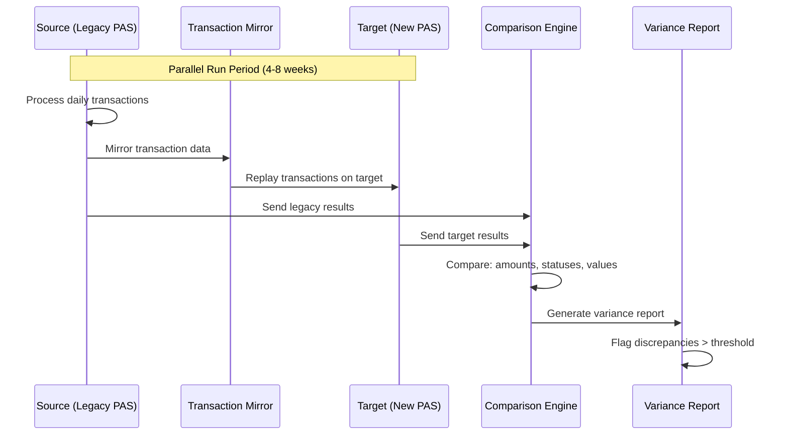

**Parallel Run Acceptance Criteria:**

| Transaction Type | Match Rate Target |
|-----------------|-------------------|
| Premium posting | > 99.9% |
| COI/expense charges | > 99.5% (rounding may cause minor variance) |
| Interest crediting | > 99.5% |
| Withdrawal processing | > 99.9% |
| Loan advance | > 99.9% |
| Death claim | > 99.9% |
| Status changes | 100% |

---

## 8. Migration Architecture

### 8.1 ETL Pipeline Architecture

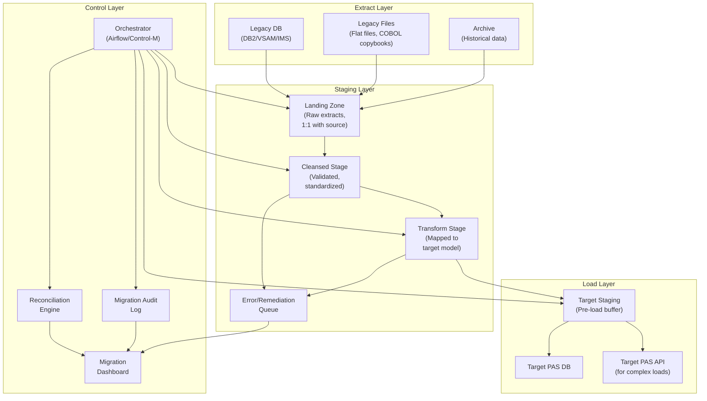

### 8.2 Staging Area Design

| Stage | Purpose | Retention |
|-------|---------|-----------|
| **Landing (Raw)** | Exact copy of source extracts; immutable audit trail | Permanent (archive after project) |
| **Cleansed** | Data quality rules applied; invalid records flagged | Until load verified |
| **Transform** | Source-to-target mapping applied; target format | Until load verified |
| **Error Queue** | Records that failed validation or transformation | Until remediated |
| **Reconciliation** | Summary counts and totals for reconciliation | Permanent |
| **Audit Log** | Every record's journey through the pipeline | Permanent |

### 8.3 Error Handling and Remediation Queue

```sql
CREATE TABLE migration.error_queue (
    error_id          BIGSERIAL PRIMARY KEY,
    batch_id          VARCHAR(30)  NOT NULL,
    stage_name        VARCHAR(20)  NOT NULL,
    source_table      VARCHAR(50)  NOT NULL,
    source_key        VARCHAR(100) NOT NULL,
    error_code        VARCHAR(20)  NOT NULL,
    error_severity    VARCHAR(10)  NOT NULL,  -- CRITICAL, HIGH, MEDIUM, LOW
    error_message     TEXT         NOT NULL,
    source_record     JSONB,
    remediation_action VARCHAR(20),           -- MANUAL_FIX, AUTO_DEFAULT, SKIP, REPROCESS
    remediated_by     VARCHAR(50),
    remediated_date   TIMESTAMP,
    notes             TEXT,
    created_timestamp TIMESTAMP NOT NULL DEFAULT NOW()
);
```

**Error Severity Classification:**

| Severity | Definition | Action |
|----------|-----------|--------|
| CRITICAL | Financial impact, policy cannot be administered | Halt migration; fix immediately |
| HIGH | Data quality issue affecting reporting or compliance | Fix before cutover |
| MEDIUM | Non-critical data gap; workaround available | Fix within hypercare |
| LOW | Cosmetic or non-impactful; nice-to-fix | Backlog for post-migration |

### 8.4 Performance Optimization

| Technique | Description | Impact |
|-----------|-------------|--------|
| Parallel extraction | Multiple extract threads reading different partitions | 3-5× extraction speed |
| Bulk loading | Use database COPY/bulk insert instead of row-by-row | 10-50× load speed |
| Partition processing | Process policies in partitions (by product, by block) | Enables restart-resume |
| Index management | Drop indexes before load, rebuild after | 2-5× load speed |
| Constraint deferral | Disable FK constraints during load, validate after | Faster load |
| Staging in memory | Use in-memory staging for transformation | Faster transformation |
| Compression | Compress staging files (gzip/zstd) | Reduce I/O |

### 8.5 Restart/Resume Capability

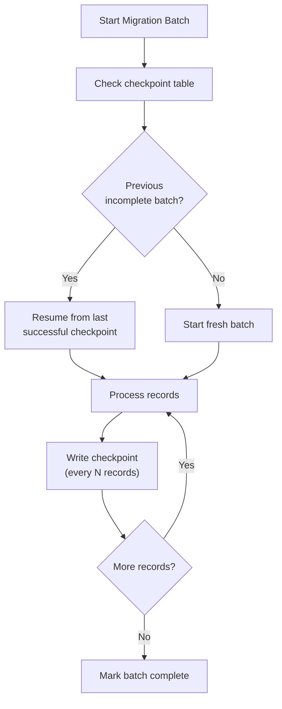

```sql
CREATE TABLE migration.checkpoint (
    checkpoint_id     BIGSERIAL PRIMARY KEY,
    batch_id          VARCHAR(30) NOT NULL,
    stage_name        VARCHAR(20) NOT NULL,
    partition_key     VARCHAR(50),
    last_processed_key VARCHAR(100) NOT NULL,
    records_processed BIGINT NOT NULL,
    records_errored   BIGINT NOT NULL DEFAULT 0,
    status            VARCHAR(10) NOT NULL,  -- RUNNING, COMPLETED, FAILED
    started_timestamp TIMESTAMP NOT NULL,
    updated_timestamp TIMESTAMP NOT NULL DEFAULT NOW()
);
```

---

## 9. Mock Migration & Dress Rehearsal

### 9.1 Mock Migration Strategy

| Mock # | Scope | Purpose | Duration |
|--------|-------|---------|----------|
| Mock 0 | 100 policies (hand-picked edge cases) | Validate mapping logic, ETL code | 1-2 weeks |
| Mock 1 | 5,000-10,000 policies (stratified sample) | End-to-end pipeline, basic validation | 2-3 weeks |
| Mock 2 | 50,000-100,000 policies (larger sample) | Performance baseline, extended validation | 3-4 weeks |
| Mock 3 | Full production volume | Dress rehearsal: timing, performance, runbook validation | 4-6 weeks |
| Mock 4 (if needed) | Full production volume | Final dress rehearsal with all fixes | 3-4 weeks |

### 9.2 Mock Migration Checklist

| # | Activity | Mock 1 | Mock 2 | Mock 3 |
|---|----------|--------|--------|--------|
| 1 | Extract source data | X | X | X |
| 2 | Run ETL pipeline end-to-end | X | X | X |
| 3 | Load into target system | X | X | X |
| 4 | Validate record counts | X | X | X |
| 5 | Financial reconciliation | X | X | X |
| 6 | Calculation verification (sample) | X | X | X |
| 7 | Process test transactions on target | — | X | X |
| 8 | Performance metrics (timing) | — | X | X |
| 9 | Execute cutover runbook | — | — | X |
| 10 | Test rollback procedures | — | — | X |
| 11 | Measure cutover window duration | — | — | X |
| 12 | User acceptance testing | — | — | X |
| 13 | Integration testing (billing, claims) | — | X | X |
| 14 | Correspondence generation | — | — | X |
| 15 | Reporting verification | — | X | X |

### 9.3 Defect Tracking

| Defect Category | Mock 1 Count | Mock 2 Count | Mock 3 Count | Target |
|----------------|-------------|-------------|-------------|--------|
| Mapping errors | 45 | 12 | 2 | 0 |
| Code crosswalk gaps | 23 | 5 | 0 | 0 |
| Transformation bugs | 18 | 8 | 1 | 0 |
| Data quality issues | 67 | 34 | 15 | < 10 |
| Performance issues | 5 | 3 | 0 | 0 |
| Target load failures | 12 | 4 | 0 | 0 |
| Calculation variances | 32 | 11 | 3 | 0 |
| **Total** | **202** | **77** | **21** | **< 10** |

### 9.4 Production Readiness Criteria

| # | Criterion | Threshold | Status |
|---|-----------|-----------|--------|
| 1 | All critical defects resolved | 0 critical open | |
| 2 | Financial reconciliation passes | 100% within tolerance | |
| 3 | Policy count matches | 100% | |
| 4 | Calculation verification passes | 100% within tolerance (±$0.01) | |
| 5 | All transaction types tested | 100% of transaction types | |
| 6 | Parallel run match rate | > 99.5% | |
| 7 | Cutover window within target | ≤ planned window (e.g., 48 hours) | |
| 8 | Rollback tested successfully | Demonstrated in Mock 3 | |
| 9 | UAT sign-off | Business sign-off obtained | |
| 10 | Regulatory notification | DOI notified if required | |

---

## 10. Cutover Strategy

### 10.1 Big Bang vs. Phased Cutover

| Approach | Description | Pros | Cons |
|----------|-------------|------|------|
| **Big Bang** | All policies migrate in a single cutover weekend | Clean break, no dual maintenance | High risk, all-or-nothing, larger cutover window |
| **Phased by Product** | Each product wave migrates separately | Lower risk per wave, lessons learned applied | Dual system operation between waves, integration complexity |
| **Phased by Status** | In-force first, then terminated/historical | Focus on operational policies first | Must handle status changes during transition |
| **Strangler Pattern** | New business on target; legacy runs off over time | Zero cutover risk for in-force | May run two systems for years |

### 10.2 Cutover Runbook

| # | Time | Activity | Owner | Duration | Rollback Step |
|---|------|----------|-------|----------|---------------|
| 1 | T-48h | Final source data extract | ETL Team | 4h | N/A |
| 2 | T-44h | Freeze source system (no new transactions) | Operations | 15min | Unfreeze |
| 3 | T-43h | Run migration ETL pipeline | ETL Team | 8h | Drop target tables |
| 4 | T-35h | Load data into target PAS | Target Team | 6h | Truncate target |
| 5 | T-29h | Financial reconciliation | QA Team | 4h | N/A (if fail → rollback) |
| 6 | T-25h | Automated validation suite | QA Team | 4h | N/A (if fail → rollback) |
| 7 | T-21h | Calculation verification (sample) | Actuarial | 4h | N/A |
| 8 | T-17h | Spot-check review | Business | 4h | N/A |
| 9 | T-13h | Integration verification (billing, GL, reinsurance) | IT Team | 4h | N/A |
| 10 | T-9h | **GO / NO-GO DECISION** | Migration Board | 1h | Rollback to source |
| 11 | T-8h | Switch DNS/routing to target | Infrastructure | 30min | Switch back |
| 12 | T-7.5h | Smoke test (login, policy search, transaction) | Business | 2h | N/A |
| 13 | T-5.5h | Process queued transactions | Operations | 2h | N/A |
| 14 | T-3.5h | Run overnight batch (billing, valuation) | Operations | 3h | N/A |
| 15 | T-0.5h | Final verification | QA + Business | 30min | N/A |
| 16 | T-0h | **CUTOVER COMPLETE — Go Live** | Migration Board | — | — |

### 10.3 Point of No Return

Establish a clear **Point of No Return (PNR)** — after which rollback becomes impractical:

| Phase | Rollback Feasibility |
|-------|---------------------|
| Before data load | Easy — truncate target, unfreeze source |
| After data load, before integration switch | Medium — truncate target, unfreeze source |
| After integration switch, before transactions processed | Medium — reverse switch, reconcile queued transactions |
| After transactions processed on target | Difficult — must reverse transactions or migrate back |
| **PNR → After first production transactions on target** | **Rollback requires reverse migration** |

### 10.4 Rollback Plan

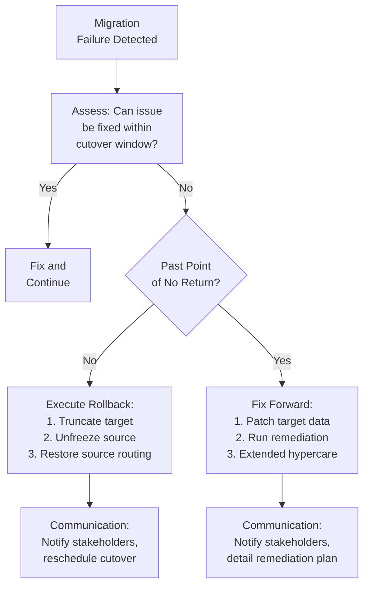

### 10.5 Communication Plan

| Audience | Message | Timing | Channel |
|----------|---------|--------|---------|
| Policyholders | No action required; system upgrade | T-30 days | Letter + email |
| Agents/Producers | System downtime; new portal URL; training | T-14 days | Email + webinar |
| Call Center | System frozen period; scripting for customer calls | T-7 days | Training session |
| IT Operations | Cutover runbook; on-call schedule | T-3 days | War room setup |
| Executives | Go/No-Go status; risk assessment | T-1 day | Executive briefing |
| Regulators (if required) | System change notification | T-30 days | Formal letter |

---

## 11. Historical Data

### 11.1 History Depth Decision

| Data Type | Recommended Migration Depth | Rationale |
|-----------|---------------------------|-----------|
| Policy master record | All policies (any status) | Regulatory, audit, reinstatement requests |
| Premium transactions | 7-10 years | Tax reporting (7-year statute), experience studies |
| Financial transactions (non-premium) | 7-10 years | Audit trail, regulatory |
| Claim history | All claims | Open claims + regulatory retention |
| Correspondence history | 7 years | Regulatory correspondence retention |
| Notes/diary | 5-7 years | Operational, legal |
| Agent production | 10 years | Commission vesting, production credits |
| Transaction images (checks, forms) | 7 years | Regulatory retention |

### 11.2 Archival Strategy for Older Data

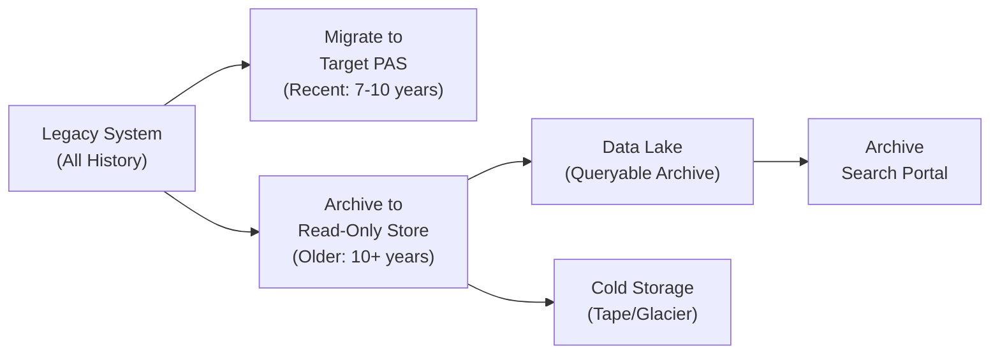

### 11.3 Legal/Regulatory Retention Requirements

| Jurisdiction | Data Type | Minimum Retention |
|-------------|-----------|-------------------|
| Federal (IRS) | Tax-related records | 7 years from tax year |
| State (typical) | Policy records | Duration of policy + 7-10 years |
| State (typical) | Claim records | 7-10 years from settlement |
| State (typical) | Correspondence | 5-7 years |
| NAIC Model Regulation | Market conduct records | 5 years |
| SOX (public companies) | Financial records | 7 years |
| HIPAA (if health data) | Medical information | 6 years |
| ERISA (qualified plans) | Plan records | 6 years |

---

## 12. Complete Migration Project Plan

### 12.1 Work Breakdown Structure (WBS)

```
1.0 Migration Project
├── 1.1 Planning & Setup
│   ├── 1.1.1 Project charter and scope definition
│   ├── 1.1.2 Resource onboarding and training
│   ├── 1.1.3 Environment setup (staging, target)
│   ├── 1.1.4 Tool procurement (ETL, DQ, comparison)
│   └── 1.1.5 Vendor coordination (legacy vendor, target vendor)
├── 1.2 Source Analysis
│   ├── 1.2.1 Legacy data profiling
│   ├── 1.2.2 Legacy business rule documentation
│   ├── 1.2.3 Data quality assessment
│   ├── 1.2.4 Source-to-target gap analysis
│   └── 1.2.5 Data quality remediation plan
├── 1.3 Data Mapping
│   ├── 1.3.1 Field-level mapping (per domain)
│   ├── 1.3.2 Code table crosswalks
│   ├── 1.3.3 Transformation rule definition
│   ├── 1.3.4 Mapping review and approval
│   └── 1.3.5 Data dictionary for target
├── 1.4 ETL Development
│   ├── 1.4.1 Extract development (per source)
│   ├── 1.4.2 Transformation development (per domain)
│   ├── 1.4.3 Load development (per target entity)
│   ├── 1.4.4 Error handling and remediation queue
│   ├── 1.4.5 Reconciliation engine
│   ├── 1.4.6 Orchestration/scheduling
│   └── 1.4.7 Unit testing of ETL components
├── 1.5 Mock Migrations
│   ├── 1.5.1 Mock 0 (edge cases — 100 policies)
│   ├── 1.5.2 Mock 1 (sample — 10K policies)
│   ├── 1.5.3 Mock 2 (medium — 100K policies)
│   ├── 1.5.4 Mock 3 (full volume — dress rehearsal)
│   └── 1.5.5 Mock 4 (contingency if Mock 3 fails)
├── 1.6 Validation
│   ├── 1.6.1 Pre-migration validation checks
│   ├── 1.6.2 Post-migration validation checks
│   ├── 1.6.3 Financial reconciliation
│   ├── 1.6.4 Calculation verification
│   ├── 1.6.5 Random sample manual verification
│   └── 1.6.6 Parallel run execution and comparison
├── 1.7 Cutover
│   ├── 1.7.1 Cutover runbook development
│   ├── 1.7.2 Cutover rehearsal (during Mock 3)
│   ├── 1.7.3 Go/No-Go decision criteria
│   ├── 1.7.4 Production cutover execution
│   └── 1.7.5 Post-cutover verification
├── 1.8 Hypercare
│   ├── 1.8.1 Hypercare support plan
│   ├── 1.8.2 Defect triage and remediation
│   ├── 1.8.3 Post-migration data fixes
│   ├── 1.8.4 Performance monitoring
│   └── 1.8.5 Knowledge transfer to operations
└── 1.9 Project Closure
    ├── 1.9.1 Legacy system decommission plan
    ├── 1.9.2 Archive legacy data
    ├── 1.9.3 Lessons learned
    └── 1.9.4 Final project report
```

### 12.2 Timeline Summary

| Phase | Duration | Key Milestones |
|-------|----------|---------------|
| Planning & Setup | 2 months | Project charter, environments ready |
| Source Analysis | 3 months | Profiling complete, gap analysis delivered |
| Data Mapping | 3 months (overlaps with analysis) | All mappings approved |
| ETL Development | 5 months | All ETL code complete and unit tested |
| Mock Migrations | 6 months (Mock 1 → Mock 3) | Each mock achieves progressive quality gates |
| Parallel Run | 2 months | Match rate > 99.5% achieved |
| Cutover | 1 weekend | Go-Live |
| Hypercare | 2 months | All critical defects resolved |
| **Total** | **18-24 months** (per wave) | |

---

## 13. Sample Data Mapping Document

### Policy Domain — Core Mapping

| Map ID | Source Table | Source Column | Source Type | Map Type | Rule | Target Table | Target Column | Target Type | Required |
|--------|-------------|-------------|------------|----------|------|-------------|--------------|------------|----------|
| MAP-POL-001 | POLMSTR | POL-NBR | PIC X(15) | DIRECT | Trim leading/trailing spaces | policy | policy_number | VARCHAR(20) | Y |
| MAP-POL-002 | POLMSTR | CO-CD | PIC X(3) | LOOKUP | Map via company_crosswalk | policy | company_code | VARCHAR(10) | Y |
| MAP-POL-003 | POLMSTR | PROD-CD | PIC X(8) | LOOKUP | Map via product_crosswalk | policy | product_plan_id | BIGINT (FK) | Y |
| MAP-POL-004 | POLMSTR | STAT-CD | PIC X(2) | LOOKUP | Map via status_crosswalk | policy | policy_status_code | VARCHAR(10) | Y |
| MAP-POL-005 | POLMSTR | ISS-DT | PIC 9(8) COMP-3 | DIRECT | Convert packed decimal YYYYMMDD to DATE | policy | issue_date | DATE | Y |
| MAP-POL-006 | POLMSTR | POL-DT | PIC 9(8) COMP-3 | DIRECT | Convert packed decimal YYYYMMDD to DATE | policy | policy_date | DATE | Y |
| MAP-POL-007 | POLMSTR | FACE-AMT | PIC S9(9)V99 COMP-3 | DIRECT | Convert packed decimal to DECIMAL | policy | face_amount | DECIMAL(15,2) | Y |
| MAP-POL-008 | POLMSTR | MODE-CD | PIC X(1) | LOOKUP | A→ANNUAL, S→SEMI, Q→QUARTERLY, M→MONTHLY | policy | premium_mode_code | VARCHAR(5) | Y |
| MAP-POL-009 | POLMSTR | ANN-PREM | PIC S9(9)V99 COMP-3 | DIRECT | Convert packed decimal | policy | annual_premium_amount | DECIMAL(15,2) | N |
| MAP-POL-010 | (derived) | — | — | DERIVE | ANN-PREM ÷ mode_factor(MODE-CD) | policy | modal_premium_amount | DECIMAL(15,2) | N |
| MAP-POL-011 | POLMSTR | ACCT-VAL | PIC S9(11)V9999 COMP-3 | DIRECT | Convert packed decimal | policy | total_account_value | DECIMAL(15,4) | N |
| MAP-POL-012 | POLMSTR | ISS-ST | PIC X(2) | DIRECT | Validate against state table | policy | issue_state_code | VARCHAR(2) | Y |
| MAP-POL-013 | (none) | — | — | DEFAULT | 'MIGRATED' | policy | admin_system_code | VARCHAR(10) | Y |
| MAP-POL-014 | POLMSTR | TAX-QUAL | PIC X(1) | LOOKUP | Q→QUAL_IRA, N→NQUAL, R→QUAL_ROTH, ... | policy | tax_qualification_code | VARCHAR(10) | Y |
| MAP-POL-015 | POLMSTR | MEC-IND | PIC X(1) | CONDITIONAL | Y→MEC, N→NOT_MEC, NULL→PENDING | policy | mec_status_code | VARCHAR(10) | Y |

---

## 14. Migration Architecture Diagrams

### 14.1 End-to-End Migration Architecture

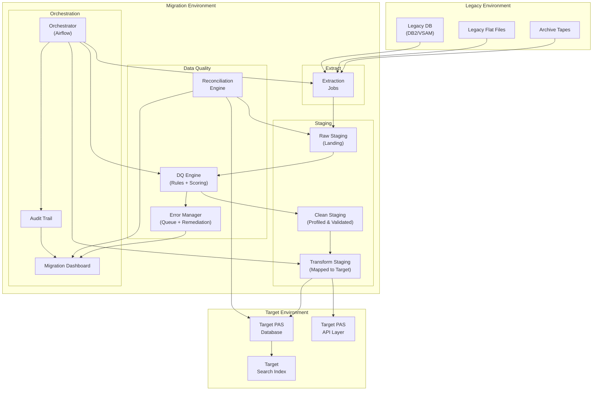

### 14.2 Parallel Run Architecture

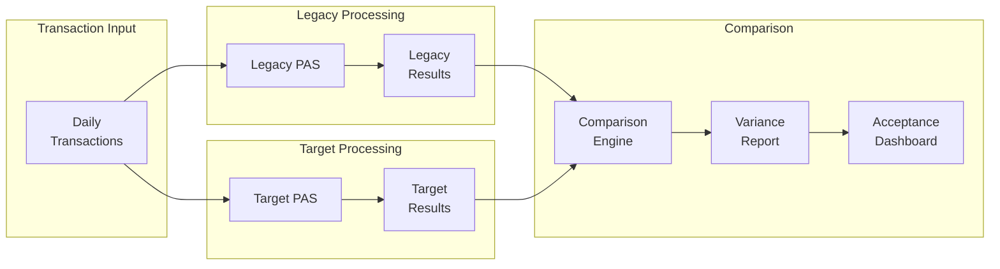

---

## 15. Validation Report Templates

### 15.1 Migration Summary Report

```
═══════════════════════════════════════════════════════════════
              MIGRATION VALIDATION SUMMARY REPORT
              Wave: [Wave 2 — Whole Life / UL]
              Mock: [Mock 3 — Full Volume]
              Date: [2026-02-15]
═══════════════════════════════════════════════════════════════

1. RECORD COUNT RECONCILIATION
───────────────────────────────────────────────────────────────
Entity             Source Count  Target Count  Variance  Status
───────────────────────────────────────────────────────────────
Policies           215,678       215,678       0         PASS
Coverages          312,456       312,456       0         PASS
Party (Individual) 198,345       198,345       0         PASS
Party (Org/Trust)    8,234         8,234       0         PASS
Addresses          425,678       425,678       0         PASS
Beneficiaries      387,123       387,123       0         PASS
Transactions     15,234,567   15,234,567       0         PASS
Agent Records       12,456        12,456       0         PASS
───────────────────────────────────────────────────────────────

2. FINANCIAL RECONCILIATION
───────────────────────────────────────────────────────────────
Measure                 Source           Target          Var
───────────────────────────────────────────────────────────────
Total Face Amount       $45,234,567,890  $45,234,567,890 $0
Total Account Value     $8,734,123,456   $8,734,123,444  -$12
Total Surrender Value   $8,123,987,654   $8,123,987,699  $45
Total Loan Balance      $1,213,456,789   $1,213,456,789  $0
Total Annualized Prem   $892,345,678     $892,345,678    $0
───────────────────────────────────────────────────────────────
Overall Financial Reconciliation: PASS (within tolerance)

3. DATA QUALITY SCORE
───────────────────────────────────────────────────────────────
Domain          Completeness  Validity  Consistency  Overall
───────────────────────────────────────────────────────────────
Policy Core     100.0%        99.95%    99.92%       99.96%
Party           99.98%        99.90%    99.85%       99.91%
Financial       100.0%        100.0%    99.99%       100.0%
Coverage        99.99%        99.95%    99.90%       99.95%
───────────────────────────────────────────────────────────────

4. ERROR SUMMARY
───────────────────────────────────────────────────────────────
Severity  Count   Resolved  Open  Trend vs Mock 2
───────────────────────────────────────────────────────────────
Critical  0       0         0     ↓ from 3
High      2       1         1     ↓ from 8
Medium    15      10        5     ↓ from 34
Low       21      12        9     ↓ from 67
───────────────────────────────────────────────────────────────

5. GO / NO-GO RECOMMENDATION: [CONDITIONAL GO]
   Condition: Resolve 1 remaining HIGH defect before cutover.
```

---

## 16. Risk Register

### 16.1 Migration Risk Register

| ID | Risk | Likelihood | Impact | Score | Mitigation | Owner |
|----|------|-----------|--------|-------|------------|-------|
| R01 | Undocumented legacy business rules cause incorrect transformation | High | Critical | 20 | Legacy SME deep dives; multiple mock migrations; actuarial validation | Data Architect |
| R02 | Data quality issues in source require extensive remediation | High | High | 16 | Early data profiling; automated DQ rules; remediation queue with escalation | DQ Lead |
| R03 | Cutover window exceeded | Medium | Critical | 15 | Performance tuning; parallel extraction; rehearsals with timing | Migration Lead |
| R04 | Financial reconciliation fails | Medium | Critical | 15 | Progressive reconciliation through mocks; narrow tolerance thresholds; actuarial review | QA Lead |
| R05 | Legacy system freeze causes business disruption | Medium | High | 12 | Minimize freeze window; communicate early; queue critical transactions | Operations |
| R06 | Target system cannot handle data volume | Medium | High | 12 | Performance testing in Mock 2/3; capacity planning; vendor coordination | Target PM |
| R07 | Party deduplication creates incorrect merges | Medium | High | 12 | Conservative matching thresholds; manual review for medium-confidence; stewardship | Data Steward |
| R08 | Historical data gaps cannot be reconstructed | Medium | Medium | 9 | Early archive extraction; summary-to-detail reconstruction; regulatory review of retention requirements | Data Architect |
| R09 | Staff turnover (legacy SMEs unavailable) | Medium | High | 12 | Document knowledge early; cross-train; contract for extended support | PM |
| R10 | Regulatory concerns about migration quality | Low | Critical | 10 | Proactive DOI communication; demonstrate validation framework; invite regulatory review | Compliance |
| R11 | Integration failures post-cutover (billing, GL, reinsurance) | Medium | High | 12 | Integration testing in each mock; parallel run includes integration flows | Integration Lead |
| R12 | Scope creep (additional data domains requested mid-project) | High | Medium | 12 | Firm scope definition; change control board; wave planning | PM |

### 16.2 Risk Scoring Matrix

|  | **Minimal Impact** | **Low Impact** | **Medium Impact** | **High Impact** | **Critical Impact** |
|--|-------------------|---------------|------------------|----------------|-------------------|
| **Very High** | 5 | 10 | 15 | 20 | **25** |
| **High** | 4 | 8 | 12 | **16** | **20** |
| **Medium** | 3 | 6 | **9** | **12** | **15** |
| **Low** | 2 | 4 | 6 | 8 | **10** |
| **Very Low** | 1 | 2 | 3 | 4 | 5 |

---

## 17. Implementation Guidance

### 17.1 Lessons Learned from Industry

| Lesson | Detail |
|--------|--------|
| **Start data profiling on Day 1** | The #1 cause of migration delays is discovering data quality issues late |
| **Invest in automation** | Manual validation doesn't scale; invest in automated reconciliation and comparison |
| **Don't underestimate party data** | Party/customer migration (dedup, standardization, enrichment) is often 30-40% of total effort |
| **Actuaries must be embedded** | Actuarial validation is on the critical path; allocate dedicated actuarial resources |
| **Plan for 4+ mock migrations** | Each mock uncovers new issues; don't expect mock 1 to be clean |
| **Preserve original policy numbers** | Changing policy numbers causes massive downstream impacts (billing, correspondence, agents) |
| **Document everything** | Future audits will ask "how did you determine this value during migration?" — have the answer |
| **Test transactions, not just data** | Migrated data must be processable; test billing cycles, claims, service requests |
| **Budget 20-30% contingency** | Migration projects consistently exceed initial estimates |
| **Consider a migration factory** | Repeatable pipeline that handles each wave, not a one-off for each product block |

### 17.2 Tool Selection Guide

| Tool Category | Options | Selection Criteria |
|--------------|---------|-------------------|
| ETL | Informatica, DataStage, Talend, Apache Spark, AWS Glue | Volume, complexity, team skills |
| Data Quality | Informatica DQ, Trillium, Melissa, Great Expectations | PII handling, address standardization, matching |
| Comparison | Beyond Compare (data), custom SQL, Datacompy (Python) | Volume, precision, reporting |
| Orchestration | Airflow, Control-M, Autosys | Enterprise standards, complexity |
| Test Data | Delphix, custom masking scripts | PII compliance, data volume |
| Project Tracking | Jira, Azure DevOps | Enterprise standards |
| Documentation | Confluence, SharePoint, Erwin (data models) | Accessibility, version control |

### 17.3 Anti-Patterns to Avoid

| Anti-Pattern | Consequence | Better Approach |
|-------------|-------------|-----------------|
| "We'll fix data quality after migration" | Garbage in, garbage out; issues compound | Fix at source or during transformation |
| "Legacy SMEs aren't needed — we have documentation" | Undocumented rules cause silent failures | Embed legacy SMEs in the team |
| "One mock migration is enough" | First mock always has significant defects | Plan for 3-4 mocks minimum |
| "We can do cutover in one night" | Full-volume migration of 1M+ policies takes time | Plan for 48-72 hour cutover window |
| "Parallel run is optional" | No confidence in target system accuracy | Always run parallel for cash-value products |
| "We'll migrate everything at once" | Overwhelming scope, unmanageable risk | Phase by product complexity |
| "The vendor handles migration" | Carrier retains responsibility for data quality | Carrier must own validation and sign-off |

---

*This article is part of the Life Insurance PAS Architect's Encyclopedia. For related topics, see Article 42 (Canonical Data Model), Article 43 (Data Warehousing & Analytics), and Article 47 (Testing Strategies).*
