# Article 45: Reinsurance Administration for Life Insurance PAS

## Table of Contents

1. [Introduction](#1-introduction)
2. [Reinsurance Overview](#2-reinsurance-overview)
3. [Treaty Types](#3-treaty-types)
4. [Treaty Management](#4-treaty-management)
5. [Cession Processing](#5-cession-processing)
6. [Treaty Accounting](#6-treaty-accounting)
7. [Bordereau Reporting](#7-bordereau-reporting)
8. [Settlement Processing](#8-settlement-processing)
9. [Retrocession](#9-retrocession)
10. [Financial Reporting](#10-financial-reporting)
11. [Reinsurance Data Requirements](#11-reinsurance-data-requirements)
12. [Complete Data Model (25+ Entities)](#12-complete-data-model-25-entities)
13. [Cession Calculation Examples](#13-cession-calculation-examples)
14. [Architecture](#14-architecture)
15. [Integration: PAS-to-Reinsurance Data Flow](#15-integration-pas-to-reinsurance-data-flow)
16. [Implementation Guidance](#16-implementation-guidance)

---

## 1. Introduction

Reinsurance is the mechanism by which a life insurance company (the **cedant** or **ceding company**) transfers a portion of its risk to another insurer (the **reinsurer**). In a Policy Administration System context, reinsurance administration involves the systematic identification of risks that qualify for cession, calculation of ceded amounts, reporting to reinsurers, and processing of financial settlements.

### 1.1 Why Reinsurance Matters to PAS Architects

| Aspect | PAS Impact |
|--------|-----------|
| **Data Integration** | PAS must feed policy-level data (face amount, risk class, age, premium) to the reinsurance system in real time or batch |
| **Calculation Engine** | Cession amounts, ceded premiums, and claim recoveries are calculated based on treaty terms stored in configuration |
| **Financial Integrity** | Ceded premiums, recoveries, and reserve credits flow to the general ledger and statutory reporting |
| **Regulatory Compliance** | Schedule S of the Annual Statement requires detailed reinsurance reporting |
| **Product Design** | Retention limits and reinsurance availability influence maximum face amounts and underwriting guidelines |
| **Claims Processing** | Death claims must trigger reinsurance recovery calculations for ceded amounts |

### 1.2 Key Terminology

| Term | Definition |
|------|-----------|
| **Cedant / Ceding Company** | The direct writer (insurance company) that transfers risk |
| **Reinsurer** | The company that assumes the risk |
| **Retrocessionaire** | A reinsurer that accepts risk from another reinsurer |
| **Retention** | The amount of risk the cedant keeps for its own account |
| **Cession** | The amount of risk transferred to the reinsurer |
| **Treaty** | The agreement between cedant and reinsurer defining terms of risk transfer |
| **Facultative** | Individual risk placement (case-by-case) |
| **Automatic (Obligatory)** | Risk transfer that occurs automatically when predefined criteria are met |
| **Bordereau** | Periodic report listing individual ceded policies and financial activity |
| **Net Amount at Risk (NAR)** | Death benefit minus account value (or reserve); the actual mortality risk |
| **Cession Rate** | The percentage or formula by which risk is shared with the reinsurer |

---

## 2. Reinsurance Overview

### 2.1 Purpose of Reinsurance

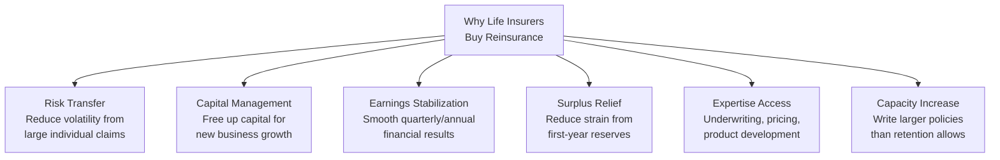

### 2.2 Reinsurance Market Structure

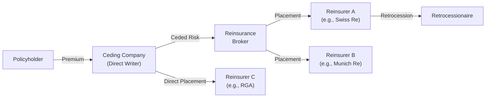

**Major Life Reinsurers (Global):**

| Reinsurer | Headquarters | Key Markets |
|-----------|-------------|-------------|
| Swiss Re | Zurich, Switzerland | Global |
| Munich Re | Munich, Germany | Global |
| RGA (Reinsurance Group of America) | St. Louis, USA | N. America, Asia Pacific |
| Hannover Re | Hannover, Germany | Global |
| SCOR | Paris, France | Global |
| General Re (Berkshire Hathaway) | Stamford, USA | N. America, Europe |
| Canada Life Re | Toronto, Canada | N. America |
| Pacific Life Re | London, UK | Asia Pacific, Europe |

### 2.3 Retention Strategy

| Factor | Impact on Retention |
|--------|-------------------|
| Surplus / Capital | Higher surplus → higher retention capacity |
| Risk appetite | Conservative → lower retention; aggressive → higher retention |
| Product type | Term (higher mortality risk) → lower retention; UL (lower NAR) → higher retention |
| Portfolio concentration | High concentration in one risk class → lower retention for diversification |
| Reinsurance cost | High reinsurance pricing → retain more; low pricing → cede more |
| Regulatory capital | Risk-based capital requirements influence retention decisions |

**Typical Retention Levels (US Market):**

| Company Size | Typical Automatic Retention | Typical Facultative Limit |
|-------------|---------------------------|--------------------------|
| Small (< $5B assets) | $1M - $5M | $10M - $25M |
| Medium ($5B - $50B) | $5M - $15M | $25M - $50M |
| Large (> $50B) | $15M - $50M | $50M+ |

---

## 3. Treaty Types

### 3.1 Proportional Treaties

In proportional treaties, the cedant and reinsurer share premiums and losses in a fixed proportion.

#### 3.1.1 Quota Share

The reinsurer assumes a fixed percentage of every risk that falls within the treaty scope.

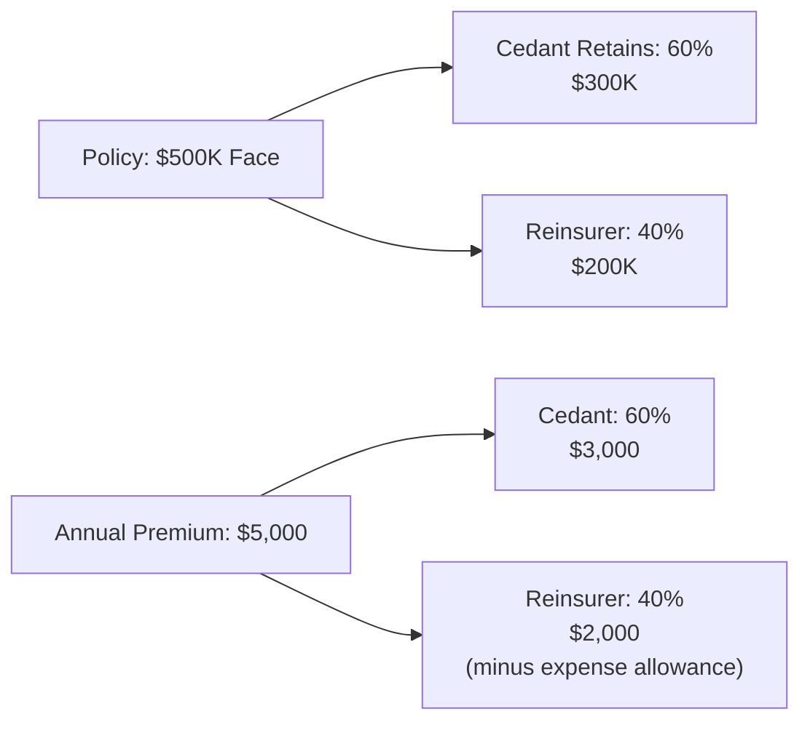

| Attribute | Value |
|-----------|-------|
| Cession Percentage | Fixed (e.g., 40%) |
| Premium Sharing | Same percentage as risk |
| Claim Sharing | Same percentage as risk |
| Expense Allowance | Reinsurer pays cedant a commission (e.g., 25-35% of ceded premium) |
| Use Case | New company needing surplus relief; small company increasing capacity |

#### 3.1.2 Surplus Treaty

The reinsurer assumes the amount that exceeds the cedant's retention, up to a specified number of "lines" (multiples of retention).

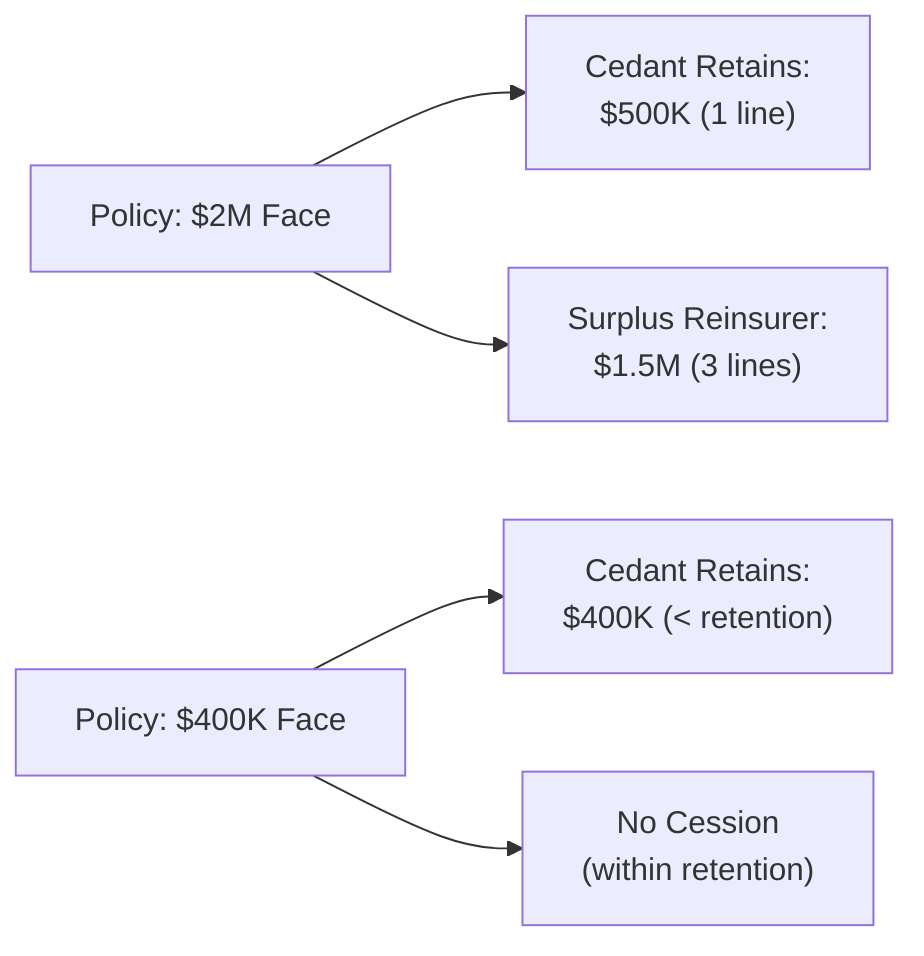

| Attribute | Value |
|-----------|-------|
| Retention | Fixed dollar amount (e.g., $500K) |
| Capacity | N lines × retention (e.g., 5 lines × $500K = $2.5M total capacity) |
| Cession Amount | Face Amount − Retention (up to treaty capacity) |
| Cession Percentage | Varies by policy: (Face − Retention) / Face |
| Premium Sharing | Same percentage as cession |
| Use Case | Most common form for individual life; allows retention on small policies |

#### 3.1.3 Coinsurance

The reinsurer assumes a proportional share of the policy, including premiums, reserves, and all financial obligations.

| Attribute | Value |
|-----------|-------|
| Reserve Transfer | Yes — reinsurer holds statutory reserves on ceded portion |
| Asset Transfer | Yes — assets backing reserves transfer to reinsurer |
| Accounting | Policy "disappears" from cedant's books for ceded share |
| Use Case | Block transfers, novation, surplus relief |

#### 3.1.4 Modified Coinsurance (Mod-Co)

Similar to coinsurance, but the cedant retains the assets and pays the reinsurer an investment income adjustment.

| Attribute | Value |
|-----------|-------|
| Reserve Transfer | Economically yes, but cedant holds reserve assets |
| Asset Transfer | No — cedant retains invested assets |
| Investment Adjustment | Cedant pays reinsurer an interest rate on reserves |
| Use Case | Cedant wants surplus relief without transferring assets |

#### 3.1.5 Coinsurance with Funds Withheld

The cedant retains the reserves and assets, but credits the reinsurer's share via a funds withheld account.

### 3.2 Non-Proportional Treaties

#### 3.2.1 Yearly Renewable Term (YRT)

The reinsurer covers the **Net Amount at Risk** (NAR) for a one-year renewable term. Premiums are based on YRT rates applied to the NAR.

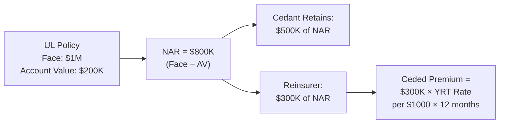

| Attribute | Value |
|-----------|-------|
| Premium Basis | YRT rates × ceded NAR (rates vary by age, gender, risk class, duration) |
| Coverage Period | One year, automatically renewed |
| Reserve | Minimal (one-year term) |
| NAR Recalculation | Monthly or annually as account value changes |
| Use Case | Universal life, variable life, any cash-value product where NAR declines over time |

### 3.3 Facultative Reinsurance

For individual risks that:
- Exceed automatic treaty capacity
- Don't fit within treaty terms (e.g., substandard risk classes)
- Require special underwriting collaboration

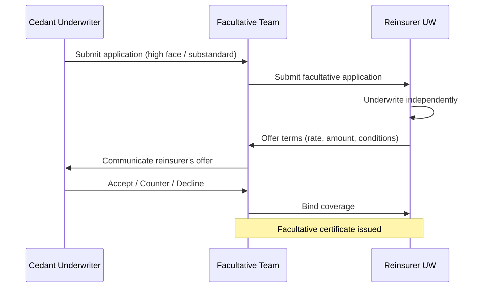

| Attribute | Value |
|-----------|-------|
| Submission | Individual risk basis (application, medical records, financials) |
| Underwriting | Independent UW by reinsurer |
| Binding | Written certificate for each risk |
| Timeline | 5-15 business days for standard; longer for complex |
| Cost | Higher per-unit cost than automatic (due to individual UW expense) |

---

## 4. Treaty Management

### 4.1 Treaty Data Model

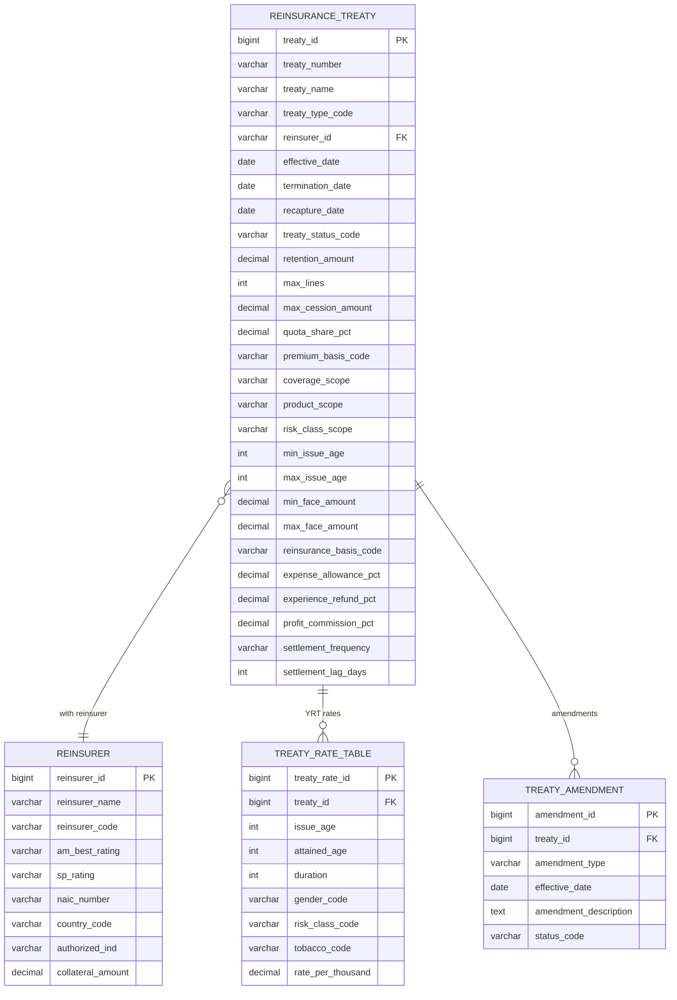

### 4.2 Treaty Lifecycle

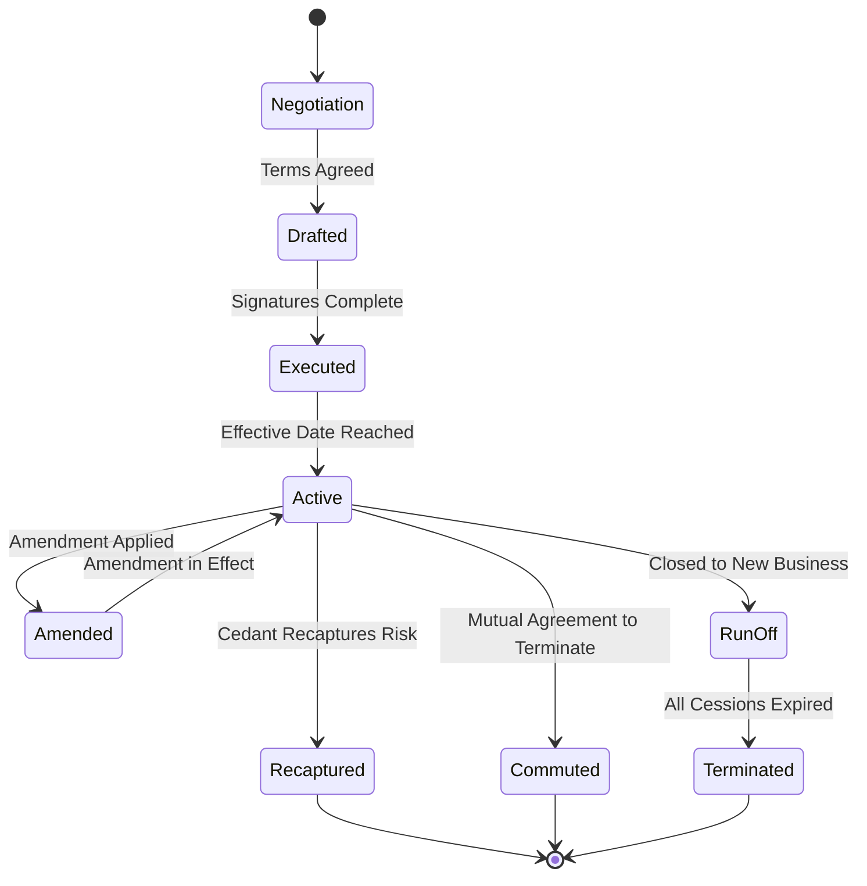

### 4.3 Treaty Negotiation and Placement

| Phase | Activities | Key Documents |
|-------|-----------|--------------|
| **Pre-Placement** | Risk analysis, retention study, coverage gap identification | Retention study report |
| **Marketing** | Prepare submission, distribute to reinsurers (directly or via broker) | Reinsurance submission package |
| **Quoting** | Reinsurers analyze cedant's experience, rate the risk, propose terms | Quote letter |
| **Negotiation** | Negotiate rates, retention, expense allowance, terms | Term sheet |
| **Binding** | Agree on final terms, exchange letters of intent | Binder / LOI |
| **Documentation** | Draft and execute treaty document | Executed treaty |
| **Implementation** | Configure in reinsurance admin system, update PAS | Configuration specs |

### 4.4 Treaty Commutation / Recapture

**Commutation:** Cedant and reinsurer agree to terminate the treaty, with the reinsurer paying a lump sum to extinguish all future obligations.

**Recapture:** Cedant exercises its contractual right (after a specified duration, typically 10 years) to take back ceded risk.

| Aspect | Commutation | Recapture |
|--------|-------------|-----------|
| Trigger | Mutual agreement | Cedant's contractual right |
| Payment | Lump sum settlement based on reserve calculation | Typically no payment (or recapture fee) |
| Timing | Any time by mutual consent | After recapture period (e.g., 10 years) |
| Impact | All future obligations extinguished | Cedant assumes ceded reserves and risk |
| Accounting | Gain/loss on commutation | Reserve assumption |

---

## 5. Cession Processing

### 5.1 Automatic Cession Rules

When a new policy is issued (or a face amount increase is processed), the cession engine evaluates:

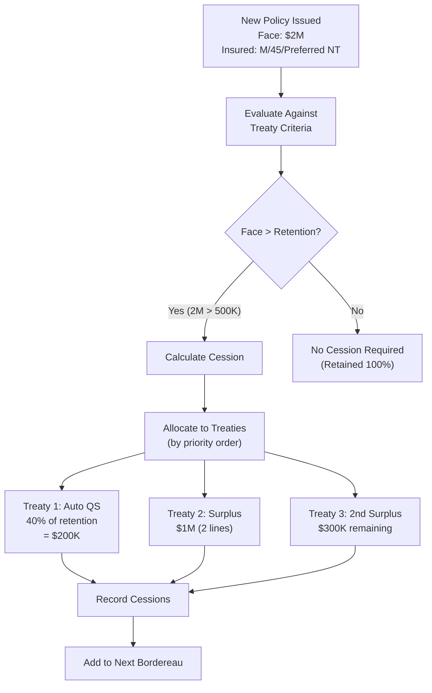

### 5.2 Cession Calculation Engine

#### Algorithm: Multi-Treaty Cession Allocation

```
INPUT: policy_face_amount, retention, treaties[] (ordered by priority)

remaining = policy_face_amount
cedant_retained = MIN(policy_face_amount, retention)
remaining = remaining - cedant_retained

FOR EACH treaty IN treaties (ordered by application_priority):
    IF remaining <= 0:
        BREAK
    
    CASE treaty.type:
        QUOTA_SHARE:
            cession_amount = policy_face_amount × treaty.quota_share_pct
            cedant_retained = cedant_retained - cession_amount  -- Adjusts retention
            
        SURPLUS:
            max_cession = treaty.max_lines × retention
            cession_amount = MIN(remaining, max_cession)
            remaining = remaining - cession_amount
            
        YRT:
            cession_nar = MIN(remaining_nar, treaty_capacity)
            remaining_nar = remaining_nar - cession_nar
            
        FACULTATIVE:
            -- Already placed individually during underwriting
            cession_amount = facultative_certificate.amount
            remaining = remaining - cession_amount
    
    CREATE cession_record(treaty, cession_amount, cession_percentage)

IF remaining > 0:
    FLAG: "Insufficient reinsurance capacity — manual review required"
```

### 5.3 Cession Record Structure

| Attribute | Type | Description |
|-----------|------|-------------|
| `cession_id` | BIGINT (PK) | Surrogate key |
| `policy_id` | BIGINT (FK) | Reference to Policy |
| `coverage_id` | BIGINT (FK) | Reference to Coverage |
| `treaty_id` | BIGINT (FK) | Reference to Treaty |
| `reinsurer_id` | BIGINT (FK) | Reference to Reinsurer |
| `cession_type_code` | VARCHAR(10) | AUTOMATIC, FACULTATIVE |
| `cession_status_code` | VARCHAR(10) | ACTIVE, RECAPTURED, TERMINATED, COMMUTED |
| `cession_effective_date` | DATE | Date cession became effective |
| `cession_termination_date` | DATE | Date cession terminated |
| `original_cession_amount` | DECIMAL(15,2) | Original ceded face amount |
| `current_cession_amount` | DECIMAL(15,2) | Current ceded face amount (may change due to face decreases) |
| `cession_percentage` | DECIMAL(7,5) | Percentage of total face ceded to this treaty |
| `retention_amount` | DECIMAL(15,2) | Cedant's retained amount on this policy |
| `net_amount_at_risk` | DECIMAL(15,4) | Current NAR for this cession (for YRT) |
| `ceded_nar` | DECIMAL(15,4) | Ceded portion of NAR |
| `insured_age_at_cession` | INT | Insured's age when ceded |
| `insured_gender_code` | VARCHAR(1) | Gender at cession |
| `risk_class_code` | VARCHAR(10) | Risk class at cession |
| `tobacco_class_code` | VARCHAR(5) | Tobacco class |
| `table_rating` | INT | Substandard table rating |
| `flat_extra_amount` | DECIMAL(10,4) | Flat extra per $1000 |
| `flat_extra_duration` | INT | Duration of flat extra |
| `facultative_cert_number` | VARCHAR(30) | Facultative certificate number |
| `created_timestamp` | TIMESTAMP | Record creation time |

### 5.4 Jumbo / Large Case Handling

For very large policies that exceed all automatic treaty capacity:

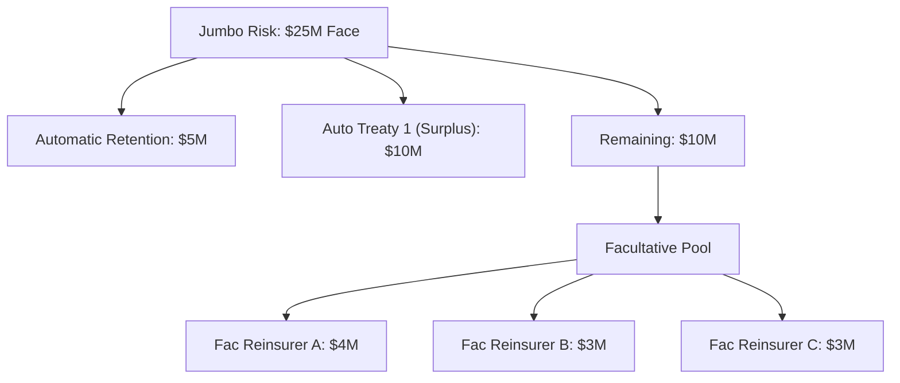

### 5.5 Cession Events (Triggers for Re-evaluation)

| Event | Cession Impact |
|-------|---------------|
| New policy issue | Initial cession allocation |
| Face amount increase | Additional cession if increase > retention |
| Face amount decrease | Reduce cessions proportionally |
| Risk class change (rating revision) | Update ceded rates; may trigger facultative resubmission |
| Policy reinstatement | Reinstate cessions (confirm with reinsurer) |
| Policy lapse | Terminate cessions |
| Conversion (term → permanent) | New cession on converted policy |
| Policy split / partial surrender | Recalculate cessions |
| Death claim | Trigger claim notification to reinsurer |
| Recapture exercise | Terminate qualifying cessions |

---

## 6. Treaty Accounting

### 6.1 Premium Cession

#### Proportional (Quota Share / Surplus)

```
Ceded Premium = Gross Premium × Cession Percentage
```

Example (Surplus Treaty):
- Gross Annual Premium: $10,000
- Face Amount: $2,000,000
- Retention: $500,000
- Cession: $1,500,000 (75%)
- Ceded Premium: $10,000 × 75% = **$7,500**
- Expense Allowance: $7,500 × 30% = **$2,250** (reinsurer pays cedant)
- Net Ceded Premium: $7,500 − $2,250 = **$5,250**

#### Non-Proportional (YRT)

```
Ceded Premium = Ceded NAR ÷ 1000 × YRT Rate per $1000 × (Period / 12)
```

Example:
- Net Amount at Risk: $800,000
- Retention NAR: $500,000
- Ceded NAR: $300,000
- YRT Rate (Male, Age 55, NT, Duration 10): $3.25 per $1000
- Monthly Ceded Premium: $300K ÷ 1000 × $3.25 ÷ 12 = **$81.25**
- Annual Ceded Premium: $300K ÷ 1000 × $3.25 = **$975.00**

### 6.2 Claim Recovery

#### Proportional

```
Ceded Claim = Gross Claim Amount × Cession Percentage
```

Example:
- Death Benefit Paid: $2,000,000
- Cession Percentage: 75%
- Cedant Retains: $500,000
- Reinsurer Pays: **$1,500,000**

#### YRT

```
Ceded Claim = Ceded NAR at Date of Death
```

Example:
- Death Benefit: $1,000,000
- Account Value at DOD: $200,000
- Total NAR: $800,000
- Cedant Retained NAR: $500,000
- Ceded NAR: $300,000
- Cedant Pays from Own Account: $700,000 ($500K retained NAR + $200K AV)
- Reinsurer Pays: **$300,000**

### 6.3 Reserve Credit

The cedant takes credit for ceded reserves on its statutory balance sheet:

```
Reserve Credit = Statutory Reserve × Cession Percentage  (proportional)
Reserve Credit = Ceded NAR × YRT Reserve Factor           (YRT)
```

### 6.4 Expense Allowance

The reinsurer pays the cedant an expense allowance (commission) to compensate for acquisition and maintenance expenses:

| Treaty Type | Typical Allowance | Basis |
|-------------|------------------|-------|
| Quota Share | 25-40% of ceded premium | Covers acquisition costs (commissions, UW) |
| Surplus | 20-35% of ceded premium | Lower than QS (smaller policies already retained) |
| Coinsurance | 90-110% of first-year premium; 5-10% renewal | Covers full acquisition costs |
| YRT | None (embedded in YRT rates) | Rates already net of expenses |

### 6.5 Experience Refund

Some treaties include an experience refund provision where the reinsurer returns a portion of profits if experience is favorable:

```
Experience Refund = MAX(0, (Ceded Premium - Ceded Claims - Reinsurer Expenses - Reinsurer Margin) × Refund Pct)
```

| Parameter | Typical Value |
|-----------|--------------|
| Refund Percentage | 25-50% of reinsurer profit |
| Deficit Carry-Forward | Losses carried forward for 2-3 years |
| Margin Load | 5-15% of ceded premium retained by reinsurer |

---

## 7. Bordereau Reporting

### 7.1 Types of Bordereaux

| Type | Content | Frequency |
|------|---------|-----------|
| **Premium Bordereau** | Listing of all ceded policies with premium detail | Monthly or Quarterly |
| **Claim Bordereau** | New claims, claim updates, and settlements | Monthly |
| **In-Force Bordereau** | Full listing of all ceded in-force policies | Annually or Quarterly |
| **Cession Bordereau** | New cessions and changes during the period | Monthly |
| **Cancellation Bordereau** | Terminated cessions during the period | Monthly |

### 7.2 Premium Bordereau Layout

| Field | Description | Example |
|-------|-------------|---------|
| Treaty Number | Treaty identifier | TY-2024-001 |
| Reporting Period | Month/quarter being reported | 2025-Q3 |
| Policy Number | Ceding company policy number | UL2024001234 |
| Insured Name | Name of insured life | John A. Smith |
| Insured DOB | Date of birth | 1980-05-15 |
| Insured Gender | M/F | M |
| Issue Date | Policy issue date | 2024-03-15 |
| Risk Class | Underwriting classification | Preferred NT |
| Plan Code | Product plan | FLEXUL-A |
| Face Amount | Total face amount | $1,000,000 |
| Retention | Cedant's retention | $500,000 |
| Ceded Amount | Amount ceded to this treaty | $500,000 |
| Cession Percentage | Percentage ceded | 50% |
| NAR (if YRT) | Current Net Amount at Risk | $400,000 |
| Ceded NAR (if YRT) | Ceded portion of NAR | $200,000 |
| Gross Premium | Gross premium for period | $2,500.00 |
| Ceded Premium | Premium ceded for period | $1,250.00 |
| Expense Allowance | Allowance for period | $375.00 |
| Net Ceded Premium | Net premium due to reinsurer | $875.00 |

### 7.3 Electronic Bordereau Formats

| Format | Standard | Usage |
|--------|----------|-------|
| CSV / Excel | Custom per reinsurer | Most common for small/medium cedants |
| ACORD XML | ACORD Life Reinsurance Messages | Growing adoption among large carriers |
| Fixed-Width | Legacy format | Older treaty relationships |
| EDI | X12 / EDIFACT | Rare for life reinsurance |
| API (JSON) | RESTful API | Modern reinsurance platforms |

### 7.4 Bordereau Generation Architecture

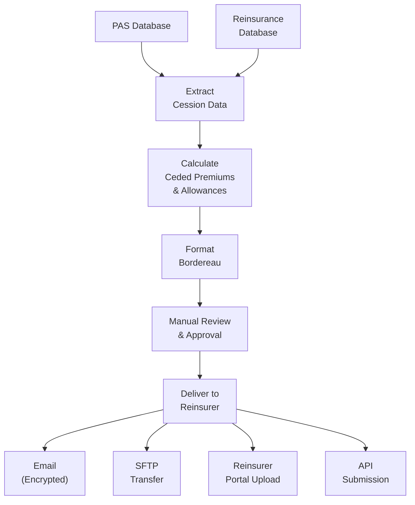

### 7.5 Bordereau Reconciliation

| Check | Source | Target | Tolerance |
|-------|--------|--------|-----------|
| Policy Count | PAS cession records | Bordereau line count | 0 |
| Total Ceded Premium | Sum of calculated ceded premiums | Bordereau total premium | ±$1.00 |
| Total Expense Allowance | Sum of calculated allowances | Bordereau total allowance | ±$1.00 |
| Net Amount | Ceded premium − allowance | Bordereau net | ±$0.01 |
| In-Force Count | Active cessions in PAS | In-force bordereau count | 0 |

---

## 8. Settlement Processing

### 8.1 Settlement Calculation

```
Net Settlement =
    + Ceded Premiums (due to reinsurer)
    - Claim Recoveries (due from reinsurer)
    - Expense Allowances (due from reinsurer)
    ± Experience Refund (+ if favorable, - if deficit)
    ± Interest on Balances
    ± Prior Period Adjustments
```

### 8.2 Monthly Settlement Example

```
═══════════════════════════════════════════════════════════
        REINSURANCE SETTLEMENT STATEMENT
        Treaty: TY-2024-001 (YRT Automatic)
        Reinsurer: Swiss Re Life & Health
        Period: October 2025
═══════════════════════════════════════════════════════════

PREMIUMS CEDED
  New Business Premiums                     $  125,432.50
  Renewal Premiums                          $2,345,678.90
  Premium Adjustments (prior period)        $   (5,234.00)
  ─────────────────────────────────────────────────────────
  Total Premiums Ceded                      $2,465,877.40

CLAIM RECOVERIES
  Death Claim - Policy UL2020005678         $ (500,000.00)
  Death Claim - Policy TL2019003456         $ (250,000.00)
  Waiver Claim - Policy UL2018001234        $   (2,345.00)
  ─────────────────────────────────────────────────────────
  Total Claim Recoveries                    $ (752,345.00)

EXPENSE ALLOWANCE
  Expense Allowance (N/A for YRT)           $        0.00
  ─────────────────────────────────────────────────────────
  Total Expense Allowance                   $        0.00

EXPERIENCE REFUND
  Experience Refund                         $        0.00
  ─────────────────────────────────────────────────────────
  Total Experience Refund                   $        0.00

INTEREST
  Interest on Late Premium (5%)             $      1,234.56
  ─────────────────────────────────────────────────────────
  Total Interest                            $      1,234.56

═══════════════════════════════════════════════════════════
NET SETTLEMENT (Due to Reinsurer)           $1,714,766.96
═══════════════════════════════════════════════════════════
```

### 8.3 Settlement Dispute Resolution

| Issue Type | Resolution Process |
|-----------|-------------------|
| Premium calculation disagreement | Recalculate using treaty rates; reconcile policy-by-policy |
| Claim recovery dispute | Review claim documentation; confirm cession was active at date of death |
| Bordereau discrepancy | Compare line-by-line; identify missing/extra policies |
| Rate application error | Verify rate table version; apply correct age/class/duration lookup |
| Timing difference | Align on reporting period boundaries; address pipeline lag |
| Treaty interpretation | Escalate to treaty administrators; involve legal if needed |

---

## 9. Retrocession

### 9.1 Retrocession Overview

A reinsurer may transfer a portion of its assumed risk to another reinsurer (the retrocessionaire):

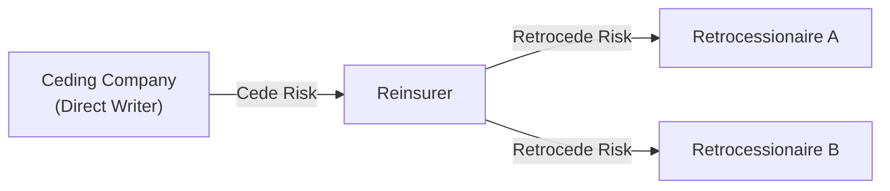

### 9.2 Multi-Layer Structures

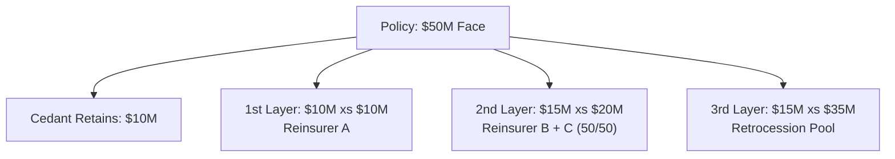

### 9.3 PAS Implications

The PAS of the ceding company typically manages only the direct reinsurance relationship. Retrocession is managed by the reinsurer's own systems. However, for financial reporting:

- Cedant must track **authorized vs. unauthorized** reinsurer status
- If the reinsurer is unauthorized, the cedant must hold collateral (trust, letter of credit, or funds withheld)
- Retrocession does not change the cedant's contractual relationship with the reinsurer

---

## 10. Financial Reporting

### 10.1 Schedule S (Statutory Annual Statement)

Schedule S is the statutory report that details all reinsurance activity:

| Part | Content |
|------|---------|
| Part 1A | Assumed reinsurance (life — ordinary) |
| Part 1B | Assumed reinsurance (life — group, A&H) |
| Part 2 | Ceded reinsurance by individual treaty |
| Part 3 | Reinsurance ceded to unauthorized companies |
| Part 4 | Paid and incurred losses on reinsurance ceded |
| Part 5 | Interrogatories (questions about reinsurance practices) |
| Part 6 | Schedule of reinsurers |

### 10.2 Reinsurance Reserve Credit

For authorized reinsurers, the cedant can take full credit for ceded reserves on its statutory balance sheet:

```
Net Statutory Reserve = Gross Reserve − Ceded Reserve (to authorized reinsurers)
```

For unauthorized reinsurers, the cedant must hold collateral:

| Collateral Type | Description |
|----------------|-------------|
| Trust Account | Assets held in trust for cedant's benefit |
| Letter of Credit | Bank-issued LOC in cedant's favor |
| Funds Withheld | Cedant holds reserves; credits reinsurer via accounting |

### 10.3 Accounting Entries

#### Premium Cession (Proportional)

| Account | Debit | Credit |
|---------|-------|--------|
| Reinsurance Ceded (Premium) | | $7,500 |
| Due from Reinsurer (Expense Allowance) | $2,250 | |
| Due to Reinsurer (Net) | | ($5,250) |

#### Claim Recovery

| Account | Debit | Credit |
|---------|-------|--------|
| Due from Reinsurer (Claim Recovery) | $1,500,000 | |
| Reinsurance Recoverable | | $1,500,000 |

#### Reserve Credit

| Account | Debit | Credit |
|---------|-------|--------|
| Reinsurance Reserve Credit | $3,000,000 | |
| Policy Reserves | | $3,000,000 |

### 10.4 GAAP / IFRS Considerations

| Standard | Treatment |
|----------|-----------|
| US GAAP (ASC 944) | Reinsurance receivables and payables recognized; risk transfer test required; "deposit accounting" if no significant risk transfer |
| IFRS 17 | Reinsurance contracts held are measured separately from underlying insurance contracts; CSM for reinsurance adjusts for expected gains/losses |

---

## 11. Reinsurance Data Requirements

### 11.1 Policy-Level Data for Cession

| # | Field | Description | Used For |
|---|-------|-------------|----------|
| 1 | Policy Number | Unique identifier | All |
| 2 | Plan Code | Product identifier | Treaty eligibility |
| 3 | Issue Date | Date issued | Duration calculation |
| 4 | Face Amount | Total face amount | Cession calculation |
| 5 | Insured Name | Full name | Bordereau reporting |
| 6 | Insured DOB | Date of birth | Age calculation, rate lookup |
| 7 | Insured Gender | M/F | Rate lookup |
| 8 | Insured SSN | Social Security | Identity verification |
| 9 | Risk Class | Preferred, Standard, etc. | Rate lookup |
| 10 | Tobacco Status | NT/T | Rate lookup |
| 11 | Table Rating | Extra mortality rating (1-16) | Flat extra cession |
| 12 | Flat Extra | Per $1000 extra premium | Flat extra cession |
| 13 | Flat Extra Duration | Years of flat extra | Expiration tracking |
| 14 | Policy Status | In-force, lapsed, etc. | Active cession tracking |
| 15 | State of Issue | US state | Regulatory, rate variation |
| 16 | Premium Amount | Gross premium | Premium cession |
| 17 | Premium Mode | Annual, semi, etc. | Premium cession timing |
| 18 | Account Value | Current AV (UL/VUL) | NAR calculation |
| 19 | Death Benefit | Current DB | NAR calculation |
| 20 | Net Amount at Risk | DB − AV | YRT cession basis |
| 21 | Coverage Amount | Individual coverage face | Multi-coverage cession |
| 22 | Rider Types/Amounts | Attached riders | Rider reinsurance |
| 23 | Beneficiary Info | Primary beneficiary | Claim processing |
| 24 | Assignment Info | Collateral assignment | Claim processing |

### 11.2 Claim Data for Recovery

| # | Field | Description |
|---|-------|-------------|
| 1 | Claim Number | Unique claim identifier |
| 2 | Policy Number | Associated policy |
| 3 | Date of Death | Insured's date of death |
| 4 | Cause of Death | ICD-10 or narrative |
| 5 | Manner of Death | Natural, accident, suicide, homicide |
| 6 | Death Certificate | Copy of certificate |
| 7 | Benefit Amount | Total death benefit payable |
| 8 | Account Value at DOD | For UL/VUL: AV at date of death |
| 9 | NAR at DOD | Net amount at risk at date of death |
| 10 | Ceded Amount | Amount ceded under each treaty |
| 11 | Claim Status | Approved, denied, pending |
| 12 | Contestability | Within contestability period? |
| 13 | Settlement Date | Date claim was settled |
| 14 | Settlement Amount | Amount paid |

### 11.3 Reserve Data for Credit

| # | Field | Description |
|---|-------|-------------|
| 1 | Policy Number | Policy identifier |
| 2 | Valuation Date | As-of date for reserves |
| 3 | Gross Statutory Reserve | Total statutory reserve before reinsurance |
| 4 | Ceded Statutory Reserve | Reserve credit for each treaty |
| 5 | Net Statutory Reserve | Gross − Ceded |
| 6 | Valuation Basis | CRVM, NLP, etc. |
| 7 | Mortality Table | Valuation mortality table |
| 8 | Interest Rate | Valuation interest rate |
| 9 | Deficiency Reserve | Deficiency reserve (if applicable) |
| 10 | Ceded Deficiency Reserve | Ceded deficiency reserve |

---

## 12. Complete Data Model (25+ Entities)

### 12.1 Reinsurance Domain ERD

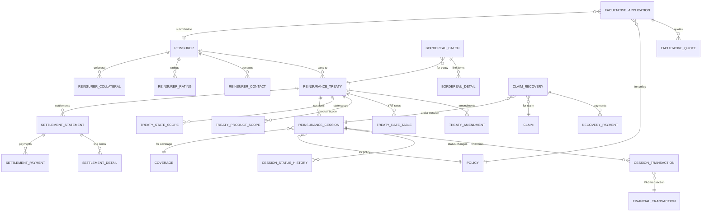

### 12.2 Entity Inventory (28 Entities)

| # | Entity | Description |
|---|--------|-------------|
| 1 | REINSURER | Reinsurer master record |
| 2 | REINSURER_CONTACT | Reinsurer contacts (treaty admin, claims, UW) |
| 3 | REINSURER_RATING | Financial strength ratings (AM Best, S&P, Moody's) |
| 4 | REINSURER_COLLATERAL | Trust accounts, LOCs, funds withheld |
| 5 | REINSURANCE_TREATY | Treaty master record |
| 6 | TREATY_AMENDMENT | Treaty changes and endorsements |
| 7 | TREATY_RATE_TABLE | YRT rate tables per treaty |
| 8 | TREATY_RATE_TABLE_ENTRY | Individual rate entries (age/gender/class/duration) |
| 9 | TREATY_PRODUCT_SCOPE | Products covered by the treaty |
| 10 | TREATY_STATE_SCOPE | States covered by the treaty |
| 11 | TREATY_EXCLUSION | Exclusions (hazardous occupations, aviation, etc.) |
| 12 | REINSURANCE_CESSION | Individual policy cession record |
| 13 | CESSION_STATUS_HISTORY | Cession status change audit trail |
| 14 | CESSION_TRANSACTION | Financial transactions on a cession (premium, claim, reserve) |
| 15 | CESSION_NAR_HISTORY | Monthly NAR snapshots for YRT cessions |
| 16 | SETTLEMENT_STATEMENT | Monthly/quarterly settlement header |
| 17 | SETTLEMENT_DETAIL | Settlement line items by category |
| 18 | SETTLEMENT_PAYMENT | Actual payments made/received |
| 19 | SETTLEMENT_DISPUTE | Disputed items and resolution |
| 20 | BORDEREAU_BATCH | Bordereau generation batch header |
| 21 | BORDEREAU_DETAIL | Individual bordereau line items |
| 22 | FACULTATIVE_APPLICATION | Facultative submission record |
| 23 | FACULTATIVE_QUOTE | Reinsurer quotes on facultative submissions |
| 24 | FACULTATIVE_CERTIFICATE | Bound facultative certificate |
| 25 | CLAIM_RECOVERY | Claim recovery from reinsurer |
| 26 | RECOVERY_PAYMENT | Claim recovery payment tracking |
| 27 | RETENTION_SCHEDULE | Retention limits by product/risk class |
| 28 | REINSURANCE_GL_POSTING | General ledger postings for reinsurance |

---

## 13. Cession Calculation Examples

### 13.1 Example 1: Surplus Treaty

**Scenario:**
- Policy Face Amount: $3,000,000
- Cedant Retention: $500,000
- Surplus Treaty: 5 lines (max capacity = 5 × $500K = $2,500,000)
- Gross Annual Premium: $15,000

**Calculation:**
```
Cession Amount = MIN(Face − Retention, Treaty Capacity)
               = MIN($3M − $500K, $2.5M)
               = MIN($2.5M, $2.5M)
               = $2,500,000

Cession Percentage = $2,500,000 / $3,000,000 = 83.33%

Cedant Retains:
  Face: $500,000
  Premium: $15,000 × 16.67% = $2,500.00

Ceded to Surplus Treaty:
  Face: $2,500,000
  Premium: $15,000 × 83.33% = $12,500.00
  Expense Allowance: $12,500 × 30% = $3,750.00
  Net to Reinsurer: $12,500 − $3,750 = $8,750.00
```

### 13.2 Example 2: YRT Treaty (Universal Life)

**Scenario:**
- UL Policy Face Amount: $1,000,000
- Death Benefit Option: A (Level)
- Account Value: $150,000
- NAR = $1,000,000 − $150,000 = $850,000
- Cedant Retention: $500,000 of NAR
- YRT Treaty covers excess NAR

**Calculation:**
```
Ceded NAR = Total NAR − Retention = $850,000 − $500,000 = $350,000

YRT Rate (M/Age 50/Preferred NT/Duration 8): $2.85 per $1000

Monthly Ceded Premium = $350,000 / 1000 × $2.85 / 12 = $83.13

Annual Ceded Premium = $350,000 / 1000 × $2.85 = $997.50
```

**NAR Changes Over Time:**

| Year | Account Value | NAR | Retained NAR | Ceded NAR | Annual Ceded Premium |
|------|-------------|-----|-------------|-----------|---------------------|
| 1 | $50,000 | $950,000 | $500,000 | $450,000 | $1,282.50 |
| 5 | $150,000 | $850,000 | $500,000 | $350,000 | $997.50 |
| 10 | $300,000 | $700,000 | $500,000 | $200,000 | $570.00 |
| 15 | $500,000 | $500,000 | $500,000 | $0 | $0.00 |
| 20 | $750,000 | $250,000 | $250,000 | $0 | $0.00 |

### 13.3 Example 3: Multi-Treaty Allocation

**Scenario:**
- Policy Face Amount: $8,000,000
- Cedant Retention: $2,000,000
- Treaty 1 (Auto Surplus — 4 lines): Capacity = $8,000,000
- Treaty 2 (2nd Surplus — 3 lines): Capacity = $6,000,000
- Treaty 3 (Facultative): As needed

**Allocation:**
```
Step 1: Cedant Retains $2,000,000
        Remaining: $8M − $2M = $6,000,000

Step 2: Treaty 1 (4 lines × $2M = $8M capacity)
        Cede: MIN($6M, $8M) = $6,000,000
        Remaining: $0

Step 3: Treaty 2 — Not needed (remaining = 0)
Step 4: Facultative — Not needed (remaining = 0)

Final Allocation:
  Cedant:   $2,000,000 (25.00%)
  Treaty 1: $6,000,000 (75.00%)
  Treaty 2: $0
  Total:    $8,000,000 (100.00%)
```

### 13.4 Example 4: Quota Share + Surplus Combination

**Scenario:**
- Policy Face Amount: $5,000,000
- Quota Share Treaty: 20% of all business
- Cedant Retention (after QS): $1,600,000
- Surplus Treaty: 5 lines

**Allocation:**
```
Step 1: Quota Share — 20% of $5M = $1,000,000 ceded
        After QS: $5M − $1M = $4,000,000 remains with cedant

Step 2: Cedant Retention (post-QS): $1,600,000
        Net Retention = $1,600,000

Step 3: Surplus Treaty: $4M − $1.6M = $2,400,000
        Treaty Capacity: 5 × $1.6M = $8,000,000
        Cede: MIN($2.4M, $8M) = $2,400,000

Final Allocation:
  Quota Share Reinsurer:  $1,000,000 (20.00%)
  Cedant Net Retention:   $1,600,000 (32.00%)
  Surplus Reinsurer:      $2,400,000 (48.00%)
  Total:                  $5,000,000 (100.00%)
```

---

## 14. Architecture

### 14.1 Reinsurance Administration Engine

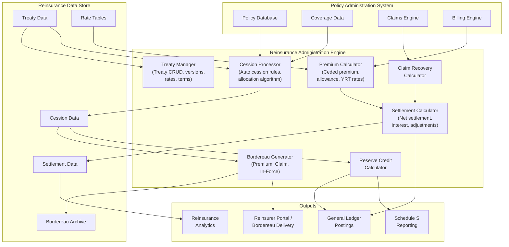

### 14.2 Event-Driven Cession Processing

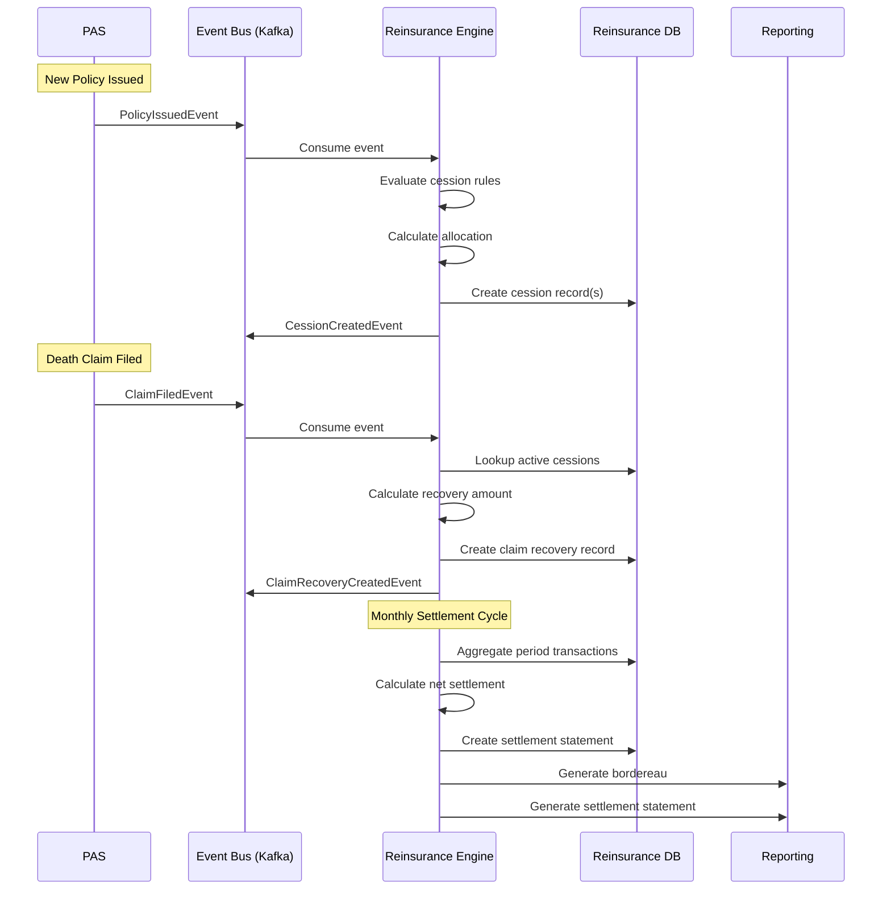

---

## 15. Integration: PAS-to-Reinsurance Data Flow

### 15.1 Integration Architecture

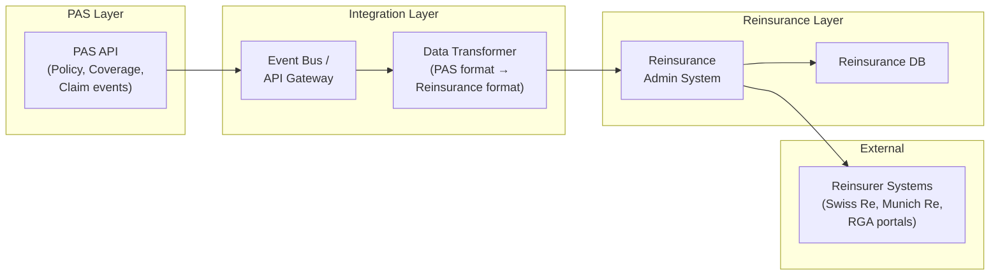

### 15.2 Key Integration Points

| Integration Point | Direction | Trigger | Data | Method |
|-------------------|-----------|---------|------|--------|
| New Policy Issue | PAS → Rein | Policy issued event | Policy, coverage, insured data | Event / API |
| Face Amount Change | PAS → Rein | Face change processed | Policy, new face, old face | Event / API |
| Policy Termination | PAS → Rein | Lapse/surrender/maturity | Policy, termination date, reason | Event / API |
| Premium Payment | PAS → Rein | Premium applied | Premium amount, allocation | Batch / Event |
| Account Value Update | PAS → Rein | Monthly valuation | AV, NAR, fund values | Batch |
| Death Claim | PAS → Rein | Claim filed | Claim, DOD, benefit amount | Event / API |
| Claim Decision | PAS → Rein | Claim approved/denied | Decision, settlement amount | Event / API |
| Ceded Premium | Rein → GL | Monthly settlement | GL posting entries | Batch |
| Claim Recovery | Rein → Claims | Recovery calculated | Recovery amount, payee | Event / API |
| Reserve Credit | Rein → Valuation | Quarterly/annual | Ceded reserves by treaty | Batch |
| Bordereau | Rein → Reinsurer | Monthly/quarterly | Bordereau files | SFTP / API |
| Settlement | Rein → Reinsurer | Monthly/quarterly | Settlement statement, payment | SFTP / Wire |

### 15.3 Data Synchronization Patterns

| Pattern | Description | Use Case |
|---------|-------------|----------|
| **Real-Time Event** | PAS publishes events; reinsurance engine subscribes | New policy, claim, face change |
| **Batch Extract** | Nightly/monthly extract of policy data for reinsurance | Account value updates, reserve data |
| **Request-Reply** | Reinsurance engine queries PAS for current data on demand | Facultative underwriting, claim investigation |
| **Scheduled Job** | Orchestrated batch processing at defined intervals | Bordereau generation, settlement calculation |

---

## 16. Implementation Guidance

### 16.1 Build vs. Buy Decision for Reinsurance Admin

| Factor | Build Custom | Buy Specialized (e.g., RGAX AURA, FAST RE, Sapiens RE) |
|--------|-------------|------------------------------------------------------|
| Cost | Lower upfront; higher maintenance | Higher license/subscription; lower maintenance |
| Time | 12-18 months | 6-12 months (configuration + integration) |
| Flexibility | Full control over features | Constrained by vendor capabilities |
| Treaty complexity | Can model any treaty | May not support exotic structures |
| Integration | Custom integration with PAS | Pre-built connectors for major PAS vendors |
| Regulatory reporting | Must build Schedule S | Built-in Schedule S |
| Expertise required | Deep reinsurance + tech skills | Configuration skills + vendor support |

### 16.2 Phased Implementation

```mermaid
gantt
    title Reinsurance Implementation Phases
    dateFormat  YYYY-Q
    section Phase 1: Foundation
    Treaty data model           :done, 2025-Q1, 2025-Q2
    Basic cession processing    :done, 2025-Q2, 2025-Q3
    Manual bordereau generation :2025-Q3, 2025-Q3
    section Phase 2: Automation
    Automatic cession engine    :2025-Q3, 2025-Q4
    YRT rate management         :2025-Q4, 2026-Q1
    Premium calculation         :2025-Q4, 2026-Q1
    Automated bordereau         :2026-Q1, 2026-Q1
    section Phase 3: Financial
    Claim recovery processing   :2026-Q1, 2026-Q2
    Settlement engine           :2026-Q2, 2026-Q3
    GL integration              :2026-Q2, 2026-Q3
    Schedule S reporting        :2026-Q3, 2026-Q3
    section Phase 4: Advanced
    Facultative workflow        :2026-Q3, 2026-Q4
    Retrocession tracking       :2026-Q4, 2027-Q1
    Analytics / dashboards      :2026-Q4, 2027-Q1
```

### 16.3 Common Pitfalls

| Pitfall | Impact | Mitigation |
|---------|--------|------------|
| Cession not aligned with UW decision | Policy issued with insufficient reinsurance | Integrate cession processing into issuance workflow |
| Stale NAR on YRT treaties | Incorrect ceded premiums | Automate monthly NAR recalculation from PAS AV updates |
| Missing flat extra cession | Substandard risk not properly ceded | Include table ratings and flat extras in cession logic |
| Bordereau discrepancies | Settlement disputes, delayed payments | Automated reconciliation before submission |
| Untracked treaty amendments | Incorrect rates or terms applied | Version-controlled treaty management |
| Manual settlement process | Errors, delays, staff dependency | Automate settlement calculation and approval workflow |
| No cession audit trail | Regulatory risk, dispute resolution difficulty | Log every cession event with timestamp and user |

### 16.4 Key Performance Indicators

| KPI | Target | Measurement |
|-----|--------|-------------|
| Cession processing timeliness | < 1 day from policy issue | Time from issue to cession creation |
| Bordereau accuracy | 100% reconciled | Automated reconciliation score |
| Bordereau delivery timeliness | Within 15 days of period close | Delivery date vs. due date |
| Settlement accuracy | 100% within tolerance | Variance between calculated and agreed |
| Claim recovery timeliness | < 5 days from claim approval | Time from approval to recovery request |
| Treaty rate table currency | 100% current | Rate table version vs. latest amendment |
| Facultative turnaround | < 10 business days | Submission to binding |

---

*This article is part of the Life Insurance PAS Architect's Encyclopedia. For related topics, see Article 42 (Canonical Data Model), Article 43 (Data Warehousing & Analytics), and Article 46 (Product Configuration & Rules-Driven Design).*
