# Article 46: Product Configuration & Rules-Driven Design for Life Insurance PAS

## Table of Contents

1. [Introduction](#1-introduction)
2. [Product Configuration Philosophy](#2-product-configuration-philosophy)
3. [Product Catalog Structure](#3-product-catalog-structure)
4. [Configurable Product Parameters](#4-configurable-product-parameters)
5. [Rate Table Management](#5-rate-table-management)
6. [Factor Table Management](#6-factor-table-management)
7. [Rules Configuration](#7-rules-configuration)
8. [State Variation Configuration](#8-state-variation-configuration)
9. [Product Testing](#9-product-testing)
10. [Product Launch Process](#10-product-launch-process)
11. [Complete Data Model (30+ Entities)](#11-complete-data-model-30-entities)
12. [Sample Product Configuration](#12-sample-product-configuration)
13. [Architecture](#13-architecture)
14. [Implementation Guidance](#14-implementation-guidance)

---

## 1. Introduction

Product configuration is the mechanism by which a life insurance PAS defines and administers different insurance products without modifying application code. A well-designed product configuration framework allows actuaries, product managers, and business analysts to define new products, modify existing ones, and manage state-specific variations through configuration — not code deployments.

### 1.1 The Configuration Imperative

| Challenge | Without Configuration | With Configuration |
|-----------|----------------------|-------------------|
| New product launch | 6-18 months of coding, testing, deployment | 4-12 weeks of configuration, testing, certification |
| State variation | Hard-coded IF/ELSE for each state | State override tables and rule sets |
| Rate change | Code change + deployment | Rate table upload + effective dating |
| Regulatory update | Development sprint + regression testing | Rule modification + targeted testing |
| Product retirement | Complex code removal | Status flag change to CLOSED_TO_NEW |
| Audit trail | Scattered across code commits | Version-controlled configuration with effective dating |

### 1.2 Configuration Maturity Levels

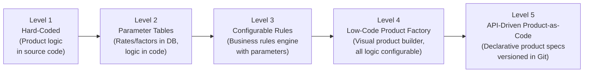

---

## 2. Product Configuration Philosophy

### 2.1 Table-Driven vs. Code-Driven

| Approach | Description | Pros | Cons |
|----------|------------|------|------|
| **Code-Driven** | Product logic embedded in application code (Java/C#/COBOL) | Full flexibility, complex logic | Slow changes, requires developers, deployment risk |
| **Table-Driven** | Rates, factors, and parameters stored in database tables; code reads tables at runtime | Faster changes for rates/factors | Code still needed for calculation logic |
| **Rules-Driven** | Business rules defined in a rules engine (Drools, Blaze Advisor, ILOG, custom DSL) | Business users can modify rules; audit trail | Rules engine complexity, performance concerns |
| **Configuration-First** | All product behavior defined through configuration metadata; generic engine interprets config | Maximum speed-to-market, minimal code | Upfront investment in configuration framework; complex products may hit limits |
| **Hybrid** | Core calculations in code; parameters, rates, rules in configuration | Best balance of flexibility and performance | Must clearly delineate code vs. config boundary |

### 2.2 Parameter-Based Product Definition

The core principle: a product is defined by a set of parameters, not by code. The PAS engine reads these parameters and executes generic algorithms.

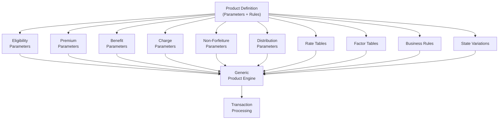

### 2.3 No-Code / Low-Code Product Setup

Modern PAS platforms offer visual product builders:

| Capability | Description |
|-----------|-------------|
| Visual Product Designer | Drag-and-drop product component assembly |
| Formula Editor | Spreadsheet-like formula builder for calculations |
| Rule Designer | Visual decision table / decision tree builder |
| Rate Table Import | Spreadsheet upload for rate/factor tables |
| State Override Manager | UI for defining state-specific parameter overrides |
| Test Workbench | Integrated test case execution for configured products |
| Version Comparison | Side-by-side comparison of product versions |
| Approval Workflow | Multi-step review and approval of product changes |

---

## 3. Product Catalog Structure

### 3.1 Product Hierarchy

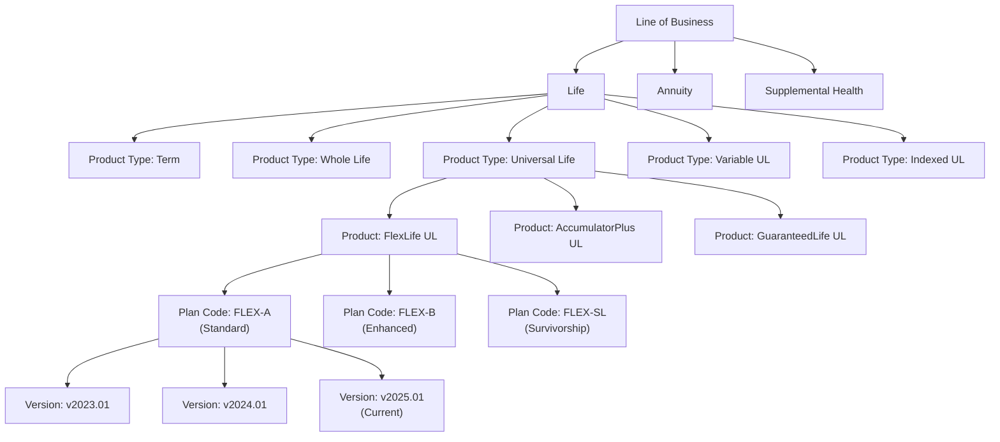

### 3.2 Product Metadata

| Attribute | Description | Example |
|-----------|-------------|---------|
| `product_code` | Unique product identifier | FLEXUL |
| `plan_code` | Plan variation within product | FLEX-A |
| `product_name` | Marketing name | FlexLife Universal Life |
| `product_type_code` | Classification | UNIVERSAL_LIFE |
| `lob_code` | Line of business | LIFE |
| `premium_type_code` | Fixed, flexible, or single | FLEXIBLE |
| `cash_value_ind` | Builds cash value? | TRUE |
| `participating_ind` | Eligible for dividends? | FALSE |
| `tax_qualified_eligible` | Can be issued as qualified? | TRUE |
| `valuation_basis` | Statutory valuation method | CRVM |
| `naic_product_code` | NAIC annual statement line | 1 (Individual Life) |
| `marketing_start_date` | Available for sale | 2025-01-01 |
| `marketing_end_date` | Closed to new business | NULL (still open) |

### 3.3 Product Lifecycle

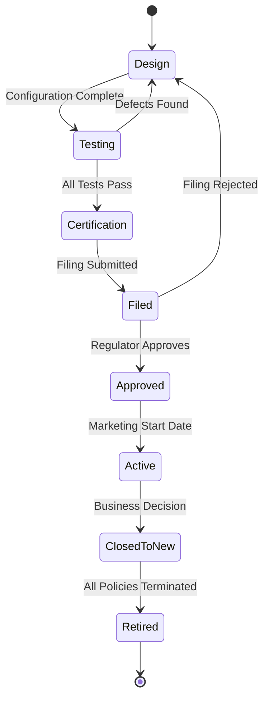

### 3.4 Product Versioning

Each product version captures a complete snapshot of all parameters, rates, factors, and rules effective for policies issued during that version's date range.

| Version | Effective Date | Trigger | Changes |
|---------|---------------|---------|---------|
| v2023.01 | 2023-01-01 | Initial filing | Base product configuration |
| v2023.07 | 2023-07-01 | Rate change | Updated COI rates, credited rate floor |
| v2024.01 | 2024-01-01 | CSO table adoption | New CSO 2017 mortality, revised NF values |
| v2024.06 | 2024-06-01 | State filing amendment | Added New York state variation |
| v2025.01 | 2025-01-01 | Product enhancement | New indexed crediting strategy, updated caps |

**Version Rule:** Existing policies use the version in effect at their issue date. New policies use the currently active version.

---

## 4. Configurable Product Parameters

### 4.1 Eligibility Rules

| Parameter | Type | Description | Example |
|-----------|------|-------------|---------|
| `min_issue_age` | INT | Minimum age at issue | 18 |
| `max_issue_age` | INT | Maximum age at issue | 80 |
| `min_face_amount` | DECIMAL | Minimum initial face | $50,000 |
| `max_face_amount` | DECIMAL | Maximum initial face | $10,000,000 |
| `face_amount_increment` | DECIMAL | Face must be a multiple of | $1,000 |
| `eligible_states[]` | VARCHAR[] | States where product is available | All 50 states + DC |
| `excluded_states[]` | VARCHAR[] | States where product is NOT available | NY (separate filing) |
| `eligible_risk_classes[]` | VARCHAR[] | Accepted risk classes | PP, PF, STD, T1-T4 |
| `max_table_rating` | INT | Maximum substandard table accepted | 8 |
| `replacement_allowed` | BOOLEAN | Can replace existing policy | TRUE |
| `1035_exchange_allowed` | BOOLEAN | Accepts 1035 exchanges | TRUE |
| `trust_ownership_allowed` | BOOLEAN | Can be trust-owned | TRUE |
| `corporate_ownership_allowed` | BOOLEAN | Can be corporately owned | TRUE |
| `joint_life_available` | BOOLEAN | Joint life coverage option | TRUE |

### 4.2 Premium Rules

| Parameter | Type | Description | Example (UL) |
|-----------|------|-------------|-------------|
| `premium_type` | ENUM | FIXED, FLEXIBLE, SINGLE | FLEXIBLE |
| `min_initial_premium` | DECIMAL | Minimum first-year premium | $600 |
| `min_renewal_premium` | DECIMAL | Minimum subsequent premium | $300 |
| `max_annual_premium` | DECIMAL | Maximum annual premium (below MEC) | 7-pay limit |
| `target_premium_method` | ENUM | How target premium is calculated | TABLE_LOOKUP |
| `target_premium_table_id` | BIGINT | Reference to target premium rate table | FK |
| `guideline_single_premium` | FORMULA | GSP calculation for IRC §7702 | NSP × DB Option factor |
| `guideline_level_premium` | FORMULA | GLP calculation for IRC §7702 | Level annuity factor × DB |
| `seven_pay_premium` | FORMULA | 7-pay test limit (MEC test) | NLP for 7 years × face |
| `premium_modes_allowed[]` | VARCHAR[] | Allowed payment frequencies | ANNUAL, SEMI, QUARTERLY, MONTHLY |
| `mode_factors` | MAP | Modal premium factors | {ANNUAL:1.0, SEMI:0.5133, QUARTERLY:0.2625, MONTHLY:0.0875} |
| `no_lapse_guarantee_premium` | DECIMAL | Premium required for NLG | Calculated from NLG table |
| `premium_load_pct` | DECIMAL | Front-end premium load | 5% of premium |
| `premium_load_target_pct` | DECIMAL | Load on target premium | 7.5% |
| `premium_load_excess_pct` | DECIMAL | Load on excess premium | 2% |

### 4.3 Benefit Rules

| Parameter | Type | Description | Example |
|-----------|------|-------------|---------|
| `death_benefit_options[]` | VARCHAR[] | Available DB options | A (Level), B (Increasing), C (ROP) |
| `default_db_option` | VARCHAR | Default if not specified | A |
| `db_option_change_allowed` | BOOLEAN | Can change DB option? | TRUE |
| `db_option_change_min_duration` | INT | Minimum years before change | 1 |
| `cash_value_calc_method` | ENUM | RETROSPECTIVE, PROSPECTIVE | RETROSPECTIVE |
| `interest_crediting_method` | ENUM | DECLARED, PORTFOLIO, NEW_MONEY | DECLARED |
| `minimum_guaranteed_rate` | DECIMAL | Contractual minimum interest | 2.00% |
| `current_declared_rate` | DECIMAL | Current non-guaranteed rate | 4.25% |
| `indexed_strategies_available[]` | VARCHAR[] | Available indexed strategies | S&P_PTP_1YR, RUSSELL_MONTHLY_AVG, FIXED |
| `maximum_participation_rate` | DECIMAL | Max participation rate for indexed | 100% |
| `minimum_floor_rate` | DECIMAL | Minimum floor on indexed returns | 0% |
| `maximum_cap_rate` | DECIMAL | Maximum cap on indexed returns | 12% |
| `fund_options_available[]` | BIGINT[] | Available variable sub-accounts | [101, 102, 103, ...] |
| `max_number_of_funds` | INT | Maximum funds a policyholder can select | 20 |
| `min_fund_allocation_pct` | DECIMAL | Minimum allocation to any single fund | 5% |
| `dca_available` | BOOLEAN | Dollar Cost Averaging available? | TRUE |
| `auto_rebalance_available` | BOOLEAN | Automatic rebalancing? | TRUE |

### 4.4 Charge Rules

| Charge Type | Configuration Parameters |
|-------------|------------------------|
| **Cost of Insurance (COI)** | `coi_rate_table_id`, `coi_basis` (NAR or face), `coi_timing` (monthly, anniversary), `guaranteed_coi_table_id`, `current_coi_table_id` |
| **Monthly Expense Charge** | `monthly_expense_amount` (flat), `monthly_expense_pct` (of AV), `monthly_expense_waiver_year` (waived after N years) |
| **Per-Unit Charge** | `per_unit_amount` (per $1000 of face), `per_unit_max_years` |
| **Administrative Charge** | `admin_charge_amount` (annual), `admin_charge_timing` (monthly, annual) |
| **Premium Load** | `front_load_target_pct`, `front_load_excess_pct`, `back_load_pct` |
| **Surrender Charge** | `surrender_charge_table_id`, `surrender_charge_basis` (premium, face, AV), `surrender_charge_years` |
| **M&E Charge** | `me_annual_pct` (of separate account), `me_deduction_frequency` (daily, monthly) |
| **Rider Charges** | Per rider: `rider_charge_type` (COI, flat, AV-based), `rider_rate_table_id` |

### 4.5 Non-Forfeiture Rules

| Parameter | Description | Example |
|-----------|-------------|---------|
| `nf_method` | Non-forfeiture calculation method | STANDARD_NONFORFEITURE |
| `nf_mortality_table` | Mortality table for NF values | CSO 2017 |
| `nf_interest_rate` | NF interest rate | 4.00% |
| `nf_options_available[]` | Available NF options | ETI, RPU, CSV |
| `etl_min_duration` | Minimum duration for ETI | 3 years |
| `rpu_min_duration` | Minimum duration for RPU | 3 years |
| `csv_min_duration` | Minimum duration for CSV | 3 years (or as required by state) |
| `automatic_nf_option` | Default NF if no election | ETI |
| `nf_factor_table_id` | Factor table for NF calculations | FK |

### 4.6 Distribution Rules

| Parameter | Description | Example |
|-----------|-------------|---------|
| `max_partial_withdrawal_pct` | Max withdrawal as % of AV | 90% |
| `free_withdrawal_pct` | Annual free withdrawal percentage | 10% of AV |
| `free_withdrawal_basis` | Basis for free withdrawal | ACCOUNT_VALUE or PREMIUM |
| `min_withdrawal_amount` | Minimum withdrawal amount | $500 |
| `min_remaining_value` | Minimum value after withdrawal | $500 |
| `systematic_withdrawal_available` | SWP available? | TRUE |
| `loan_available` | Policy loans available? | TRUE |
| `max_loan_pct_of_csv` | Maximum loan as % of CSV | 90% |
| `loan_interest_rate_fixed` | Fixed loan interest rate | 5.00% |
| `loan_interest_rate_variable` | Variable loan rate (Moody's + spread) | Moody's + 100 bps |
| `preferred_loan_available` | Preferred/wash loan available? | TRUE (after year 10) |
| `settlement_options[]` | Available settlement options | LUMP_SUM, LIFE_ANNUITY, PERIOD_CERTAIN, INSTALLMENTS |

---

## 5. Rate Table Management

### 5.1 Rate Table Types

| Table Type | Description | Dimensions |
|-----------|-------------|-----------|
| **Mortality (COI)** | Cost of Insurance rate per $1000 of NAR | Issue age, attained age, duration, gender, tobacco, risk class, band |
| **Guaranteed COI** | Maximum contractual COI rates | Same as current COI |
| **Target Premium** | Target premium rate per $1000 | Issue age, gender, risk class, plan |
| **Expense Charge** | Monthly/annual expense charge table | Duration, face amount band |
| **Surrender Charge** | Surrender charge by policy year | Policy year, premium band |
| **Commission** | Commission rates by policy year | Policy year, commission type, plan |
| **No-Lapse Guarantee** | NLG premium rate per $1000 | Issue age, gender, risk class |

### 5.2 Rate Table Versioning and Effective Dating

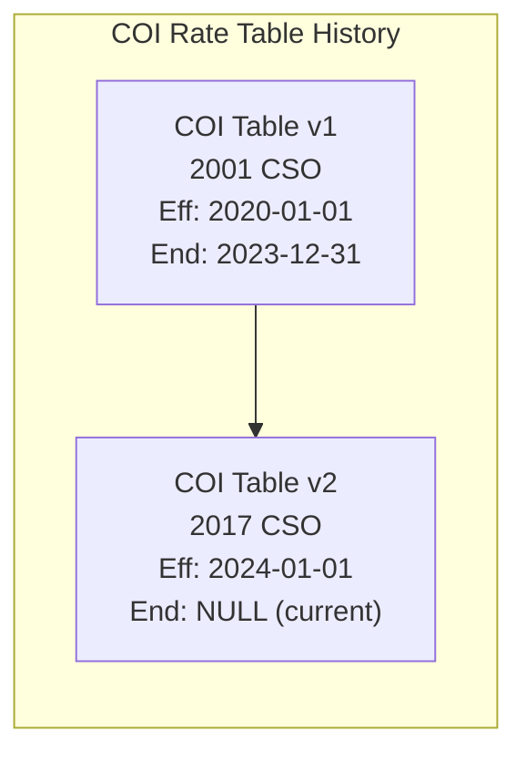

### 5.3 Rate Table Data Model

```sql
CREATE TABLE product_config.rate_table (
    rate_table_id        BIGSERIAL    PRIMARY KEY,
    rate_table_code      VARCHAR(30)  NOT NULL,
    rate_table_name      VARCHAR(100) NOT NULL,
    rate_table_type_code VARCHAR(20)  NOT NULL,
    product_plan_id      BIGINT       REFERENCES product_config.product_plan(product_plan_id),
    mortality_table_code VARCHAR(20),
    version_number       INT          NOT NULL DEFAULT 1,
    effective_date       DATE         NOT NULL,
    end_date             DATE,
    status_code          VARCHAR(10)  NOT NULL DEFAULT 'ACTIVE',
    created_timestamp    TIMESTAMPTZ  NOT NULL DEFAULT NOW(),
    created_by           VARCHAR(50)  NOT NULL,
    approved_by          VARCHAR(50),
    approved_date        DATE,
    UNIQUE (rate_table_code, version_number)
);

CREATE TABLE product_config.rate_table_entry (
    rate_entry_id    BIGSERIAL     PRIMARY KEY,
    rate_table_id    BIGINT        NOT NULL REFERENCES product_config.rate_table(rate_table_id),
    issue_age        INT,
    attained_age     INT,
    duration         INT,
    gender_code      VARCHAR(1),
    tobacco_code     VARCHAR(5),
    risk_class_code  VARCHAR(10),
    face_band_code   VARCHAR(10),
    state_code       VARCHAR(2),
    rate_per_thousand DECIMAL(12,8),
    flat_rate        DECIMAL(12,4),
    percentage_rate  DECIMAL(10,8)
);

CREATE INDEX idx_rate_lookup ON product_config.rate_table_entry(
    rate_table_id, issue_age, gender_code, tobacco_code, risk_class_code, duration
);
```

### 5.4 Rate Table Import and Validation

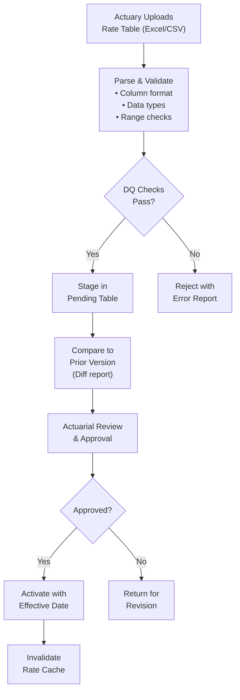

**Rate Table Validation Rules:**

| Rule | Description |
|------|-------------|
| Completeness | All required age/gender/class combinations present |
| Monotonicity | COI rates increase with age (generally) |
| Non-negative | All rates ≥ 0 |
| Maximum check | No rate exceeds a sanity threshold (e.g., $500 per $1000) |
| Continuity | No gaps in age ranges |
| Comparison | Current rates do not exceed guaranteed rates |
| Crossfoot | Select + ultimate rates transition smoothly |

### 5.5 Rate Lookup Optimization

For high-performance rate lookup (millions of lookups per billing cycle):

| Strategy | Description |
|----------|-------------|
| In-memory cache | Load full rate tables into application memory (HashMap/Dictionary) |
| Composite key index | Database index on (table_id, issue_age, gender, tobacco, risk_class, duration) |
| Pre-computed rates | For common combinations, pre-compute and cache monthly COI per policy |
| Rate interpolation | For non-integer ages, define interpolation rules |
| Lazy loading | Load rate tables on first access; cache with TTL |

---

## 6. Factor Table Management

### 6.1 Factor Table Types

| Factor Type | Purpose | Inputs | Output |
|-------------|---------|--------|--------|
| **Annuity Factor** | Convert lump sum to periodic income | Age, gender, mortality table, interest rate, period certain | Factor per $1 of income |
| **Present Value Factor** | Discount future cash flows | Duration, interest rate | PV factor |
| **Net Single Premium (NSP)** | IRC §7702 CVAT test | Age, gender, mortality, interest | NSP per $1 of insurance |
| **Conversion Factor** | Convert term to permanent | Age at conversion, product | Premium factor |
| **Non-Forfeiture Factor** | ETI duration, RPU amount | Age, duration, mortality, interest | NF benefit per $1 of reserve |
| **Reserve Factor** | Statutory reserve per unit | Age, duration, plan, mortality, interest | Reserve per $1000 |
| **Commutation Factor** | Actuarial commutation (Dx, Nx, Cx, Mx) | Age, mortality, interest | Commutation column values |

### 6.2 Factor Generation

Factors are generated from actuarial assumptions, not manually entered:

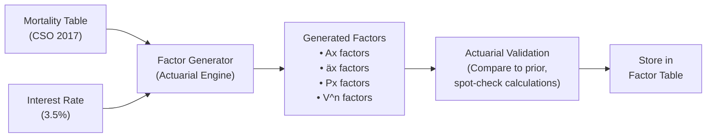

### 6.3 Factor Table Storage

```sql
CREATE TABLE product_config.factor_table (
    factor_table_id      BIGSERIAL    PRIMARY KEY,
    factor_table_code    VARCHAR(30)  NOT NULL,
    factor_type_code     VARCHAR(20)  NOT NULL,
    mortality_table_code VARCHAR(20),
    interest_rate        DECIMAL(7,5),
    effective_date       DATE         NOT NULL,
    end_date             DATE,
    generation_date      DATE,
    generated_by         VARCHAR(50),
    status_code          VARCHAR(10)  DEFAULT 'ACTIVE',
    UNIQUE (factor_table_code, effective_date)
);

CREATE TABLE product_config.factor_table_entry (
    factor_entry_id   BIGSERIAL    PRIMARY KEY,
    factor_table_id   BIGINT       NOT NULL REFERENCES product_config.factor_table(factor_table_id),
    age               INT,
    duration          INT,
    gender_code       VARCHAR(1),
    payment_mode      VARCHAR(10),
    period_certain    INT,
    factor_value      DECIMAL(18,12) NOT NULL
);
```

---

## 7. Rules Configuration

### 7.1 Business Rules by Domain

| Domain | Rule Examples |
|--------|-------------|
| **Eligibility** | Is the applicant within age limits? Is the face amount within product range? Is the state approved? Is the risk class eligible? |
| **Validation** | Is the premium within min/max? Do beneficiary percentages sum to 100%? Is the billing mode valid for this product? |
| **Processing** | How should a premium be allocated across coverages/funds? How should a withdrawal be distributed? What happens at anniversary? |
| **Calculation** | How is COI calculated? How is interest credited? How is the death benefit determined? What is the surrender charge? |
| **Authorization** | Does this transaction require supervisor approval? Is the withdrawal above the free amount? Does the face increase require underwriting? |

### 7.2 Rules Engine Architecture

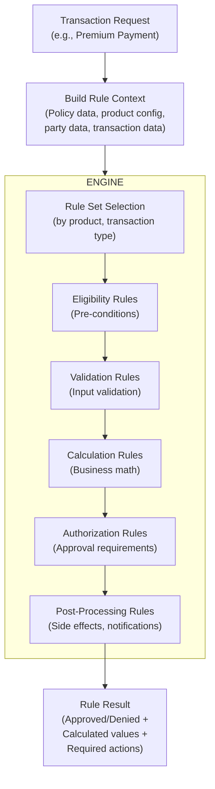

### 7.3 Rule Set Configuration

```json
{
  "ruleSetId": "RS-PREMIUM-PAYMENT-UL",
  "ruleSetName": "Universal Life Premium Payment Rules",
  "applicableProducts": ["FLEXUL", "ACCUMUL", "GUARLIFE"],
  "applicableTransactions": ["PREM_INIT", "PREM_RENEWAL", "PREM_ADD"],
  "version": 3,
  "effectiveDate": "2025-01-01",
  "rules": [
    {
      "ruleId": "R001",
      "ruleName": "Policy Must Be In Force",
      "ruleType": "ELIGIBILITY",
      "priority": 1,
      "condition": "policy.status IN ('INFORCE', 'GRACE_PERIOD')",
      "action": "ALLOW",
      "failureAction": "REJECT",
      "failureMessage": "Premium cannot be accepted; policy is not in force."
    },
    {
      "ruleId": "R002",
      "ruleName": "Minimum Premium Check",
      "ruleType": "VALIDATION",
      "priority": 10,
      "condition": "transaction.amount >= product.minRenewalPremium",
      "action": "ALLOW",
      "failureAction": "REJECT",
      "failureMessage": "Premium amount ${transaction.amount} is below minimum of ${product.minRenewalPremium}."
    },
    {
      "ruleId": "R003",
      "ruleName": "MEC Test — 7-Pay Limit",
      "ruleType": "VALIDATION",
      "priority": 20,
      "condition": "policy.cumulativePremium + transaction.amount <= policy.sevenPayLimit",
      "action": "ALLOW",
      "failureAction": "WARN",
      "failureMessage": "Premium will cause MEC. Cumulative: ${policy.cumulativePremium + transaction.amount}, 7-Pay Limit: ${policy.sevenPayLimit}",
      "overridable": true,
      "overrideAuthority": "SUPERVISOR"
    },
    {
      "ruleId": "R004",
      "ruleName": "Guideline Premium Test — IRC §7702",
      "ruleType": "VALIDATION",
      "priority": 25,
      "condition": "policy.cumulativePremium + transaction.amount <= policy.guidelineCumulativeLimit",
      "action": "ALLOW",
      "failureAction": "REJECT",
      "failureMessage": "Premium exceeds IRC §7702 guideline limit. Maximum additional premium: ${policy.guidelineCumulativeLimit - policy.cumulativePremium}"
    },
    {
      "ruleId": "R005",
      "ruleName": "Allocate Premium to Funds",
      "ruleType": "CALCULATION",
      "priority": 100,
      "condition": "ALWAYS",
      "action": "EXECUTE",
      "calculationMethod": "APPLY_FUND_ALLOCATION",
      "parameters": {
        "allocationType": "PREMIUM",
        "deductLoadFirst": true,
        "loadPercentage": "${product.premiumLoadPct}"
      }
    }
  ]
}
```

### 7.4 Decision Table Format

For rules with many conditions and outcomes, a decision table is more maintainable:

**Example: Withdrawal Authorization Rules**

| Withdrawal Amount | Policy Duration | Surrender Charge Active | Loan Outstanding | Free Amount Exceeded | Authorization Level |
|-------------------|----------------|------------------------|------------------|---------------------|-------------------|
| < $10,000 | Any | Any | No | No | AUTO_APPROVE |
| < $10,000 | Any | Any | No | Yes | EXAMINER |
| $10,000 - $50,000 | > 5 years | No | No | Any | EXAMINER |
| $10,000 - $50,000 | ≤ 5 years | Yes | Any | Any | SUPERVISOR |
| > $50,000 | Any | Any | Any | Any | SUPERVISOR |
| Full Surrender | Any | Yes | Any | — | SUPERVISOR |
| Full Surrender | Any | No | Yes | — | EXAMINER |

### 7.5 Rule Versioning

Rules are versioned in lockstep with product versions:

| Product Version | Rule Set Version | Changes |
|----------------|-----------------|---------|
| v2023.01 | RS-v1 | Initial rule set |
| v2024.01 | RS-v2 | Added MEC 7-pay test rule for new CSO tables |
| v2025.01 | RS-v3 | Updated IRC §7702 guideline premium calculations |

**Rule Change Management:**

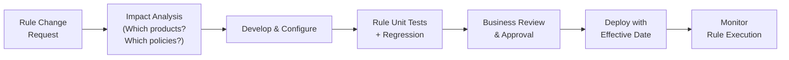

---

## 8. State Variation Configuration

### 8.1 State-Specific Overrides

Many product parameters vary by state due to regulatory requirements:

| Parameter | Default | NY Override | CA Override | TX Override |
|-----------|---------|------------|------------|------------|
| Free-look period | 10 days | 10 days (different rules) | 10 days | 10 days |
| Max surrender charge years | 15 | 10 | 10 | 15 |
| Minimum non-forfeiture rate | 4.00% | 3.00% | 4.00% | 4.00% |
| Illustration regulations | Model Reg | Reg 74 (stricter) | Standard | Standard |
| Replacement rules | NAIC Model | Reg 60 (stricter) | Standard | Standard |
| Premium tax rate | Varies | 0.00% | 2.35% | 1.75% |
| Minimum CSV at year N | Standard NF | Enhanced NF | Standard NF | Standard NF |

### 8.2 State Override Data Model

```sql
CREATE TABLE product_config.state_variation (
    state_variation_id   BIGSERIAL    PRIMARY KEY,
    product_plan_id      BIGINT       NOT NULL REFERENCES product_config.product_plan(product_plan_id),
    state_code           VARCHAR(2)   NOT NULL,
    parameter_name       VARCHAR(50)  NOT NULL,
    parameter_value      VARCHAR(200) NOT NULL,
    parameter_type       VARCHAR(10)  NOT NULL,
    effective_date       DATE         NOT NULL,
    end_date             DATE,
    regulatory_reference VARCHAR(100),
    UNIQUE (product_plan_id, state_code, parameter_name, effective_date)
);
```

### 8.3 Override Resolution Logic

```
FUNCTION resolve_parameter(product_plan_id, parameter_name, state_code, effective_date):
    -- 1. Check for state-specific override
    state_value = LOOKUP state_variation
        WHERE product_plan_id = :product_plan_id
        AND state_code = :state_code
        AND parameter_name = :parameter_name
        AND effective_date BETWEEN :effective_date AND end_date

    IF state_value EXISTS:
        RETURN state_value

    -- 2. Fall back to product-level default
    product_value = LOOKUP product_parameter
        WHERE product_plan_id = :product_plan_id
        AND parameter_name = :parameter_name

    RETURN product_value
```

### 8.4 State Approval Tracking

| Attribute | Description |
|-----------|-------------|
| `state_approval_id` | Surrogate key |
| `product_plan_id` | Product reference |
| `state_code` | State |
| `filing_number` | State filing reference |
| `filing_date` | Date filed |
| `filing_type_code` | NEW, AMENDMENT, RATE_CHANGE |
| `approval_status_code` | FILED, APPROVED, DISAPPROVED, WITHDRAWN, DEFERRED |
| `approval_date` | Date approved |
| `effective_date` | Date product becomes available in state |
| `conditions` | Conditions of approval |
| `reviewer_name` | State reviewer |

---

## 9. Product Testing

### 9.1 Product Configuration Testing Framework

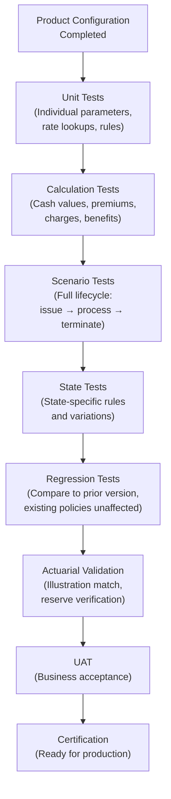

### 9.2 Actuarial Validation

| Test | Method | Acceptance Criteria |
|------|--------|-------------------|
| Cash value comparison | Compare PAS cash values to illustration system values at policy years 1, 5, 10, 15, 20 | Match within ±$1.00 |
| Reserve verification | Compare PAS-calculated reserves to actuarial model | Match within ±0.1% |
| COI verification | Verify COI deductions match rate table × NAR / 12 | Exact match |
| Interest crediting | Verify credited interest matches declared rate × AV | Match within ±$0.01 |
| Non-forfeiture values | Compare ETI duration and RPU amount to NF factor tables | Exact match |
| Annuity payout | Compare payout amount to annuity factor × account value | Match within ±$0.01 |
| IRC §7702 compliance | Verify cash value does not exceed CVAT/GPT limit | Pass |
| MEC test | Verify 7-pay test correctly identifies MEC | Pass |

### 9.3 Test Data Generation

For comprehensive product testing, generate a matrix of **model points**:

| Dimension | Values | Count |
|-----------|--------|-------|
| Issue Age | 25, 35, 45, 55, 65, 75 | 6 |
| Gender | M, F | 2 |
| Risk Class | Preferred Plus, Preferred, Standard, Substandard (T2) | 4 |
| Tobacco | Non-Tobacco, Tobacco | 2 |
| Face Amount | $100K, $250K, $500K, $1M, $5M | 5 |
| Premium | Minimum, Target, Maximum | 3 |
| DB Option | A, B, C | 3 |
| **Total Model Points** | | **2,160** |

### 9.4 Regression Testing Across Product Versions

When a new product version is released:

1. Run existing in-force policies through the new version's calculation engine
2. Compare results to the prior version
3. Verify that only expected changes are detected
4. No existing policy should be adversely affected by a product version change

---

## 10. Product Launch Process

### 10.1 End-to-End Product Launch Workflow

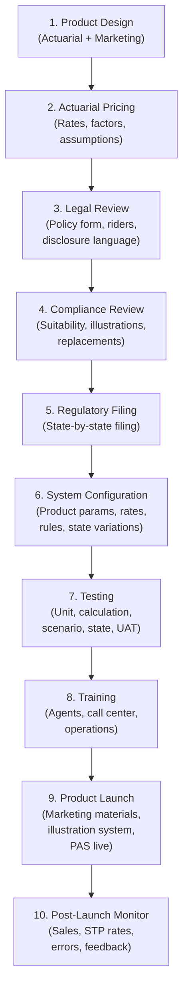

### 10.2 Speed-to-Market Metrics

| Metric | Legacy PAS | Modern Configurable PAS | Improvement |
|--------|-----------|------------------------|-------------|
| Product configuration time | 4-8 months | 2-6 weeks | 75% reduction |
| Rate table change | 2-4 weeks (code change + deploy) | 1-3 days (upload + approve) | 90% reduction |
| State variation addition | 2-4 weeks | 1-5 days | 85% reduction |
| New rider addition | 3-6 months | 2-8 weeks | 70% reduction |
| Regulatory rule update | 1-3 months | 1-2 weeks | 80% reduction |
| Full product test cycle | 3-6 months | 2-4 weeks | 80% reduction |

### 10.3 Product Launch Checklist

| # | Category | Item | Owner | Status |
|---|----------|------|-------|--------|
| 1 | Actuarial | Pricing model approved | Chief Actuary | |
| 2 | Actuarial | Rate tables generated and reviewed | Product Actuary | |
| 3 | Actuarial | Factor tables generated | Valuation Actuary | |
| 4 | Actuarial | Illustration model built and tested | Illustration Team | |
| 5 | Legal | Policy form approved | Legal Counsel | |
| 6 | Legal | Rider forms approved | Legal Counsel | |
| 7 | Compliance | Suitability standards documented | Compliance | |
| 8 | Compliance | Illustration compliance verified | Compliance | |
| 9 | Regulatory | State filings submitted | Filing Team | |
| 10 | Regulatory | State approvals received | Filing Team | |
| 11 | Configuration | Product parameters configured | Config Team | |
| 12 | Configuration | Rate tables loaded | Config Team | |
| 13 | Configuration | Business rules configured | Config Team | |
| 14 | Configuration | State variations configured | Config Team | |
| 15 | Configuration | Commission schedules configured | Distribution | |
| 16 | Testing | Unit tests pass | QA | |
| 17 | Testing | Calculation tests pass | QA + Actuarial | |
| 18 | Testing | State-specific tests pass | QA | |
| 19 | Testing | Regression tests pass | QA | |
| 20 | Testing | UAT sign-off | Business | |
| 21 | Training | Agent training materials ready | Training | |
| 22 | Training | Call center scripts updated | Training | |
| 23 | Training | Operations procedures updated | Operations | |
| 24 | Marketing | Product brochures ready | Marketing | |
| 25 | Marketing | Website updated | Marketing | |
| 26 | Distribution | Illustration system updated | IT | |
| 27 | Distribution | E-App configured | IT | |
| 28 | Reinsurance | Reinsurance treaties updated | Reinsurance | |
| 29 | Go-Live | Production deployment verified | IT | |
| 30 | Go-Live | Post-launch monitoring active | Operations | |

---

## 11. Complete Data Model (30+ Entities)

### 11.1 Product Configuration ERD

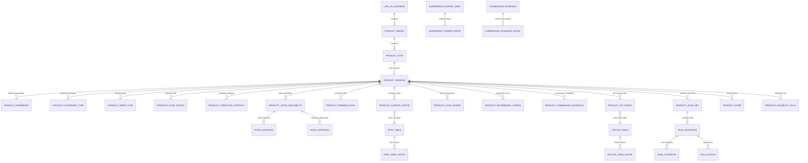

### 11.2 Entity Inventory (35 Entities)

| # | Entity | Description |
|---|--------|-------------|
| 1 | LINE_OF_BUSINESS | LOB master (Life, Annuity, Health) |
| 2 | PRODUCT_SERIES | Product series grouping |
| 3 | PRODUCT_PLAN | Product/plan definition |
| 4 | PRODUCT_VERSION | Version history of product configuration |
| 5 | PRODUCT_PARAMETER | Generic parameter key-value store per version |
| 6 | PRODUCT_COVERAGE_TYPE | Available base and rider coverage types |
| 7 | PRODUCT_RIDER_TYPE | Rider-specific configuration |
| 8 | PRODUCT_FUND_OPTION | Available variable sub-accounts |
| 9 | PRODUCT_CREDITING_STRATEGY | Indexed crediting strategy configuration |
| 10 | PRODUCT_CHARGE_CONFIG | Charge type and rate configuration |
| 11 | PRODUCT_PREMIUM_RULE | Premium min/max/target/mode rules |
| 12 | PRODUCT_NF_CONFIG | Non-forfeiture configuration |
| 13 | PRODUCT_LOAN_CONFIG | Loan availability and terms |
| 14 | PRODUCT_WITHDRAWAL_CONFIG | Withdrawal rules and limits |
| 15 | PRODUCT_SETTLEMENT_OPTION | Available payout/settlement options |
| 16 | PRODUCT_COMMISSION_SCHEDULE | Commission schedule assignment |
| 17 | PRODUCT_STATE_AVAILABILITY | State-by-state availability |
| 18 | STATE_VARIATION | State-specific parameter overrides |
| 19 | STATE_APPROVAL | Regulatory filing and approval tracking |
| 20 | PRODUCT_ELIGIBILITY_RULE | Eligibility criteria |
| 21 | PRODUCT_FORM | Policy forms and endorsements |
| 22 | PRODUCT_RULE_SET | Business rule set assignment |
| 23 | RATE_TABLE | Rate table header |
| 24 | RATE_TABLE_ENTRY | Rate table entries (age/gender/class/duration) |
| 25 | FACTOR_TABLE | Factor table header |
| 26 | FACTOR_TABLE_ENTRY | Factor table entries |
| 27 | SURRENDER_CHARGE_TABLE | Surrender charge schedule header |
| 28 | SURRENDER_CHARGE_ENTRY | Surrender charge by year |
| 29 | COMMISSION_SCHEDULE | Commission schedule header |
| 30 | COMMISSION_SCHEDULE_DETAIL | Commission rate by year/type |
| 31 | RULE_DEFINITION | Individual business rule |
| 32 | RULE_CONDITION | Rule condition expression |
| 33 | RULE_ACTION | Rule action (approve, reject, calculate, notify) |
| 34 | PRODUCT_TAX_CONFIG | Tax-related configuration (7702, MEC) |
| 35 | PRODUCT_REINSURANCE_CONFIG | Reinsurance retention and treaty assignment |

---

## 12. Sample Product Configuration

### 12.1 Universal Life Product (JSON)

```json
{
  "productCode": "FLEXUL",
  "planCode": "FLEX-A",
  "version": 3,
  "effectiveDate": "2025-01-01",
  "productName": "FlexLife Universal Life",
  "productType": "UNIVERSAL_LIFE",
  "lobCode": "LIFE",
  "premiumType": "FLEXIBLE",

  "eligibility": {
    "minIssueAge": 18,
    "maxIssueAge": 80,
    "minFaceAmount": 50000,
    "maxFaceAmount": 10000000,
    "faceAmountIncrement": 1000,
    "eligibleRiskClasses": ["PP", "PF", "STD", "T1", "T2", "T3", "T4", "T5", "T6", "T7", "T8"],
    "maxTableRating": 8,
    "eligibleStates": ["*"],
    "excludedStates": [],
    "trustOwnershipAllowed": true,
    "corporateOwnershipAllowed": true
  },

  "premium": {
    "minInitialPremium": 600.00,
    "minRenewalPremium": 300.00,
    "targetPremiumTableId": "TGT-FLEXUL-2025",
    "premiumModesAllowed": ["ANNUAL", "SEMI", "QUARTERLY", "MONTHLY"],
    "modeFactors": {
      "ANNUAL": 1.0000,
      "SEMI": 0.5133,
      "QUARTERLY": 0.2625,
      "MONTHLY": 0.0875
    },
    "premiumLoadTarget": 0.075,
    "premiumLoadExcess": 0.020,
    "section7702Test": "GPT"
  },

  "benefits": {
    "deathBenefitOptions": ["A", "B", "C"],
    "defaultDeathBenefitOption": "A",
    "dbOptionChangeAllowed": true,
    "cashValueMethod": "RETROSPECTIVE",
    "interestCreditingMethod": "DECLARED",
    "minimumGuaranteedRate": 0.0200,
    "currentDeclaredRate": 0.0425,
    "persistencyBonus": {
      "eligible": true,
      "yearEligible": 10,
      "bonusPercentage": 0.0050
    }
  },

  "charges": {
    "costOfInsurance": {
      "basis": "NET_AMOUNT_AT_RISK",
      "timing": "MONTHLY",
      "currentRateTableId": "COI-FLEXUL-2025-CURRENT",
      "guaranteedRateTableId": "COI-FLEXUL-2025-GUARANTEED"
    },
    "monthlyExpenseCharge": {
      "type": "FLAT",
      "amount": 10.00,
      "waivedAfterYear": 0
    },
    "perUnitCharge": {
      "amountPerThousand": 0.05,
      "maxYears": 10
    },
    "surrenderCharge": {
      "tableId": "SC-FLEXUL-2025",
      "basis": "TARGET_PREMIUM",
      "years": 15,
      "schedule": [
        {"year": 1, "pct": 1.00}, {"year": 2, "pct": 0.95},
        {"year": 3, "pct": 0.85}, {"year": 4, "pct": 0.75},
        {"year": 5, "pct": 0.65}, {"year": 6, "pct": 0.55},
        {"year": 7, "pct": 0.45}, {"year": 8, "pct": 0.35},
        {"year": 9, "pct": 0.25}, {"year": 10, "pct": 0.20},
        {"year": 11, "pct": 0.15}, {"year": 12, "pct": 0.10},
        {"year": 13, "pct": 0.05}, {"year": 14, "pct": 0.03},
        {"year": 15, "pct": 0.00}
      ]
    }
  },

  "nonForfeiture": {
    "method": "STANDARD_NONFORFEITURE",
    "mortalityTable": "CSO_2017",
    "interestRate": 0.0400,
    "optionsAvailable": ["ETI", "RPU", "CSV"],
    "automaticOption": "ETI",
    "minimumDurationForCSV": 3
  },

  "loans": {
    "available": true,
    "maxLoanPctOfCSV": 0.90,
    "fixedLoanRate": 0.0500,
    "preferredLoanAvailable": true,
    "preferredLoanEligibleYear": 10,
    "preferredLoanRate": 0.0400,
    "loanInterestCapitalization": "ANNUAL"
  },

  "withdrawals": {
    "partialWithdrawalAllowed": true,
    "freeWithdrawalPct": 0.10,
    "freeWithdrawalBasis": "ACCOUNT_VALUE",
    "minWithdrawalAmount": 500.00,
    "minRemainingValue": 500.00,
    "systematicWithdrawalAvailable": true
  },

  "riders": [
    {"riderCode": "WP", "name": "Waiver of Premium", "required": false, "maxIssueAge": 60},
    {"riderCode": "ADB", "name": "Accidental Death Benefit", "required": false, "maxAmount": 500000},
    {"riderCode": "CHILD", "name": "Children's Insurance", "required": false, "unitAmount": 10000},
    {"riderCode": "GIB", "name": "Guaranteed Insurability", "required": false, "maxIssueAge": 37},
    {"riderCode": "CHRONIC", "name": "Chronic Illness Accelerated Benefit", "required": false},
    {"riderCode": "TERM", "name": "Term Insurance Rider", "required": false, "maxAmount": 1000000}
  ]
}
```

---

## 13. Architecture

### 13.1 Product Configuration Engine Architecture

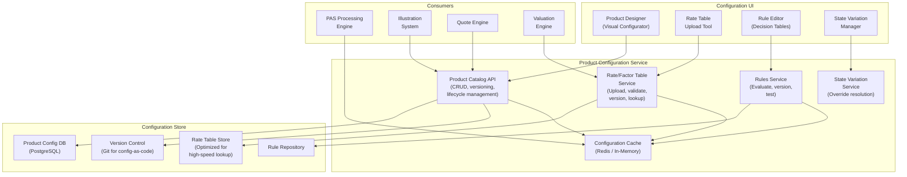

### 13.2 Product Testing Framework Architecture

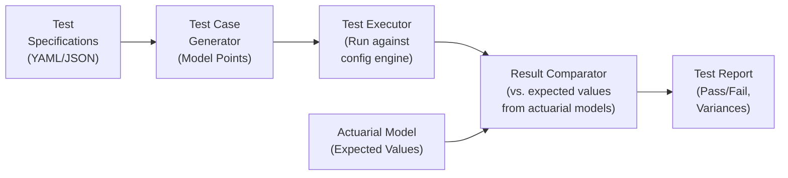

---

## 14. Implementation Guidance

### 14.1 Configuration Framework Design Principles

| Principle | Description |
|-----------|-------------|
| **Separation of Concerns** | Product definition (what) is separate from processing engine (how) |
| **Effective Dating** | Every configuration element has effective and end dates |
| **Version Immutability** | Published versions are immutable; changes create new versions |
| **Override Hierarchy** | Base → Product → Plan → State → Policy (most specific wins) |
| **Fail-Safe Defaults** | Every parameter has a sensible default; missing config should not crash the system |
| **Audit Trail** | Every configuration change is logged with user, timestamp, and reason |
| **Testability** | Configuration can be tested in isolation without deploying to a full environment |
| **Backward Compatibility** | New product versions do not alter behavior for existing policies on prior versions |

### 14.2 Common Pitfalls

| Pitfall | Impact | Mitigation |
|---------|--------|------------|
| Over-configuration | Everything is configurable but nothing is fast or maintainable | Configure what changes; code what is stable |
| Under-configuration | Critical parameters are hard-coded; every change requires deployment | Identify all parameters that vary by product, state, or time |
| No version control | Cannot reproduce historical configuration | Version every configuration change |
| No testing framework | Configuration changes break production | Automated product test suite |
| God configuration object | Single massive configuration blob | Decompose into focused domains (premium, charges, benefits, etc.) |
| No state override mechanism | State-specific logic scattered in code | Systematic state variation framework |
| Ignoring performance | Rate table lookups are slow | Cache hot rate tables in memory |

### 14.3 Key Success Metrics

| Metric | Target | Measurement |
|--------|--------|-------------|
| Time to configure new product | < 6 weeks | Elapsed time from specs to production-ready |
| Rate table change cycle | < 3 days | Upload to production |
| State variation addition | < 5 days | Request to production |
| Configuration defect rate | < 2% of changes | Defects found in testing |
| Product test automation coverage | > 95% | Automated tests / total test cases |
| Cache hit rate for product lookups | > 99% | Cache monitoring |

---

*This article is part of the Life Insurance PAS Architect's Encyclopedia. For related topics, see Article 42 (Canonical Data Model), Article 45 (Reinsurance Administration), and Article 47 (Testing Strategies for PAS).*
