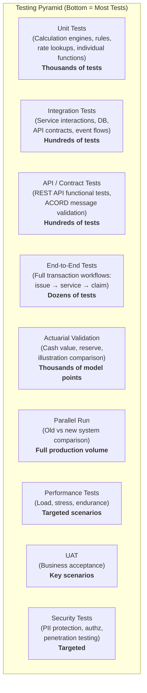
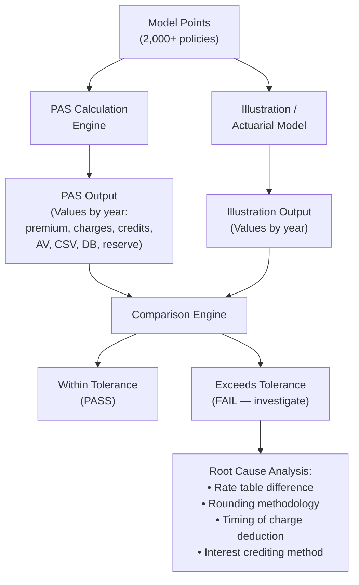
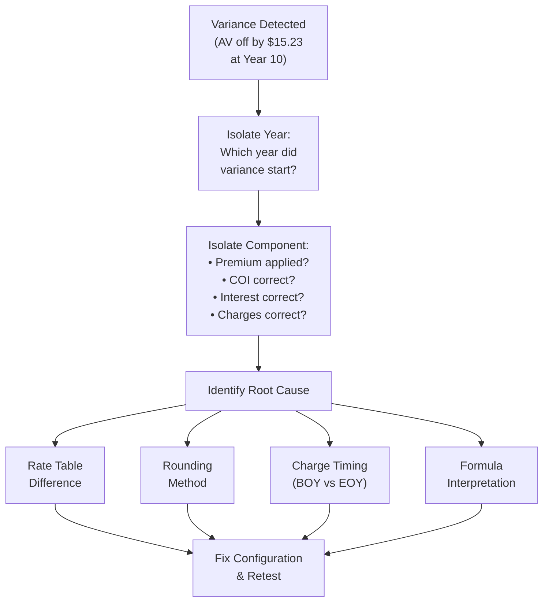
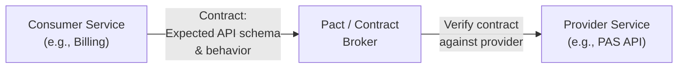
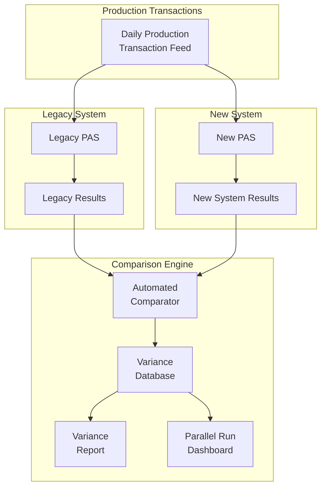
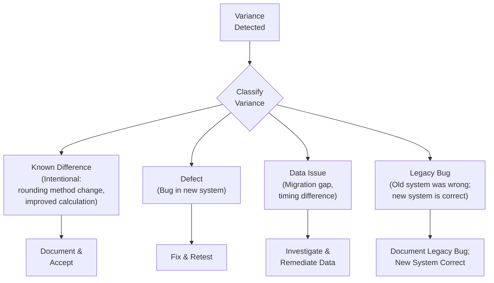
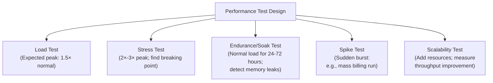
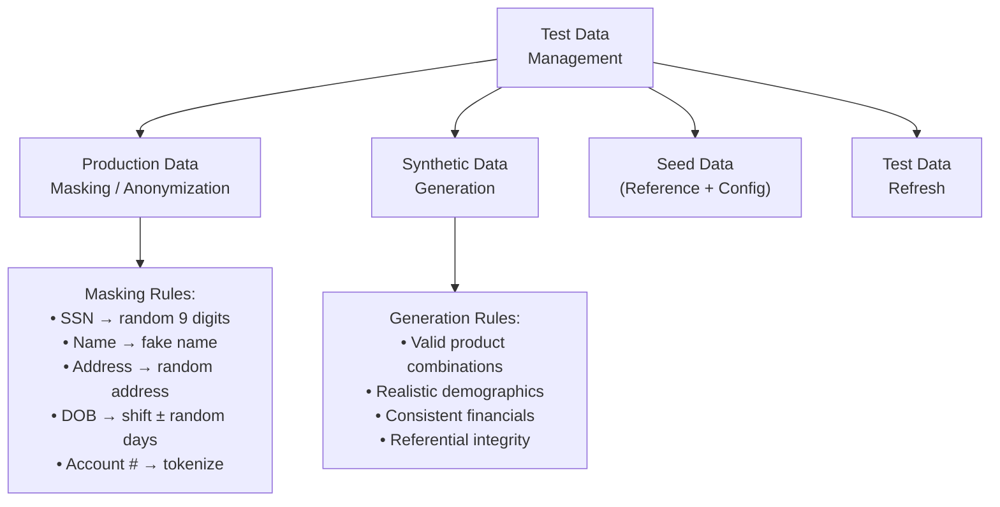
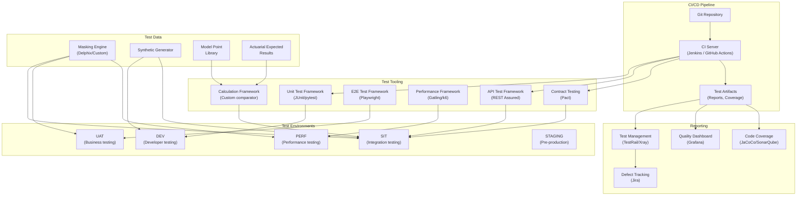

# Article 47: Testing Strategies for Life Insurance PAS

## Table of Contents

1. [Introduction](#1-introduction)
2. [Testing Pyramid for PAS](#2-testing-pyramid-for-pas)
3. [Actuarial Validation](#3-actuarial-validation)
4. [Calculation Testing](#4-calculation-testing)
5. [Regulatory Testing](#5-regulatory-testing)
6. [Integration Testing](#6-integration-testing)
7. [Parallel Run Testing](#7-parallel-run-testing)
8. [Performance Testing](#8-performance-testing)
9. [Data Migration Testing](#9-data-migration-testing)
10. [Test Data Management](#10-test-data-management)
11. [Test Automation](#11-test-automation)
12. [UAT Framework](#12-uat-framework)
13. [Complete Test Strategy Document Template](#13-complete-test-strategy-document-template)
14. [Sample Test Cases](#14-sample-test-cases)
15. [Test Architecture Diagram](#15-test-architecture-diagram)
16. [Implementation Guidance](#16-implementation-guidance)

---

## 1. Introduction

Testing a Life Insurance Policy Administration System is uniquely challenging because of the domain's combination of financial precision, regulatory compliance, actuarial complexity, and long-duration contract management. A missed rounding error in a COI calculation can compound over 40 years. A misapplied state rule can trigger regulatory action. A failed integration can leave policyholders without benefits.

### 1.1 Why PAS Testing Is Unique

| Challenge | PAS-Specific Impact |
|-----------|-------------------|
| Financial precision | Calculations must be accurate to the penny across millions of policies over decades |
| Regulatory compliance | 50+ state jurisdictions with unique rules; non-compliance = fines and market conduct actions |
| Actuarial correctness | Cash values, reserves, and benefits must match actuarial models; errors affect financial statements |
| Long-duration contracts | A policy issued today must be correctly administered for 50+ years |
| Product complexity | 50-200+ products with unique parameters, riders, crediting strategies |
| Transaction interdependence | Premium → COI → Interest → Account Value → NAR → Reinsurance → Reserve: one error cascades |
| History sensitivity | A change today must not break historical calculations or audit trails |
| Integration breadth | PAS integrates with 15-30+ systems (billing, claims, GL, reinsurance, correspondence, etc.) |

### 1.2 Cost of Defects by Discovery Phase

| Phase Discovered | Relative Cost | Insurance Example |
|-----------------|---------------|-------------------|
| Unit Test | 1× | COI rate lookup returns wrong value — fix immediately |
| Integration Test | 5× | Premium not flowing to billing system — rework interfaces |
| System Test | 10× | Incorrect cash values on 1,000-policy test — redesign calculation |
| UAT | 25× | Business rejects annuity payout logic — rebuild benefit module |
| Parallel Run | 50× | 5% of policies have wrong reserves — emergency remediation |
| Production | 200× | Regulators find incorrect NF values — recall statements, refile, remediate |

---

## 2. Testing Pyramid for PAS

### 2.1 The PAS Testing Pyramid



### 2.2 Test Type Distribution

| Test Type | Scope | Volume | Frequency | Who |
|-----------|-------|--------|-----------|-----|
| Unit | Single function/method | 5,000-20,000 | Every commit (CI) | Developers |
| Integration | Service-to-service, service-to-DB | 500-2,000 | Every PR merge | Developers + QA |
| API / Contract | REST endpoints, message formats | 300-1,000 | Daily (CI) | QA + Developers |
| End-to-End | Full business workflows | 50-200 | Nightly | QA |
| Actuarial Validation | Calculation accuracy | 2,000-10,000 model points | Per product config change | Actuarial + QA |
| Parallel Run | System-to-system comparison | Full book (100K-1M+ policies) | During migration/upgrade | QA + Actuarial |
| Performance | Throughput, latency, stress | 10-50 scenarios | Weekly during build | Performance Engineers |
| Security | Vulnerabilities, access control | 50-200 checks | Per release | Security Team |
| UAT | Business scenario validation | 100-500 | Per release | Business Users |

---

## 3. Actuarial Validation

### 3.1 What Must Be Validated

| Calculation | Validation Method | Tolerance |
|------------|-------------------|-----------|
| Cash value (accumulation) | Compare PAS projection to illustration system | ±$1.00 per policy per year |
| Cash surrender value | CSV = AV − surrender charge; verify at each anniversary | ±$0.01 |
| Cost of insurance | Monthly COI = NAR/1000 × monthly COI rate; verify rate lookup | Exact match |
| Interest crediting | Monthly interest = AV × (annual rate / 12) | ±$0.01 |
| Indexed interest credit | Segment return × participation rate, capped at cap, floored at floor | ±$0.01 |
| Death benefit | DB = MAX(face, AV × corridor factor) for option A; DB = face + AV for option B | Exact match |
| Dividend | Dividend = divisible surplus × contribution formula | ±$0.01 |
| Non-forfeiture (ETI) | ETI duration from NF factor table | Exact match (to nearest month) |
| Non-forfeiture (RPU) | RPU amount from NF factor table × NF value | ±$1.00 |
| Annuity payout | Payout = AV × annuity factor | ±$0.01 |
| Reserve (statutory) | Compare PAS reserve to actuarial model | ±0.1% of reserve |
| Reserve (GAAP/LDTI) | Compare to GAAP model | ±0.5% (more complex) |
| MEC test (7-pay) | Cumulative premiums vs. 7-pay limit | Exact match |
| IRC §7702 (GPT/CVAT) | Cash value vs. guideline/corridor limit | Exact match |

### 3.2 Seriatim Comparison Methodology



### 3.3 Model Point Design

Design model points to cover the full product parameter space:

| Dimension | Values | Purpose |
|-----------|--------|---------|
| Issue Age | 25, 30, 35, 40, 45, 50, 55, 60, 65, 70, 75 | Age-dependent rates |
| Gender | M, F | Gender-rated products |
| Risk Class | Preferred Plus, Preferred, Standard, Table 2, Table 4 | Class-specific COI rates |
| Tobacco | NT, T | Tobacco-differentiated rates |
| Face Amount | $100K, $250K, $500K, $1M, $5M | Band-dependent charges and rates |
| Premium | Minimum, Target, 2× Target, Maximum | Different accumulation paths |
| DB Option | A, B, C | Different death benefit and COI calculations |
| Product | Each active product/plan code | Product-specific configuration |
| State | NY, CA, TX (high-variation states) + default | State variation testing |

### 3.4 Tolerance Thresholds

| Comparison Field | Absolute Tolerance | Percentage Tolerance | Duration |
|-----------------|-------------------|---------------------|----------|
| Account Value | ±$1.00 | ±0.01% | Per year |
| Monthly COI | ±$0.01 | — | Per month |
| Monthly Interest | ±$0.01 | — | Per month |
| Surrender Value | ±$1.00 | ±0.01% | Per year |
| Death Benefit | ±$1.00 | — | Per year |
| Statutory Reserve | ±$10.00 | ±0.10% | Per year |
| Annual Premium | Exact | — | — |

### 3.5 Variance Investigation Workflow



---

## 4. Calculation Testing

### 4.1 Test Case Design for Financial Calculations

#### Boundary Value Analysis

| Calculation | Boundary Tests |
|------------|----------------|
| Premium | Exact minimum, minimum − $1 (reject), exact maximum, maximum + $1 (reject) |
| Face amount | Min face, max face, face at band boundary |
| Issue age | Min age, max age, age − 1 (reject), age + 1 (reject) |
| COI rate | First-year rate, last select period rate, ultimate rate transition |
| Surrender charge | Year 0 (no surrender allowed), year 1, year N (charge = 0), year N+1 |
| Loan | Max loan amount, max loan + $1 (reject), zero loan |
| Withdrawal | Free amount exactly, free amount + $1 (triggers charge), full surrender |
| Index credit | Negative return (floor applies), zero return, return > cap (cap applies) |
| MEC | Cumulative premium = 7-pay − $1 (not MEC), 7-pay + $1 (MEC) |
| §7702 | Cash value = CVAT limit − $1 (pass), CVAT limit + $1 (fail) |

#### Precision Testing

```
Test: Monthly interest credit precision
Setup:
  Account Value: $123,456.78
  Annual Credited Rate: 4.25%
  
Expected Monthly Credit:
  $123,456.78 × (0.0425 / 12) = $123,456.78 × 0.003541667 = $437.19

Verification:
  Assert PAS_interest_credit == $437.19 (±$0.01)
  Assert PAS uses DECIMAL(15,4) minimum for intermediate calculations
  Assert rounding is applied at the final step only (not at each intermediate)
```

### 4.2 Automated Comparison Framework

```python
# Conceptual Python test framework for PAS calculation validation

class CalculationTest:
    def __init__(self, product_code, model_point):
        self.product = product_code
        self.model_point = model_point
        self.pas_engine = PASCalculationEngine(product_code)
        self.expected_engine = ActuarialModel(product_code)
    
    def run_projection(self, years=30):
        pas_results = self.pas_engine.project(self.model_point, years)
        expected_results = self.expected_engine.project(self.model_point, years)
        return self.compare(pas_results, expected_results)
    
    def compare(self, actual, expected):
        variances = []
        for year in range(len(actual)):
            for field in ['account_value', 'csv', 'death_benefit', 
                          'coi_charge', 'interest_credit', 'reserve']:
                actual_val = actual[year][field]
                expected_val = expected[year][field]
                tolerance = self.get_tolerance(field)
                if abs(actual_val - expected_val) > tolerance:
                    variances.append({
                        'year': year + 1,
                        'field': field,
                        'actual': actual_val,
                        'expected': expected_val,
                        'variance': actual_val - expected_val
                    })
        return variances

# Generate and run model points
model_points = generate_model_points(
    ages=[25, 35, 45, 55, 65],
    genders=['M', 'F'],
    risk_classes=['PP', 'PF', 'STD'],
    tobacco=['NT', 'T'],
    face_amounts=[100000, 500000, 1000000],
    premiums=['MIN', 'TARGET', 'MAX']
)

results = []
for mp in model_points:
    test = CalculationTest('FLEXUL', mp)
    variances = test.run_projection(years=30)
    results.append({'model_point': mp, 'variances': variances})
    
# Report
total_tests = len(model_points) * 30 * 6  # years × fields
total_failures = sum(len(r['variances']) for r in results)
pass_rate = (total_tests - total_failures) / total_tests * 100
```

---

## 5. Regulatory Testing

### 5.1 State-Specific Rule Verification

| State Rule | Test |
|-----------|------|
| Free-look period (10 days, 20 days for replacement, 30 days for seniors in some states) | Issue policy; attempt free-look return at day 9 (allowed), day 11 (verify state extension), day 31 (verify rejection) |
| Non-forfeiture minimum values | Compare PAS NF values to state-required minimums at each policy anniversary |
| Surrender charge limits | Verify charges do not exceed state-mandated maximums (e.g., NY 10-year limit) |
| Grace period length | Verify grace notice timing and lapse dating per state requirement |
| Interest crediting on death claim | Verify interest from DOD to settlement per state requirement |
| Required notices | Verify generation and timing of all required notices (grace, lapse, annual statement) |
| Replacement rules | Verify proper replacement processing (comparisons, forms, hold periods) |
| Illustration compliance | Verify illustrated values comply with NAIC Illustration Model Regulation |

### 5.2 Notice Generation Testing

| Notice | Trigger | Timing | Content Verification |
|--------|---------|--------|---------------------|
| Grace Notice | Premium unpaid past due date | Within 10 days of due date | Correct amount due, grace period end date, consequences |
| Lapse Notice | Grace period expired | Within 5 days of lapse | Reinstatement provisions, NF options |
| Annual Statement | Policy anniversary | 30 days before anniversary | Correct AV, CSV, DB, premiums paid, loans, dividends |
| Illustration Annual Update | Anniversary (variable/indexed) | 30 days before anniversary | Current vs. guaranteed projections |
| Tax Reporting (1099-R) | Taxable distribution | By January 31 | Correct gross distribution, taxable amount, withholding |
| Tax Reporting (5498) | IRA contribution | By May 31 | Correct contribution amount, FMV |
| Confirmation Letter | Transaction processed | Within 5 business days | Transaction type, amount, new values |

### 5.3 ACORD Message Compliance Testing

| ACORD Message | Operation | Test |
|---------------|-----------|------|
| TXLife Request (103) | New Business Submission | Validate request XML against ACORD schema; verify all required elements present |
| TXLife Response (103) | New Business Response | Validate response includes all required status codes and data |
| TXLife Request (121) | Policy Inquiry | Query returns correct policy data in ACORD format |
| TXLife Request (501) | Financial Activity | Transaction data maps correctly to ACORD FinancialActivity |
| TXLife Request (151) | Billing Inquiry | Billing data returns in correct ACORD format |

---

## 6. Integration Testing

### 6.1 Integration Test Matrix

| Integration | Direction | Test Scenarios |
|------------|-----------|----------------|
| PAS → Billing | Outbound | Premium schedule creation, billing method change, mode change, suspense processing |
| PAS → Claims | Bidirectional | Death claim notification, claim status update, claim payment trigger |
| PAS → Reinsurance | Outbound | Cession creation on new policy, face change, claim recovery request, bordereau data |
| PAS → General Ledger | Outbound | Transaction posting (premiums, claims, commissions), month-end journal entries |
| PAS → Correspondence | Outbound | Notice trigger, template selection, merge data accuracy, delivery confirmation |
| PAS → Illustration | Bidirectional | Product data sync, in-force illustration request, illustration compliance |
| PAS → E-Application | Inbound | Application data import, validation, policy creation |
| PAS ← MIB | Inbound | MIB code check, hit processing |
| PAS ← Labs/Paramedical | Inbound | Lab results import, risk class assignment |
| PAS ← MVR | Inbound | Motor vehicle report import |
| PAS ← Payment Processor | Inbound | EFT/ACH payment confirmation, NSF notification |
| PAS → Agent Portal | Outbound | Commission data, policy data, production reports |
| PAS → Customer Portal | Outbound | Policy summary, transaction history, document access |
| PAS → Data Warehouse | Outbound | CDC/batch extract accuracy, completeness |

### 6.2 Contract Testing (Consumer-Driven)



**Example Pact Contract:**

```json
{
  "consumer": { "name": "billing-service" },
  "provider": { "name": "pas-policy-api" },
  "interactions": [
    {
      "description": "Request for policy billing data",
      "request": {
        "method": "GET",
        "path": "/api/v1/policies/UL2024001234/billing",
        "headers": { "Accept": "application/json" }
      },
      "response": {
        "status": 200,
        "headers": { "Content-Type": "application/json" },
        "body": {
          "policyNumber": "UL2024001234",
          "billingMode": "MONTHLY",
          "modalPremium": 875.00,
          "paidToDate": "2025-06-15",
          "billingStatus": "ACTIVE",
          "autoPay": true,
          "nextBillDate": "2025-07-01"
        },
        "matchingRules": {
          "body": {
            "$.policyNumber": { "match": "type" },
            "$.modalPremium": { "match": "decimal" },
            "$.paidToDate": { "match": "date", "format": "yyyy-MM-dd" }
          }
        }
      }
    }
  ]
}
```

### 6.3 External Vendor Integration Testing

| Vendor | Test Approach | Key Scenarios |
|--------|--------------|---------------|
| MIB (Medical Information Bureau) | Mock MIB responses; test hit/no-hit processing | Clean check, code hit (follow-up required), multiple hits |
| Lab Vendors (ExamOne, APPS) | Mock lab result files; test import and parsing | Normal results, abnormal results, incomplete results |
| Payment Processors (ACH/EFT) | Mock NACHA file processing | Successful payment, NSF/return, prenote confirmation |
| Address Validation (USPS/CASS) | Mock CASS engine responses | Valid address, invalid (suggested correction), undeliverable |
| E-Signature (DocuSign, OneSpan) | Mock signature status callbacks | Completed, declined, expired |
| ECM (Document Management) | Mock document storage/retrieval | Store success, retrieve success, document not found |

---

## 7. Parallel Run Testing

### 7.1 Parallel Run Architecture



### 7.2 Comparison Fields

| Transaction Type | Comparison Fields | Tolerance |
|-----------------|-------------------|-----------|
| Premium Payment | Applied amount, fund allocation, new AV, new CSV | ±$0.01 |
| COI Deduction | Monthly COI amount, NAR used | ±$0.01 |
| Interest Credit | Interest amount, rate used, new AV | ±$0.01 |
| Withdrawal | Withdrawal amount, surrender charge, new AV, tax withholding | ±$0.01 |
| Loan | Loan amount, interest rate, new loan balance | ±$0.01 |
| Death Claim | Benefit amount, interest on claim, settlement amount | ±$1.00 |
| Anniversary | All year-end values (AV, CSV, DB, reserve) | ±$1.00 |
| Billing | Bill amount, billing date, billing status | Exact |
| Correspondence | Notice type, generation trigger, recipient | Exact |

### 7.3 Parallel Run Duration and Acceptance

| Phase | Duration | Scope | Acceptance Criteria |
|-------|----------|-------|-------------------|
| Phase 1 | 2 weeks | Sample transactions (100-500/day) | > 95% match rate |
| Phase 2 | 2 weeks | Full daily transactions | > 98% match rate |
| Phase 3 | 2 weeks | Full transactions + billing cycle | > 99% match rate |
| Phase 4 | 2 weeks | Full transactions + month-end processing | > 99.5% match rate |
| **Exit Criteria** | — | All transaction types tested | **> 99.5% overall match rate** |

### 7.4 Variance Triage Process



---

## 8. Performance Testing

### 8.1 Performance Test Scenarios

| Scenario | Description | Target |
|----------|-------------|--------|
| **Peak Billing Cycle** | Process monthly billing for entire book (500K-1M+ policies) | Complete within 4-hour batch window |
| **Month-End Processing** | Anniversary processing, interest crediting, charge deductions | Complete within 6-hour batch window |
| **Year-End Reporting** | Annual statement generation, tax form generation, reserve valuation | Complete within 24-hour batch window |
| **API Response Time** | Policy inquiry, transaction submission, document retrieval | P95 < 500ms; P99 < 2s |
| **Concurrent Users** | 200+ simultaneous call center agents processing transactions | Stable performance, no degradation |
| **Batch Transaction Throughput** | Bulk premium posting (e.g., payroll deduction file — 50K records) | Process within 1 hour |
| **Report Generation** | Monthly management reports, ad-hoc queries | Interactive reports < 30s; complex < 5min |

### 8.2 Performance Test Design



### 8.3 Performance Test Data

| Volume | Small Test | Medium Test | Production-Scale |
|--------|-----------|-------------|-----------------|
| Policies | 50,000 | 250,000 | 1,000,000+ |
| Transactions/month | 500,000 | 2,500,000 | 10,000,000+ |
| Active users | 20 | 100 | 300+ |
| Products | 10 | 30 | 100+ |
| Concurrent API calls | 50 | 200 | 500+ |

### 8.4 Performance Acceptance Criteria

| Metric | Target | Measurement Method |
|--------|--------|-------------------|
| API response time (P50) | < 200ms | Application Performance Monitor (APM) |
| API response time (P95) | < 500ms | APM |
| API response time (P99) | < 2,000ms | APM |
| Batch billing throughput | > 5,000 policies/minute | Batch job logging |
| Monthly processing window | < 6 hours | Batch scheduler |
| Error rate under load | < 0.1% | APM |
| CPU utilization at peak | < 80% | Infrastructure monitoring |
| Memory utilization at peak | < 85% | Infrastructure monitoring |
| Database query time (P95) | < 100ms | DB monitoring |
| Zero memory leaks | No growth over 72-hour soak | Memory profiler |

### 8.5 Performance Test Tools

| Tool | Purpose | Type |
|------|---------|------|
| JMeter | API load testing, batch simulation | Open source |
| Gatling | High-performance HTTP load testing | Open source |
| k6 | Developer-friendly load testing | Open source |
| Locust | Python-based distributed load testing | Open source |
| LoadRunner | Enterprise load testing | Commercial |
| Datadog APM | Application performance monitoring | Commercial |
| Grafana + Prometheus | Infrastructure monitoring | Open source |
| pgBadger / pg_stat_statements | PostgreSQL performance analysis | Open source |

---

## 9. Data Migration Testing

### 9.1 Migration Test Categories

| Category | Description | Test Method |
|----------|-------------|-------------|
| **Record Count** | Source count = target count (by entity, by status, by product) | SQL comparison queries |
| **Financial Reconciliation** | Sum of financial values match (AV, CSV, loan, reserve, premium) | Aggregate comparison |
| **Sampling** | Random and stratified sample of policies verified end-to-end | Manual and automated |
| **Transformation Accuracy** | Code crosswalks applied correctly; derivations correct | Sampling + automated rules |
| **Boundary Conditions** | Edge cases: oldest policies, highest face amounts, most riders | Manual verification |
| **Orphan Records** | No orphan children (coverages, transactions without parent policy) | FK validation queries |
| **Processability** | Can the target system process transactions on migrated data? | Run test transactions |
| **Referential Integrity** | All FK relationships valid in target | Constraint validation |
| **Historical Accuracy** | Transaction history faithfully represents legacy events | Sample comparison |

### 9.2 Migration Test Automation

```sql
-- Record count reconciliation
SELECT 'POLICY' AS entity,
       (SELECT COUNT(*) FROM legacy.policy WHERE status_cd IN ('IF','LP','SU')) AS source_count,
       (SELECT COUNT(*) FROM life_pas.policy WHERE policy_status_code IN ('INFORCE','LAPSED','SURRENDERED')) AS target_count,
       (SELECT COUNT(*) FROM legacy.policy WHERE status_cd IN ('IF','LP','SU')) -
       (SELECT COUNT(*) FROM life_pas.policy WHERE policy_status_code IN ('INFORCE','LAPSED','SURRENDERED')) AS variance
UNION ALL
SELECT 'COVERAGE',
       (SELECT COUNT(*) FROM legacy.coverage),
       (SELECT COUNT(*) FROM life_pas.coverage),
       (SELECT COUNT(*) FROM legacy.coverage) - (SELECT COUNT(*) FROM life_pas.coverage)
UNION ALL
SELECT 'PARTY',
       (SELECT COUNT(*) FROM legacy.insured),
       (SELECT COUNT(*) FROM life_pas.individual),
       (SELECT COUNT(*) FROM legacy.insured) - (SELECT COUNT(*) FROM life_pas.individual);

-- Financial reconciliation
SELECT 'ACCOUNT_VALUE' AS measure,
       (SELECT SUM(acct_val) FROM legacy.policy WHERE status_cd = 'IF') AS source_total,
       (SELECT SUM(total_account_value) FROM life_pas.policy WHERE policy_status_code = 'INFORCE') AS target_total,
       ABS((SELECT SUM(acct_val) FROM legacy.policy WHERE status_cd = 'IF') -
           (SELECT SUM(total_account_value) FROM life_pas.policy WHERE policy_status_code = 'INFORCE')) AS abs_variance;
```

---

## 10. Test Data Management

### 10.1 Test Data Strategies



### 10.2 PII Masking Rules

| Field | Masking Technique | Example |
|-------|------------------|---------|
| SSN | Format-preserving random | 123-45-6789 → 987-65-4321 |
| First Name | Substitute from name dictionary | John → Michael |
| Last Name | Substitute from name dictionary | Smith → Johnson |
| Date of Birth | Shift by random offset (±30 days) | 1980-05-15 → 1980-06-08 |
| Address | Substitute from address dictionary | 123 Oak St → 456 Elm Ave |
| Phone | Format-preserving random | 555-0123 → 555-9876 |
| Email | Generate random email | john@email.com → user4523@test.com |
| Bank Account | Tokenize | 1234567890 → TOK_A8B3C2D1 |
| Policy Number | Preserve (not PII but link to PII context) | Keep original or add prefix |

### 10.3 Synthetic Test Data Generation

```python
# Conceptual synthetic data generator for PAS testing

def generate_test_policy(product_config, seed):
    random.seed(seed)
    
    issue_age = random.choice(range(
        product_config.min_issue_age,
        product_config.max_issue_age + 1
    ))
    gender = random.choice(['M', 'F'])
    risk_class = random.choice(product_config.eligible_risk_classes)
    tobacco = random.choice(['NT', 'T'])
    
    face_amount = random.choice([
        50000, 100000, 250000, 500000, 1000000
    ])
    face_amount = max(face_amount, product_config.min_face_amount)
    face_amount = min(face_amount, product_config.max_face_amount)
    
    issue_date = generate_random_date('2020-01-01', '2025-01-01')
    
    return {
        'policy_number': f'TEST-{seed:010d}',
        'product_plan_id': product_config.product_plan_id,
        'issue_date': issue_date,
        'face_amount': face_amount,
        'insured': {
            'first_name': fake.first_name(),
            'last_name': fake.last_name(),
            'birth_date': issue_date - timedelta(days=issue_age * 365),
            'gender': gender,
            'ssn': fake.ssn(),
            'risk_class': risk_class,
            'tobacco': tobacco
        },
        'premium_mode': random.choice(['ANNUAL', 'MONTHLY']),
        'death_benefit_option': random.choice(['A', 'B'])
    }
```

### 10.4 Test Data Refresh Strategy

| Environment | Refresh Frequency | Source | Method |
|------------|-------------------|--------|--------|
| Development | On demand | Synthetic generation | Automated script |
| Integration | Weekly | Masked production subset | Automated pipeline |
| System Test | Bi-weekly | Masked production (full) | Database restore |
| Performance | Monthly | Masked production (full scale) | Database restore + scaling |
| UAT | Per release | Masked production + synthetic edge cases | Hybrid |

---

## 11. Test Automation

### 11.1 CI/CD Pipeline Integration

```mermaid
graph LR
    COMMIT["Developer<br/>Commit"]
    COMMIT --> BUILD["Build<br/>(Compile, lint)"]
    BUILD --> UNIT["Unit Tests<br/>(5-10 min)"]
    UNIT --> INTEG["Integration Tests<br/>(15-30 min)"]
    INTEG --> API["API Tests<br/>(10-20 min)"]
    API --> DEPLOY_QA["Deploy to QA"]
    DEPLOY_QA --> E2E["E2E Tests<br/>(30-60 min)"]
    E2E --> CALC["Calculation Tests<br/>(30-60 min)"]
    CALC --> DEPLOY_STAGE["Deploy to Staging"]
    DEPLOY_STAGE --> PERF["Performance Tests<br/>(2-4 hours)"]
    PERF --> DEPLOY_PROD["Deploy to<br/>Production"]
```



### 11.2 Test Automation Framework Stack

| Layer | Tool | Purpose |
|-------|------|---------|
| Unit Tests | JUnit 5 / TestNG (Java), pytest (Python), xUnit (.NET) | Individual function testing |
| API Tests | REST Assured, Postman/Newman, Karate | HTTP API testing |
| Contract Tests | Pact | Consumer-driven contract testing |
| E2E Tests | Selenium, Playwright, Cypress | UI workflow testing |
| Calculation Tests | Custom framework (Excel comparison engine) | Actuarial validation |
| Performance Tests | Gatling, k6, JMeter | Load and stress testing |
| Data Quality Tests | Great Expectations, dbt tests | Data pipeline validation |
| Test Management | TestRail, Xray (Jira), Zephyr | Test case management and reporting |

### 11.3 Regression Test Suite

| Suite | Test Count | Run Time | Trigger |
|-------|-----------|----------|---------|
| Smoke Tests | 50 | 5 min | Every deployment |
| Unit Test Suite | 5,000+ | 10 min | Every commit |
| API Regression Suite | 500 | 20 min | Every PR merge |
| Calculation Regression | 2,000 model points | 45 min | Product config change |
| Full Regression | 10,000+ | 4 hours | Weekly / pre-release |
| Performance Regression | 10 scenarios | 2 hours | Weekly |

---

## 12. UAT Framework

### 12.1 Business Scenario Design

| Scenario # | Category | Description | Priority |
|-----------|----------|-------------|----------|
| UAT-001 | New Business | Issue UL policy: full underwriting, preferred risk, $500K face | Critical |
| UAT-002 | New Business | Issue term policy: simplified issue, standard risk, $250K face | Critical |
| UAT-003 | New Business | Issue IUL with multiple indexed strategies and fixed allocation | Critical |
| UAT-004 | Premium | Post monthly EFT premium to UL policy | Critical |
| UAT-005 | Premium | Post excess (dump-in) premium approaching MEC limit | High |
| UAT-006 | Service | Change beneficiary from individual to trust | High |
| UAT-007 | Service | Change address with USPS validation | Medium |
| UAT-008 | Service | Process partial withdrawal from UL (within free amount) | Critical |
| UAT-009 | Service | Process partial withdrawal exceeding free amount (surrender charge applies) | High |
| UAT-010 | Service | Policy loan advance and repayment | Critical |
| UAT-011 | Service | Face amount increase with underwriting | High |
| UAT-012 | Service | Face amount decrease | Medium |
| UAT-013 | Service | Change death benefit option A to B | Medium |
| UAT-014 | Service | Fund transfer between sub-accounts (VUL) | High |
| UAT-015 | Billing | Monthly billing cycle processing | Critical |
| UAT-016 | Billing | Grace period processing and lapse | Critical |
| UAT-017 | Billing | Reinstatement within 6 months | High |
| UAT-018 | Claims | Death claim — straightforward approval and payment | Critical |
| UAT-019 | Claims | Death claim — within contestability period | High |
| UAT-020 | Claims | Waiver of premium claim | High |
| UAT-021 | Anniversary | Annual policy anniversary processing (charges, credits, statement) | Critical |
| UAT-022 | Anniversary | Policy maturity processing | Medium |
| UAT-023 | Tax | 1099-R generation for taxable distribution | High |
| UAT-024 | Tax | RMD calculation and processing (qualified annuity) | High |
| UAT-025 | Reinsurance | Verify cession creation on new policy issuance | High |

### 12.2 UAT Environment Management

| Requirement | Implementation |
|-------------|---------------|
| Dedicated UAT environment | Separate infrastructure mirroring production |
| Production-like data | Masked production data + synthetic test scenarios |
| Stable configuration | Frozen configuration during UAT window |
| Integration stubs | All downstream systems connected (or stubbed for unavailable) |
| User access | Business testers provisioned with appropriate roles |
| Defect tracking | Dedicated Jira project/board for UAT defects |
| Support team | Developers and QA on standby for triage |

### 12.3 UAT Sign-Off Criteria

| # | Criterion | Required |
|---|-----------|----------|
| 1 | All Critical test scenarios executed and passed | 100% |
| 2 | All High priority scenarios executed | 100% |
| 3 | High priority pass rate | ≥ 95% |
| 4 | Medium priority scenarios executed | ≥ 90% |
| 5 | No Critical severity defects open | 0 open |
| 6 | No High severity defects open (or approved workaround) | 0 open (or documented workaround) |
| 7 | Business sign-off from each functional area | All areas signed |
| 8 | Actuarial validation sign-off | Signed |
| 9 | Compliance review sign-off | Signed |

---

## 13. Complete Test Strategy Document Template

### 13.1 Test Strategy Outline

```
1. INTRODUCTION
   1.1 Purpose
   1.2 Scope
   1.3 References
   1.4 Definitions and Acronyms

2. TEST APPROACH
   2.1 Testing Levels (Unit, Integration, System, UAT)
   2.2 Testing Types (Functional, Non-Functional, Regulatory, Actuarial)
   2.3 Testing Pyramid — Volume by Level
   2.4 Risk-Based Testing Prioritization

3. TEST ENVIRONMENTS
   3.1 Environment Inventory (DEV, SIT, UAT, PERF, STAGING, PROD)
   3.2 Environment Configuration
   3.3 Data Management Strategy
   3.4 Environment Refresh Schedule

4. TEST DATA MANAGEMENT
   4.1 Production Data Masking Approach
   4.2 Synthetic Data Generation
   4.3 Test Data Seeding
   4.4 PII/PHI Compliance

5. FUNCTIONAL TESTING
   5.1 New Business Processing
   5.2 Policy Servicing
   5.3 Billing and Premium
   5.4 Claims Processing
   5.5 Reinsurance
   5.6 Agent/Commission
   5.7 Correspondence
   5.8 Reporting

6. ACTUARIAL VALIDATION
   6.1 Calculation Verification Methodology
   6.2 Model Point Design
   6.3 Comparison Process
   6.4 Tolerance Thresholds
   6.5 Variance Investigation

7. REGULATORY TESTING
   7.1 State-Specific Rules
   7.2 Notice Compliance
   7.3 Tax Reporting
   7.4 Illustration Compliance

8. INTEGRATION TESTING
   8.1 Integration Points Inventory
   8.2 Contract Testing Strategy
   8.3 External Vendor Testing

9. PERFORMANCE TESTING
   9.1 Performance Scenarios
   9.2 Acceptance Criteria
   9.3 Performance Test Data
   9.4 Monitoring Strategy

10. SECURITY TESTING
    10.1 PII Protection Testing
    10.2 Authorization Testing
    10.3 Penetration Testing

11. MIGRATION TESTING (if applicable)
    11.1 Data Validation
    11.2 Financial Reconciliation
    11.3 Parallel Run

12. TEST AUTOMATION
    12.1 Automation Strategy
    12.2 Framework and Tools
    12.3 CI/CD Integration
    12.4 Regression Suite Management

13. UAT FRAMEWORK
    13.1 Business Scenario Design
    13.2 UAT Execution
    13.3 Sign-Off Criteria

14. DEFECT MANAGEMENT
    14.1 Defect Lifecycle
    14.2 Severity Definitions
    14.3 Triage Process
    14.4 Exit Criteria

15. ROLES AND RESPONSIBILITIES
    15.1 RACI Matrix
    15.2 Resource Plan

16. SCHEDULE
    16.1 Test Phase Timeline
    16.2 Milestones
    16.3 Dependencies

17. RISKS AND MITIGATIONS
    17.1 Testing Risks
    17.2 Mitigation Plans

APPENDICES
    A. Test Case Templates
    B. Defect Report Template
    C. Test Environment Diagrams
    D. Tool Configuration
```

---

## 14. Sample Test Cases

### 14.1 New Business — UL Policy Issuance

| Field | Value |
|-------|-------|
| **Test ID** | TC-NB-001 |
| **Title** | Issue Universal Life Policy — Standard Full Underwriting |
| **Priority** | Critical |
| **Preconditions** | Product FLEXUL configured; applicant data prepared; underwriting rules active |

**Steps:**

| # | Step | Expected Result | Actual | Pass/Fail |
|---|------|-----------------|--------|-----------|
| 1 | Submit application with: Insured M/45/Preferred NT, Face $500K, DB Option A | Application accepted; policy in APPLIED status | | |
| 2 | Complete underwriting — approve as applied | Policy moves to APPROVED status | | |
| 3 | Submit initial premium $5,000 via EFT | Premium received; policy moves to ISSUED | | |
| 4 | Verify policy status = INFORCE | Status = INFORCE; issue date = today | | |
| 5 | Verify coverage created: Base, coverage_amount = $500K | Coverage record exists; status = ACTIVE | | |
| 6 | Verify party roles: Owner = SELF, Insured = PRIMARY, Beneficiary | Three policy_party_role records created | | |
| 7 | Verify premium applied: transaction type = PREM_INIT, amount = $5,000 | Financial transaction created | | |
| 8 | Verify premium load deducted: $5,000 × 7.5% = $375 | Load transaction created, AV = $4,625 | | |
| 9 | Verify account value = initial premium − load | AV = $4,625.00 | | |
| 10 | Verify reinsurance cession created (if face > retention) | Cession record created for appropriate treaty | | |
| 11 | Verify commission calculated: FYC × target premium | Commission transaction created for writing agent | | |
| 12 | Verify confirmation letter generated | Generated document record; template = ISSUE_CONFIRMATION | | |
| 13 | Verify MEC status = NOT_MEC (cumulative premium < 7-pay) | mec_status_code = NOT_MEC | | |

### 14.2 Monthly COI Deduction

| Field | Value |
|-------|-------|
| **Test ID** | TC-MONTHLY-001 |
| **Title** | Monthly Cost of Insurance Deduction |
| **Priority** | Critical |

**Steps:**

| # | Step | Expected Result |
|---|------|-----------------|
| 1 | Setup: UL policy, M/50/Standard NT, Face $1M, AV $100,000 | Policy in force |
| 2 | Trigger monthiversary processing | Monthly charges processed |
| 3 | Calculate expected NAR: $1,000,000 − $100,000 = $900,000 | NAR = $900,000 |
| 4 | Lookup COI rate: M/50/STD/NT/Duration 5 from rate table | Rate = $X.XX per $1000 |
| 5 | Calculate expected COI: $900,000 / 1000 × rate ÷ 12 | Expected monthly COI = $Y.YY |
| 6 | Verify PAS COI deduction matches expected | COI transaction amount matches ±$0.01 |
| 7 | Verify AV reduced by COI amount | New AV = old AV − COI |
| 8 | Verify monthly expense charge deducted | Expense charge = $10.00 (flat) |
| 9 | Verify interest credited | Interest = AV × (annual rate / 12) |
| 10 | Verify new AV = old AV − COI − expense + interest | Reconcile to the penny |

### 14.3 Death Claim Processing

| Field | Value |
|-------|-------|
| **Test ID** | TC-CLM-001 |
| **Title** | Death Claim — Straightforward Approval |
| **Priority** | Critical |

**Steps:**

| # | Step | Expected Result |
|---|------|-----------------|
| 1 | Create death claim notification: DOD = 2025-06-15, policy in force | Claim record created; status = REPORTED |
| 2 | Upload death certificate, claimant statement | Claim documents recorded; status = RECEIVED |
| 3 | Verify claim details: insured matched, coverage active, not in contestability | All checks pass |
| 4 | Calculate death benefit: DB Option A, face = $500K, AV = $75K | DB = MAX($500K, $75K × corridor) = $500K |
| 5 | Calculate interest on claim: DOD to settlement date | Interest calculated per state requirement |
| 6 | Calculate reinsurance recovery | Recovery amount per cession records |
| 7 | Approve claim | Claim status = APPROVED; decision recorded |
| 8 | Process beneficiary payment: Primary 100% to Jane Smith | Claim payment created; check or EFT |
| 9 | Verify GL posting: DB account credited, claim expense debited | GL entries created |
| 10 | Verify 1099-R generated (if taxable portion) | Tax form generated |
| 11 | Verify policy status = terminated (DEATHCLAIM → PAID) | Policy terminated |
| 12 | Verify reinsurance claim notification sent | Reinsurance claim recovery record created |

---

## 15. Test Architecture Diagram

### 15.1 Test Infrastructure



---

## 16. Implementation Guidance

### 16.1 Test Strategy Phasing

```mermaid
gantt
    title Test Implementation Roadmap
    dateFormat  YYYY-Q
    section Phase 1: Foundation
    Test framework setup         :done, 2025-Q1, 2025-Q1
    Unit test suite (core calcs) :done, 2025-Q1, 2025-Q2
    Test data strategy           :done, 2025-Q1, 2025-Q2
    CI/CD pipeline               :done, 2025-Q2, 2025-Q2
    section Phase 2: Expansion
    API test suite               :active, 2025-Q2, 2025-Q3
    Integration test suite       :2025-Q3, 2025-Q4
    Actuarial validation FW      :2025-Q3, 2025-Q4
    Contract testing             :2025-Q4, 2026-Q1
    section Phase 3: Maturity
    E2E test automation          :2026-Q1, 2026-Q2
    Performance test suite       :2026-Q1, 2026-Q2
    Security testing             :2026-Q2, 2026-Q3
    UAT framework                :2026-Q2, 2026-Q3
    section Phase 4: Optimization
    Test analytics dashboard     :2026-Q3, 2026-Q4
    AI-assisted test generation  :2026-Q4, 2027-Q1
    Continuous testing maturity   :2026-Q4, 2027-Q1
```

### 16.2 Key Success Metrics

| Metric | Target | Measurement |
|--------|--------|-------------|
| Unit test coverage | > 80% (line); > 70% (branch) | SonarQube |
| API test coverage | 100% of endpoints | Test management tool |
| Actuarial model point coverage | 100% of product/age/class combinations | Model point matrix |
| Defect escape rate | < 5% (defects found in production vs. total defects) | Defect tracking |
| Automated regression pass rate | > 99% (excluding known issues) | CI/CD reports |
| Mean time to detect (MTTD) | < 1 day for critical defects | Defect tracking |
| Test cycle time | < 4 hours for full regression | CI/CD pipeline metrics |
| UAT defect density | < 2 defects per 100 test cases | UAT tracking |

### 16.3 Common Pitfalls

| Pitfall | Impact | Mitigation |
|---------|--------|------------|
| Testing only "happy path" | Edge cases cause production failures | Boundary value analysis, equivalence partitioning, error guessing |
| No actuarial involvement in testing | Calculation errors undetected | Embed actuarial staff in testing team |
| Insufficient test data diversity | State-specific, product-specific defects missed | Comprehensive model point matrix |
| Manual regression testing | Slow, error-prone, incomplete | Invest in automation from sprint 1 |
| No performance testing until late | Performance issues discovered at cutover | Include performance tests in CI/CD |
| Ignoring negative testing | System crashes on invalid inputs | Test invalid data, unauthorized access, boundary violations |
| Treating parallel run as optional | Go-live with unvalidated calculations | Always run parallel for financial systems |

---

*This article is part of the Life Insurance PAS Architect's Encyclopedia. For related topics, see Article 42 (Canonical Data Model), Article 44 (Data Migration & Conversion), and Article 46 (Product Configuration & Rules-Driven Design).*
