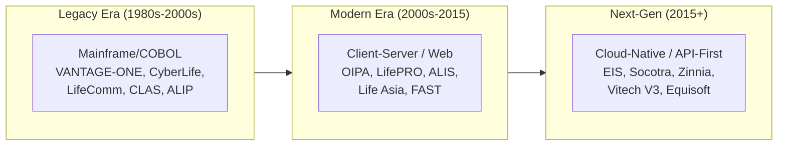
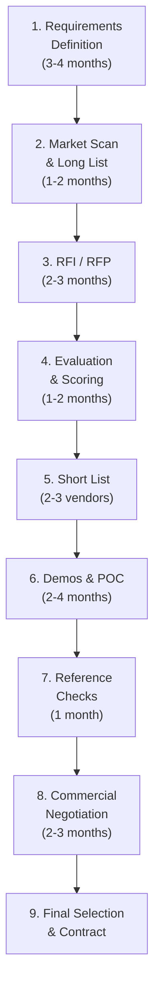
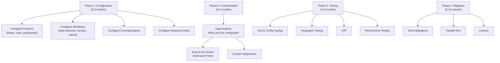
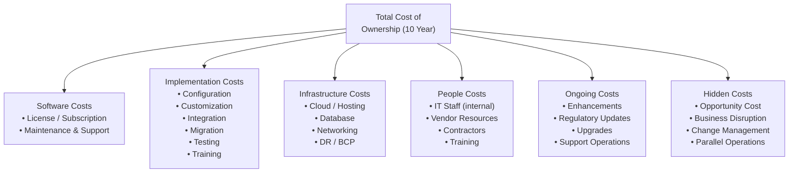
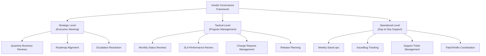
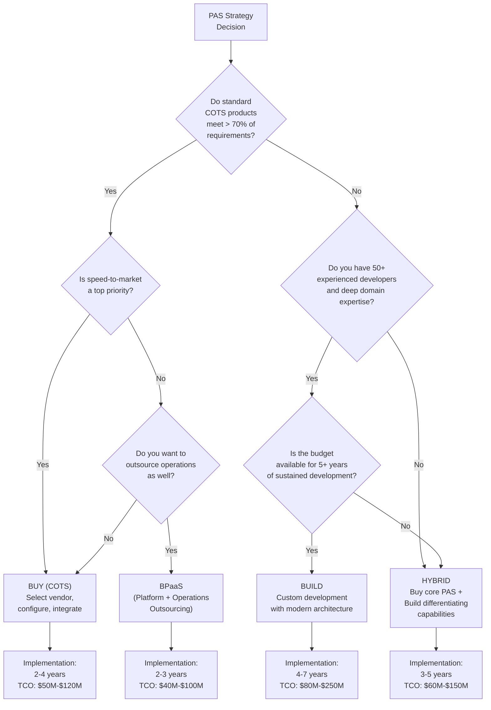

# Article 48: Vendor Landscape & Build-vs-Buy for Life Insurance PAS

## Table of Contents

1. [Introduction](#1-introduction)
2. [PAS Vendor Landscape](#2-pas-vendor-landscape)
3. [COTS vs Custom Build Analysis](#3-cots-vs-custom-build-analysis)
4. [Vendor Selection Framework](#4-vendor-selection-framework)
5. [Implementation Patterns](#5-implementation-patterns)
6. [Modern PAS Characteristics](#6-modern-pas-characteristics)
7. [InsurTech Integration](#7-insurtech-integration)
8. [Total Cost of Ownership (TCO)](#8-total-cost-of-ownership-tco)
9. [Vendor Management](#9-vendor-management)
10. [Evaluation Matrix](#10-evaluation-matrix)
11. [Decision Tree: Build vs Buy vs Hybrid](#11-decision-tree-build-vs-buy-vs-hybrid)
12. [Implementation Timeline Templates](#12-implementation-timeline-templates)
13. [Risk Assessment Framework](#13-risk-assessment-framework)
14. [Implementation Guidance](#14-implementation-guidance)

---

## 1. Introduction

The selection and implementation of a Policy Administration System is among the most consequential technology decisions a life insurance carrier will make. The PAS is the operational backbone — it issues policies, calculates values, processes transactions, generates bills, pays claims, and feeds every downstream system. A poor choice can constrain the business for a decade or more.

### 1.1 The Stakes

| Dimension | Impact of PAS Decision |
|-----------|----------------------|
| Financial | $20M-$200M+ total investment (implementation + 10-year TCO) |
| Timeline | 3-7 years from selection to full deployment |
| Operational | Determines operational efficiency, STP rates, and unit costs for 10-20 years |
| Strategic | Enables or constrains product innovation, distribution expansion, and M&A integration |
| Risk | Failed PAS implementations have put carriers into regulatory difficulty or financial distress |
| People | Requires retraining hundreds of staff; changes every workflow |

### 1.2 The Current Market Landscape

The life PAS vendor market is undergoing a generational shift:



---

## 2. PAS Vendor Landscape

### 2.1 Major Vendors and Platforms

#### 2.1.1 EXL / LifePRO

| Attribute | Detail |
|-----------|--------|
| **Parent Company** | EXL Service Holdings (acquired from EDS → HP → DXC → EXL) |
| **Architecture** | Modular; originally client-server, modernizing to cloud |
| **Technology Stack** | Java-based core; Oracle or SQL Server database |
| **Target Market** | Mid-to-large US life carriers; strong in individual life and annuity |
| **Key Differentiators** | Deep product configuration; large installed base; strong community |
| **Deployment** | On-premise, private cloud, or EXL-managed cloud |
| **Product Coverage** | Term, whole life, UL, VUL, IUL, fixed annuity, variable annuity, indexed annuity |
| **Notable Clients** | Multiple top-25 US life carriers |

#### 2.1.2 Sapiens / ALIS

| Attribute | Detail |
|-----------|--------|
| **Parent Company** | Sapiens International |
| **Architecture** | Rules-driven; table-driven product configuration |
| **Technology Stack** | Java, web-based, microservices evolution |
| **Target Market** | Mid-to-large carriers globally; strong in group and individual |
| **Key Differentiators** | Highly configurable product engine; global presence |
| **Deployment** | Cloud (AWS/Azure), on-premise |
| **Product Coverage** | Full life and annuity spectrum; group life and health |

#### 2.1.3 Oracle / OIPA (Oracle Insurance Policy Administration)

| Attribute | Detail |
|-----------|--------|
| **Parent Company** | Oracle Corporation |
| **Architecture** | Rules-based, XML-driven product configuration |
| **Technology Stack** | Java/J2EE, Oracle Database, XML rules |
| **Target Market** | Large carriers seeking high configurability |
| **Key Differentiators** | Extremely flexible rules engine; Oracle ecosystem integration |
| **Deployment** | Oracle Cloud Infrastructure (OCI), on-premise |
| **Product Coverage** | Individual life, annuity, group, supplemental health |
| **Notable Strength** | Product configuration without code changes |

#### 2.1.4 Majesco / Policy Administration

| Attribute | Detail |
|-----------|--------|
| **Parent Company** | Majesco (private equity backed) |
| **Architecture** | Cloud-native platform; API-first |
| **Technology Stack** | .NET/Cloud, microservices |
| **Target Market** | Mid-market carriers; speed-to-market focused |
| **Key Differentiators** | Modern cloud architecture; digital-first approach |
| **Deployment** | Cloud (SaaS model preferred) |
| **Product Coverage** | L&A (life, annuity), P&C (separate platform) |

#### 2.1.5 DXC / Life Asia

| Attribute | Detail |
|-----------|--------|
| **Parent Company** | DXC Technology |
| **Architecture** | Proven traditional architecture; modernization underway |
| **Technology Stack** | Originally AS/400 → Java modernization |
| **Target Market** | Asia Pacific, UK, and international markets |
| **Key Differentiators** | Dominant in APAC; multi-currency; multi-language |
| **Deployment** | On-premise, managed hosting, cloud migration in progress |
| **Product Coverage** | Individual life, group life, health, investment-linked |

#### 2.1.6 Verisk / FAST (Financial & Administrative Services Technology)

| Attribute | Detail |
|-----------|--------|
| **Parent Company** | Verisk Analytics |
| **Architecture** | Table-driven administration engine |
| **Technology Stack** | Java-based; highly configurable |
| **Target Market** | US life carriers; TPA market |
| **Key Differentiators** | Speed of product configuration; TPA model support |
| **Deployment** | Cloud, on-premise |
| **Product Coverage** | Life and annuity |

#### 2.1.7 Fineos

| Attribute | Detail |
|-----------|--------|
| **Parent Company** | Fineos Corporation (publicly listed) |
| **Architecture** | Cloud-native; SaaS |
| **Technology Stack** | Modern cloud (AWS), microservices |
| **Target Market** | Employee benefits, group insurance, individual life |
| **Key Differentiators** | Strong in group/employee benefits; modern UX |
| **Deployment** | SaaS (cloud-only) |
| **Product Coverage** | Group life, disability, absence management, individual life |

#### 2.1.8 Vitech / V3

| Attribute | Detail |
|-----------|--------|
| **Parent Company** | Vitech Systems (acquired by Thoma Bravo) |
| **Architecture** | Modern, configurable platform |
| **Technology Stack** | .NET, cloud-ready |
| **Target Market** | Group insurance, retirement, pension |
| **Key Differentiators** | Strong in pension/retirement administration; group benefits |
| **Deployment** | Cloud, on-premise |
| **Product Coverage** | Group life, pension, retirement, individual life (expanding) |

#### 2.1.9 EIS Group

| Attribute | Detail |
|-----------|--------|
| **Parent Company** | EIS Group (venture-backed) |
| **Architecture** | Cloud-native, microservices, API-first, event-driven |
| **Technology Stack** | Java/Kotlin, Kubernetes, cloud-native, open APIs |
| **Target Market** | Forward-looking carriers seeking modern architecture |
| **Key Differentiators** | Truly cloud-native; open ecosystem; API-first; headless |
| **Deployment** | Cloud (SaaS on AWS/GCP) |
| **Product Coverage** | Multi-line (life, annuity, P&C, health) |
| **Notable Strength** | Modern architecture, developer-friendly |

#### 2.1.10 Socotra

| Attribute | Detail |
|-----------|--------|
| **Parent Company** | Socotra Inc. (venture-backed) |
| **Architecture** | Cloud-native, API-first, developer-centric |
| **Technology Stack** | Modern cloud, REST APIs, JSON configuration |
| **Target Market** | InsurTech, startups, MGAs, innovative carriers |
| **Key Differentiators** | Speed-to-market; developer experience; API completeness |
| **Deployment** | SaaS (cloud-only) |
| **Product Coverage** | Multi-line (primarily P&C and simple life; expanding) |
| **Consideration** | Newer entrant; less proven for complex life products |

#### 2.1.11 Zinnia (formerly Fidelity & Guaranty Technology)

| Attribute | Detail |
|-----------|--------|
| **Parent Company** | Zinnia (formerly Fidelity & Guaranty Life technology arm) |
| **Architecture** | Modern platform; annuity-focused |
| **Technology Stack** | Cloud, modern stack |
| **Target Market** | Annuity carriers, life insurers |
| **Key Differentiators** | Deep annuity domain expertise; digital distribution |
| **Deployment** | Cloud |
| **Product Coverage** | Fixed annuity, indexed annuity, variable annuity, life |

#### 2.1.12 Additional Vendors

| Vendor | Focus | Notes |
|--------|-------|-------|
| **Andesa** | Variable products, retirement | Strong in VA/VUL administration |
| **iPipeline** | Distribution technology | Illustration, e-application, case management |
| **Equisoft** | Insurance technology | Policy admin, CRM, planning, analytics |
| **SE2** | Insurance BPO + technology | Administration platform + outsourced operations |
| **Mphasis Wyde** | Life and annuity admin | Configuration-driven platform |
| **Infosys McCamish** | Life and annuity BPaaS | Platform + operations outsourcing |
| **Hexaware / Mobiquity** | Digital insurance platform | Emerging player in digital-first insurance |

---

## 3. COTS vs Custom Build Analysis

### 3.1 Cost Comparison

| Cost Category | COTS (Commercial) | Custom Build |
|-------------- |--------------------|-------------|
| **License / Subscription** | $2M-$20M initial; $1M-$5M annual | $0 (no license) |
| **Implementation** | $15M-$80M (configuration, customization, integration, migration, testing) | $20M-$100M+ (design, development, testing) |
| **Timeline to Go-Live** | 2-5 years | 3-7 years |
| **Ongoing Maintenance** | 15-20% of license annually (vendor support) | 20-30% of build cost annually (in-house team) |
| **Upgrade Costs** | $5M-$30M per major version (every 3-5 years) | Continuous (no "upgrade" but continuous development) |
| **Staff Required** | 15-30 FTE for configuration, integration, maintenance | 30-80 FTE for development, maintenance, support |
| **5-Year TCO** | $30M-$100M | $40M-$150M+ |
| **10-Year TCO** | $50M-$180M | $80M-$250M+ |

### 3.2 Comparison Dimensions

| Dimension | COTS | Custom Build |
|-----------|------|-------------|
| **Time-to-Market** | Faster (pre-built functionality) | Slower (build from scratch) |
| **Functionality** | 70-85% out-of-box; remainder requires configuration/customization | 100% tailored to requirements |
| **Flexibility** | Constrained by vendor's architecture and extension model | Full control |
| **Risk** | Vendor stability, roadmap alignment, customization complexity | Development risk, architectural risk, key-person dependency |
| **Innovation** | Dependent on vendor R&D investment | Self-directed innovation |
| **Regulatory Compliance** | Vendor maintains regulatory features; faster adoption | Must build and maintain all regulatory logic |
| **Talent** | Need vendor-certified resources (scarcer) | Need strong development team (also scarce) |
| **Vendor Dependency** | High — locked into vendor's ecosystem | None — full ownership |
| **Upgrade Path** | Vendor provides upgrade path (may be costly) | Continuous improvement (no forced upgrades) |
| **IP Ownership** | Vendor owns IP; carrier licenses it | Carrier owns all IP |

### 3.3 When to Build vs. Buy

**Build When:**
- You have a truly unique business model that no COTS product can support
- You have a large, experienced technology organization
- Speed of feature development is a critical competitive advantage
- You are a very large carrier that can amortize development costs over millions of policies
- You have previously failed at vendor implementations and want full control

**Buy When:**
- Your business model is largely standard (term, whole life, UL, annuities)
- You want to focus technology resources on differentiation, not plumbing
- You need faster time-to-market
- You are mid-market and cannot sustain a large development team
- Regulatory compliance features are critical and vendor maintains them

---

## 4. Vendor Selection Framework

### 4.1 Selection Process Overview



### 4.2 Requirements Definition

| Requirement Category | Key Considerations | Weight |
|---------------------|--------------------|--------|
| **Functional** | Product support (term, UL, VUL, IUL, annuity), new business, policy servicing, billing, claims, reinsurance, commission, correspondence | 35% |
| **Technical** | Architecture (cloud, API, microservices), scalability, performance, security, integration, data model | 20% |
| **Regulatory** | State compliance, NAIC reporting, tax reporting, illustration compliance, ACORD support | 10% |
| **Integration** | Pre-built connectors, API ecosystem, event-driven capability, EDW feeds | 10% |
| **Scalability** | Policy volume capacity, transaction throughput, batch processing window | 5% |
| **Vendor Viability** | Financial stability, market position, R&D investment, client retention | 10% |
| **Implementation** | Implementation methodology, timeline, resources, migration support | 5% |
| **Total Cost** | License, implementation, maintenance, infrastructure, staffing | 5% |

### 4.3 RFI / RFP Process

**RFI (Request for Information):**
- Broad market scan (6-10 vendors)
- High-level capability questions
- Architecture overview
- Client references
- Financial stability
- Purpose: Narrow to a short list of 3-5 vendors for detailed RFP

**RFP (Request for Proposal):**
- Detailed functional requirements (200-500+ requirements)
- Technical architecture requirements
- Integration requirements
- Migration requirements
- Pricing (itemized: license, implementation, ongoing)
- Implementation timeline and methodology
- Staffing model and expertise

### 4.4 Evaluation Criteria (Weighted Scoring)

| # | Criterion | Weight | Scoring Method |
|---|-----------|--------|---------------|
| 1 | Product Administration (NB, service, billing, claims) | 20% | Demo evaluation + RFP response |
| 2 | Product Configuration Flexibility | 10% | POC exercise: configure a sample product |
| 3 | Technical Architecture | 10% | Architecture review + technical deep-dive |
| 4 | Integration Capabilities | 8% | API catalog review + integration demo |
| 5 | Regulatory Compliance | 8% | State rule demo + compliance questionnaire |
| 6 | Reporting & Analytics | 5% | Report demo + data model review |
| 7 | User Experience | 5% | UI demo + usability assessment |
| 8 | Scalability & Performance | 5% | Performance benchmarks + reference checks |
| 9 | Migration Support | 5% | Migration methodology + tools assessment |
| 10 | Vendor Stability & Viability | 7% | Financial review + analyst reports |
| 11 | Client References | 5% | Reference calls (3+ references) |
| 12 | Implementation Methodology | 5% | Methodology review + PM assessment |
| 13 | Total Cost of Ownership | 5% | TCO model comparison |
| 14 | Innovation & Roadmap | 2% | Roadmap presentation + R&D investment |
| **Total** | **100%** | |

### 4.5 Proof of Concept (POC)

POC exercises should be standardized across short-listed vendors:

| POC Scenario | Complexity | Purpose |
|-------------|------------|---------|
| Configure a UL product with 3 riders | Medium | Test product configuration capabilities |
| Issue a policy through full lifecycle | Medium | Test new business and servicing workflow |
| Process a death claim with reinsurance recovery | Medium | Test claims and reinsurance integration |
| Generate state-specific correspondence | Low | Test correspondence engine |
| Migrate 1,000 sample policies | High | Test migration tools and data mapping |
| Process month-end batch for 10,000 policies | High | Test batch processing performance |
| Integrate with mock billing and GL systems | Medium | Test API/integration capabilities |

### 4.6 Reference Check Guide

| Question Category | Sample Questions |
|------------------|-----------------|
| Implementation | How long did implementation take? Was it on time/budget? What were the biggest challenges? |
| Product Configuration | How long does it take to configure a new product? Can business users configure without IT? |
| Performance | How many policies do you administer? What are batch processing times? |
| Support | How responsive is vendor support? How are bugs prioritized? |
| Upgrades | Have you done a major version upgrade? How painful was it? |
| Integration | How did you integrate with billing, claims, GL? Were APIs sufficient? |
| Customization | How much customization did you need? How does it affect upgrades? |
| Satisfaction | Would you choose this vendor again? What would you do differently? |

### 4.7 Contract Considerations

| Clause | Key Points |
|--------|-----------|
| **Licensing Model** | Perpetual vs. subscription; per-policy vs. flat fee; named user vs. concurrent |
| **SLA** | Uptime (99.9%+), response times, resolution times, penalty for non-compliance |
| **Source Code Escrow** | Access to source code if vendor goes bankrupt or ceases support |
| **Exit Provisions** | Data export rights, transition assistance, wind-down timeline |
| **Customization IP** | Who owns custom extensions? Can they be maintained independently? |
| **Upgrade Commitments** | Vendor commits to backward compatibility; reasonable upgrade path |
| **Data Ownership** | Carrier retains full ownership of all data at all times |
| **Security / Privacy** | SOC 2 Type II, penetration testing, PII handling, data residency |
| **Most Favored Nation** | Pricing parity with comparable customers |
| **Change Control** | Process for scope changes during implementation |

---

## 5. Implementation Patterns

### 5.1 Big Bang vs. Phased

| Pattern | Description | Risk | Duration |
|---------|-------------|------|----------|
| **Big Bang** | All products, all blocks, all functions go live at once | Very High | 3-5 years |
| **Product Phased** | Wave 1: Term; Wave 2: UL; Wave 3: Variable; Wave 4: Annuity | Medium | 4-6 years |
| **Function Phased** | Wave 1: New business; Wave 2: Servicing; Wave 3: Billing/Claims | Medium-High | 3-5 years |
| **Block Phased** | Wave 1: New business (prospective); Wave 2: In-force migration | Medium | 3-7 years |
| **Strangler** | All new business on new PAS; legacy runs off over time | Low | 5-15 years (legacy run-off) |

### 5.2 Configuration-First Approach



### 5.3 Customization Management

| Customization Type | Risk | Recommendation |
|-------------------|------|----------------|
| **Configuration** (vendor-supported parameters) | Low | Preferred approach — no impact on upgrades |
| **Extension** (vendor-provided extension points, hooks, plugins) | Medium-Low | Good — vendor supports these patterns |
| **Modification** (changing vendor source code) | High | Avoid — breaks upgradability, increases maintenance |
| **Bolt-On** (separate system integrated via API) | Medium | Acceptable for truly unique capabilities |
| **Wrapper** (UI wrapper around vendor core) | Medium | Acceptable for UX differentiation |

**The "Customization Tax":**

Every customization that deviates from the vendor's supported model incurs ongoing costs:
- Regression testing on every vendor patch/upgrade
- Custom documentation and training
- Custom support procedures
- Potential re-implementation during major version upgrade

---

## 6. Modern PAS Characteristics

### 6.1 Modern vs. Legacy Assessment

| Characteristic | Legacy PAS | Modern PAS |
|---------------|-----------|-----------|
| **Architecture** | Monolithic, mainframe/client-server | Microservices, cloud-native |
| **API** | Proprietary, batch-oriented | REST/GraphQL, real-time, ACORD-aligned |
| **Cloud** | On-premise only | Cloud-native (AWS/Azure/GCP) or cloud-ready |
| **Configuration** | Hard-coded or limited tables | Low-code/no-code product factory |
| **UI** | Green screen or thick client | Web/mobile responsive, headless option |
| **Integration** | File-based, MQ, custom | Event-driven (Kafka), API gateway, webhooks |
| **Data** | Proprietary schema, limited API access | Open data model, data lake ready |
| **DevOps** | Manual deployment, quarterly releases | CI/CD, automated testing, weekly releases |
| **Scalability** | Vertical (bigger server) | Horizontal (add containers/nodes) |
| **Multi-Tenant** | Single tenant | Multi-tenant capable |
| **Ecosystem** | Closed | Open ecosystem, marketplace |

### 6.2 Architecture Assessment Checklist

| # | Assessment Criterion | Modern Indicator |
|---|---------------------|-----------------|
| 1 | Is the system API-first with comprehensive REST APIs? | Yes — all functions accessible via API |
| 2 | Can it run on major cloud platforms (AWS, Azure, GCP)? | Yes — cloud-native or cloud-ready |
| 3 | Is product configuration possible without code changes? | Yes — business users can configure via UI |
| 4 | Does it support event-driven architecture? | Yes — publishes events to Kafka/EventBridge |
| 5 | Can the UI be replaced or customized independently? | Yes — headless (API-only) option |
| 6 | Does it support CI/CD deployment? | Yes — containerized, automated deployment |
| 7 | Can it scale horizontally under load? | Yes — stateless services, container orchestration |
| 8 | Does it have an open data model with change data capture? | Yes — CDC enabled, documented schema |
| 9 | Does it support multi-tenant deployment? | Yes — shared infrastructure, isolated data |
| 10 | Is it built on a microservices architecture? | Yes — independently deployable services |

---

## 7. InsurTech Integration

### 7.1 InsurTech Ecosystem

```mermaid
graph TD
    PAS_CENTER["PAS<br/>(Core Platform)"]

    PAS_CENTER --> UW_TECH["Underwriting Tech"]
    UW_TECH --> UW1["Accelerated UW<br/>(Haven Life, RGAX AURA)"]
    UW_TECH --> UW2["Data Enrichment<br/>(LexisNexis, Verisk)"]
    UW_TECH --> UW3["AI Underwriting<br/>(Lapetus, Carpe Data)"]

    PAS_CENTER --> CLAIMS_TECH["Claims Tech"]
    CLAIMS_TECH --> CLM1["Digital FNOL<br/>(Snapsheet)"]
    CLAIMS_TECH --> CLM2["Fraud Detection<br/>(Shift, FRISS)"]

    PAS_CENTER --> ENGAGE_TECH["Engagement Tech"]
    ENGAGE_TECH --> ENG1["Customer Portal<br/>(Custom / Vendor)"]
    ENGAGE_TECH --> ENG2["Chatbot / AI<br/>(Kasisto, Ushur)"]
    ENGAGE_TECH --> ENG3["Digital Correspondence<br/>(Messagepoint, Smart)"]

    PAS_CENTER --> DIST_TECH["Distribution Tech"]
    DIST_TECH --> DIST1["Digital Application<br/>(iPipeline, Firelight)"]
    DIST_TECH --> DIST2["Illustration<br/>(iPipeline, Ebix)"]
    DIST_TECH --> DIST3["Agent Portal<br/>(Custom / Vendor)"]

    PAS_CENTER --> DATA_TECH["Data & Analytics"]
    DATA_TECH --> DATA1["Predictive Analytics<br/>(Atidot, Lapetus)"]
    DATA_TECH --> DATA2["Customer Intelligence<br/>(Verisk, LexisNexis)"]
```



### 7.2 Integration Patterns with InsurTech

| Pattern | Description | Use Case |
|---------|-------------|----------|
| **API Integration** | Real-time REST/GraphQL calls between PAS and InsurTech | Underwriting decision, address validation |
| **Event-Driven** | PAS publishes events; InsurTech subscribes and reacts | New policy issued → trigger engagement workflow |
| **Webhook** | InsurTech calls PAS webhook when async process completes | E-signature completed → PAS processes policy issue |
| **Batch/File** | Scheduled file exchange for bulk data | Daily agent production feed, monthly regulatory extract |
| **Embedded** | InsurTech UI embedded within PAS workflow via iframe/SDK | Accelerated UW widget in PAS new business screen |

### 7.3 API Marketplace / Partner Ecosystem

Modern PAS vendors increasingly offer partner ecosystems:

| PAS Vendor | Ecosystem Approach |
|-----------|-------------------|
| EIS Group | Open partner marketplace; certified integrations |
| Socotra | Developer portal; API-first with partner SDKs |
| Majesco | Digital ecosystem with pre-built InsurTech connectors |
| OIPA | Oracle integration cloud; middleware adapters |
| LifePRO | Integration hub with standard adapters |

---

## 8. Total Cost of Ownership (TCO)

### 8.1 TCO Components



### 8.2 5-Year TCO Model Template

| Cost Category | Year 1 | Year 2 | Year 3 | Year 4 | Year 5 | Total |
|--------------|--------|--------|--------|--------|--------|-------|
| **Software License/Subscription** | | | | | | |
| Initial license fee | $5M | — | — | — | — | $5M |
| Annual maintenance (20%) | — | $1M | $1M | $1M | $1M | $4M |
| **Implementation** | | | | | | |
| Vendor professional services | $4M | $6M | $3M | — | — | $13M |
| SI (Systems Integrator) services | $3M | $5M | $4M | — | — | $12M |
| Internal IT team (20 FTE × $200K) | $4M | $4M | $4M | $4M | $4M | $20M |
| Data migration | $0.5M | $1.5M | $1M | — | — | $3M |
| Testing (tools + resources) | $0.5M | $1M | $1M | — | — | $2.5M |
| Training | $0.5M | $0.5M | $0.3M | — | — | $1.3M |
| **Infrastructure** | | | | | | |
| Cloud hosting | $0.3M | $0.5M | $0.8M | $1M | $1M | $3.6M |
| Environments (dev, test, UAT, prod) | $0.2M | $0.3M | $0.3M | $0.3M | $0.3M | $1.4M |
| **Ongoing Operations** | | | | | | |
| Support team (5 FTE) | — | — | $1M | $1M | $1M | $3M |
| Enhancement / change requests | — | — | $0.5M | $1M | $1M | $2.5M |
| Regulatory updates | — | — | $0.3M | $0.3M | $0.3M | $0.9M |
| **Total by Year** | **$18M** | **$19.8M** | **$17.2M** | **$8.6M** | **$8.6M** | **$72.2M** |

### 8.3 TCO Comparison: COTS vs. Build vs. BPaaS

| Cost Element | COTS | Custom Build | BPaaS (Platform + Operations) |
|-------------|------|-------------|------------------------------|
| Software | $5M-$20M license + $1M-$5M/yr maintenance | $0 | $3-$8/policy/year subscription |
| Implementation | $15M-$80M | $20M-$100M+ | $10M-$40M |
| Internal IT Staff | 15-25 FTE | 40-80 FTE | 5-10 FTE |
| Infrastructure | $1M-$3M/yr | $2M-$5M/yr | Included in subscription |
| Vendor Lock-in | Medium-High | None | High |
| 5-Year TCO (500K policies) | $50M-$120M | $60M-$150M | $40M-$100M |

---

## 9. Vendor Management

### 9.1 Governance Framework



### 9.2 SLA Framework

| SLA Category | Metric | Target | Measurement |
|-------------|--------|--------|-------------|
| **Availability** | System uptime (production) | 99.9% (8.76 hours downtime/year) | Monitoring tool |
| **Performance** | API response time (P95) | < 500ms | APM |
| **Batch Processing** | Monthly billing cycle completion | Within 4-hour window | Batch scheduler |
| **Incident Response** | Severity 1 (system down) acknowledgment | < 15 minutes | Ticketing system |
| **Incident Response** | Severity 1 resolution | < 4 hours | Ticketing system |
| **Incident Response** | Severity 2 (major function impaired) resolution | < 8 hours | Ticketing system |
| **Incident Response** | Severity 3 (minor issue) resolution | < 5 business days | Ticketing system |
| **Change Request** | Standard change request turnaround | < 10 business days | CR tracker |
| **Release** | Quarterly release delivery | On schedule (±2 weeks) | Release calendar |
| **Security** | Vulnerability remediation (critical) | < 48 hours | Security scanner |

### 9.3 Exit Planning

| Phase | Activities | Duration |
|-------|-----------|----------|
| **Planning** | Identify replacement option; define data extraction requirements; document all customizations | 6-12 months before exit |
| **Data Extraction** | Extract all policy data in portable format (ACORD XML, CSV, database dump) | 2-3 months |
| **Knowledge Transfer** | Document all business rules, configurations, and customizations | 3-6 months |
| **Transition** | Set up new system; migrate data; parallel run | 12-24 months |
| **Decommission** | Wind down old system; terminate contract; archive data | 3-6 months |
| **Post-Exit** | Verify all data migrated; confirm no vendor dependency remains | 3 months |

---

## 10. Evaluation Matrix

### 10.1 Vendor Capability Comparison (50+ Capabilities)

| # | Capability | EXL LifePRO | Sapiens ALIS | Oracle OIPA | Majesco | EIS Group | Socotra | Vitech V3 |
|---|-----------|-------------|-------------|-------------|---------|-----------|---------|-----------|
| | **Product Administration** | | | | | | | |
| 1 | Term Life | 5 | 5 | 5 | 4 | 4 | 3 | 3 |
| 2 | Whole Life | 5 | 5 | 5 | 4 | 4 | 2 | 3 |
| 3 | Universal Life | 5 | 5 | 5 | 4 | 4 | 3 | 3 |
| 4 | Variable UL | 5 | 4 | 5 | 3 | 3 | 2 | 3 |
| 5 | Indexed UL | 5 | 4 | 5 | 4 | 3 | 2 | 3 |
| 6 | Fixed Annuity | 5 | 4 | 5 | 4 | 3 | 2 | 4 |
| 7 | Variable Annuity | 5 | 4 | 5 | 3 | 3 | 2 | 4 |
| 8 | Indexed Annuity | 5 | 4 | 5 | 4 | 3 | 2 | 3 |
| 9 | Group Life | 3 | 5 | 4 | 3 | 4 | 2 | 5 |
| 10 | Supplemental Health | 2 | 4 | 3 | 3 | 3 | 2 | 4 |
| | **Core Processing** | | | | | | | |
| 11 | New Business / Issuance | 5 | 5 | 5 | 4 | 4 | 4 | 4 |
| 12 | Policy Servicing | 5 | 5 | 5 | 4 | 4 | 3 | 4 |
| 13 | Billing | 5 | 5 | 4 | 4 | 4 | 3 | 4 |
| 14 | Claims | 4 | 4 | 4 | 4 | 3 | 2 | 4 |
| 15 | Commission/Compensation | 4 | 4 | 4 | 4 | 3 | 2 | 4 |
| 16 | Reinsurance | 3 | 4 | 3 | 3 | 2 | 1 | 3 |
| 17 | Correspondence | 4 | 4 | 4 | 4 | 3 | 2 | 3 |
| 18 | Valuation / Reserves | 3 | 3 | 3 | 3 | 2 | 1 | 3 |
| | **Product Configuration** | | | | | | | |
| 19 | Table-Driven Config | 5 | 5 | 5 | 4 | 5 | 5 | 4 |
| 20 | Low-Code Product Builder | 3 | 4 | 4 | 4 | 5 | 4 | 3 |
| 21 | Rate Table Management | 5 | 5 | 5 | 4 | 4 | 3 | 4 |
| 22 | Business Rules Engine | 4 | 5 | 5 | 4 | 5 | 4 | 4 |
| 23 | State Variation Support | 5 | 5 | 5 | 4 | 4 | 3 | 3 |
| 24 | Product Versioning | 4 | 5 | 5 | 4 | 5 | 4 | 4 |
| | **Technology** | | | | | | | |
| 25 | Cloud-Native Architecture | 3 | 3 | 3 | 4 | 5 | 5 | 3 |
| 26 | API Completeness | 3 | 3 | 4 | 4 | 5 | 5 | 3 |
| 27 | Microservices | 2 | 3 | 3 | 4 | 5 | 5 | 3 |
| 28 | Event-Driven / Kafka | 2 | 3 | 3 | 3 | 5 | 4 | 2 |
| 29 | CI/CD Support | 2 | 3 | 3 | 4 | 5 | 5 | 3 |
| 30 | Headless (UI-Agnostic) | 2 | 3 | 3 | 3 | 5 | 5 | 3 |
| 31 | Multi-Tenant | 2 | 3 | 3 | 4 | 5 | 5 | 3 |
| 32 | Container/Kubernetes | 2 | 3 | 3 | 4 | 5 | 5 | 3 |
| | **Integration** | | | | | | | |
| 33 | Pre-built Integrations | 4 | 4 | 4 | 4 | 3 | 3 | 3 |
| 34 | ACORD Support | 4 | 4 | 4 | 3 | 3 | 2 | 3 |
| 35 | Data Warehouse / CDC | 3 | 3 | 4 | 3 | 4 | 3 | 3 |
| | **Vendor** | | | | | | | |
| 36 | Financial Stability | 4 | 4 | 5 | 3 | 3 | 2 | 4 |
| 37 | Market Share (US Life) | 5 | 4 | 4 | 3 | 2 | 1 | 3 |
| 38 | R&D Investment | 4 | 4 | 5 | 3 | 4 | 4 | 4 |
| 39 | Client Retention | 5 | 4 | 4 | 3 | 3 | 3 | 4 |
| 40 | Implementation Track Record | 4 | 4 | 3 | 3 | 3 | 2 | 4 |

**Scoring: 5 = Best-in-class; 4 = Strong; 3 = Adequate; 2 = Limited; 1 = Weak/Not Available**

---

## 11. Decision Tree: Build vs Buy vs Hybrid

### 11.1 Decision Framework



### 11.2 Hybrid Approach Patterns

| Pattern | Description | Example |
|---------|-------------|---------|
| **Core + Custom UX** | Buy COTS PAS core; build custom customer/agent portal | OIPA core + custom React portal |
| **Core + Custom Analytics** | Buy COTS PAS; build custom analytics/ML platform | LifePRO + custom data lake + ML models |
| **Core + Custom Integration** | Buy COTS PAS; build custom integration/orchestration layer | ALIS + custom microservices for workflow |
| **Core + Custom Digital** | Buy COTS PAS; build custom digital sales/servicing journey | Majesco + custom mobile app |
| **Multi-Vendor** | Different vendors for different functions | OIPA (admin) + Fineos (claims) + iPipeline (distribution) |

---

## 12. Implementation Timeline Templates

### 12.1 COTS Implementation (Phased by Product)

```mermaid
gantt
    title COTS PAS Implementation — Product Phased
    dateFormat  YYYY-Q
    section Foundation
    Vendor Selection              :done, 2024-Q1, 2024-Q4
    Environment Setup             :done, 2024-Q3, 2025-Q1
    Core Configuration (Shared)   :done, 2025-Q1, 2025-Q3
    Integration Framework         :active, 2025-Q1, 2025-Q4
    section Wave 1: Term Products
    Product Configuration         :2025-Q2, 2025-Q4
    Integration Build             :2025-Q3, 2026-Q1
    Testing (SIT + UAT)           :2025-Q4, 2026-Q2
    Migration (Term)              :2026-Q1, 2026-Q3
    Go-Live Wave 1                :milestone, 2026-Q3, 0d
    section Wave 2: UL Products
    Product Configuration         :2025-Q4, 2026-Q2
    Integration Enhancements      :2026-Q1, 2026-Q3
    Testing                       :2026-Q2, 2026-Q4
    Migration (UL)                :2026-Q3, 2027-Q1
    Go-Live Wave 2                :milestone, 2027-Q1, 0d
    section Wave 3: Variable/Indexed
    Product Configuration         :2026-Q2, 2026-Q4
    Fund/Segment Integration      :2026-Q3, 2027-Q1
    Testing                       :2026-Q4, 2027-Q2
    Migration                     :2027-Q1, 2027-Q3
    Go-Live Wave 3                :milestone, 2027-Q3, 0d
    section Wave 4: Annuities
    Product Configuration         :2027-Q1, 2027-Q3
    Testing                       :2027-Q2, 2027-Q4
    Migration                     :2027-Q3, 2028-Q1
    Go-Live Wave 4                :milestone, 2028-Q1, 0d
    section Decommission
    Legacy Decommission           :2028-Q1, 2028-Q3
```

### 12.2 Key Milestones

| Milestone | Timeline | Criteria |
|-----------|----------|----------|
| Vendor Contract Signed | Month 0 | Contract executed, SOW agreed |
| Environments Ready | Month 3 | All environments provisioned and accessible |
| Core Configuration Complete | Month 9 | Shared components (party, workflow, correspondence) configured |
| Wave 1 Product Config Complete | Month 12 | Term products configured and unit tested |
| Wave 1 Integration Complete | Month 15 | All integrations functional for term products |
| Wave 1 UAT Complete | Month 18 | Business sign-off for term products |
| Wave 1 Go-Live | Month 21 | Term products live in production |
| All Waves Complete | Month 42-48 | Full book migrated and operational |
| Legacy Decommissioned | Month 48-54 | Legacy system fully retired |

---

## 13. Risk Assessment Framework

### 13.1 Vendor Selection Risks

| Risk | Likelihood | Impact | Mitigation |
|------|-----------|--------|------------|
| Vendor financial instability | Medium | Critical | Review financials; source code escrow; exit clause |
| Vendor acquired / product discontinued | Medium | High | Multi-vendor short list; contractual protections |
| Vendor roadmap diverges from carrier needs | Medium | High | Roadmap alignment clause; customer advisory board participation |
| Implementation partner lacks insurance expertise | Medium | High | Require insurance domain SMEs; reference checks |
| Hidden costs in vendor pricing | High | Medium | Detailed TCO analysis; fixed-price contracts where possible |

### 13.2 Implementation Risks

| Risk | Likelihood | Impact | Mitigation |
|------|-----------|--------|------------|
| Scope creep | High | High | Firm scope definition; change control board; wave planning |
| Data migration failures | High | Critical | Multiple mock migrations; dedicated migration team; early start |
| Integration complexity underestimated | High | High | Integration POC during selection; dedicated integration team |
| Customization exceeds plan | High | High | Configuration-first approach; strict customization governance |
| Business resistance to change | Medium | High | Executive sponsorship; change management program; early training |
| Key personnel turnover | Medium | High | Cross-training; documentation; vendor knowledge transfer |
| Performance issues at scale | Medium | High | Early performance testing; production-scale mock migration |
| Regulatory gap discovered late | Medium | Critical | Regulatory testing in every wave; compliance review board |
| Timeline extension | High | Medium | Realistic planning; contingency buffer; agile methodology |

### 13.3 Risk Scoring and Prioritization

| Score | Likelihood × Impact | Action |
|-------|-------------------|--------|
| 20-25 | Critical | Immediate executive attention; mitigation plan required |
| 12-16 | High | Active mitigation; weekly monitoring |
| 6-10 | Medium | Documented mitigation; monthly monitoring |
| 1-5 | Low | Accept; quarterly review |

---

## 14. Implementation Guidance

### 14.1 Top 10 Lessons Learned

| # | Lesson | Detail |
|---|--------|--------|
| 1 | **Executive sponsorship is non-negotiable** | PAS implementations that fail almost always lack sustained C-level sponsorship |
| 2 | **Configuration before customization** | Exhaust all configuration options before writing custom code |
| 3 | **Migration is the critical path** | Data migration always takes longer than expected; start early, plan for 4+ mocks |
| 4 | **Integration complexity is underestimated** | Budget 30-40% of effort for integration; test early and often |
| 5 | **Change management is half the battle** | Invest in training, communication, and organizational readiness |
| 6 | **Actuaries must be embedded** | Actuarial validation is on the critical path; allocate dedicated actuarial resources throughout |
| 7 | **Test like your business depends on it** | It does. Automated testing, parallel runs, and UAT are not optional |
| 8 | **Plan for the long game** | PAS programs are 3-7 year journeys; sustain funding, sponsorship, and talent |
| 9 | **Vendor relationship is a partnership** | Treat the vendor as a partner, not a commodity supplier; invest in the relationship |
| 10 | **Measure progress with business metrics** | Track STP rates, processing times, defect counts, and user satisfaction — not just project milestones |

### 14.2 Organizational Readiness Checklist

| # | Area | Readiness Question | Status |
|---|------|-------------------|--------|
| 1 | Leadership | Is there an executive sponsor with authority and commitment? | |
| 2 | Funding | Is multi-year funding approved and protected? | |
| 3 | Resources | Are dedicated business and IT resources identified and allocated? | |
| 4 | Change Management | Is there a formal change management program? | |
| 5 | Governance | Is there a program governance structure (steering committee, PMO)? | |
| 6 | Legacy Knowledge | Are legacy system SMEs available and committed? | |
| 7 | Data Quality | Has legacy data been profiled and remediation planned? | |
| 8 | Integration | Are all integration points documented and owners identified? | |
| 9 | Testing | Is there a comprehensive test strategy with actuarial and regulatory coverage? | |
| 10 | Training | Is a training program planned for all impacted roles? | |

### 14.3 Post-Implementation Success Metrics

| Metric | Baseline (Legacy) | Target (New PAS) | Measurement |
|--------|-------------------|------------------|-------------|
| New business STP rate | 30-40% | 70-85% | % of applications auto-issued |
| Policy service STP rate | 50-60% | 80-90% | % of service requests auto-processed |
| New product launch time | 6-18 months | 2-4 months | Design to production |
| Unit cost per policy | $X | $X × 0.6-0.7 (30-40% reduction) | Operating cost / policy count |
| Call center handle time | 8-12 minutes | 5-7 minutes | Average call duration |
| Customer satisfaction (NPS) | X | X + 15-25 points | NPS survey |
| Regulatory findings | Y per exam | Y × 0.5 | Market conduct exam results |
| System availability | 99.0-99.5% | 99.9%+ | Uptime monitoring |

---

*This article is part of the Life Insurance PAS Architect's Encyclopedia. For related topics, see Article 42 (Canonical Data Model), Article 46 (Product Configuration & Rules-Driven Design), and Article 47 (Testing Strategies for PAS).*
